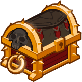
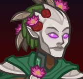
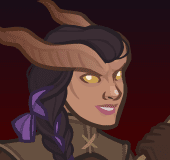
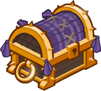

[Back to Main](index.md)

# Premium Packs and DLC

Upcoming real-money shop items.

ID: 614

### Legendkeeper Alyndra Theme Pack - 3,830 Platinum  
Date of release: 10 Sept 2025

> Unlock Alyndra along with an exclusive Legendkeeper Skin & Familiar!

Contents:

    
        
            ID: 77**Alyndra (Seat 6)**
        
        
            **Champion Unlock**
            Alyndra
        
    
    
        
            ID: 597**Legendkeeper Alyndra (Alyndra)**
        
        
            **Skin**
            Legendkeeper Alyndra
        
    
    
        
            ID: 278**Professor Griff**The judgiest judge to ever judge.
        
        
            **Familiar**
            Professor Griff
        
    
    
        
            ID: 1587**Feat**???: 1587
        
        
            **Feat**
            ???: 1587
        
    
    
        
            ID: 261**Platinum Alyndra Chest**Loot for: Alyndra<code>"for_crusaders":[77]</code>
        
        
            **Chest**
            Platinum Alyndra Chest
            x32 (Shinies x2)
        
    
    
        
            ID: 1723**Potion of the Gem Hunter**Increases the gem drops from bosses by 50%<code>increase_boss_gems_percent,50</code>
        
        
            **Buff**
            Potion of the Gem Hunter
            x1
        
    

ID: 615

### Mythic Torogar Skin & Feat Pack - 1,680 Platinum  
Date of release: 10 Sept 2025

> Unlock Torogar along with his exclusive Mythic Skin & Feat!

Contents:

    
        
            ID: 69**Torogar (Seat 10)**
        
        
            **Champion Unlock**
            Torogar
        
    
    
        
            ID: 598**Mythic Torogar (Torogar)**
        
        
            **Skin**
            Mythic Torogar
        
    
    
        
            ID: 2009**Primal Rage**I am a conqueror, in her unholy name.  Increases the effect of Torogar's Preach ability by 80%.<code>buff_upgrade,80,4489</code>
        
        
            **Feat**
            Primal Rage
            Torogar
        
    
    
        
            ID: 20**Large Bounty Contract**Claim a bounty worth 8 hours of offline gold earnings and event tokens.<code>seconds_worth_of_gold,28800</code>
        
        
            **Buff**
            Large Bounty Contract
            x6
        
    
    
        
            ID: 34**Large Blacksmithing Contract**Contract a master blacksmith to improve a piece of equipment owned by one of your Champions.<code>level_up_loot,24</code>
        
        
            **Buff**
            Large Blacksmithing Contract
            x6
        
    
    
        
            ID: 245**Platinum Torogar Chest**Loot for: Torogar<code>"for_crusaders":[69]</code>
        
        
            **Chest**
            Platinum Torogar Chest
            x14 (Shinies x1)
        
    

ID: 616

### Divine Certainty Skin & Feat Pack - 1,680 Platinum  
Date of release: 10 Sept 2025

> Unlock Certainty along with her exclusive Divine Skin & Feat!

Contents:

    
        
            ID: 138**Certainty (Seat 5)**
        
        
            **Champion Unlock**
            Certainty
        
    
    
        
            ID: 599**Divine Certainty (Certainty)**
        
        
            **Skin**
            Divine Certainty
        
    
    
        
            ID: 2260**Angel Investor**Good enough. I believe in your potential.  Increases the effect of Certainty's Employee Evaluations ability by 80%.<code>buff_upgrade,80,12509</code>
        
        
            **Feat**
            Angel Investor
            Certainty
        
    
    
        
            ID: 20**Large Bounty Contract**Claim a bounty worth 8 hours of offline gold earnings and event tokens.<code>seconds_worth_of_gold,28800</code>
        
        
            **Buff**
            Large Bounty Contract
            x6
        
    
    
        
            ID: 34**Large Blacksmithing Contract**Contract a master blacksmith to improve a piece of equipment owned by one of your Champions.<code>level_up_loot,24</code>
        
        
            **Buff**
            Large Blacksmithing Contract
            x6
        
    
    
        
            ID: 547**Platinum Certainty Chest**Loot for: Certainty<code>"for_crusaders":[138]</code>
        
        
            **Chest**
            Platinum Certainty Chest
            x14 (Shinies x1)
        
    

ID: 618

### Nightmare D'hani Skin & Feat Pack - 1,680 Platinum  
Date of release: 10 Sept 2025

> Unlock D'hani along with her exclusive Nightmare Skin & Feat!

Contents:

    
        
            ID: 89**D'hani (Seat 1)**
        
        
            **Champion Unlock**
            D'hani
        
    
    
        
            ID: 601**Nightmare D'hani (D'hani)**
        
        
            **Skin**
            Nightmare D'hani
        
    
    
        
            ID: 1617**Vicious Verdure**Imagine a dark green. Now, darker. Darker. Keep going.  Increase the AOE damage dealt by Stroke of Green by 80%.<code>buff_upgrade,80,13714,1</code>
        
        
            **Feat**
            Vicious Verdure
            D'hani
        
    
    
        
            ID: 20**Large Bounty Contract**Claim a bounty worth 8 hours of offline gold earnings and event tokens.<code>seconds_worth_of_gold,28800</code>
        
        
            **Buff**
            Large Bounty Contract
            x6
        
    
    
        
            ID: 34**Large Blacksmithing Contract**Contract a master blacksmith to improve a piece of equipment owned by one of your Champions.<code>level_up_loot,24</code>
        
        
            **Buff**
            Large Blacksmithing Contract
            x6
        
    
    
        
            ID: 335**Platinum D'hani Chest**Loot for: D'hani<code>"for_crusaders":[89]</code>
        
        
            **Chest**
            Platinum D'hani Chest
            x14 (Shinies x1)
        
    

ID: 619

### Silver Sword of Gith Familiar Pack - 840 Platinum  
Date of release: 24 Sept 2025

> Collect your own Silver Sword of Gith Familiar!

Contents:

    
        
            ID: 283**Animated Silver Sword**A gift. A burden. The sacred blade of shadow's bane.
        
        
            **Familiar**
            Animated Silver Sword
        
    
    
        
            ID: 4**Huge Potion of Giant's Strength**A transparent potion in which floats the sliver of a giant's fingernail.<code>global_dps_multiplier_mult,900</code>
        
        
            **Buff**
            Huge Potion of Giant's Strength
            x2
        
    
    
        
            ID: 8**Huge Potion of Clairvoyance**Three eyeballs bob in this yellowish potion.<code>gold_multiplier_mult,400</code>
        
        
            **Buff**
            Huge Potion of Clairvoyance
            x2
        
    
    
        
            ID: 77**Huge Potion of Speed**This potion's yellow fluid is streaked with black and swirls on its own.<code>time_scale,2.75</code>
        
        
            **Buff**
            Huge Potion of Speed
            x2
        
    

ID: 621

### King of Shadows Origin Theme Pack - $27.99  
Date of release: 01 Oct 2025

> Unlock King of Shadows along with an exclusive Guardian of Illefarn Skin, Familiar & Familiar Skin!

ⓘ *Note: It appears that this pack will only be available for real money instead of Platinum.*

Contents:

    
        
            ID: 168**King of Shadows**
        
        
            **Champion Unlock**
            King of Shadows
        
    
    
        
            ID: 605**Guardian of Illefarn (King of Shadows)**
        
        
            **Skin**
            Guardian of Illefarn
        
    
    
        
            ID: 285**Ebrath the Illefarn Mastiff**Guardian's Best Friend.
        
        
            **Familiar**
            Ebrath the Illefarn Mastiff
        
    
    
        
            ID: 12**Beholder Sketch Skin**
        
        
            **Familiar Skin**
            Beholder Sketch Skin
        
    
    
        
            ID: 2317**Feat**???: 2317
        
        
            **Feat**
            ???: 2317
        
    
    
        
            ID: 756**Platinum King of Shadows Chest**Loot for: King of Shadows<code>"for_crusaders":[168]</code>
        
        
            **Chest**
            Platinum King of Shadows Chest
            x32 (Shinies x2)
        
    
    
        
            ID: 1723**Potion of the Gem Hunter**Increases the gem drops from bosses by 50%<code>increase_boss_gems_percent,50</code>
        
        
            **Buff**
            Potion of the Gem Hunter
            x1
        
    

ID: 622

### Raven Queen Astarion Skin & Feat Pack - 1,680 Platinum  
Date of release: 01 Oct 2025

> Unlock Astarion along with his exclusive Raven Queen Skin & Feat!

Contents:

    
        
            ID: 129**Astarion (Seat 10)**
        
        
            **Champion Unlock**
            Astarion
        
    
    
        
            ID: 606**Raven Queen Astarion (Astarion)**
        
        
            **Skin**
            Raven Queen Astarion
        
    
    
        
            ID: 2296**Exquisite Taste**Straight from the neck is preferred, but goblets are used in mortal company.  Increases the effect of Astarion's Well Fed ability by 80%. (Prestack)<code>buff_upgrade,80,12491</code>
        
        
            **Feat**
            Exquisite Taste
            Astarion
        
    
    
        
            ID: 20**Large Bounty Contract**Claim a bounty worth 8 hours of offline gold earnings and event tokens.<code>seconds_worth_of_gold,28800</code>
        
        
            **Buff**
            Large Bounty Contract
            x6
        
    
    
        
            ID: 34**Large Blacksmithing Contract**Contract a master blacksmith to improve a piece of equipment owned by one of your Champions.<code>level_up_loot,24</code>
        
        
            **Buff**
            Large Blacksmithing Contract
            x6
        
    
    
        
            ID: 460**Platinum Astarion Chest**Loot for: Astarion<code>"for_crusaders":[129]</code>
        
        
            **Chest**
            Platinum Astarion Chest
            x14 (Shinies x1)
        
    

ID: 623

### Raven Queen Thellora Skin & Feat Pack - 1,680 Platinum  
Date of release: 01 Oct 2025

> Unlock Thellora along with her exclusive Raven Queen Skin & Feat!

Contents:

    
        
            ID: 139**Thellora (Seat 1)**
        
        
            **Champion Unlock**
            Thellora
        
    
    
        
            ID: 607**Raven Queen Thellora (Thellora)**
        
        
            **Skin**
            Raven Queen Thellora
        
    
    
        
            ID: 2297**Stampede**Altogether now! The bards shall sing of our charge!  Increases the effect of Thellora's Defender of the Meek, Vanguard of the Quick and Callessa's Blessed by 80%. (Prestack)<code>buff_upgrades,80,12982,12983,12984</code>
        
        
            **Feat**
            Stampede
            Thellora
        
    
    
        
            ID: 20**Large Bounty Contract**Claim a bounty worth 8 hours of offline gold earnings and event tokens.<code>seconds_worth_of_gold,28800</code>
        
        
            **Buff**
            Large Bounty Contract
            x6
        
    
    
        
            ID: 34**Large Blacksmithing Contract**Contract a master blacksmith to improve a piece of equipment owned by one of your Champions.<code>level_up_loot,24</code>
        
        
            **Buff**
            Large Blacksmithing Contract
            x6
        
    
    
        
            ID: 549**Platinum Thellora Chest**Loot for: Thellora<code>"for_crusaders":[139]</code>
        
        
            **Chest**
            Platinum Thellora Chest
            x14 (Shinies x1)
        
    

ID: 624

### Darklord Farideh Theme Pack - 3,830 Platinum  
Date of release: 08 Oct 2025

> Unlock Farideh along with an exclusive Darklord Skin & Familiar!

Contents:

    
        
            ID: 33**Farideh (Seat 7)**
        
        
            **Champion Unlock**
            Farideh
        
    
    
        
            ID: 608**Darklord Farideh (Farideh)**
        
        
            **Skin**
            Darklord Farideh
        
    
    
        
            ID: 286**Ausir the White Raven**The bright messenger of a dark lady.
        
        
            **Familiar**
            Ausir the White Raven
        
    
    
        
            ID: 2174**Feat**???: 2174
        
        
            **Feat**
            ???: 2174
        
    
    
        
            ID: 72**Platinum Farideh Chest**Loot for: Farideh<code>"for_crusaders":[33]</code>
        
        
            **Chest**
            Platinum Farideh Chest
            x32 (Shinies x2)
        
    
    
        
            ID: 1723**Potion of the Gem Hunter**Increases the gem drops from bosses by 50%<code>increase_boss_gems_percent,50</code>
        
        
            **Buff**
            Potion of the Gem Hunter
            x1
        
    

ID: 625

### Lord of Undeath Kas Skin & Feat Pack - 1,680 Platinum  
Date of release: 08 Oct 2025

> Unlock Kas along with his exclusive Lord of Undeath Skin & Feat!

Contents:

    
        
            ID: 153**Kas (Seat 6)**
        
        
            **Champion Unlock**
            Kas
        
    
    
        
            ID: 609**Lord of Undeath Kas (Kas)**
        
        
            **Skin**
            Lord of Undeath Kas
        
    
    
        
            ID: 2298**Federates**Only a handful of mortals may say that they've earned my esteem.  Increases the effect of Kas' Mortal Pawns ability by 80%.<code>buff_upgrade,80,15620,2</code>
        
        
            **Feat**
            Federates
            Kas
        
    
    
        
            ID: 20**Large Bounty Contract**Claim a bounty worth 8 hours of offline gold earnings and event tokens.<code>seconds_worth_of_gold,28800</code>
        
        
            **Buff**
            Large Bounty Contract
            x6
        
    
    
        
            ID: 34**Large Blacksmithing Contract**Contract a master blacksmith to improve a piece of equipment owned by one of your Champions.<code>level_up_loot,24</code>
        
        
            **Buff**
            Large Blacksmithing Contract
            x6
        
    
    
        
            ID: 577**Platinum Kas Chest**Loot for: Kas<code>"for_crusaders":[153]</code>
        
        
            **Chest**
            Platinum Kas Chest
            x14 (Shinies x1)
        
    

ID: 626

### Shadowfell Ezmerelda Skin & Feat Pack - 1,680 Platinum  
Date of release: 08 Oct 2025

> Unlock Ezmerelda along with her exclusive Shadowfell Skin & Feat!

Contents:

    
        
            ID: 70**Ezmerelda (Seat 1)**
        
        
            **Champion Unlock**
            Ezmerelda
        
    
    
        
            ID: 610**Shadowfell Ezmerelda (Ezmerelda)**
        
        
            **Skin**
            Shadowfell Ezmerelda
        
    
    
        
            ID: 2299**Lethal Study**Every creature has a weak spot. Watch and learn.  Increases the effect of Ezmerelda's Training Montage ability by 80%. (Prestack)<code>buff_upgrade,80,15037,0</code>
        
        
            **Feat**
            Lethal Study
            Ezmerelda
        
    
    
        
            ID: 20**Large Bounty Contract**Claim a bounty worth 8 hours of offline gold earnings and event tokens.<code>seconds_worth_of_gold,28800</code>
        
        
            **Buff**
            Large Bounty Contract
            x6
        
    
    
        
            ID: 34**Large Blacksmithing Contract**Contract a master blacksmith to improve a piece of equipment owned by one of your Champions.<code>level_up_loot,24</code>
        
        
            **Buff**
            Large Blacksmithing Contract
            x6
        
    
    
        
            ID: 247**Platinum Ezmerelda Chest**Loot for: Ezmerelda<code>"for_crusaders":[70]</code>
        
        
            **Chest**
            Platinum Ezmerelda Chest
            x14 (Shinies x1)
        
    

ID: 627

### Avren in a Jar Skin & Feat Pack - 1,680 Platinum  
Date of release: 15 Oct 2025

> Unlock Avren along with his exclusive Avren in a Jar Skin & Feat!

Contents:

    
        
            ID: 51**Avren (Seat 11)**
        
        
            **Champion Unlock**
            Avren
        
    
    
        
            ID: 611**Avren in a Jar (Avren)**
        
        
            **Skin**
            Avren in a Jar
        
    
    
        
            ID: 2300**Multiversal Allies**I've got friends in weird places.  Increases the damage of all Champions by 20% for each unique species in the formation, stacking additively.<code>effect_def,2193</code>
        
        
            **Feat**
            Multiversal Allies
            Avren
        
    
    
        
            ID: 20**Large Bounty Contract**Claim a bounty worth 8 hours of offline gold earnings and event tokens.<code>seconds_worth_of_gold,28800</code>
        
        
            **Buff**
            Large Bounty Contract
            x6
        
    
    
        
            ID: 34**Large Blacksmithing Contract**Contract a master blacksmith to improve a piece of equipment owned by one of your Champions.<code>level_up_loot,24</code>
        
        
            **Buff**
            Large Blacksmithing Contract
            x6
        
    
    
        
            ID: 161**Platinum Avren Chest**Loot for: Avren<code>"for_crusaders":[51]</code>
        
        
            **Chest**
            Platinum Avren Chest
            x14 (Shinies x1)
        
    

ID: 628

### Nightwalker Krond Skin & Feat Pack - 1,680 Platinum  
Date of release: 15 Oct 2025

> Unlock Krond along with his exclusive Nightwalker Skin & Feat!

Contents:

    
        
            ID: 15**Krond (Seat 6)**
        
        
            **Champion Unlock**
            Krond
        
    
    
        
            ID: 612**Nightwalker Krond (Krond)**
        
        
            **Skin**
            Nightwalker Krond
        
    
    
        
            ID: 2301**Kindred Spirits**Whatever our cause, we fight for it together.  Increases the base effect of Krond's Unsung Alliance ability by 80%. (Prestack)<code>buff_upgrade,80,17237,0</code>
        
        
            **Feat**
            Kindred Spirits
            Krond
        
    
    
        
            ID: 20**Large Bounty Contract**Claim a bounty worth 8 hours of offline gold earnings and event tokens.<code>seconds_worth_of_gold,28800</code>
        
        
            **Buff**
            Large Bounty Contract
            x6
        
    
    
        
            ID: 34**Large Blacksmithing Contract**Contract a master blacksmith to improve a piece of equipment owned by one of your Champions.<code>level_up_loot,24</code>
        
        
            **Buff**
            Large Blacksmithing Contract
            x6
        
    
    
        
            ID: 6**Platinum Krond Chest**Loot for: Krond<code>"for_crusaders":[15]</code>
        
        
            **Chest**
            Platinum Krond Chest
            x14 (Shinies x1)
        
    

ID: 629

### Umbra the Shadow Dragon Familiar Pack - 1,680 Platinum  
Date of release: 22 Oct 2025

> Collect your own Umbra the Shadow Dragon familiar!

Contents:

    
        
            ID: 287**Umbra the Shadow Dragon**Beware her dark breath weapon - you will rise in her service after death.
        
        
            **Familiar**
            Umbra the Shadow Dragon
        
    
    
        
            ID: 4**Huge Potion of Giant's Strength**A transparent potion in which floats the sliver of a giant's fingernail.<code>global_dps_multiplier_mult,900</code>
        
        
            **Buff**
            Huge Potion of Giant's Strength
            x4
        
    
    
        
            ID: 8**Huge Potion of Clairvoyance**Three eyeballs bob in this yellowish potion.<code>gold_multiplier_mult,400</code>
        
        
            **Buff**
            Huge Potion of Clairvoyance
            x4
        
    
    
        
            ID: 36**Potion of Polish**This shiny, silver liquid clings to the edge of the bottle in an unusual way.<code>shiny_loot,1</code>
        
        
            **Buff**
            Potion of Polish
            x1
        
    
    
        
            ID: 77**Huge Potion of Speed**This potion's yellow fluid is streaked with black and swirls on its own.<code>time_scale,2.75</code>
        
        
            **Buff**
            Huge Potion of Speed
            x4
        
    

ID: 630

### Shadow-Cursed Halsin Skin & Feat Pack - 1,680 Platinum  
Date of release: 29 Oct 2025

> Unlock Halsin along with his exclusive Shadow-Cursed Skin & Feat!

Contents:

    
        
            ID: 156**Halsin (Seat 3)**
        
        
            **Champion Unlock**
            Halsin
        
    
    
        
            ID: 615**Shadow-Cursed Halsin (Halsin)**
        
        
            **Skin**
            Shadow-Cursed Halsin
        
    
    
        
            ID: 2302**Prodigal Leader**Even those who defile nature inevitably return to it, in the end.  All Champions damage +50%.<code>global_dps_multiplier_mult,50</code>
        
        
            **Feat**
            Prodigal Leader
            Halsin
        
    
    
        
            ID: 20**Large Bounty Contract**Claim a bounty worth 8 hours of offline gold earnings and event tokens.<code>seconds_worth_of_gold,28800</code>
        
        
            **Buff**
            Large Bounty Contract
            x6
        
    
    
        
            ID: 34**Large Blacksmithing Contract**Contract a master blacksmith to improve a piece of equipment owned by one of your Champions.<code>level_up_loot,24</code>
        
        
            **Buff**
            Large Blacksmithing Contract
            x6
        
    
    
        
            ID: 645**Platinum Halsin Chest**Loot for: Halsin<code>"for_crusaders":[156]</code>
        
        
            **Chest**
            Platinum Halsin Chest
            x14 (Shinies x1)
        
    

ID: 631

### Dark Urge Slayer Familiar & Feat Pack - 1,680 Platinum  
Date of release: 29 Oct 2025

> Collect a Feat for The Dark Urge along with an exclusive Dark Urge-themed familiar!

Contents:

    
        
            ID: 288**Form of the Slayer**A form for Bhaal's chosen…
        
        
            **Familiar**
            Form of the Slayer
        
    
    
        
            ID: 2303**Blood Moon**Time for the final act.  Increases the effect of Dark Urge's The Urge ability by 80%.<code>buff_upgrade,80,14379</code>
        
        
            **Feat**
            Blood Moon
            Dark Urge
        
    
    
        
            ID: 36**Potion of Polish**This shiny, silver liquid clings to the edge of the bottle in an unusual way.<code>shiny_loot,1</code>
        
        
            **Buff**
            Potion of Polish
            x1
        
    
    
        
            ID: 77**Huge Potion of Speed**This potion's yellow fluid is streaked with black and swirls on its own.<code>time_scale,2.75</code>
        
        
            **Buff**
            Huge Potion of Speed
            x2
        
    
    
        
            ID: 1712**Potion of the Hunter**Increase Global Damage by 100%<code>global_dps_multiplier_mult,100</code>
        
        
            **Buff**
            Potion of the Hunter
            x1
        
    

ID: 633

### Snug the Spectator Familiar Pack - $5.99  
Date of release: 03 Nov 2025

> Collect your own Snug the Spectator familiar!

ⓘ *Note: It appears that this pack will only be available for real money instead of Platinum.*

Contents:

    
        
            ID: 290**Snug the Spectator**Surprisingly snuggly for a Spectator.
        
        
            **Familiar**
            Snug the Spectator
        
    
    
        
            ID: 4**Huge Potion of Giant's Strength**A transparent potion in which floats the sliver of a giant's fingernail.<code>global_dps_multiplier_mult,900</code>
        
        
            **Buff**
            Huge Potion of Giant's Strength
            x2
        
    
    
        
            ID: 8**Huge Potion of Clairvoyance**Three eyeballs bob in this yellowish potion.<code>gold_multiplier_mult,400</code>
        
        
            **Buff**
            Huge Potion of Clairvoyance
            x2
        
    
    
        
            ID: 77**Huge Potion of Speed**This potion's yellow fluid is streaked with black and swirls on its own.<code>time_scale,2.75</code>
        
        
            **Buff**
            Huge Potion of Speed
            x2
        
    

ID: 634

### Action Figure Skylla Theme Pack - 3,830 Platinum  
Date of release: 05 Nov 2025

> Unlock Skylla along with an exclusive Action Figure Skin & Familiar!

Contents:

    
        
            ID: 169**Skylla**
        
        
            **Champion Unlock**
            Skylla
        
    
    
        
            ID: 616**Action Figure Skylla (Skylla)**
        
        
            **Skin**
            Action Figure Skylla
        
    
    
        
            ID: 291**Spite the Sprite**A sprite as spiteful as their master is frightful.
        
        
            **Familiar**
            Spite the Sprite
        
    
    
        
            ID: 2339**Feat**???: 2339
        
        
            **Feat**
            ???: 2339
        
    
    
        
            ID: 762**Platinum Skylla Chest**Loot for: Skylla<code>"for_crusaders":[169]</code>
        
        
            **Chest**
            Platinum Skylla Chest
            x32 (Shinies x2)
        
    
    
        
            ID: 1723**Potion of the Gem Hunter**Increases the gem drops from bosses by 50%<code>increase_boss_gems_percent,50</code>
        
        
            **Buff**
            Potion of the Gem Hunter
            x1
        
    

ID: 635

### Entropic Sentry Skin & Feat Pack - 1,680 Platinum  
Date of release: 05 Nov 2025

> Unlock Sentry along with her exclusive Entropic Skin & Feat!

Contents:

    
        
            ID: 52**Sentry (Seat 4)**
        
        
            **Champion Unlock**
            Sentry
        
    
    
        
            ID: 617**Entropic Sentry (Sentry)**
        
        
            **Skin**
            Entropic Sentry
        
    
    
        
            ID: 2350**TBD Sentry Feat (Do not translate)**
        
        
            **Feat**
            TBD Sentry Feat (Do not translate)
            Sentry
        
    
    
        
            ID: 20**Large Bounty Contract**Claim a bounty worth 8 hours of offline gold earnings and event tokens.<code>seconds_worth_of_gold,28800</code>
        
        
            **Buff**
            Large Bounty Contract
            x6
        
    
    
        
            ID: 34**Large Blacksmithing Contract**Contract a master blacksmith to improve a piece of equipment owned by one of your Champions.<code>level_up_loot,24</code>
        
        
            **Buff**
            Large Blacksmithing Contract
            x6
        
    
    
        
            ID: 163**Platinum Sentry Chest**Loot for: Sentry<code>"for_crusaders":[52]</code>
        
        
            **Chest**
            Platinum Sentry Chest
            x14 (Shinies x1)
        
    

ID: 636

### Hemomancer Widdle Skin & Feat Pack - 1,680 Platinum  
Date of release: 05 Nov 2025

> Unlock Widdle along with her exclusive Hemomancer Skin & Feat!

Contents:

    
        
            ID: 91**Widdle (Seat 2)**
        
        
            **Champion Unlock**
            Widdle
        
    
    
        
            ID: 618**Hemomancer Widdle (Widdle)**
        
        
            **Skin**
            Hemomancer Widdle
        
    
    
        
            ID: 2351**TBD Widdle Feat (Do not translate)**
        
        
            **Feat**
            TBD Widdle Feat (Do not translate)
            Widdle
        
    
    
        
            ID: 20**Large Bounty Contract**Claim a bounty worth 8 hours of offline gold earnings and event tokens.<code>seconds_worth_of_gold,28800</code>
        
        
            **Buff**
            Large Bounty Contract
            x6
        
    
    
        
            ID: 34**Large Blacksmithing Contract**Contract a master blacksmith to improve a piece of equipment owned by one of your Champions.<code>level_up_loot,24</code>
        
        
            **Buff**
            Large Blacksmithing Contract
            x6
        
    
    
        
            ID: 339**Platinum Widdle Chest**Loot for: Widdle<code>"for_crusaders":[91]</code>
        
        
            **Chest**
            Platinum Widdle Chest
            x14 (Shinies x1)
        
    

ID: 637

### Twice Cursed Havilar Theme Pack - 3,830 Platinum  
Date of release: 12 Nov 2025

> Unlock Havilar along with an exclusive Twice Cursed Skin & Familiar!

Contents:

    
        
            ID: 56**Havilar (Seat 10)**
        
        
            **Champion Unlock**
            Havilar
        
    
    
        
            ID: 619**Twice Cursed Havilar (Havilar)**
        
        
            **Skin**
            Twice Cursed Havilar
        
    
    
        
            ID: 292**Lefty the Crawling Claw**
        
        
            **Familiar**
            Lefty the Crawling Claw
        
    
    
        
            ID: 1**Selflessness**Aye, a selfless dwarf I am.  All Champions damage +10%.<code>global_dps_multiplier_mult,10</code>
        
        
            **Feat**
            Selflessness
            Bruenor
        
    
    
        
            ID: 171**Platinum Havilar Chest**Loot for: Havilar<code>"for_crusaders":[56]</code>
        
        
            **Chest**
            Platinum Havilar Chest
            x32 (Shinies x2)
        
    
    
        
            ID: 1723**Potion of the Gem Hunter**Increases the gem drops from bosses by 50%<code>increase_boss_gems_percent,50</code>
        
        
            **Buff**
            Potion of the Gem Hunter
            x1
        
    

ID: 638

### Turiel the Fallen Skin & Feat Pack - 1,680 Platinum  
Date of release: 12 Nov 2025

> Unlock Turiel along with his exclusive Fallen Skin & Feat!

Contents:

    
        
            ID: 49**Turiel (Seat 1)**
        
        
            **Champion Unlock**
            Turiel
        
    
    
        
            ID: 620**Turiel the Fallen (Turiel)**
        
        
            **Skin**
            Turiel the Fallen
        
    
    
        
            ID: 2352**TBD Turiel Feat (Do not translate)**
        
        
            **Feat**
            TBD Turiel Feat (Do not translate)
            Turiel
        
    
    
        
            ID: 20**Large Bounty Contract**Claim a bounty worth 8 hours of offline gold earnings and event tokens.<code>seconds_worth_of_gold,28800</code>
        
        
            **Buff**
            Large Bounty Contract
            x6
        
    
    
        
            ID: 34**Large Blacksmithing Contract**Contract a master blacksmith to improve a piece of equipment owned by one of your Champions.<code>level_up_loot,24</code>
        
        
            **Buff**
            Large Blacksmithing Contract
            x6
        
    
    
        
            ID: 108**Platinum Turiel Chest**Loot for: Turiel<code>"for_crusaders":[49]</code>
        
        
            **Chest**
            Platinum Turiel Chest
            x14 (Shinies x1)
        
    

ID: 639

### Witch Queen Minthara Skin & Feat Pack - 1,680 Platinum  
Date of release: 12 Nov 2025

> Unlock Minthara along with her exclusive Witch Queen Skin & Feat!

Contents:

    
        
            ID: 154**Minthara (Seat 3)**
        
        
            **Champion Unlock**
            Minthara
        
    
    
        
            ID: 621**Witch Queen Minthara (Minthara)**
        
        
            **Skin**
            Witch Queen Minthara
        
    
    
        
            ID: 2353**TBD Minthara Feat (Do not translate)**
        
        
            **Feat**
            TBD Minthara Feat (Do not translate)
            Minthara
        
    
    
        
            ID: 20**Large Bounty Contract**Claim a bounty worth 8 hours of offline gold earnings and event tokens.<code>seconds_worth_of_gold,28800</code>
        
        
            **Buff**
            Large Bounty Contract
            x6
        
    
    
        
            ID: 34**Large Blacksmithing Contract**Contract a master blacksmith to improve a piece of equipment owned by one of your Champions.<code>level_up_loot,24</code>
        
        
            **Buff**
            Large Blacksmithing Contract
            x6
        
    
    
        
            ID: 579**Platinum Minthara Chest**Loot for: Minthara<code>"for_crusaders":[154]</code>
        
        
            **Chest**
            Platinum Minthara Chest
            x14 (Shinies x1)
        
    

ID: 640

### Gromma's Sea Otter Guide Familiar & Feat Pack - 1,680 Platinum  
Date of release: 19 Nov 2025

> Collect a Feat for Gromma along with an exclusive Gromma-themed familiar!

Contents:

    
        
            ID: 293**Shellby The Sea Otter**Longtime ally of Gromma - easily distracted by pretty things.
        
        
            **Familiar**
            Shellby The Sea Otter
        
    
    
        
            ID: 1757**Rite of Passage**Look how far you've come - you're nearly as old as I am!  Increases the base value of Grandmotherly Love's stacking bonus by 80%.<code>change_upgrade_data,14874,1</code>
        
        
            **Feat**
            Rite of Passage
            Gromma
        
    
    
        
            ID: 36**Potion of Polish**This shiny, silver liquid clings to the edge of the bottle in an unusual way.<code>shiny_loot,1</code>
        
        
            **Buff**
            Potion of Polish
            x1
        
    
    
        
            ID: 77**Huge Potion of Speed**This potion's yellow fluid is streaked with black and swirls on its own.<code>time_scale,2.75</code>
        
        
            **Buff**
            Huge Potion of Speed
            x2
        
    
    
        
            ID: 1712**Potion of the Hunter**Increase Global Damage by 100%<code>global_dps_multiplier_mult,100</code>
        
        
            **Buff**
            Potion of the Hunter
            x1
        
    

ID: 641

### Star Blight Jang Sao Skin & Feat Pack - 1,680 Platinum  
Date of release: 19 Nov 2025

> Unlock Jang Sao along with her exclusive Star Blight Skin & Feat!

Contents:

    
        
            ID: 140**Jang Sao (Seat 8)**
        
        
            **Champion Unlock**
            Jang Sao
        
    
    
        
            ID: 622**Star Blight Jang Sao (Jang Sao)**
        
        
            **Skin**
            Star Blight Jang Sao
        
    
    
        
            ID: 2355**TBD Jang Sao Feat (Do not translate)**
        
        
            **Feat**
            TBD Jang Sao Feat (Do not translate)
            Jang Sao
        
    
    
        
            ID: 20**Large Bounty Contract**Claim a bounty worth 8 hours of offline gold earnings and event tokens.<code>seconds_worth_of_gold,28800</code>
        
        
            **Buff**
            Large Bounty Contract
            x6
        
    
    
        
            ID: 34**Large Blacksmithing Contract**Contract a master blacksmith to improve a piece of equipment owned by one of your Champions.<code>level_up_loot,24</code>
        
        
            **Buff**
            Large Blacksmithing Contract
            x6
        
    
    
        
            ID: 551**Platinum Jang Sao Chest**Loot for: Jang Sao<code>"for_crusaders":[140]</code>
        
        
            **Chest**
            Platinum Jang Sao Chest
            x14 (Shinies x1)
        
    

ID: 642

### Dark Pact Virgil Skin & Feat Pack - 1,680 Platinum  
Date of release: 19 Nov 2025

> Unlock Virgil along with his exclusive Dark Pact Skin & Feat!

Contents:

    
        
            ID: 115**Virgil (Seat 10)**
        
        
            **Champion Unlock**
            Virgil
        
    
    
        
            ID: 623**Dark Pact Virgil (Virgil)**
        
        
            **Skin**
            Dark Pact Virgil
        
    
    
        
            ID: 2356**TBD Virgil Feat (Do not translate)**
        
        
            **Feat**
            TBD Virgil Feat (Do not translate)
            Virgil
        
    
    
        
            ID: 20**Large Bounty Contract**Claim a bounty worth 8 hours of offline gold earnings and event tokens.<code>seconds_worth_of_gold,28800</code>
        
        
            **Buff**
            Large Bounty Contract
            x6
        
    
    
        
            ID: 34**Large Blacksmithing Contract**Contract a master blacksmith to improve a piece of equipment owned by one of your Champions.<code>level_up_loot,24</code>
        
        
            **Buff**
            Large Blacksmithing Contract
            x6
        
    
    
        
            ID: 432**Platinum Virgil Chest**Loot for: Virgil<code>"for_crusaders":[115]</code>
        
        
            **Chest**
            Platinum Virgil Chest
            x14 (Shinies x1)
        
    

ID: 643

### Trickster Sheila Skin & Feat Pack - 1,680 Platinum  
Date of release: 26 Nov 2025

> Unlock Sheila along with her exclusive Trickster Skin & Feat!

Contents:

    
        
            ID: 160**Sheila (Seat 7)**
        
        
            **Champion Unlock**
            Sheila
        
    
    
        
            ID: 624**Trickster Sheila (Sheila)**
        
        
            **Skin**
            Trickster Sheila
        
    
    
        
            ID: 2357**TBD Sheila Feat (Do not translate)**
        
        
            **Feat**
            TBD Sheila Feat (Do not translate)
            Sheila
        
    
    
        
            ID: 20**Large Bounty Contract**Claim a bounty worth 8 hours of offline gold earnings and event tokens.<code>seconds_worth_of_gold,28800</code>
        
        
            **Buff**
            Large Bounty Contract
            x6
        
    
    
        
            ID: 34**Large Blacksmithing Contract**Contract a master blacksmith to improve a piece of equipment owned by one of your Champions.<code>level_up_loot,24</code>
        
        
            **Buff**
            Large Blacksmithing Contract
            x6
        
    
    
        
            ID: 653**Platinum Sheila Chests**Loot for: Sheila<code>"for_crusaders":[160]</code>
        
        
            **Chest**
            Platinum Sheila Chests
            x14 (Shinies x1)
        
    

ID: 645

### Cozy Regis Skin & Feat Pack - 1,680 Platinum  
Date of release: 03 Dec 2025

> Unlock Regis along with his exclusive Cozy Skin & Feat!

Contents:

    
        
            ID: 20**Regis (Seat 2)**
        
        
            **Champion Unlock**
            Regis
        
    
    
        
            ID: 625**Cozy Regis (Regis)**
        
        
            **Skin**
            Cozy Regis
        
    
    
        
            ID: 2358**TBD Regis Feat (Do not translate)**
        
        
            **Feat**
            TBD Regis Feat (Do not translate)
            Regis
        
    
    
        
            ID: 20**Large Bounty Contract**Claim a bounty worth 8 hours of offline gold earnings and event tokens.<code>seconds_worth_of_gold,28800</code>
        
        
            **Buff**
            Large Bounty Contract
            x6
        
    
    
        
            ID: 34**Large Blacksmithing Contract**Contract a master blacksmith to improve a piece of equipment owned by one of your Champions.<code>level_up_loot,24</code>
        
        
            **Buff**
            Large Blacksmithing Contract
            x6
        
    
    
        
            ID: 17**Platinum Regis Chest**Loot for: Regis<code>"for_crusaders":[20]</code>
        
        
            **Chest**
            Platinum Regis Chest
            x14 (Shinies x1)
        
    

ID: 646

### Winter Gloom Shadowheart Skin & Feat Pack - 1,680 Platinum  
Date of release: 03 Dec 2025

> Unlock Shadowheart along with her exclusive Winter Gloom Skin & Feat!

Contents:

    
        
            ID: 141**Shadowheart (Seat 6)**
        
        
            **Champion Unlock**
            Shadowheart
        
    
    
        
            ID: 626**Winter Gloom Shadowheart (Shadowheart)**
        
        
            **Skin**
            Winter Gloom Shadowheart
        
    
    
        
            ID: 2359**TBD Shadowheart Feat (Do not translate)**
        
        
            **Feat**
            TBD Shadowheart Feat (Do not translate)
            Shadowheart
        
    
    
        
            ID: 20**Large Bounty Contract**Claim a bounty worth 8 hours of offline gold earnings and event tokens.<code>seconds_worth_of_gold,28800</code>
        
        
            **Buff**
            Large Bounty Contract
            x6
        
    
    
        
            ID: 34**Large Blacksmithing Contract**Contract a master blacksmith to improve a piece of equipment owned by one of your Champions.<code>level_up_loot,24</code>
        
        
            **Buff**
            Large Blacksmithing Contract
            x6
        
    
    
        
            ID: 553**Platinum  Shadowheart Chest**Loot for: Shadowheart<code>"for_crusaders":[141]</code>
        
        
            **Chest**
            Platinum  Shadowheart Chest
            x14 (Shinies x1)
        
    

ID: 647

### Owlsworth the Snowy Owl Familiar Pack - 1,680 Platinum  
Date of release: 03 Dec 2025

> Collect your own Owlsworth the Snowy Owl familiar!

Contents:

    
        
            ID: 295**Owlsworth the Snowy Owl**Most fear Owlsworth. One didn’t. He doesn't come back now.
        
        
            **Familiar**
            Owlsworth the Snowy Owl
        
    
    
        
            ID: 4**Huge Potion of Giant's Strength**A transparent potion in which floats the sliver of a giant's fingernail.<code>global_dps_multiplier_mult,900</code>
        
        
            **Buff**
            Huge Potion of Giant's Strength
            x4
        
    
    
        
            ID: 8**Huge Potion of Clairvoyance**Three eyeballs bob in this yellowish potion.<code>gold_multiplier_mult,400</code>
        
        
            **Buff**
            Huge Potion of Clairvoyance
            x4
        
    
    
        
            ID: 36**Potion of Polish**This shiny, silver liquid clings to the edge of the bottle in an unusual way.<code>shiny_loot,1</code>
        
        
            **Buff**
            Potion of Polish
            x1
        
    
    
        
            ID: 77**Huge Potion of Speed**This potion's yellow fluid is streaked with black and swirls on its own.<code>time_scale,2.75</code>
        
        
            **Buff**
            Huge Potion of Speed
            x4
        
    

ID: 648

### Winter Gloom Yorven Skin & Feat Pack - 1,680 Platinum  
Date of release: 03 Dec 2025

> Unlock Yorven along with his exclusive Winter Gloom Skin & Feat!

Contents:

    
        
            ID: 92**Yorven (Seat 10)**
        
        
            **Champion Unlock**
            Yorven
        
    
    
        
            ID: 627**Winter Gloom Yorven (Yorven)**
        
        
            **Skin**
            Winter Gloom Yorven
        
    
    
        
            ID: 2360**TBD Yorven Feat (Do not translate)**
        
        
            **Feat**
            TBD Yorven Feat (Do not translate)
            Yorven
        
    
    
        
            ID: 20**Large Bounty Contract**Claim a bounty worth 8 hours of offline gold earnings and event tokens.<code>seconds_worth_of_gold,28800</code>
        
        
            **Buff**
            Large Bounty Contract
            x6
        
    
    
        
            ID: 34**Large Blacksmithing Contract**Contract a master blacksmith to improve a piece of equipment owned by one of your Champions.<code>level_up_loot,24</code>
        
        
            **Buff**
            Large Blacksmithing Contract
            x6
        
    
    
        
            ID: 341**Platinum Yorven Chest**Loot for: Yorven<code>"for_crusaders":[92]</code>
        
        
            **Chest**
            Platinum Yorven Chest
            x14 (Shinies x1)
        
    

ID: 649

### Cozy Nordom Theme Pack - 3,830 Platinum  
Date of release: 10 Dec 2025

> Unlock Nordom along with an exclusive Cozy Skin & Familiar!

Contents:

    
        
            ID: 100**Nordom (Seat 9)**
        
        
            **Champion Unlock**
            Nordom
        
    
    
        
            ID: 628**Cozy Nordom (Nordom)**
        
        
            **Skin**
            Cozy Nordom
        
    
    
        
            ID: 296**Cog the Clockwork Modron**Craftsmanship even Primus would be impressed by.
        
        
            **Familiar**
            Cog the Clockwork Modron
        
    
    
        
            ID: 1**Selflessness**Aye, a selfless dwarf I am.  All Champions damage +10%.<code>global_dps_multiplier_mult,10</code>
        
        
            **Feat**
            Selflessness
            Bruenor
        
    
    
        
            ID: 357**Platinum Nordom Chest**Loot for: Nordom<code>"for_crusaders":[100]</code>
        
        
            **Chest**
            Platinum Nordom Chest
            x32 (Shinies x2)
        
    
    
        
            ID: 1723**Potion of the Gem Hunter**Increases the gem drops from bosses by 50%<code>increase_boss_gems_percent,50</code>
        
        
            **Buff**
            Potion of the Gem Hunter
            x1
        
    

ID: 650

### Cozy Halsin Skin & Feat Pack - 1,680 Platinum  
Date of release: 10 Dec 2025

> Unlock Halsin along with his exclusive Cozy Skin & Feat!

Contents:

    
        
            ID: 156**Halsin (Seat 3)**
        
        
            **Champion Unlock**
            Halsin
        
    
    
        
            ID: 629**Cozy Halsin (Halsin)**
        
        
            **Skin**
            Cozy Halsin
        
    
    
        
            ID: 2361**TBD Halsin Feat (Do not translate)**
        
        
            **Feat**
            TBD Halsin Feat (Do not translate)
            Halsin
        
    
    
        
            ID: 20**Large Bounty Contract**Claim a bounty worth 8 hours of offline gold earnings and event tokens.<code>seconds_worth_of_gold,28800</code>
        
        
            **Buff**
            Large Bounty Contract
            x6
        
    
    
        
            ID: 34**Large Blacksmithing Contract**Contract a master blacksmith to improve a piece of equipment owned by one of your Champions.<code>level_up_loot,24</code>
        
        
            **Buff**
            Large Blacksmithing Contract
            x6
        
    
    
        
            ID: 645**Platinum Halsin Chest**Loot for: Halsin<code>"for_crusaders":[156]</code>
        
        
            **Chest**
            Platinum Halsin Chest
            x14 (Shinies x1)
        
    

ID: 651

### Hug the Rug of Smothering Familiar Pack - 2,380 Platinum  
Date of release: 10 Dec 2025

> Collect your own Hug the Rug of Smothering familiar!

Contents:

    
        
            ID: 297**Hug the Rug of Smothering**Full-bodied snuggles, whether you want them or not.
        
        
            **Familiar**
            Hug the Rug of Smothering
        
    
    
        
            ID: 4**Huge Potion of Giant's Strength**A transparent potion in which floats the sliver of a giant's fingernail.<code>global_dps_multiplier_mult,900</code>
        
        
            **Buff**
            Huge Potion of Giant's Strength
            x6
        
    
    
        
            ID: 8**Huge Potion of Clairvoyance**Three eyeballs bob in this yellowish potion.<code>gold_multiplier_mult,400</code>
        
        
            **Buff**
            Huge Potion of Clairvoyance
            x6
        
    
    
        
            ID: 36**Potion of Polish**This shiny, silver liquid clings to the edge of the bottle in an unusual way.<code>shiny_loot,1</code>
        
        
            **Buff**
            Potion of Polish
            x1
        
    
    
        
            ID: 40**Huge Potion of Fire Breath**The orange liquid in this vial flickers and smoke fills the top of the container.<code>click_damage_seconds_global_dps,600</code>
        
        
            **Buff**
            Huge Potion of Fire Breath
            x6
        
    
    
        
            ID: 77**Huge Potion of Speed**This potion's yellow fluid is streaked with black and swirls on its own.<code>time_scale,2.75</code>
        
        
            **Buff**
            Huge Potion of Speed
            x6
        
    
    
        
            ID: 1721**Potion of the Gold Hunter**Increase Gold Find by 100%<code>gold_multiplier_mult,100</code>
        
        
            **Buff**
            Potion of the Gold Hunter
            x1
        
    
    
        
            **Modron Component Pieces**
        
        
            **Modron Component Pieces**
            x2,000
        
    

ID: 652

### Warmduke Skin & Feat Pack - 1,680 Platinum  
Date of release: 10 Dec 2025

> Unlock Warduke along with his exclusive Warmduke Skin & Feat!

Contents:

    
        
            ID: 116**Warduke (Seat 8)**
        
        
            **Champion Unlock**
            Warduke
        
    
    
        
            ID: 630**Warmduke (Warduke)**
        
        
            **Skin**
            Warmduke
        
    
    
        
            ID: 2362**TBD Warduke Feat (Do not translate)**
        
        
            **Feat**
            TBD Warduke Feat (Do not translate)
            Warduke
        
    
    
        
            ID: 20**Large Bounty Contract**Claim a bounty worth 8 hours of offline gold earnings and event tokens.<code>seconds_worth_of_gold,28800</code>
        
        
            **Buff**
            Large Bounty Contract
            x6
        
    
    
        
            ID: 34**Large Blacksmithing Contract**Contract a master blacksmith to improve a piece of equipment owned by one of your Champions.<code>level_up_loot,24</code>
        
        
            **Buff**
            Large Blacksmithing Contract
            x6
        
    
    
        
            ID: 434**Platinum Warduke Chest**Loot for: Warduke<code>"for_crusaders":[116]</code>
        
        
            **Chest**
            Platinum Warduke Chest
            x14 (Shinies x1)
        
    

ID: 653

### Champions of Renown: Year 8 All Star Pack - 8,000 Platinum  
Date of release: 23 Dec 2025

> Unlock and quickly gear up 5 of our favorite Champions from Year 8! Includes an exclusive skin for Kalix!

Contents:

    
        
            ID: 153**Kas (Seat 6)**
        
        
            **Champion Unlock**
            Kas
        
    
    
        
            ID: 157**Eric (Seat 4)**
        
        
            **Champion Unlock**
            Eric
        
    
    
        
            ID: 158**Kalix (Seat 5)**
        
        
            **Champion Unlock**
            Kalix
        
    
    
        
            ID: 159**Volo (Seat 9)**
        
        
            **Champion Unlock**
            Volo
        
    
    
        
            ID: 165**Baldric (Seat 12)**
        
        
            **Champion Unlock**
            Baldric
        
    
    
        
            ID: 631**???**
        
        
            **???**
            skin
            ID: 631
        
    
    
        
            ID: 577**Platinum Kas Chest**Loot for: Kas<code>"for_crusaders":[153]</code>
        
        
            **Chest**
            Platinum Kas Chest
            x32 (Shinies x2)
        
    
    
        
            ID: 647**Platinum Eric Chest**Loot for: Eric<code>"for_crusaders":[157]</code>
        
        
            **Chest**
            Platinum Eric Chest
            x32 (Shinies x2)
        
    
    
        
            ID: 649**Platinum Kalix Chest**Loot for: Kalix<code>"for_crusaders":[158]</code>
        
        
            **Chest**
            Platinum Kalix Chest
            x32 (Shinies x2)
        
    
    
        
            ID: 651**Platinum Volo Chest**Loot for: Volo<code>"for_crusaders":[159]</code>
        
        
            **Chest**
            Platinum Volo Chest
            x32 (Shinies x2)
        
    
    
        
            ID: 663**Platinum Baldric Chest**Loot for: Baldric<code>"for_crusaders":[165]</code>
        
        
            **Chest**
            Platinum Baldric Chest
            x32 (Shinies x2)
        
    

ID: 654

### Cozy Hunter Vin Ursa Skin & Feat Pack - 1,680 Platinum  
Date of release: 30 Dec 2025

> Unlock Vin Ursa along with her exclusive Cozy Hunter Skin & Feat!

Contents:

    
        
            ID: 127**Vin Ursa (Seat 7)**
        
        
            **Champion Unlock**
            Vin Ursa
        
    
    
        
            ID: 632**Cozy Hunter Vin Ursa (Vin Ursa)**
        
        
            **Skin**
            Cozy Hunter Vin Ursa
        
    
    
        
            ID: 2363**TBD Vin Ursa Feat (Do not translate)**
        
        
            **Feat**
            TBD Vin Ursa Feat (Do not translate)
            Vin Ursa
        
    
    
        
            ID: 20**Large Bounty Contract**Claim a bounty worth 8 hours of offline gold earnings and event tokens.<code>seconds_worth_of_gold,28800</code>
        
        
            **Buff**
            Large Bounty Contract
            x6
        
    
    
        
            ID: 34**Large Blacksmithing Contract**Contract a master blacksmith to improve a piece of equipment owned by one of your Champions.<code>level_up_loot,24</code>
        
        
            **Buff**
            Large Blacksmithing Contract
            x6
        
    
    
        
            ID: 456**Platinum Vin Ursa Chest**Loot for: Vin Ursa<code>"for_crusaders":[127]</code>
        
        
            **Chest**
            Platinum Vin Ursa Chest
            x14 (Shinies x1)
        
    

ID: 655

### Fixer the Automaton Familiar & Lazaapz Feat Pack - 1,680 Platinum  
Date of release: 30 Dec 2025

> Collect a Feat for Lazaapz along with an exclusive Lazaapz-themed familiar!

Contents:

    
        
            ID: 298**Fixer the Automaton**
        
        
            **Familiar**
            Fixer the Automaton
        
    
    
        
            ID: 2364**TBD Lazaapz Feat (Do not translate)**
        
        
            **Feat**
            TBD Lazaapz Feat (Do not translate)
            Lazaapz
        
    
    
        
            ID: 36**Potion of Polish**This shiny, silver liquid clings to the edge of the bottle in an unusual way.<code>shiny_loot,1</code>
        
        
            **Buff**
            Potion of Polish
            x1
        
    
    
        
            ID: 77**Huge Potion of Speed**This potion's yellow fluid is streaked with black and swirls on its own.<code>time_scale,2.75</code>
        
        
            **Buff**
            Huge Potion of Speed
            x2
        
    
    
        
            ID: 1712**Potion of the Hunter**Increase Global Damage by 100%<code>global_dps_multiplier_mult,100</code>
        
        
            **Buff**
            Potion of the Hunter
            x1
        
    

[Back to Top](#top)

*Last Modified: {{ site.time }}*