[Back to Main](index.md)

# Premium Packs and DLC

Upcoming real-money shop items.

ID: 637

### Twice Cursed Havilar Theme Pack - 3,830 Platinum  
Date of release: 12 Nov 2025

> Unlock Havilar along with an exclusive Twice Cursed Skin & Familiar!

Contents:

    
        
            ID: 56**Havilar (Seat 10)**
        
        
            **Champion Unlock**
            Havilar
        
    
    
        
            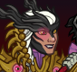ID: 619**Twice Cursed Havilar (Havilar)**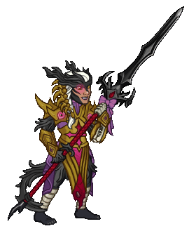
        
        
            **Skin**
            Twice Cursed Havilar
        
    
    
        
            ID: 292**Lefty the Crawling Claw**Undeath wrecks your cuticles--you have to stay on top of that.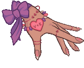
        
        
            **Familiar**
            Lefty the Crawling Claw
        
    
    
        
            ID: 2367**Feat**???: 2367
        
        
            **Feat**
            ???: 2367
        
    
    
        
            ID: 171**Platinum Havilar Chest**Loot for: Havilar<code>"for_crusaders":[56]</code>
        
        
            **Chest**
            Platinum Havilar Chest
            x32 (Shinies x2)
        
    
    
        
            ID: 1723**Potion of the Gem Hunter**Increases the gem drops from bosses by 50%<code>increase_boss_gems_percent,50</code>
        
        
            **Buff**
            Potion of the Gem Hunter
            x1
        
    

ID: 638

### Turiel the Fallen Skin & Feat Pack - 1,680 Platinum  
Date of release: 12 Nov 2025

> Unlock Turiel along with his exclusive Fallen Skin & Feat!

Contents:

    
        
            ID: 49**Turiel (Seat 1)**
        
        
            **Champion Unlock**
            Turiel
        
    
    
        
            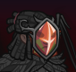ID: 620**Turiel the Fallen (Turiel)**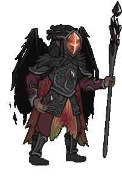
        
        
            **Skin**
            Turiel the Fallen
        
    
    
        
            ID: 2352**Axiomatic Embrace**Good may be corrupted, but law is ineffable by definition.  Increases the effect of Turiel's Lawful Mission ability by 80%. (Prestack)<code>buff_upgrade,80,10661,0</code>
        
        
            **Feat**
            Axiomatic Embrace
            Turiel
        
    
    
        
            ID: 20**Large Bounty Contract**Claim a bounty worth 8 hours of offline gold earnings and event tokens.<code>seconds_worth_of_gold,28800</code>
        
        
            **Buff**
            Large Bounty Contract
            x6
        
    
    
        
            ID: 34**Large Blacksmithing Contract**Contract a master blacksmith to improve a piece of equipment owned by one of your Champions.<code>level_up_loot,24</code>
        
        
            **Buff**
            Large Blacksmithing Contract
            x6
        
    
    
        
            ID: 108**Platinum Turiel Chest**Loot for: Turiel<code>"for_crusaders":[49]</code>
        
        
            **Chest**
            Platinum Turiel Chest
            x14 (Shinies x1)
        
    

ID: 639

### Witch Queen Minthara Skin & Feat Pack - 1,680 Platinum  
Date of release: 12 Nov 2025

> Unlock Minthara along with her exclusive Witch Queen Skin & Feat!

Contents:

    
        
            ID: 154**Minthara (Seat 3)**
        
        
            **Champion Unlock**
            Minthara
        
    
    
        
            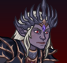ID: 621**Witch Queen Minthara (Minthara)**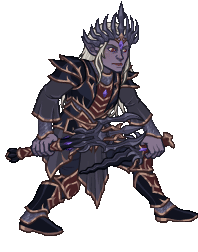
        
        
            **Skin**
            Witch Queen Minthara
        
    
    
        
            ID: 2353**Intense Strife**You think yourself broken? Defeated? I've only just begun.  Increases the effect of Minthara's Soul Branding ability by 80%. (Prestack)<code>buff_upgrade,80,15944,0</code>
        
        
            **Feat**
            Intense Strife
            Minthara
        
    
    
        
            ID: 20**Large Bounty Contract**Claim a bounty worth 8 hours of offline gold earnings and event tokens.<code>seconds_worth_of_gold,28800</code>
        
        
            **Buff**
            Large Bounty Contract
            x6
        
    
    
        
            ID: 34**Large Blacksmithing Contract**Contract a master blacksmith to improve a piece of equipment owned by one of your Champions.<code>level_up_loot,24</code>
        
        
            **Buff**
            Large Blacksmithing Contract
            x6
        
    
    
        
            ID: 579**Platinum Minthara Chest**Loot for: Minthara<code>"for_crusaders":[154]</code>
        
        
            **Chest**
            Platinum Minthara Chest
            x14 (Shinies x1)
        
    

ID: 640

### Gromma's Sea Otter Guide Familiar & Feat Pack - 1,680 Platinum  
Date of release: 19 Nov 2025

> Collect a Feat for Gromma along with an exclusive Gromma-themed familiar!

Contents:

    
        
            ID: 293**Shellby The Sea Otter**Longtime ally of Gromma - easily distracted by pretty things.
        
        
            **Familiar**
            Shellby The Sea Otter
        
    
    
        
            ID: 1757**Rite of Passage**Look how far you've come - you're nearly as old as I am!  Increases the base value of Grandmotherly Love's stacking bonus by 80%.<code>change_upgrade_data,14874,1</code>
        
        
            **Feat**
            Rite of Passage
            Gromma
        
    
    
        
            ID: 36**Potion of Polish**This shiny, silver liquid clings to the edge of the bottle in an unusual way.<code>shiny_loot,1</code>
        
        
            **Buff**
            Potion of Polish
            x1
        
    
    
        
            ID: 77**Huge Potion of Speed**This potion's yellow fluid is streaked with black and swirls on its own.<code>time_scale,2.75</code>
        
        
            **Buff**
            Huge Potion of Speed
            x2
        
    
    
        
            ID: 1712**Potion of the Hunter**Increase Global Damage by 100%<code>global_dps_multiplier_mult,100</code>
        
        
            **Buff**
            Potion of the Hunter
            x1
        
    

ID: 641

### Star Blight Jang Sao Skin & Feat Pack - 1,680 Platinum  
Date of release: 19 Nov 2025

> Unlock Jang Sao along with her exclusive Star Blight Skin & Feat!

Contents:

    
        
            ID: 140**Jang Sao (Seat 8)**
        
        
            **Champion Unlock**
            Jang Sao
        
    
    
        
            ID: 622**Star Blight Jang Sao (Jang Sao)**
        
        
            **Skin**
            Star Blight Jang Sao
        
    
    
        
            ID: 2355**Eternity and Infinity**Nothing can be bolder. Nothing can be vaster.  Increases the effect of Jang Sao's Wisdom of the Ages and Speed of Shooting Stars by 80%. (Prestack)<code>buff_upgrades,80,13261,13262</code>
        
        
            **Feat**
            Eternity and Infinity
            Jang Sao
        
    
    
        
            ID: 20**Large Bounty Contract**Claim a bounty worth 8 hours of offline gold earnings and event tokens.<code>seconds_worth_of_gold,28800</code>
        
        
            **Buff**
            Large Bounty Contract
            x6
        
    
    
        
            ID: 34**Large Blacksmithing Contract**Contract a master blacksmith to improve a piece of equipment owned by one of your Champions.<code>level_up_loot,24</code>
        
        
            **Buff**
            Large Blacksmithing Contract
            x6
        
    
    
        
            ID: 551**Platinum Jang Sao Chest**Loot for: Jang Sao<code>"for_crusaders":[140]</code>
        
        
            **Chest**
            Platinum Jang Sao Chest
            x14 (Shinies x1)
        
    

ID: 642

### Dark Pact Virgil Skin & Feat Pack - 1,680 Platinum  
Date of release: 19 Nov 2025

> Unlock Virgil along with his exclusive Dark Pact Skin & Feat!

Contents:

    
        
            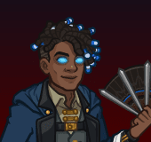ID: 115**Virgil (Seat 10)**
        
        
            **Champion Unlock**
            Virgil
        
    
    
        
            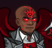ID: 623**Dark Pact Virgil (Virgil)**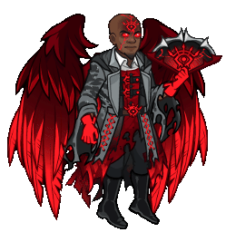
        
        
            **Skin**
            Dark Pact Virgil
        
    
    
        
            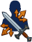ID: 2356**Standard Affair**We're all in this together! ...No, Kent, I'm not singing.  Increases the damage of all Champions by 20% for each unique species in the formation, stacking additively.<code>effect_def,2527</code>
        
        
            **Feat**
            Standard Affair
            Virgil
        
    
    
        
            ID: 20**Large Bounty Contract**Claim a bounty worth 8 hours of offline gold earnings and event tokens.<code>seconds_worth_of_gold,28800</code>
        
        
            **Buff**
            Large Bounty Contract
            x6
        
    
    
        
            ID: 34**Large Blacksmithing Contract**Contract a master blacksmith to improve a piece of equipment owned by one of your Champions.<code>level_up_loot,24</code>
        
        
            **Buff**
            Large Blacksmithing Contract
            x6
        
    
    
        
            ID: 432**Platinum Virgil Chest**Loot for: Virgil<code>"for_crusaders":[115]</code>
        
        
            **Chest**
            Platinum Virgil Chest
            x14 (Shinies x1)
        
    

ID: 643

### Trickster Sheila Skin & Feat Pack - 1,680 Platinum  
Date of release: 26 Nov 2025

> Unlock Sheila along with her exclusive Trickster Skin & Feat!

Contents:

    
        
            ID: 160**Sheila (Seat 7)**
        
        
            **Champion Unlock**
            Sheila
        
    
    
        
            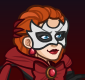ID: 624**Trickster Sheila (Sheila)**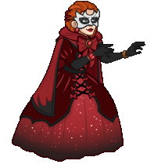
        
        
            **Skin**
            Trickster Sheila
        
    
    
        
            ID: 2357**Best Friends**I trust my friends, and they trust me! We'll always be together!  Increases the effect of Sheila's Meekly Meeting, Youthful Allies and A Rosy Outlook by 80%. (Prestack)<code>buff_upgrades,80,16541,16542,16543</code>
        
        
            **Feat**
            Best Friends
            Sheila
        
    
    
        
            ID: 20**Large Bounty Contract**Claim a bounty worth 8 hours of offline gold earnings and event tokens.<code>seconds_worth_of_gold,28800</code>
        
        
            **Buff**
            Large Bounty Contract
            x6
        
    
    
        
            ID: 34**Large Blacksmithing Contract**Contract a master blacksmith to improve a piece of equipment owned by one of your Champions.<code>level_up_loot,24</code>
        
        
            **Buff**
            Large Blacksmithing Contract
            x6
        
    
    
        
            ID: 653**Platinum Sheila Chests**Loot for: Sheila<code>"for_crusaders":[160]</code>
        
        
            **Chest**
            Platinum Sheila Chests
            x14 (Shinies x1)
        
    

ID: 644

### Cozy Lark Theme Pack - 3,830 Platinum  
Date of release: 03 Dec 2025

> Unlock Lark along with an exclusive Cozy Skin & Familiar!

Contents:

    
        
            ID: 170**Lark**
        
        
            **Champion Unlock**
            Lark
        
    
    
        
            ID: 633**Cozy Lark (Lark)**
        
        
            **Skin**
            Cozy Lark
        
    
    
        
            ID: 294**Lerk the Lark**No idea where he got that hat from, but he has good taste!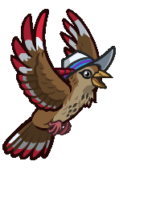
        
        
            **Familiar**
            Lerk the Lark
        
    
    
        
            ID: 2390**Feat**???: 2390
        
        
            **Feat**
            ???: 2390
        
    
    
        
            ID: 769**Platinum Lark Chest**Loot for: Lark<code>"for_crusaders":[170]</code>
        
        
            **Chest**
            Platinum Lark Chest
            x32 (Shinies x2)
        
    
    
        
            ID: 1723**Potion of the Gem Hunter**Increases the gem drops from bosses by 50%<code>increase_boss_gems_percent,50</code>
        
        
            **Buff**
            Potion of the Gem Hunter
            x1
        
    

ID: 645

### Cozy Regis Skin & Feat Pack - 1,680 Platinum  
Date of release: 03 Dec 2025

> Unlock Regis along with his exclusive Cozy Skin & Feat!

Contents:

    
        
            ID: 20**Regis (Seat 2)**
        
        
            **Champion Unlock**
            Regis
        
    
    
        
            ID: 625**Cozy Regis (Regis)**
        
        
            **Skin**
            Cozy Regis
        
    
    
        
            ID: 2358**Standard Affair**I could teach you a thing or two about underestimating common folk.  Increases the damage of all Champions by 20% for each unique species in the formation, stacking additively.<code>effect_def,2527</code>
        
        
            **Feat**
            Standard Affair
            Regis
        
    
    
        
            ID: 20**Large Bounty Contract**Claim a bounty worth 8 hours of offline gold earnings and event tokens.<code>seconds_worth_of_gold,28800</code>
        
        
            **Buff**
            Large Bounty Contract
            x6
        
    
    
        
            ID: 34**Large Blacksmithing Contract**Contract a master blacksmith to improve a piece of equipment owned by one of your Champions.<code>level_up_loot,24</code>
        
        
            **Buff**
            Large Blacksmithing Contract
            x6
        
    
    
        
            ID: 17**Platinum Regis Chest**Loot for: Regis<code>"for_crusaders":[20]</code>
        
        
            **Chest**
            Platinum Regis Chest
            x14 (Shinies x1)
        
    

ID: 646

### Winter Gloom Shadowheart Skin & Feat Pack - 1,680 Platinum  
Date of release: 03 Dec 2025

> Unlock Shadowheart along with her exclusive Winter Gloom Skin & Feat!

Contents:

    
        
            ID: 141**Shadowheart (Seat 6)**
        
        
            **Champion Unlock**
            Shadowheart
        
    
    
        
            ID: 626**Winter Gloom Shadowheart (Shadowheart)**
        
        
            **Skin**
            Winter Gloom Shadowheart
        
    
    
        
            ID: 1981**Prodigal Leader**Pain was my teacher. Let's share what I've learned.  All Champions damage +50%.<code>global_dps_multiplier_mult,50</code>
        
        
            **Feat**
            Prodigal Leader
            Shadowheart
        
    
    
        
            ID: 20**Large Bounty Contract**Claim a bounty worth 8 hours of offline gold earnings and event tokens.<code>seconds_worth_of_gold,28800</code>
        
        
            **Buff**
            Large Bounty Contract
            x6
        
    
    
        
            ID: 34**Large Blacksmithing Contract**Contract a master blacksmith to improve a piece of equipment owned by one of your Champions.<code>level_up_loot,24</code>
        
        
            **Buff**
            Large Blacksmithing Contract
            x6
        
    
    
        
            ID: 553**Platinum  Shadowheart Chest**Loot for: Shadowheart<code>"for_crusaders":[141]</code>
        
        
            **Chest**
            Platinum  Shadowheart Chest
            x14 (Shinies x1)
        
    

ID: 647

### Owlsworth the Snowy Owl Familiar Pack - 1,680 Platinum  
Date of release: 03 Dec 2025

> Collect your own Owlsworth the Snowy Owl familiar!

Contents:

    
        
            ID: 295**Owlsworth the Snowy Owl**Most fear Owlsworth. One didn’t. He doesn't come back now.
        
        
            **Familiar**
            Owlsworth the Snowy Owl
        
    
    
        
            ID: 4**Huge Potion of Giant's Strength**A transparent potion in which floats the sliver of a giant's fingernail.<code>global_dps_multiplier_mult,900</code>
        
        
            **Buff**
            Huge Potion of Giant's Strength
            x4
        
    
    
        
            ID: 8**Huge Potion of Clairvoyance**Three eyeballs bob in this yellowish potion.<code>gold_multiplier_mult,400</code>
        
        
            **Buff**
            Huge Potion of Clairvoyance
            x4
        
    
    
        
            ID: 36**Potion of Polish**This shiny, silver liquid clings to the edge of the bottle in an unusual way.<code>shiny_loot,1</code>
        
        
            **Buff**
            Potion of Polish
            x1
        
    
    
        
            ID: 77**Huge Potion of Speed**This potion's yellow fluid is streaked with black and swirls on its own.<code>time_scale,2.75</code>
        
        
            **Buff**
            Huge Potion of Speed
            x4
        
    

ID: 648

### Winter Gloom Yorven Skin & Feat Pack - 1,680 Platinum  
Date of release: 03 Dec 2025

> Unlock Yorven along with his exclusive Winter Gloom Skin & Feat!

Contents:

    
        
            ID: 92**Yorven (Seat 10)**
        
        
            **Champion Unlock**
            Yorven
        
    
    
        
            ID: 627**Winter Gloom Yorven (Yorven)**
        
        
            **Skin**
            Winter Gloom Yorven
        
    
    
        
            ID: 2360**Too Late**The longer I fight, the angrier I get.  Increases the effect of Yorven's Down The Rabbit Hole ability by 80%.<code>buff_upgrade,80,17066</code>
        
        
            **Feat**
            Too Late
            Yorven
        
    
    
        
            ID: 20**Large Bounty Contract**Claim a bounty worth 8 hours of offline gold earnings and event tokens.<code>seconds_worth_of_gold,28800</code>
        
        
            **Buff**
            Large Bounty Contract
            x6
        
    
    
        
            ID: 34**Large Blacksmithing Contract**Contract a master blacksmith to improve a piece of equipment owned by one of your Champions.<code>level_up_loot,24</code>
        
        
            **Buff**
            Large Blacksmithing Contract
            x6
        
    
    
        
            ID: 341**Platinum Yorven Chest**Loot for: Yorven<code>"for_crusaders":[92]</code>
        
        
            **Chest**
            Platinum Yorven Chest
            x14 (Shinies x1)
        
    

ID: 656

### Jang Sao's Champions of Renown Pack - $69.99  
Date of release: 03 Dec 2025

> Xbox Exclusive (Do Not Translate)

ⓘ *Note: This pack might not be available for purchase since it's potentially a platform giveaway.*

Contents:

    
        
            ID: 54**Artemis (Seat 3)**
        
        
            **Champion Unlock**
            Artemis
        
    
    
        
            ID: 121**Miria (Seat 12)**
        
        
            **Champion Unlock**
            Miria
        
    
    
        
            ID: 129**Astarion (Seat 10)**
        
        
            **Champion Unlock**
            Astarion
        
    
    
        
            ID: 140**Jang Sao (Seat 8)**
        
        
            **Champion Unlock**
            Jang Sao
        
    
    
        
            ID: 158**Kalix (Seat 5)**
        
        
            **Champion Unlock**
            Kalix
        
    
    
        
            ID: 300**Striker the Blood Hawk**Beware the screech of Striker!
        
        
            **Familiar**
            Striker the Blood Hawk
        
    
    
        
            ID: 167**Platinum Artemis Chest**Loot for: Artemis<code>"for_crusaders":[54]</code>
        
        
            **Chest**
            Platinum Artemis Chest
            x32 (Shinies x2)
        
    
    
        
            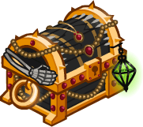ID: 444**Platinum Miria Chest**Loot for: Miria<code>"for_crusaders":[121]</code>
        
        
            **Chest**
            Platinum Miria Chest
            x32 (Shinies x2)
        
    
    
        
            ID: 460**Platinum Astarion Chest**Loot for: Astarion<code>"for_crusaders":[129]</code>
        
        
            **Chest**
            Platinum Astarion Chest
            x32 (Shinies x2)
        
    
    
        
            ID: 551**Platinum Jang Sao Chest**Loot for: Jang Sao<code>"for_crusaders":[140]</code>
        
        
            **Chest**
            Platinum Jang Sao Chest
            x32 (Shinies x2)
        
    
    
        
            ID: 649**Platinum Kalix Chest**Loot for: Kalix<code>"for_crusaders":[158]</code>
        
        
            **Chest**
            Platinum Kalix Chest
            x32 (Shinies x2)
        
    
    
        
            ID: 1721**Potion of the Gold Hunter**Increase Gold Find by 100%<code>gold_multiplier_mult,100</code>
        
        
            **Buff**
            Potion of the Gold Hunter
            x1
        
    
    
        
            ID: 1723**Potion of the Gem Hunter**Increases the gem drops from bosses by 50%<code>increase_boss_gems_percent,50</code>
        
        
            **Buff**
            Potion of the Gem Hunter
            x1
        
    

ID: 649

### Cozy Nordom Theme Pack - 3,830 Platinum  
Date of release: 10 Dec 2025

> Unlock Nordom along with an exclusive Cozy Skin & Familiar!

Contents:

    
        
            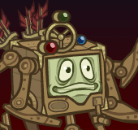ID: 100**Nordom (Seat 9)**
        
        
            **Champion Unlock**
            Nordom
        
    
    
        
            ID: 628**Cozy Nordom (Nordom)**
        
        
            **Skin**
            Cozy Nordom
        
    
    
        
            ID: 296**Cog the Clockwork Modron**Craftsmanship even Primus would be impressed by.
        
        
            **Familiar**
            Cog the Clockwork Modron
        
    
    
        
            ID: 2376**Feat**???: 2376
        
        
            **Feat**
            ???: 2376
        
    
    
        
            ID: 357**Platinum Nordom Chest**Loot for: Nordom<code>"for_crusaders":[100]</code>
        
        
            **Chest**
            Platinum Nordom Chest
            x32 (Shinies x2)
        
    
    
        
            ID: 1723**Potion of the Gem Hunter**Increases the gem drops from bosses by 50%<code>increase_boss_gems_percent,50</code>
        
        
            **Buff**
            Potion of the Gem Hunter
            x1
        
    

ID: 650

### Cozy Halsin Skin & Feat Pack - 1,680 Platinum  
Date of release: 10 Dec 2025

> Unlock Halsin along with his exclusive Cozy Skin & Feat!

Contents:

    
        
            ID: 156**Halsin (Seat 3)**
        
        
            **Champion Unlock**
            Halsin
        
    
    
        
            ID: 629**Cozy Halsin (Halsin)**
        
        
            **Skin**
            Cozy Halsin
        
    
    
        
            ID: 2361**Multiversal Allies**To serve and protect nature is a common bond that transcends all borders.  Increases the damage of all Champions by 20% for each unique species in the formation, stacking additively.<code>effect_def,2193</code>
        
        
            **Feat**
            Multiversal Allies
            Halsin
        
    
    
        
            ID: 20**Large Bounty Contract**Claim a bounty worth 8 hours of offline gold earnings and event tokens.<code>seconds_worth_of_gold,28800</code>
        
        
            **Buff**
            Large Bounty Contract
            x6
        
    
    
        
            ID: 34**Large Blacksmithing Contract**Contract a master blacksmith to improve a piece of equipment owned by one of your Champions.<code>level_up_loot,24</code>
        
        
            **Buff**
            Large Blacksmithing Contract
            x6
        
    
    
        
            ID: 645**Platinum Halsin Chest**Loot for: Halsin<code>"for_crusaders":[156]</code>
        
        
            **Chest**
            Platinum Halsin Chest
            x14 (Shinies x1)
        
    

ID: 651

### Hug the Rug of Smothering Familiar Pack - 2,380 Platinum  
Date of release: 10 Dec 2025

> Collect your own Hug the Rug of Smothering familiar!

Contents:

    
        
            ID: 297**Hug the Rug of Smothering**Full-bodied snuggles, whether you want them or not.
        
        
            **Familiar**
            Hug the Rug of Smothering
        
    
    
        
            ID: 4**Huge Potion of Giant's Strength**A transparent potion in which floats the sliver of a giant's fingernail.<code>global_dps_multiplier_mult,900</code>
        
        
            **Buff**
            Huge Potion of Giant's Strength
            x6
        
    
    
        
            ID: 8**Huge Potion of Clairvoyance**Three eyeballs bob in this yellowish potion.<code>gold_multiplier_mult,400</code>
        
        
            **Buff**
            Huge Potion of Clairvoyance
            x6
        
    
    
        
            ID: 36**Potion of Polish**This shiny, silver liquid clings to the edge of the bottle in an unusual way.<code>shiny_loot,1</code>
        
        
            **Buff**
            Potion of Polish
            x1
        
    
    
        
            ID: 40**Huge Potion of Fire Breath**The orange liquid in this vial flickers and smoke fills the top of the container.<code>click_damage_seconds_global_dps,600</code>
        
        
            **Buff**
            Huge Potion of Fire Breath
            x6
        
    
    
        
            ID: 77**Huge Potion of Speed**This potion's yellow fluid is streaked with black and swirls on its own.<code>time_scale,2.75</code>
        
        
            **Buff**
            Huge Potion of Speed
            x6
        
    
    
        
            ID: 1721**Potion of the Gold Hunter**Increase Gold Find by 100%<code>gold_multiplier_mult,100</code>
        
        
            **Buff**
            Potion of the Gold Hunter
            x1
        
    
    
        
            **Modron Component Pieces**
        
        
            **Modron Component Pieces**
            x2,000
        
    

ID: 652

### Warmduke Skin & Feat Pack - 1,680 Platinum  
Date of release: 10 Dec 2025

> Unlock Warduke along with his exclusive Warmduke Skin & Feat!

Contents:

    
        
            ID: 116**Warduke (Seat 8)**
        
        
            **Champion Unlock**
            Warduke
        
    
    
        
            ID: 630**Warmduke (Warduke)**
        
        
            **Skin**
            Warmduke
        
    
    
        
            ID: 2362**Blazing Blade**I don't WANT to think about tactics. I want to HIT things with my SWORD!  Increases the effect of Warduke's A Trained Killer ability by 80%.<code>buff_upgrade,80,9615</code>
        
        
            **Feat**
            Blazing Blade
            Warduke
        
    
    
        
            ID: 20**Large Bounty Contract**Claim a bounty worth 8 hours of offline gold earnings and event tokens.<code>seconds_worth_of_gold,28800</code>
        
        
            **Buff**
            Large Bounty Contract
            x6
        
    
    
        
            ID: 34**Large Blacksmithing Contract**Contract a master blacksmith to improve a piece of equipment owned by one of your Champions.<code>level_up_loot,24</code>
        
        
            **Buff**
            Large Blacksmithing Contract
            x6
        
    
    
        
            ID: 434**Platinum Warduke Chest**Loot for: Warduke<code>"for_crusaders":[116]</code>
        
        
            **Chest**
            Platinum Warduke Chest
            x14 (Shinies x1)
        
    

ID: 657

### Cozy Dark Urge Party Pack - $19.99  
Date of release: 11 Dec 2025

> 

ⓘ *Note: This pack might not be available for purchase since it's potentially a platform giveaway.*

Contents:

    
        
            ID: 103**Valentine (Seat 5)**
        
        
            **Champion Unlock**
            Valentine
        
    
    
        
            ID: 146**Dark Urge (Seat 11)**
        
        
            **Champion Unlock**
            Dark Urge
        
    
    
        
            ID: 168**King of Shadows (Seat 9)**
        
        
            **Champion Unlock**
            King of Shadows
        
    
    
        
            ID: 638**Cozy Dark Urge (Dark Urge)**
        
        
            **Skin**
            Cozy Dark Urge
        
    
    
        
            ID: 2440**Vicious Damage**Ooh, that's sure to leave a nasty scar, milord. Bravo!  Increases the damage of Dark Urge by 400%. Dark Urge's attacks prevent the target from healing for 10 seconds.<code>hero_dps_multiplier_mult,400 vicious_damage,10</code>
        
        
            **Feat**
            Vicious Damage
            Dark Urge
        
    
    
        
            ID: 363**Platinum Valentine Chest**Loot for: Valentine<code>"for_crusaders":[103]</code>
        
        
            **Chest**
            Platinum Valentine Chest
            x14 (Shinies x1)
        
    
    
        
            ID: 563**Platinum The Dark Urge Chest**Loot for: Dark Urge<code>"for_crusaders":[146]</code>
        
        
            **Chest**
            Platinum The Dark Urge Chest
            x14 (Shinies x1)
        
    
    
        
            ID: 756**Platinum King of Shadows Chest**Loot for: King of Shadows<code>"for_crusaders":[168]</code>
        
        
            **Chest**
            Platinum King of Shadows Chest
            x14 (Shinies x1)
        
    

ID: 653

### Champions of Renown: Year 8 All Star Pack - 8,000 Platinum  
Date of release: 23 Dec 2025

> Unlock and quickly gear up 5 of our favorite Champions from Year 8! Includes an exclusive skin for Kalix!

Contents:

    
        
            ID: 153**Kas (Seat 6)**
        
        
            **Champion Unlock**
            Kas
        
    
    
        
            ID: 157**Eric (Seat 4)**
        
        
            **Champion Unlock**
            Eric
        
    
    
        
            ID: 158**Kalix (Seat 5)**
        
        
            **Champion Unlock**
            Kalix
        
    
    
        
            ID: 159**Volo (Seat 9)**
        
        
            **Champion Unlock**
            Volo
        
    
    
        
            ID: 165**Baldric (Seat 12)**
        
        
            **Champion Unlock**
            Baldric
        
    
    
        
            ID: 631**???**
        
        
            **???**
            skin
            ID: 631
        
    
    
        
            ID: 577**Platinum Kas Chest**Loot for: Kas<code>"for_crusaders":[153]</code>
        
        
            **Chest**
            Platinum Kas Chest
            x32 (Shinies x2)
        
    
    
        
            ID: 647**Platinum Eric Chest**Loot for: Eric<code>"for_crusaders":[157]</code>
        
        
            **Chest**
            Platinum Eric Chest
            x32 (Shinies x2)
        
    
    
        
            ID: 649**Platinum Kalix Chest**Loot for: Kalix<code>"for_crusaders":[158]</code>
        
        
            **Chest**
            Platinum Kalix Chest
            x32 (Shinies x2)
        
    
    
        
            ID: 651**Platinum Volo Chest**Loot for: Volo<code>"for_crusaders":[159]</code>
        
        
            **Chest**
            Platinum Volo Chest
            x32 (Shinies x2)
        
    
    
        
            ID: 663**Platinum Baldric Chest**Loot for: Baldric<code>"for_crusaders":[165]</code>
        
        
            **Chest**
            Platinum Baldric Chest
            x32 (Shinies x2)
        
    

ID: 654

### Cozy Hunter Vin Ursa Skin & Feat Pack - 1,680 Platinum  
Date of release: 30 Dec 2025

> Unlock Vin Ursa along with her exclusive Cozy Hunter Skin & Feat!

Contents:

    
        
            ID: 127**Vin Ursa (Seat 7)**
        
        
            **Champion Unlock**
            Vin Ursa
        
    
    
        
            ID: 632**Cozy Hunter Vin Ursa (Vin Ursa)**
        
        
            **Skin**
            Cozy Hunter Vin Ursa
        
    
    
        
            ID: 2224**Orbital Ooze**I'm a simple plasmoid making my way through wildspace.  Increases the effect of Vin Ursa's Friends in Low Places, Friends in Meh Places and Friends in High Places by 80%.<code>buff_upgrades,80,12092,12093,12094</code>
        
        
            **Feat**
            Orbital Ooze
            Vin Ursa
        
    
    
        
            ID: 20**Large Bounty Contract**Claim a bounty worth 8 hours of offline gold earnings and event tokens.<code>seconds_worth_of_gold,28800</code>
        
        
            **Buff**
            Large Bounty Contract
            x6
        
    
    
        
            ID: 34**Large Blacksmithing Contract**Contract a master blacksmith to improve a piece of equipment owned by one of your Champions.<code>level_up_loot,24</code>
        
        
            **Buff**
            Large Blacksmithing Contract
            x6
        
    
    
        
            ID: 456**Platinum Vin Ursa Chest**Loot for: Vin Ursa<code>"for_crusaders":[127]</code>
        
        
            **Chest**
            Platinum Vin Ursa Chest
            x14 (Shinies x1)
        
    

ID: 655

### Fixer the Automaton Familiar & Lazaapz Feat Pack - 1,680 Platinum  
Date of release: 30 Dec 2025

> Collect a Feat for Lazaapz along with an exclusive Lazaapz-themed familiar!

Contents:

    
        
            ID: 298**Fixer the Automaton**Quicker she says. Always quicker!
        
        
            **Familiar**
            Fixer the Automaton
        
    
    
        
            ID: 2364**Inexhaustible Fury**Let's GO! I feel GREAT! I could break stuff all DAY!  Increases the effect of Lazaapz's first set of Specializations by 80%.<code>buff_upgrades,80,17484,17485,17486</code>
        
        
            **Feat**
            Inexhaustible Fury
            Lazaapz
        
    
    
        
            ID: 36**Potion of Polish**This shiny, silver liquid clings to the edge of the bottle in an unusual way.<code>shiny_loot,1</code>
        
        
            **Buff**
            Potion of Polish
            x1
        
    
    
        
            ID: 77**Huge Potion of Speed**This potion's yellow fluid is streaked with black and swirls on its own.<code>time_scale,2.75</code>
        
        
            **Buff**
            Huge Potion of Speed
            x2
        
    
    
        
            ID: 1712**Potion of the Hunter**Increase Global Damage by 100%<code>global_dps_multiplier_mult,100</code>
        
        
            **Buff**
            Potion of the Hunter
            x1
        
    

[Back to Top](#top)

*Last Modified: {{ site.time }}*