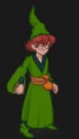
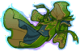
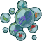
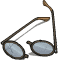
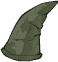
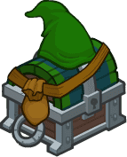

[Back to Main](index.md)

    
        Portait
    
    
        Model
    

# Presto

Presto, or the Magician, and also called Preston, was a wizard and an adventurer from Earth and the Realm (no relation). He was a companion of the monk Diana, the barbarian Bobby, the fighter Eric, the ranger Hank, and the rogue Sheila.

[Presto - FR Fandom Wiki](https://forgottenrealms.fandom.com/wiki/Presto)

# Basic Information

Presto will be the new champion in the Grand Revel event on 31 January 2024.

    
        
            **Seat**:
        
        
            Unknown
        
    
    
        
            **Race**:
        
        
            Human (Guess)
        
    
    
        
            **Class**:
        
        
            Wizard (Guess)
        
    
    
        
            **Roles**:
        
        
            Support (Guess)
        
    
    
        
            **Age**:
        
        
            Unknown
        
    
    
        
            **Gender**:
        
        
            Male (Guess)
        
    
    
        
            **Alignment**:
        
        
            Unknown
        
    
    
        
            **Affiliation**:
        
        
            Unknown
        
    

# Formation

Unknown.


    



# Abilities

**Base Attack: Presto's Hat** (Magic)
> Presto takes his hat off, pulls out a random projectile, and throws it at the nearest enemy, dealing one hit.  
> Cooldown: 4.9s (Cap 1.225s)

<em>Raw Data</em>

<pre>
{
    "id": 723,
    "name": "Presto's Hat",
    "description": "Presto takes his hat off, pulls out a random projectile, and throws it at the nearest enemy, dealing one hit.",
    "long_description": "",
    "graphic_id": 0,
    "target": "random",
    "num_targets": 1,
    "aoe_radius": 0,
    "damage_modifier": 1,
    "cooldown": 4.9,
    "animations": [
        {
            "type": "ranged_attack",
            "projectile": "pd_generic_projectile",
            "shoot_frame": 20,
            "shoot_sound": 149,
            "hit_sound": 133,
            "projectile_details": {
                "hash": "506536f125912899f3ee905bda3e8b02",
                "projectile_speed": 1250,
                "projectile_graphic_id": 22060,
                "percent_height_offset": 10,
                "rotation_speed": 100
            },
            "change_attack": {
                "attack_ids": [
                    723,
                    724,
                    725
                ]
            }
        }
    ],
    "tags": [
        "ranged"
    ],
    "damage_types": [
        "magic"
    ]
}
</pre>

**Base Attack: Presto's Hat** (Magic)
> Presto takes his hat off, pulls out a random projectile, and throws it at the nearest enemy, dealing one hit.  
> Cooldown: 4.9s (Cap 1.225s)

<em>Raw Data</em>

<pre>
{
    "id": 724,
    "name": "Presto's Hat",
    "description": "Presto takes his hat off, pulls out a random projectile, and throws it at the nearest enemy, dealing one hit.",
    "long_description": "",
    "graphic_id": 0,
    "target": "random",
    "num_targets": 1,
    "aoe_radius": 0,
    "damage_modifier": 1,
    "cooldown": 4.9,
    "animations": [
        {
            "type": "ranged_attack",
            "projectile": "pd_generic_projectile",
            "shoot_frame": 20,
            "shoot_sound": 149,
            "hit_sound": 133,
            "projectile_details": {
                "hash": "da28f8663d38cd1dd79099dcff2af789",
                "projectile_speed": 1250,
                "projectile_graphic_id": 22062,
                "percent_height_offset": -5
            },
            "change_attack": {
                "attack_ids": [
                    723,
                    724,
                    725
                ]
            }
        }
    ],
    "tags": [
        "ranged"
    ],
    "damage_types": [
        "magic"
    ]
}
</pre>

**Base Attack: Presto's Hat** (Magic)
> Presto takes his hat off, pulls out a random projectile, and throws it at the nearest enemy, dealing one hit.  
> Cooldown: 4.9s (Cap 1.225s)

<em>Raw Data</em>

<pre>
{
    "id": 725,
    "name": "Presto's Hat",
    "description": "Presto takes his hat off, pulls out a random projectile, and throws it at the nearest enemy, dealing one hit.",
    "long_description": "",
    "graphic_id": 0,
    "target": "random",
    "num_targets": 1,
    "aoe_radius": 0,
    "damage_modifier": 1,
    "cooldown": 4.9,
    "animations": [
        {
            "type": "ranged_attack",
            "projectile": "pd_generic_projectile",
            "shoot_frame": 20,
            "shoot_sound": 149,
            "hit_sound": 133,
            "projectile_details": {
                "hash": "f5c28dff14660a99747464d9098133fc",
                "projectile_speed": 1400,
                "projectile_graphic_id": 22061,
                "percent_height_offset": 5
            },
            "change_attack": {
                "attack_ids": [
                    723,
                    724,
                    725
                ]
            }
        }
    ],
    "tags": [
        "ranged"
    ],
    "damage_types": [
        "magic"
    ]
}
</pre>

**Ultimate Attack: Ultimate Hat Trick**
> Presto takes his hat off and holds it out in front of him, firing an assortment of objects at his opponents.  
> Cooldown: 4.9s (Cap 1.225s)

ⓘ *Note: Very short ultimate cooldowns are almost always for testing purposes and are likely to be increased later.*

<em>Raw Data</em>

<pre>
{
    "id": 726,
    "name": "Ultimate Hat Trick",
    "description": "Presto fires assorted objects from his hat at his enemies.",
    "long_description": "Presto takes his hat off and holds it out in front of him, firing an assortment of objects at his opponents.",
    "graphic_id": 22107,
    "target": "random",
    "num_targets": 1,
    "aoe_radius": 0,
    "damage_modifier": 1,
    "cooldown": 4.9,
    "animations": [
        {
            "type": "presto_ultimate",
            "snowball_data": {
                "slow_effect": {
                    "effect_string": "monster_speed_reduce,50",
                    "for_time": "10"
                },
                "snow_effect": {
                    "effect_string": "change_weather",
                    "weather": "snowing_only"
                }
            },
            "firework_data": {
                "stun_effect": {
                    "effect_string": "monster_stun,5"
                },
                "fog_effect": {
                    "effect_string": "change_weather",
                    "weather": "fog"
                }
            },
            "tornado_data": {
                "knockback_effect": {
                    "effect_string": "push_back_monster,25"
                },
                "rain_effect": {
                    "effect_string": "change_weather",
                    "weather": "rain"
                }
            }
        }
    ],
    "tags": [
        "ranged",
        "ultimate"
    ],
    "damage_types": [
        "magic"
    ]
}
</pre>

**Component Scavenger** (Guess)
> Presto increases the damage of Champions in the two columns in front of him by 100%.

<em>Raw Data</em>

<pre>
{
    "id": 1836,
    "flavour_text": "",
    "description": {
        "desc": "$source increases the damage of Champions in the two columns in front of him by $(amount)%"
    },
    "effect_keys": [
        {
            "effect_string": "hero_dps_multiplier_mult,100",
            "targets": [
                "next_two_col"
            ]
        }
    ],
    "requirements": "",
    "graphic_id": 0,
    "properties": {
        "is_formation_ability": true
    }
}
</pre>

**Hat of Many Spells** (Guess)
> Presto's attacks cause monsters hit by them to take +$(amount)% damage (for 15 seconds), stacking multiplicatively up to 5 times. In addition, a secondary effect occurs depending on the projectile.

<em>Raw Data</em>

<pre>
{
    "id": 1837,
    "flavour_text": "",
    "description": {
        "desc": "Presto's attacks cause monsters hit by them to take +$(amount)% damage (for 15 seconds), stacking multiplicatively up to 5 times. In addition, a secondary effect occurs depending on the projectile."
    },
    "effect_keys": [
        {
            "effect_string": "presto_hat_of_many_spells",
            "debuff_before_damage": true,
            "slow_amount": 50,
            "debuff_duration": 5,
            "debuffing_attack_ids": [
                723
            ],
            "debuff_effects": [
                {
                    "effect_string": "monster_speed_reduce,$slow_amount",
                    "for_time": "$debuff_duration"
                }
            ]
        },
        {
            "effect_string": "presto_hat_of_many_spells",
            "debuff_before_damage": true,
            "knockback_amount": 15,
            "debuffing_attack_ids": [
                724
            ],
            "debuff_effects": [
                {
                    "effect_string": "push_back_monster,$knockback_amount"
                }
            ]
        },
        {
            "effect_string": "presto_hat_of_many_spells",
            "debuff_before_damage": true,
            "stun_duration": 5,
            "debuffing_attack_ids": [
                725
            ],
            "debuff_effects": [
                {
                    "effect_string": "monster_stun,$stun_duration"
                }
            ]
        },
        {
            "effect_string": "presto_hat_of_many_spells",
            "debuff_before_damage": true,
            "debuff_base_amount": 100,
            "debuff_max_stacks": 5,
            "debuff_duration": 15,
            "reset_time_on_reapply": true,
            "debuffing_attack_ids": [
                723,
                724,
                725
            ],
            "debuff_effects": [
                {
                    "effect_string": "increase_monster_damage,$debuff_base_amount",
                    "active_graphic_id": 22161,
                    "use_stack_as_frame": true,
                    "stack_as_frame_offset": -1,
                    "overlay_play_mode": "stopped",
                    "bottom": true,
                    "stacks_on_reapply": true,
                    "manual_stacking": true,
                    "max_stacks": "$debuff_max_stacks",
                    "stacks_multiply": true,
                    "use_collection_source": true,
                    "time_stack_type": "time_reset",
                    "stack_across_effects": false,
                    "for_time": "$debuff_duration"
                }
            ]
        }
    ],
    "requirements": "",
    "graphic_id": 0,
    "properties": {
        "is_formation_ability": true,
        "owner_use_outgoing_description": true
    }
}
</pre>

**Hesitant Helper** (Guess)
> Presto increases the damage of Champions in the two columns in front of him by $(amount)%.

<em>Raw Data</em>

<pre>
{
    "id": 1838,
    "flavour_text": "",
    "description": {
        "desc": "$source increases the damage of Champions in the two columns in front of him by $(amount)%"
    },
    "effect_keys": [
        {
            "effect_string": "do_nothing"
        }
    ],
    "requirements": "",
    "graphic_id": 0,
    "properties": {
        "is_formation_ability": true
    }
}
</pre>

**Ultimate Hat Trick** (Guess)
> Presto increases the damage bonus of Hesitant Helper by 100% for each Champion in the formation with a total ability score of 78 or less.

<em>Raw Data</em>

<pre>
{
    "id": 1839,
    "flavour_text": "",
    "description": {
        "desc": "$source increases the damage bonus of Hesitant Helper by $(amount)% for each Champion in the formation with a total ability score of 78 or less."
    },
    "effect_keys": [
        {
            "effect_string": "buff_upgrade,100,13762",
            "show_bonus": true,
            "amount_func": "mult",
            "stack_func": "per_crusader",
            "target_filters": [
                {
                    "type": "stat",
                    "stat": "total_ability_score",
                    "comparison": "<=",
                    "value": 78
                }
            ],
            "stack_title": "Magic Champions",
            "amount_updated_listeners": [
                "feat_changed",
                "slot_changed"
            ]
        }
    ],
    "requirements": "",
    "graphic_id": 0,
    "properties": {
        "is_formation_ability": true
    }
}
</pre>

# Specialisations

**Specialisation: Humble Heroes** (Guess)
> Presto increases the damage bonus of Hesitant Helper by 100% for each Champion in the formation with an age of 20 or less.

<em>Raw Data</em>

<pre>
{
    "id": 1840,
    "flavour_text": "",
    "description": {
        "desc": "$source increases the damage bonus of Hesitant Helper by $(amount)% for each Champion in the formation with an age of 20 or less."
    },
    "effect_keys": [
        {
            "effect_string": "buff_upgrade,100,13762",
            "show_bonus": true,
            "amount_func": "mult",
            "stack_func": "per_crusader",
            "target_filters": [
                {
                    "type": "stat_score",
                    "stat": "age",
                    "check": "<=",
                    "value": 20
                },
                {
                    "type": "stat_score",
                    "stat": "age",
                    "check": ">=",
                    "value": 0
                }
            ],
            "stack_title": "Young Champions",
            "amount_updated_listeners": [
                "slot_changed",
                "feat_changed"
            ]
        }
    ],
    "requirements": "",
    "graphic_id": 0,
    "properties": {
        "is_formation_ability": true
    }
}
</pre>

**Specialisation: Junior Juggernauts** (Guess)
> Presto increases the damage bonus of Hesitant Helper by 100% for each Champion in the formation with a magic attack.

<em>Raw Data</em>

<pre>
{
    "id": 1841,
    "flavour_text": "",
    "description": {
        "desc": "$source increases the damage bonus of Hesitant Helper by $(amount)% for each Champion in the formation with a magic attack."
    },
    "effect_keys": [
        {
            "effect_string": "buff_upgrade,100,13762",
            "show_bonus": true,
            "amount_func": "mult",
            "stack_func": "per_crusader",
            "target_filters": [
                {
                    "type": "attack_type",
                    "attack": "magic"
                }
            ],
            "stack_title": "Magic Champions",
            "amount_updated_listeners": [
                "attack_changed",
                "slot_changed"
            ]
        }
    ],
    "requirements": "",
    "graphic_id": 0,
    "properties": {
        "is_formation_ability": true
    }
}
</pre>

**Specialisation: Magical Mastery** (Guess)
> Presto increases the damage bonus of Hesitant Helper by $(amount)% for each Champion in the formation with a magic attack.

<em>Raw Data</em>

<pre>
{
    "id": 1842,
    "flavour_text": "",
    "description": {
        "desc": "$source increases the damage bonus of Hesitant Helper by $(amount)% for each Champion in the formation with a magic attack."
    },
    "effect_keys": [
        {
            "effect_string": "change_base_attack,724",
            "apply_to_hero": true
        }
    ],
    "requirements": "",
    "graphic_id": 0,
    "properties": []
}
</pre>

# Items

    
        
            **Icons**
        
        
            **Name**
        
    
    
        
            
        
        
            Clothes
        
    
    
        
            
        
        
            Conjured Toy
        
    
    
        
            
        
        
            Glasses
        
    
    
        
            
        
        
            Hat
        
    
    
        
            
        
        
            Magic Item
        
    
    
        
            
        
        
            Magic Stuff
        
    

# Feats

Unknown.

# Legendaries

Unknown.

# Other Champion Images

    
        
            Console Portait
        
    
    
        
            Gold Chest Icon
        
        
            Silver Chest Icon
        
    

[Back to Top](#top)

*Last Modified: {{ site.time }}*