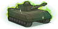

[Back to Main](index.md)

    
        Portait
    
    
        Model
    

# Presto

Presto, or the Magician, and also called Preston, was a wizard and an adventurer from Earth and the Realm (no relation). He was a companion of the monk Diana, the barbarian Bobby, the fighter Eric, the ranger Hank, and the rogue Sheila.

[Presto - FR Fandom Wiki](https://forgottenrealms.fandom.com/wiki/Presto)

# Basic Information

Presto will be the new champion in the Grand Revel event on 31 January 2024.

    
        
            **Seat**:
        
        
            Unknown
        
    
    
        
            **Race**:
        
        
            Human (Guess)
        
    
    
        
            **Class**:
        
        
            Wizard (Guess)
        
    
    
        
            **Roles**:
        
        
            Support (Guess)
        
    
    
        
            **Age**:
        
        
            Unknown
        
    
    
        
            **Gender**:
        
        
            Male (Guess)
        
    
    
        
            **Alignment**:
        
        
            Unknown
        
    
    
        
            **Affiliation**:
        
        
            Unknown
        
    

# Formation

Unknown.


    



# Abilities

**Base Attack: Presto's Hat** (Magic)
> Presto takes his hat off, pulls out a random projectile, and throws it at the nearest enemy, dealing one hit.  
> Cooldown: 4.9s (Cap 1.225s)

<em>Raw Data</em>

<pre>
{
    "description": "Presto takes his hat off, pulls out a random projectile, and throws it at the nearest enemy, dealing one hit.",
    "long_description": "",
    "damage_modifier": 1,
    "damage_types": ["magic"],
    "graphic_id": 0,
    "target": "random",
    "aoe_radius": 0,
    "tags": ["ranged"],
    "num_targets": 1,
    "animations": [{
        "effect_frames": {
            "apply_to_hero": true,
            "projectile": {
                "apply_to_hero": true,
                "effect_string": "effect_def,1842"
            }
        },
        "projectile_details": {
            "percent_height_offset": 10,
            "projectile_graphic_id": 22060,
            "projectile_speed": 1250,
            "hash": "506536f125912899f3ee905bda3e8b02",
            "rotation_speed": 100
        },
        "hit_sound": 133,
        "shoot_sound": 149,
        "type": "ranged_attack",
        "projectile": "pd_generic_projectile",
        "shoot_frame": 20
    }],
    "name": "Presto's Hat",
    "cooldown": 4.9,
    "id": 723
}
</pre>

**Base Attack: Presto's Hat** (Magic)
> Presto takes his hat off, pulls out a random projectile, and throws it at the nearest enemy, dealing one hit.  
> Cooldown: 4.9s (Cap 1.225s)

<em>Raw Data</em>

<pre>
{
    "description": "Presto takes his hat off, pulls out a random projectile, and throws it at the nearest enemy, dealing one hit.",
    "long_description": "",
    "damage_modifier": 1,
    "damage_types": ["magic"],
    "graphic_id": 0,
    "target": "random",
    "aoe_radius": 0,
    "tags": ["ranged"],
    "num_targets": 1,
    "animations": [{
        "projectile_details": {
            "percent_height_offset": -5,
            "projectile_graphic_id": 22062,
            "projectile_speed": 1250,
            "hash": "da28f8663d38cd1dd79099dcff2af789"
        },
        "hit_sound": 133,
        "shoot_sound": 149,
        "type": "ranged_attack",
        "projectile": "pd_generic_projectile",
        "shoot_frame": 20
    }],
    "name": "Presto's Hat",
    "cooldown": 4.9,
    "id": 724
}
</pre>

**Base Attack: Presto's Hat** (Magic)
> Presto takes his hat off, pulls out a random projectile, and throws it at the nearest enemy, dealing one hit.  
> Cooldown: 4.9s (Cap 1.225s)

<em>Raw Data</em>

<pre>
{
    "description": "Presto takes his hat off, pulls out a random projectile, and throws it at the nearest enemy, dealing one hit.",
    "long_description": "",
    "damage_modifier": 1,
    "damage_types": ["magic"],
    "graphic_id": 0,
    "target": "random",
    "aoe_radius": 0,
    "tags": ["ranged"],
    "num_targets": 1,
    "animations": [{
        "projectile_details": {
            "percent_height_offset": 5,
            "projectile_graphic_id": 22061,
            "projectile_speed": 1400,
            "hash": "f5c28dff14660a99747464d9098133fc"
        },
        "hit_sound": 133,
        "shoot_sound": 149,
        "type": "ranged_attack",
        "projectile": "pd_generic_projectile",
        "shoot_frame": 20
    }],
    "name": "Presto's Hat",
    "cooldown": 4.9,
    "id": 725
}
</pre>

**Base Attack: Ultimate Hat Trick** (Magic)
> Presto takes his hat off, pulls out a random projectile, and throws it at the nearest enemy, dealing one hit.  
> Cooldown: 4.9s (Cap 1.225s)

<em>Raw Data</em>

<pre>
{
    "description": "Presto takes his hat off, pulls out a random projectile, and throws it at the nearest enemy, dealing one hit.",
    "long_description": "",
    "damage_modifier": 1,
    "damage_types": ["magic"],
    "graphic_id": 0,
    "target": "random",
    "aoe_radius": 0,
    "tags": ["ranged"],
    "num_targets": 1,
    "animations": [{
        "projectile_details": {
            "trail": {
                "scale_lerp": [
                    {
                        "x": 1,
                        "y": 1
                    },
                    {
                        "x": 1,
                        "y": 1
                    }
                ],
                "lifespan": 0.5,
                "initial_velocity": {
                    "x": 0,
                    "y": 0
                },
                "alpha_lerp": {
                    "0": 0,
                    "1": 0,
                    "0.1": 0.75
                },
                "particle_graphic_ids": [8003],
                "spawn_rate": 250,
                "velocity_jitter": {
                    "x": 0,
                    "y": 0
                }
            },
            "projectile_graphic_id": 8003,
            "projectile_speed": 2000,
            "hash": "baja_blast"
        },
        "hit_sound": 133,
        "shoot_sound": 149,
        "type": "ranged_attack",
        "projectile": "pd_generic_projectile",
        "shoot_frame": 6
    }],
    "name": "Ultimate Hat Trick",
    "cooldown": 4.9,
    "id": 726
}
</pre>

**Component Scavenger** (Guess)
> Presto increases the damage of Champions in the two columns in front of him by 100%.

<em>Raw Data</em>

<pre>
{
    "effect_keys": [{
        "effect_string": "hero_dps_multiplier_mult,100",
        "targets": ["next_two_col"]
    }],
    "requirements": "",
    "description": {"desc": "$source increases the damage of Champions in the two columns in front of him by $(amount)%"},
    "id": 1836,
    "flavour_text": "",
    "graphic_id": 0,
    "properties": {"is_formation_ability": true}
}
</pre>

**Hat of Many Spells** (Guess)
> Presto increases the damage of Champions in the two columns in front of him by $(amount)%.

<em>Raw Data</em>

<pre>
{
    "effect_keys": [{"effect_string": "do_nothing"}],
    "requirements": "",
    "description": {"desc": "$source increases the damage of Champions in the two columns in front of him by $(amount)%"},
    "id": 1837,
    "flavour_text": "",
    "graphic_id": 0,
    "properties": {"is_formation_ability": true}
}
</pre>

**Hesitant Helper** (Guess)
> Presto increases the damage of Champions in the two columns in front of him by $(amount)%.

<em>Raw Data</em>

<pre>
{
    "effect_keys": [{"effect_string": "do_nothing"}],
    "requirements": "",
    "description": {"desc": "$source increases the damage of Champions in the two columns in front of him by $(amount)%"},
    "id": 1838,
    "flavour_text": "",
    "graphic_id": 0,
    "properties": {"is_formation_ability": true}
}
</pre>

**Ultimate Hat Trick** (Guess)
> Presto increases the damage bonus of Hesitant Helper by 100% for each Champion in the formation with a total ability score of 78 or less.

<em>Raw Data</em>

<pre>
{
    "effect_keys": [{
        "stack_title": "Magic Champions",
        "amount_updated_listeners": [
            "feat_changed",
            "slot_changed"
        ],
        "show_bonus": true,
        "amount_func": "mult",
        "stack_func": "per_crusader",
        "effect_string": "buff_upgrade,100,13762",
        "target_filters": [{
            "stat": "total_ability_score",
            "comparison": "<=",
            "type": "stat",
            "value": 78
        }]
    }],
    "requirements": "",
    "description": {"desc": "$source increases the damage bonus of Hesitant Helper by $(amount)% for each Champion in the formation with a total ability score of 78 or less."},
    "id": 1839,
    "flavour_text": "",
    "graphic_id": 0,
    "properties": {"is_formation_ability": true}
}
</pre>

# Specialisations

**Specialisation: Humble Heroes** (Guess)
> Presto increases the damage bonus of Hesitant Helper by 100% for each Champion in the formation with an age of 20 or less.

<em>Raw Data</em>

<pre>
{
    "effect_keys": [{
        "stack_title": "Young Champions",
        "amount_updated_listeners": [
            "slot_changed",
            "feat_changed"
        ],
        "show_bonus": true,
        "amount_func": "mult",
        "stack_func": "per_crusader",
        "effect_string": "buff_upgrade,100,13762",
        "target_filters": [
            {
                "stat": "age",
                "check": "<=",
                "type": "stat_score",
                "value": 20
            },
            {
                "stat": "age",
                "check": ">=",
                "type": "stat_score",
                "value": 0
            }
        ]
    }],
    "requirements": "",
    "description": {"desc": "$source increases the damage bonus of Hesitant Helper by $(amount)% for each Champion in the formation with an age of 20 or less."},
    "id": 1840,
    "flavour_text": "",
    "graphic_id": 0,
    "properties": {"is_formation_ability": true}
}
</pre>

**Specialisation: Junior Juggernauts** (Guess)
> Presto increases the damage bonus of Hesitant Helper by 100% for each Champion in the formation with a magic attack.

<em>Raw Data</em>

<pre>
{
    "effect_keys": [{
        "stack_title": "Magic Champions",
        "amount_updated_listeners": [
            "attack_changed",
            "slot_changed"
        ],
        "show_bonus": true,
        "amount_func": "mult",
        "stack_func": "per_crusader",
        "effect_string": "buff_upgrade,100,13762",
        "target_filters": [{
            "attack": "magic",
            "type": "attack_type"
        }]
    }],
    "requirements": "",
    "description": {"desc": "$source increases the damage bonus of Hesitant Helper by $(amount)% for each Champion in the formation with a magic attack."},
    "id": 1841,
    "flavour_text": "",
    "graphic_id": 0,
    "properties": {"is_formation_ability": true}
}
</pre>

**Specialisation: Magical Mastery** (Guess)
> Presto increases the damage bonus of Hesitant Helper by $(amount)% for each Champion in the formation with a magic attack.

<em>Raw Data</em>

<pre>
{
    "effect_keys": [{
        "apply_to_hero": true,
        "effect_string": "change_base_attack,724"
    }],
    "requirements": "",
    "description": {"desc": "$source increases the damage bonus of Hesitant Helper by $(amount)% for each Champion in the formation with a magic attack."},
    "id": 1842,
    "flavour_text": "",
    "graphic_id": 0,
    "properties": []
}
</pre>

# Items

    
        
            **Icons**
        
        
            **Name**
        
    
    
        
            
        
        
            Clothes
        
    
    
        
            
        
        
            Conjured Toy
        
    
    
        
            
        
        
            Glasses
        
    
    
        
            
        
        
            Hat
        
    
    
        
            
        
        
            Magic Item
        
    
    
        
            
        
        
            Magic Stuff
        
    

# Feats

Unknown.

# Legendaries

Unknown.

# Other Champion Images

    
        
            Console Portait
        
    
    
        
            Gold Chest Icon
        
        
            Silver Chest Icon
        
    

[Back to Top](#top)

*Last Modified: {{ site.time }}*