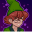
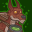
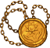
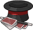
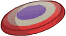
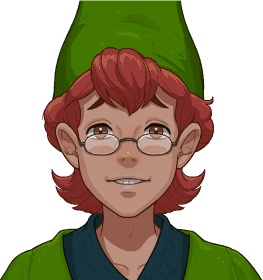

[Back to Main](index.md)

    
        Portait
    
    
        Model
    

# Presto

Presto is a bookish and timid teenager whose dreams of becoming a magician became reality when he was transported with his friends to the magical world of Dungeons & Dragons. He wields a capricious, unpredictable form of magic with his distinctive green magical hat. Presto is known for his inventive but sometimes uncontrollable magical solutions as he and his friends search for a way back home.

# Basic Information

Presto will be the new champion in the Grand Revel event on 31 January 2024.

    
        
            **Seat**:
        
        
            2
        
        
            **Stat**
        
        
            **Value**
        
        
            **Day 1 Trials**
        
        
            **Patrons**
        
    
    
        
            **Race**:
        
        
            Human
        
        
            **Strength**:
        
        
            9
        
        
            Yes
        
        
            Mirt
        
    
    
        
            **Class**:
        
        
            Wizard
        
        
            **Dexterity**:
        
        
            9
        
        
            -
        
        
            -
        
    
    
        
            **Roles**:
        
        
            Support
        
        
            **Constitution**:
        
        
            12
        
        
            Yes
        
        
            Strahd
        
    
    
        
            **Age**:
        
        
            14
        
        
            **Intelligence**:
        
        
            16
        
        
            Yes
        
        
            -
        
    
    
        
            **Gender**:
        
        
            Male
        
        
            **Wisdom**:
        
        
            14
        
        
            Yes
        
        
            &nbsp;
        
    
    
        
            **Alignment**:
        
        
            Neutral Good
        
        
            **Charisma**:
        
        
            13
        
        
            Yes
        
        
            &nbsp;
        
    
    
        
            **Affiliation**:
        
        
            Saturday Morning Squad
        
        
            **Total**:
        
        
            73
        
        
            Champion ID:
        
        
            144
        
    

# Formation

    

# Abilities

 **Base Attack: Presto's Hat** (Magic)
> Presto takes his hat off, pulls out a random projectile, and throws it at the nearest enemy, dealing one hit.  
> Cooldown: 7.5s (Cap 1.875s)

<em>Raw Data</em>

<pre>
{
    "id": 723,
    "name": "Presto's Hat",
    "description": "Presto takes his hat off, pulls out a random projectile, and throws it at the nearest enemy, dealing one hit.",
    "long_description": "",
    "graphic_id": 0,
    "target": "front",
    "num_targets": 1,
    "aoe_radius": 0,
    "damage_modifier": 1,
    "cooldown": 7.5,
    "animations": [
        {
            "type": "ranged_attack",
            "projectile": "pd_generic_projectile",
            "shoot_frame": 20,
            "shoot_sound": 149,
            "hit_sound": 133,
            "projectile_details": {
                "hash": "506536f125912899f3ee905bda3e8b02",
                "projectile_speed": 1250,
                "projectile_graphic_id": 22060,
                "percent_height_offset": 10,
                "rotation_speed": 100
            },
            "change_attack": {
                "attack_ids": [
                    723,
                    724,
                    725
                ]
            }
        }
    ],
    "tags": [
        "ranged"
    ],
    "damage_types": [
        "magic"
    ]
}
</pre>

 **Ultimate Attack: A Hatful of Havoc** (Level: 0)
> Presto fires assorted objects from his hat at his enemies, debuffing them and changing the weather.  
> Cooldown: 400s (Cap 100s)

<em>Raw Data</em>

<pre>
{
    "id": 726,
    "name": "A Hatful of Havoc",
    "description": "Presto fires assorted objects from his hat at his enemies.",
    "long_description": "Presto fires assorted objects from his hat at his enemies, debuffing them and changing the weather.",
    "graphic_id": 22107,
    "target": "random",
    "num_targets": 1,
    "aoe_radius": 0,
    "damage_modifier": 0.03,
    "cooldown": 400,
    "animations": [
        {
            "type": "presto_ultimate",
            "snowball_data": {
                "slow_effect": {
                    "effect_string": "monster_speed_reduce,50",
                    "for_time": "10"
                },
                "snow_effect": {
                    "effect_string": "change_weather",
                    "weather": "snowing_only"
                }
            },
            "firework_data": {
                "stun_effect": {
                    "effect_string": "monster_stun,5"
                },
                "fog_effect": {
                    "effect_string": "change_weather",
                    "weather": "fog"
                },
                "firework_position": [
                    1250,
                    400
                ]
            },
            "tornado_data": {
                "knockback_effect": {
                    "effect_string": "push_back_monster,25"
                },
                "rain_effect": {
                    "effect_string": "change_weather",
                    "weather": "rain"
                }
            }
        }
    ],
    "tags": [
        "ranged",
        "ultimate"
    ],
    "damage_types": [
        "magic"
    ]
}
</pre>

 **Hesitant Helper** (Level: 10)
> Presto increases the damage of Champions in the two columns in front of him by 100%.

<em>Upgrade Data</em>

<pre>
Upgrades:
       70: 100%

    Total Upgrade Bonus: 100%
</pre>

<em>Raw Data</em>

<pre>
{
    "id": 13762,
    "hero_id": 144,
    "required_level": 10,
    "required_upgrade_id": 0,
    "upgrade_type": "unlock_ability",
    "effect": "effect_def,1836",
    "static_dps_mult": null,
    "default_enabled": 1,
    "name": "Hesitant Helper",
    "tip_text": "Presto prefers the rear of the formation as he buffs all Champions in the two columns directly in front of him."
}
{
    "id": 1836,
    "flavour_text": "",
    "description": {
        "desc": "$source increases the damage of Champions in the two columns in front of him by $(amount)%"
    },
    "effect_keys": [
        {
            "effect_string": "hero_dps_multiplier_mult,100",
            "targets": [
                "next_two_col"
            ]
        }
    ],
    "requirements": "",
    "graphic_id": 22102,
    "properties": {
        "is_formation_ability": true
    }
}
</pre>

 **Hat of Many Spells** (Level: 20)
> Presto's attacks cause monsters hit by them to take +100% damage, stacking multiplicatively up to 5 times. In addition, a secondary effect occurs depending on the projectile.  
>   
> Birthday Cake: The monster is slowed by 50% for 5 seconds.  
> Skateboard: The monster is knocked back a short distance.  
> Rotary Phone: The monster is stunned for 2.5 seconds.

<em>Upgrade Data</em>

<pre>
Upgrades:
       80: 100%

    Total Upgrade Bonus: 100%
</pre>

<em>Raw Data</em>

<pre>
{
    "id": 13763,
    "hero_id": 144,
    "required_level": 20,
    "required_upgrade_id": 0,
    "upgrade_type": "unlock_ability",
    "effect": "effect_def,1837",
    "static_dps_mult": null,
    "default_enabled": 1,
    "name": "Hat of Many Spells"
}
{
    "id": 1837,
    "flavour_text": "",
    "description": {
        "desc": "Presto's attacks cause monsters hit by them to take +$(debuff_base_amount___4)% damage, stacking multiplicatively up to 5 times. In addition, a secondary effect occurs depending on the projectile.^^Birthday Cake: The monster is slowed by 50% for 5 seconds.^Skateboard: The monster is knocked back a short distance.^Rotary Phone: The monster is stunned for 2.5 seconds."
    },
    "effect_keys": [
        {
            "effect_string": "presto_hat_of_many_spells",
            "debuff_before_damage": true,
            "slow_amount": 50,
            "debuff_duration": 5,
            "debuffing_attack_ids": [
                723
            ],
            "debuff_effects": [
                {
                    "effect_string": "monster_speed_reduce,$slow_amount",
                    "for_time": "$debuff_duration"
                }
            ]
        },
        {
            "effect_string": "presto_hat_of_many_spells",
            "debuff_before_damage": true,
            "knockback_amount": 15,
            "effect_is_action": true,
            "debuffing_attack_ids": [
                724
            ],
            "debuff_effects": [
                {
                    "effect_string": "push_back_monster,$knockback_amount"
                }
            ]
        },
        {
            "effect_string": "presto_hat_of_many_spells",
            "debuff_before_damage": true,
            "stun_duration": 2.5,
            "effect_is_action": true,
            "debuffing_attack_ids": [
                725
            ],
            "debuff_effects": [
                {
                    "effect_string": "monster_stun,$stun_duration"
                }
            ]
        },
        {
            "effect_string": "presto_hat_of_many_spells",
            "debuff_before_damage": true,
            "debuff_base_amount": 100,
            "debuff_max_stacks": 5,
            "debuffing_attack_ids": [
                723,
                724,
                725
            ],
            "debuff_effects": [
                {
                    "effect_string": "increase_monster_damage,$debuff_base_amount",
                    "active_graphic_id": 22161,
                    "active_graphic_y": -120,
                    "use_stack_as_frame": true,
                    "stack_as_frame_offset": -1,
                    "overlay_play_mode": "stopped",
                    "bottom": false,
                    "stacks_on_reapply": true,
                    "manual_stacking": true,
                    "max_stacks": "$debuff_max_stacks",
                    "stacks_multiply": true,
                    "use_collection_source": true,
                    "stack_across_effects": false
                }
            ]
        }
    ],
    "requirements": "",
    "graphic_id": 22101,
    "properties": {
        "is_formation_ability": true,
        "owner_use_outgoing_description": true,
        "indexed_effect_properties": true,
        "per_effect_index_bonuses": true,
        "default_bonus_index": 0
    }
}
</pre>

 **Component Scavenger** (Level: 30)
> Presto can help scavenge up to 2000 Modron Component Pieces when killing bosses. While this cap is not reached, Presto has a 10% chance of scavenging 1 Modron Component Piece each time a boss is defeated. The cap increases by 20 every day.

<em>Raw Data</em>

<pre>
{
    "id": 13764,
    "hero_id": 144,
    "required_level": 30,
    "required_upgrade_id": 0,
    "upgrade_type": "unlock_ability",
    "effect": "effect_def,1838",
    "static_dps_mult": null,
    "default_enabled": 1,
    "name": "Component Scavenger",
    "tip_text": "Presto has a chance to uncover Modron Component pieces with each defeated boss, with a cap that increases every day."
}
{
    "id": 1838,
    "flavour_text": "",
    "description": {
        "desc": "Presto can help scavenge up to $presto_component_scavenger_max Modron Component Pieces when killing bosses. While this cap is not reached, Presto has a 10% chance of scavenging 1 Modron Component Piece each time a boss is defeated. The cap increases by 20 every day.^^$presto_component_scavenger_description"
    },
    "effect_keys": [
        {
            "effect_string": "presto_component_scavenger",
            "default_component_max": 2000,
            "off_when_benched": true
        }
    ],
    "requirements": "",
    "graphic_id": 22100,
    "properties": {
        "is_formation_ability": true,
        "formation_circle_icon": false,
        "show_owner_incoming": false
    }
}
</pre>

# Specialisations

 **Humble Heroes** (Level: 50)
> Presto increases the damage bonus of Hesitant Helper by 100% for each Champion in the formation with a total ability score of 78 or less.

<em>Raw Data</em>

<pre>
{
    "id": 13765,
    "hero_id": 144,
    "required_level": 50,
    "required_upgrade_id": 0,
    "upgrade_type": "unlock_ability",
    "effect": "effect_def,1839",
    "static_dps_mult": null,
    "default_enabled": 1,
    "name": "Humble Heroes",
    "specialization_name": "Humble Heroes",
    "specialization_description": "Presto works best with those with similar talent, preferring companions with less heroic ability scores.",
    "specialization_graphic_id": 22104
}
{
    "id": 1839,
    "flavour_text": "",
    "description": {
        "desc": "$source increases the damage bonus of Hesitant Helper by $(not_buffed amount)% for each Champion in the formation with a total ability score of 78 or less."
    },
    "effect_keys": [
        {
            "effect_string": "buff_upgrade,100,13762",
            "show_bonus": true,
            "amount_func": "mult",
            "stack_func": "per_crusader",
            "target_filters": [
                {
                    "type": "stat",
                    "stat": "total_ability_score",
                    "comparison": "<=",
                    "value": 78
                }
            ],
            "stack_title": "Humble Champions",
            "amount_updated_listeners": [
                "feat_changed",
                "slot_changed",
                "ability_score_changed"
            ]
        }
    ],
    "requirements": "",
    "graphic_id": 0,
    "properties": {
        "is_formation_ability": true,
        "formation_circle_icon": false,
        "spec_option_post_apply_info": "Humble Champions: $num_stacks"
    }
}
</pre>

 **Junior Juggernauts** (Level: 50)
> Presto increases the damage bonus of Hesitant Helper by 100% for each Champion in the formation with an age of 20 or less.

<em>Raw Data</em>

<pre>
{
    "id": 13766,
    "hero_id": 144,
    "required_level": 50,
    "required_upgrade_id": 0,
    "upgrade_type": "unlock_ability",
    "effect": "effect_def,1840",
    "static_dps_mult": null,
    "default_enabled": 1,
    "name": "Junior Juggernauts",
    "specialization_name": "Junior Juggernauts",
    "specialization_description": "Presto excels with Champions of a similar age to himself.",
    "specialization_graphic_id": 22105
}
{
    "id": 1840,
    "flavour_text": "",
    "description": {
        "desc": "$source increases the damage bonus of Hesitant Helper by $(not_buffed amount)% for each Champion in the formation with an age of 20 or less."
    },
    "effect_keys": [
        {
            "effect_string": "buff_upgrade,100,13762",
            "amount_func": "mult",
            "stacks_multiply": true,
            "stack_func": "per_hero_attribute",
            "per_hero_expr": "age<=20",
            "amount_updated_listeners": [
                "slot_changed"
            ],
            "stack_title": "Young Champions",
            "show_bonus": true
        }
    ],
    "requirements": "",
    "graphic_id": 0,
    "properties": {
        "is_formation_ability": true,
        "formation_circle_icon": false,
        "spec_option_post_apply_info": "Young Champions: $num_stacks"
    }
}
</pre>

 **Magical Mastery** (Level: 50)
> Presto increases the damage bonus of Hesitant Helper by 100% for each Champion in the formation with a magic attack.

<em>Raw Data</em>

<pre>
{
    "id": 13767,
    "hero_id": 144,
    "required_level": 50,
    "required_upgrade_id": 0,
    "upgrade_type": "unlock_ability",
    "effect": "effect_def,1841",
    "static_dps_mult": null,
    "default_enabled": 1,
    "name": "Magical Mastery",
    "specialization_name": "Magical Mastery",
    "specialization_description": "Presto is inspired by other Champions capable of powerful magical attacks.",
    "specialization_graphic_id": 22106
}
{
    "id": 1841,
    "flavour_text": "",
    "description": {
        "desc": "$source increases the damage bonus of Hesitant Helper by $(not_buffed amount)% for each Champion in the formation with a magic attack."
    },
    "effect_keys": [
        {
            "effect_string": "buff_upgrade,100,13762",
            "show_bonus": true,
            "amount_func": "mult",
            "stack_func": "per_crusader",
            "target_filters": [
                {
                    "type": "attack_type",
                    "attack": "magic"
                }
            ],
            "stack_title": "Magic Champions",
            "amount_updated_listeners": [
                "attack_changed",
                "slot_changed"
            ]
        }
    ],
    "requirements": "",
    "graphic_id": 0,
    "properties": {
        "is_formation_ability": true,
        "formation_circle_icon": false,
        "spec_option_post_apply_info": "Magic Champions: $num_stacks"
    }
}
</pre>

# Items

    
        
            **Icons**
        
        
            **Slot**
        
        
            **Epic Name**
        
        
            **Effect**
        
    
    
        
            **Weekend Outfit**Mom said this made me look handsome.**Common Earth Clothes**Can't wait to go to the amusement park!**Wizard Robes**Whoa! These are way cooler than what I wore to the amusement park!**Prestigious Robes**Dungeon Master says these are epic!&nbsp;
        
        
            1
        
        
            Prestigious Robes
        
        
            All Champion Damage
        
    
    
        
            **Lunchtime Blues**Oh man, not again!**Broken Specs**Anyone got some tape?**Resilient Glasses**I bet these could even withstand a barbarian attack!**Eyes of the Arcane**Whoa! I can see magic with these!
        
        
            2
        
        
            Eyes of the Arcane
        
        
            Hesitant Helper
        
    
    
        
            **Arcane Inspiration**A great wizard might have worn this!**Green Cap**I want to wear this, but I'm allergic to dust.**Wizard Hat**I'll be the greatest wizard the world has ever seen!**Hat of Many Spells**Maybe I can find something that can defeat Tiamat with this!
        
        
            3
        
        
            Hat of Many Spells
        
        
            Hat of Many Spells
        
    
    
        
            **Big Trouble**I've got a bad feeling about this...**Anti-Magic Cuff**What do you mean I can't do magic? That's all I do!**Amulet of Health**Thanks, Dungeon Master!**Gateway Mirror**Guys! Look! The amusement park is on the other side!
        
        
            4
        
        
            Gateway Mirror
        
        
            All Specialisations
        
    
    
        
            **Tricks of the Trade**I've been a wizard since I was six!**At-Home Magic Set**This was a birthday present. I decided then to be the greatest magician ever!**Haversack**Wait, I didn't put this in here. This is Bobby's!**Merlin's Spellbook**I'm going to learn all of these!
        
        
            5
        
        
            Merlin's Spellbook
        
        
            Ultimate Damage
        
    
    
        
            **After School Game**I always lost at this game!**Conjured Marbles**HA! Those bullywugs can't run on these!**Frisbee of Returning**Hank's going to love this!**Animated Tank**Bet Venger wasn't expecting this! ATTACK!
        
        
            6
        
        
            Animated Tank
        
        
            Ultimate Cooldown Reduction Cap: 501 dull / 251 shiny / 126 golden.
        
    

<em>Item Names and Descriptions</em>

<pre>
Slot 1:
      Weekend Outfit: Mom said this made me look handsome.
Common Earth Clothes: Can't wait to go to the amusement park!
        Wizard Robes: Whoa! These are way cooler than what I wore to the amusement park!
   Prestigious Robes: Dungeon Master says these are epic!

Slot 2:
     Lunchtime Blues: Oh man, not again!
        Broken Specs: Anyone got some tape?
   Resilient Glasses: I bet these could even withstand a barbarian attack!
  Eyes of the Arcane: Whoa! I can see magic with these!

Slot 3:
  Arcane Inspiration: A great wizard might have worn this!
           Green Cap: I want to wear this, but I'm allergic to dust.
          Wizard Hat: I'll be the greatest wizard the world has ever seen!
  Hat of Many Spells: Maybe I can find something that can defeat Tiamat with this!

Slot 4:
         Big Trouble: I've got a bad feeling about this...
     Anti-Magic Cuff: What do you mean I can't do magic? That's all I do!
    Amulet of Health: Thanks, Dungeon Master!
      Gateway Mirror: Guys! Look! The amusement park is on the other side!

Slot 5:
 Tricks of the Trade: I've been a wizard since I was six!
   At-Home Magic Set: This was a birthday present. I decided then to be the greatest magician
                      ever!
           Haversack: Wait, I didn't put this in here. This is Bobby's!
  Merlin's Spellbook: I'm going to learn all of these!

Slot 6:
   After School Game: I always lost at this game!
    Conjured Marbles: HA! Those bullywugs can't run on these!
Frisbee of Returning: Hank's going to love this!
       Animated Tank: Bet Venger wasn't expecting this! ATTACK!
</pre>

# Feats

This list will only show feats that are going to be available on the release of this champion. The separate [Feats](feats.md) page may show others that could be available later if they exist.

    
        
            **Feat**
        
        
            **Effect**
        
        
            **Source**
        
    
    
        
            **Selflessness (Presto)**Don't worry, gang! I've got this!Selflessness
        
        
            10% All Champion Damage
        
        
            Free
        
    
    
        
            **Inspiring Leader (Presto)**Don't give up, Uni! We can make it!Inspiring Leader
        
        
            25% All Champion Damage
        
        
            Gold Chest
        
    
    
        
            **I'll Go Last (Presto)**This place is scary. I don't want to go first...I'll Go Last
        
        
            20% Hesitant Helper
        
        
            Free
        
    
    
        
            **Morning Lineup (Presto)**I can help a lot better from back here.Morning Lineup
        
        
            40% Hesitant Helper
        
        
            12,500 Gems
        
    
    
        
            **Hocus Delirium (Presto)**I'm sure this will help! ...I hope.Hocus Delirium
        
        
            20% Hat of Many Spells
        
        
            Free
        
    
    
        
            **Pocus Imferium (Presto)**No way! A skateboard!Pocus Imferium
        
        
            40% Hat of Many Spells
        
        
            Gold Chest
        
    
    
        
            **Spell Me A Spell (Presto)**Whoa! I didn't know there was a tornado in my hat!Spell Me A Spell
        
        
            80% Hat of Many Spells
        
        
            50,000 Gems
        
    
    
        
            **Merlin's Blessing (Presto)**Merlin believes in us! ...Even if it was just Venger in disguise.Merlin's Blessing
        
        
            20% All Specialisations
        
        
            Free
        
    
    
        
            **DM's Chosen (Presto)**With Dungeon Master's help, we can do anything!DM's Chosen
        
        
            40% All Specialisations
        
        
            Gold Chest
        
    
    
        
            **Athlete (Presto)**I passed gym with a C-.Athlete
        
        
            Stat: +1 Strength
        
        
            12,500 Gems
        
    

# Legendaries

* Increases the damage of all Champions by 100%.
* Increases the damage of all Female Champions by 125%.
* Increases the damage of all Human Champions by 150%.
* Increases the damage of all Champions with a INT score of 13 or higher by 150%.
* Increases the damage of all Champions with a WIS score of 11 or higher by 100%.
* Increases the damage of all Champions by 20% for each Champion in the formation with a NEUTRAL alignment.

<em>DPS Applicable</em>

<pre>
     Arkhan: 3 / 6
    Artemis: 5 / 6
    Asharra: 5 / 6
      Azaka: 4 / 6
     Binwin: 3 / 6
   Birdsong: 5 / 6
Black Viper: 5 / 6
 Catti-brie: 6 / 6
     D'hani: 4 / 6
     Delina: 5 / 6
    Dhadius: 4 / 6
     Drizzt: 3 / 6
    Farideh: 5 / 6
        Fen: 5 / 6
      Grimm: 3 / 6
     Gromma: 4 / 6
       Ishi: 4 / 6
    Jaheira: 4 / 6
    Jamilah: 5 / 6
   Jarlaxle: 4 / 6
        Jim: 5 / 6
    Karlach: 4 / 6
       Kent: 3 / 6
      Krond: 4 / 6
       Krux: 3 / 6
     Lucius: 3 / 6
      Makos: 3 / 6
      Minsc: 3 / 6
      NERDS: 3 / 6
     Nahara: 4 / 6
      Nixie: 3 / 6
     Orisha: 5 / 6
   Prudence: 5 / 6
      Rosie: 4 / 6
      Strix: 5 / 6
    Torogar: 2 / 6
     Warden: 3 / 6
    Warduke: 4 / 6
     Yorven: 3 / 6
      Zorbu: 3 / 6
</pre>

<em>Non-DPS Applicable</em>

<pre>
          Aila: 4 / 6
       Alyndra: 5 / 6
       Antrius: 4 / 6
      Astarion: 4 / 6
         Avren: 3 / 6
          BBEG: 4 / 6
       Baeloth: 4 / 6
      Barrowin: 4 / 6
        Beadle: 3 / 6
          Brig: 4 / 6
          Briv: 2 / 6
       Bruenor: 3 / 6
      Calliope: 4 / 6
     Certainty: 5 / 6
       Corazón: 5 / 6
        Deekin: 2 / 6
       Desmond: 4 / 6
           Dob: 4 / 6
    Dragonbait: 4 / 6
Dungeon Master: 5 / 6
        Egbert: 2 / 6
      Ellywick: 5 / 6
       Evandra: 3 / 6
        Evelyn: 5 / 6
     Ezmerelda: 6 / 6
        Freely: 2 / 6
       Gazrick: 4 / 6
       Havilar: 4 / 6
      Hew Maan: 4 / 6
         Hitch: 5 / 6
         Imoen: 6 / 6
      Jang Sao: 5 / 6
      K'thriss: 3 / 6
         Krull: 3 / 6
       Lazaapz: 4 / 6
         Mehen: 4 / 6
          Melf: 4 / 6
         Miria: 5 / 6
        Môrgæn: 5 / 6
        Nayeli: 4 / 6
         Nerys: 5 / 6
        Nordom: 3 / 6
          Nova: 4 / 6
         Nrakk: 3 / 6
          Omin: 3 / 6
        Orkira: 4 / 6
       Paultin: 5 / 6
      Penelope: 4 / 6
        Presto: 5 / 6
         Pwent: 3 / 6
        Qillek: 4 / 6
          Reya: 6 / 6
          Rust: 3 / 6
        Selise: 6 / 6
        Sentry: 4 / 6
     Sgt. Knox: 3 / 6
   Shadowheart: 4 / 6
         Shaka: 4 / 6
       Shandie: 5 / 6
      Sisaspia: 5 / 6
         Spurt: 2 / 6
         Stoki: 5 / 6
   Strongheart: 4 / 6
       Tatyana: 4 / 6
      Thellora: 3 / 6
        Turiel: 4 / 6
         Tyril: 4 / 6
       Ulkoria: 5 / 6
         Uriah: 4 / 6
     Valentine: 4 / 6
            Vi: 5 / 6
       Viconia: 5 / 6
      Vin Ursa: 5 / 6
        Virgil: 4 / 6
       Vlahnya: 5 / 6
      Voronika: 4 / 6
        Walnut: 4 / 6
       Wulfgar: 3 / 6
          Wyll: 5 / 6
        Xander: 5 / 6
      Xerophon: 3 / 6
</pre>

 

# Other Champion Images

    
        
            Console Portait
        
    
    
        
            Gold Chest Icon
        
        
            Silver Chest Icon
        
    

[Back to Top](#top)

*Last Modified: {{ site.time }}*