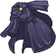
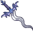

[Back to Main](index.md)

    
        
            
        
        
            Portrait
        
    
    
        
            
        
        
            Model
        
    

# Raistlin

Raistlin Majere was arguably the most powerful mage who ever lived. He was also one of the famed Heroes of the Lance, and was directly responsible for the defeat of the Queen of Darkness and her dragonarmies during the War of the Lance, although his part in that was largely to further his own ends.

[Dragonlace Fandom Wiki](https://dragonlance.fandom.com/wiki/Raistlin_Majere/){:target="_blank"}

# Basic Information

Raistlin will be a new champion in the Fleetswake event on 4 March 2026.

    
        
            **Seat**:
        
        
            2
        
    
    
        
            **Species**:
        
        
            Human
        
    
    
        
            **Class**:
        
        
            Wizard
        
    
    
        
            **Roles**:
        
        
            DPS
        
    
    
        
            **Age**:
        
        
            25
        
    
    
        
            **Gender**:
        
        
            Male
        
    
    
        
            **Alignment**:
        
        
            Neutral
        
    
    
        
            **Affiliation**:
        
        
            Heroes of the Lance
        
    

# Formation

    <svg xmlns="http://www.w3.org/2000/svg" id="Raistlin" fill="#aaa" data-formationName="Raistlin" data-campaignName="Fleetswake" width="300" height="160"><circle cx="175" cy="25" r="15"/><circle cx="175" cy="145" r="15"/><circle cx="135" cy="45" r="15"/><circle cx="135" cy="125" r="15"/><circle cx="95" cy="65" r="15"/><circle cx="95" cy="105" r="15"/><circle cx="55" cy="45" r="15"/><circle cx="55" cy="125" r="15"/><circle cx="15" cy="25" r="15"/><circle cx="15" cy="145" r="15"/><text x="205" y="25" fill="#dcdcdc" font-size="25" font-family="Arial" font-weight="bold">Raistlin</text><text x="205" y="65" fill="#dcdcdc" font-size="15" font-family="Arial" font-weight="bold">Fleetswake</text></svg>

# Attacks

**Base Attack: Magic Missile** (Magic)
> Raistlin fires a number of magic missiles at the toughest enemies.  
> Cooldown: 4.75s (Cap 1.1875s)

<em>Raw Data</em>

<pre>
{
    "id": 940,
    "name": "Magic Missile",
    "description": "Raistlin fires a number of magic missiles at the toughest enemies.",
    "long_description": "Raistlin fires a number of magic missiles at the toughest enemies.",
    "graphic_id": 0,
    "target": "highest_health",
    "num_targets": 3,
    "aoe_radius": 0,
    "damage_modifier": 1,
    "cooldown": 4.75,
    "animations": [
        {
            "type": "ranged_attack",
            "projectile": "magic_missile",
            "shoot_frame": 10,
            "shoot_offset_x": 64,
            "shoot_offset_y": -28,
            "projectile_delay": 0.1,
            "projectile_count": 3,
            "shoot_sound": 149,
            "hit_sound": 133,
            "projectile_details": {
                "projectile_graphic_id": 753,
                "impact_graphic_id": 754,
                "impact_offset_y": -50
            },
            "bonus_damage_from": {
                "type": "raistlin_debilitating_magic"
            },
            "hold_shoot_frame": true
        }
    ],
    "tags": [
        "ranged",
        "magic"
    ],
    "damage_types": [
        "magic"
    ]
}
</pre>

**Base Attack: Magic Missile** (Magic)
> Raistlin fires a number of magic missiles at the toughest enemies.  
> Cooldown: 4.75s (Cap 1.1875s)

<em>Raw Data</em>

<pre>
{
    "id": 946,
    "name": "Magic Missile",
    "description": "Raistlin fires a number of magic missiles at the toughest enemies.",
    "long_description": "Raistlin fires a number of magic missiles at the toughest enemies.",
    "graphic_id": 0,
    "target": "highest_health",
    "num_targets": 4,
    "aoe_radius": 0,
    "damage_modifier": 1,
    "cooldown": 4.75,
    "animations": [
        {
            "type": "ranged_attack",
            "projectile": "magic_missile",
            "shoot_frame": 10,
            "shoot_offset_x": 64,
            "shoot_offset_y": -28,
            "projectile_delay": 0.1,
            "projectile_count": 4,
            "shoot_sound": 149,
            "hit_sound": 133,
            "projectile_details": {
                "projectile_graphic_id": 753,
                "impact_graphic_id": 754,
                "impact_offset_y": -50
            },
            "bonus_damage_from": {
                "type": "raistlin_debilitating_magic"
            },
            "hold_shoot_frame": true
        }
    ],
    "tags": [
        "ranged",
        "magic"
    ],
    "damage_types": [
        "magic"
    ]
}
</pre>

**Base Attack: Magic Missile** (Magic)
> Raistlin fires a number of magic missiles at the toughest enemies.  
> Cooldown: 4.75s (Cap 1.1875s)

<em>Raw Data</em>

<pre>
{
    "id": 947,
    "name": "Magic Missile",
    "description": "Raistlin fires a number of magic missiles at the toughest enemies.",
    "long_description": "Raistlin fires a number of magic missiles at the toughest enemies.",
    "graphic_id": 0,
    "target": "highest_health",
    "num_targets": 5,
    "aoe_radius": 0,
    "damage_modifier": 1,
    "cooldown": 4.75,
    "animations": [
        {
            "type": "ranged_attack",
            "projectile": "magic_missile",
            "shoot_frame": 10,
            "shoot_offset_x": 64,
            "shoot_offset_y": -28,
            "projectile_delay": 0.1,
            "projectile_count": 5,
            "shoot_sound": 149,
            "hit_sound": 133,
            "projectile_details": {
                "projectile_graphic_id": 753,
                "impact_graphic_id": 754,
                "impact_offset_y": -50
            },
            "bonus_damage_from": {
                "type": "raistlin_debilitating_magic"
            },
            "hold_shoot_frame": true
        }
    ],
    "tags": [
        "ranged",
        "magic"
    ],
    "damage_types": [
        "magic"
    ]
}
</pre>

**Base Attack: Magic Missile** (Magic)
> Raistlin fires a number of magic missiles at the toughest enemies.  
> Cooldown: 4.75s (Cap 1.1875s)

<em>Raw Data</em>

<pre>
{
    "id": 948,
    "name": "Magic Missile",
    "description": "Raistlin fires a number of magic missiles at the toughest enemies.",
    "long_description": "Raistlin fires a number of magic missiles at the toughest enemies.",
    "graphic_id": 0,
    "target": "highest_health",
    "num_targets": 6,
    "aoe_radius": 0,
    "damage_modifier": 1,
    "cooldown": 4.75,
    "animations": [
        {
            "type": "ranged_attack",
            "projectile": "magic_missile",
            "shoot_frame": 10,
            "shoot_offset_x": 64,
            "shoot_offset_y": -28,
            "projectile_delay": 0.1,
            "projectile_count": 6,
            "shoot_sound": 149,
            "hit_sound": 133,
            "projectile_details": {
                "projectile_graphic_id": 753,
                "impact_graphic_id": 754,
                "impact_offset_y": -50
            },
            "bonus_damage_from": {
                "type": "raistlin_debilitating_magic"
            },
            "hold_shoot_frame": true
        }
    ],
    "tags": [
        "ranged",
        "magic"
    ],
    "damage_types": [
        "magic"
    ]
}
</pre>

**Ultimate Attack: Raistlin's Wheel of Flame** (Guess)
> Raistlin envelopes enemies with a deadly ring of fire, dealing one ultimate hit every second to enemies in the area.  
> Cooldown: 180s (Cap 45s)

<em>Raw Data</em>

<pre>
{
    "id": 941,
    "name": "Raistlin's Wheel of Flame",
    "description": "Raistlin envelopes enemies with a deadly ring of fire.",
    "long_description": "Raistlin envelopes enemies with a deadly ring of fire, dealing one ultimate hit every second to enemies in the area.",
    "graphic_id": 28532,
    "target": "all",
    "num_targets": 0,
    "aoe_radius": 0,
    "damage_modifier": 0.03,
    "cooldown": 180,
    "animations": [
        {
            "type": "ultimate_attack",
            "ultimate": "raistlin",
            "projectile_data": {
                "type": "ranged_attack",
                "shoot_offset_y": -185,
                "shoot_offset_x": 46,
                "shoot_frame": 36,
                "shoot_sound": 149,
                "hit_sound": 133,
                "projectile_details": {
                    "projectile_speed": 3500,
                    "projectile_graphic_id": 28553,
                    "impact_graphic_id": 28552,
                    "smoke_graphic_id": 446
                },
                "percent_height_offset": 5,
                "use_auto_rotation": true
            },
            "damage_frame": 8
        }
    ],
    "tags": [
        "magic",
        "ultimate"
    ],
    "damage_types": [
        "magic"
    ]
}
</pre>

# Abilities

**Prodigy of High Sorcery** (Guess)
> Raistlin increases his damage by 100% for each Champion that is not adjacent to him, stacking multiplicatively.

<em>Raw Data</em>

<pre>
{
    "id": 2619,
    "flavour_text": "",
    "description": {
        "desc": "Raistlin increases his damage by $(not_buffed amount)% for each Champion that is not adjacent to him, stacking multiplicatively."
    },
    "effect_keys": [
        {
            "effect_string": "hero_dps_multiplier_mult,100",
            "_amount_expr": "upgrade_amount(15619,0)",
            "amount_func": "mult",
            "stack_func": "per_hero_attribute",
            "per_hero_expr": "true",
            "per_hero_targets": [
                "non_adj"
            ],
            "show_bonus": true,
            "stack_title": "Non-Adjacent Champions",
            "amount_updated_listeners": [
                "upgrade_unlocked",
                "slot_changed",
                "feat_changed"
            ],
            "off_when_benched": true
        }
    ],
    "requirements": "",
    "graphic_id": 28524,
    "large_graphic_id": 28519,
    "properties": {
        "is_formation_ability": true,
        "owner_use_outgoing_description": true,
        "indexed_effect_properties": true,
        "per_effect_index_bonuses": true
    }
}
</pre>

**Savant** (Guess)
> For each positional formation ability affecting Raistlin, he gains Intensity stacks based on how few other Champions are also affected by the same ability. He gains one stack if there are three other Champions affected, two if there are two other Champions affected, three if there is only one other Champion affected, and four if Raistlin is the only Champion affected. The effect of Prodigy of High Sorcery is increased by 100% for each Intensity stack Raistlin has, stacking multiplicatively.

ⓘ *Note: This ability is prestack.*

<em>Raw Data</em>

<pre>
{
    "id": 2620,
    "flavour_text": "",
    "description": {
        "desc": "For each positional formation ability affecting Raistlin, he gains Intensity stacks based on how few other Champions are also affected by the same ability. He gains one stack if there are three other Champions affected, two if there are two other Champions affected, three if there is only one other Champion affected, and four if Raistlin is the only Champion affected. The effect of Prodigy of High Sorcery is increased by $amount% for each Intensity stack Raistlin has, stacking multiplicatively."
    },
    "effect_keys": [
        {
            "effect_string": "pre_stack,100",
            "off_when_benched": true
        },
        {
            "effect_string": "buff_upgrades,0,18929",
            "amount_func": "mult",
            "amount_expr": "upgrade_amount(18930,0)",
            "stack_func": "per_positional_formation_ability",
            "stack_func_data": {
                "stack_count_expr": "max(0, 4-other_champions_affected)"
            },
            "show_bonus": true,
            "stack_title": "Intensity Stacks",
            "amount_updated_listeners": [
                "slot_changed",
                "positional_formation_ability_changed"
            ],
            "off_when_benched": true
        },
        {
            "effect_string": "raistlin_savant_achievement",
            "off_when_benched": true
        }
    ],
    "requirements": "",
    "graphic_id": 28524,
    "large_graphic_id": 28520,
    "properties": {
        "is_formation_ability": true,
        "owner_use_outgoing_description": true,
        "formation_circle_icon": true,
        "indexed_effect_properties": true,
        "per_effect_index_bonuses": true,
        "default_bonus_index": 0
    }
}
</pre>

**Debilitating Magic** (Guess)
> When Raistlin attacks and is at or above 90% of his max health, he takes 1% of his max health as damage but deals 400% more damage with his attack.

<em>Raw Data</em>

<pre>
{
    "id": 2621,
    "flavour_text": "",
    "description": {
        "desc": "When Raistlin attacks and is at or above $health_percent_threshold% of his max health, he takes $damage_percent% of his max health as damage but deals $amount% more damage with his attack."
    },
    "effect_keys": [
        {
            "effect_string": "raistlin_debilitating_magic,400",
            "health_percent_threshold": 90,
            "damage_percent": 1
        },
        {
            "effect_string": "do_nothing,0",
            "active_graphic_id": 28829,
            "active_graphic_y": -70
        }
    ],
    "requirements": "",
    "graphic_id": 28521,
    "large_graphic_id": 28516,
    "properties": {
        "is_formation_ability": true,
        "owner_use_outgoing_description": true,
        "indexed_effect_properties": true,
        "per_effect_index_bonuses": true,
        "default_bonus_index": 1
    }
}
</pre>

**Herbalism** (Guess)
> Other Champions' healing effects on Raistlin are reduced by 50%. Whenever any other Champion in the formation uses an ultimate attack, Raistlin drinks a cup of tea after his next attack, healing himself for 2% of his max health for each ultimate that was used, stacking additively.

<em>Raw Data</em>

<pre>
{
    "id": 2622,
    "flavour_text": "",
    "description": {
        "desc": "Other Champions' healing effects on Raistlin are reduced by $(amount___2)%. Whenever any other Champion in the formation uses an ultimate attack, Raistlin drinks a cup of tea after his next attack, healing himself for $health_percent_per_ultimate% of his max health for each ultimate that was used, stacking additively."
    },
    "effect_keys": [
        {
            "effect_string": "raistlin_herbalism",
            "health_percent_per_ultimate": 2,
            "stacks_on_trigger": "will_stack_manually",
            "stacks_multiply": false
        },
        {
            "effect_string": "healed_by_others_reduction_mult,50"
        }
    ],
    "requirements": "",
    "graphic_id": 28523,
    "large_graphic_id": 28518,
    "properties": {
        "is_formation_ability": true,
        "owner_use_outgoing_description": true,
        "indexed_effect_properties": true,
        "per_effect_index_bonuses": true
    }
}
</pre>

**Flames of High Sorcery** (Guess)
> While fighting in an area with an incomplete quest, Raistlin casts Fireball at enemies in the next area after every fourth attack. This causes those enemies to spawn with missing health equal to 10% of their max health, stacking additively up to five times.

<em>Raw Data</em>

<pre>
{
    "id": 2623,
    "flavour_text": "",
    "description": {
        "desc": "While fighting in an area with an incomplete quest, Raistlin casts Fireball at enemies in the next area after every fourth attack. This causes those enemies to spawn with missing health equal to $damage_per_stack% of their max health, stacking additively up to five times."
    },
    "effect_keys": [
        {
            "effect_string": "raistlin_flames_of_high_sorcery",
            "stacks_on_trigger": "will_stack_manually",
            "stacks_multiply": false,
            "damage_per_stack": 10,
            "show_stacks": true,
            "max_stacks": 5,
            "stack_title": "Fireballs in last area",
            "effects": [
                {
                    "effect_string": "damage_hit_based_target_by_percent_disabled,0"
                },
                {
                    "effect_string": "damage_monster_target_by_percent,0"
                }
            ]
        }
    ],
    "requirements": "",
    "graphic_id": 28522,
    "large_graphic_id": 28517,
    "properties": {
        "is_formation_ability": true,
        "owner_use_outgoing_description": true
    }
}
</pre>

# Specialisations

**Heroic Mage** (Guess)
> Raistlin increases the effect of Prodigy of High Sorcery by 125% for each Good Champion in the formation, stacking multiplicatively.

<em>Raw Data</em>

<pre>
{
    "id": 2624,
    "flavour_text": "",
    "description": {
        "desc": "Raistlin increases the effect of Prodigy of High Sorcery by $(not_buffed amount)% for each Good Champion in the formation, stacking multiplicatively."
    },
    "effect_keys": [
        {
            "effect_string": "buff_upgrade,125,18929",
            "off_when_benched": true,
            "show_bonus": true,
            "amount_func": "mult",
            "stack_func": "per_hero_attribute",
            "per_hero_expr": "HasTag(`good`)",
            "amount_updated_listeners": [
                "slot_changed",
                "hero_tags_changed"
            ]
        }
    ],
    "requirements": "",
    "graphic_id": 0,
    "large_graphic_id": 28529,
    "properties": {
        "is_formation_ability": true,
        "owner_use_outgoing_description": true,
        "formation_circle_icon": false,
        "spec_option_post_apply_info": "Good Champions: $num_stacks"
    }
}
</pre>

**Reclusive Mage** (Guess)
> Raistlin increases the effect of Prodigy of High Sorcery by 125% for each Champion in the formation with a Melee or Ranged base attack, stacking multiplicatively.

<em>Raw Data</em>

<pre>
{
    "id": 2625,
    "flavour_text": "",
    "description": {
        "desc": "Raistlin increases the effect of Prodigy of High Sorcery by $(not_buffed amount)% for each Champion in the formation with a Melee or Ranged base attack, stacking multiplicatively."
    },
    "effect_keys": [
        {
            "effect_string": "buff_upgrade,125,18929",
            "off_when_benched": true,
            "show_bonus": true,
            "amount_func": "mult",
            "stack_func": "per_hero_attribute",
            "per_hero_expr": "HasAttackDamageType(`ranged`) || HasAttackDamageType(`melee`)",
            "amount_updated_listeners": [
                "slot_changed",
                "attack_changed"
            ]
        }
    ],
    "requirements": "",
    "graphic_id": 0,
    "large_graphic_id": 28530,
    "properties": {
        "is_formation_ability": true,
        "owner_use_outgoing_description": true,
        "formation_circle_icon": false,
        "spec_option_post_apply_info": "Melee or Ranged Champions: $num_stacks"
    }
}
</pre>

**War Mage** (Guess)
> Raistlin increases the effect of Prodigy of High Sorcery by 300% for each Tanking Champion in the formation, stacking multiplicatively.

<em>Raw Data</em>

<pre>
{
    "id": 2626,
    "flavour_text": "",
    "description": {
        "desc": "Raistlin increases the effect of Prodigy of High Sorcery by $(not_buffed amount)% for each Tanking Champion in the formation, stacking multiplicatively."
    },
    "effect_keys": [
        {
            "effect_string": "buff_upgrade,300,18929",
            "off_when_benched": true,
            "show_bonus": true,
            "amount_func": "mult",
            "stack_func": "per_hero_attribute",
            "per_hero_expr": "HasTag(`tanking`)",
            "amount_updated_listeners": [
                "slot_changed",
                "hero_tags_changed"
            ]
        }
    ],
    "requirements": "",
    "graphic_id": 0,
    "large_graphic_id": 28531,
    "properties": {
        "is_formation_ability": true,
        "owner_use_outgoing_description": true,
        "formation_circle_icon": false,
        "spec_option_post_apply_info": "Tanking Champions: $num_stacks"
    }
}
</pre>

# Items

    
        
            **Icons**
        
        
            **Name**
        
    
    
        
            
        
        
            Books
        
    
    
        
            
        
        
            Clothing
        
    
    
        
            
        
        
            Drinks
        
    
    
        
            
        
        
            Other Rewards
        
    
    
        
            
        
        
            Stones
        
    
    
        
            
        
        
            Weapon
        
    

# Feats

Unknown.

# Legendaries

Unknown.

# Adventures and Variants

**Unlock Adventure: The Unfair Sea (Raistlin)** (Complete Area 50)
> Search for some missing ships during Fleetswake in Waterdeep.

 **Variant 1: The Sly One** (Complete Area 75)
> Raistlin starts in the formation. He can be moved, but not removed.  
> Only Raistlin and Champions not next to him can deal damage.  
> After area 100, attacks against undamaged enemies have a 90% chance to completely miss.  
> 1-2 Baaz Draconians spawn with each wave. They don't drop gold nor count towards quest progress.  
> <b>Getting to Know Raistlin:</b> Raistlin's role is dealing damage, and he deals more damage when he is next to fewer Champions. Place him in an isolated spot of a formation to increase his damage!

 **Variant 2: War of the Lance** (Complete Area 175)
> Raistlin starts in the formation. He can be moved, but not removed.  
> You may only use Good Champions, Tanking Champions, or Champions with a ranged or melee attack.  
> Champions do not regain health when changing areas.  
> Every 3 seconds, a random Champion is struck by a falling rock, dealing 5% of their maximum health in damage.  
> 1-2 Kapak Draconians spawn with each wave. They don't drop gold nor count towards quest progress.  
> In each boss area, an Aurak Draconian boss spawns as part of the first wave. It must also be defeated to progress.  
> <b>Getting to Know Raistlin:</b> Raistlin's specialization choice determines which Champions he works best with. Which Champions will you add to the formation?

**Variant 3: Fleetswake Mastery Challenge** (Mastery Challenge: Get as far as you can!)
> No restrictions

# Other Champion Images

    
        
            Console Portrait
        
    
    
        
            Gold Chest Icon
        
        
            Silver Chest Icon
        
    

[Back to Top](#top)

*Last Modified: {{ site.time }}*