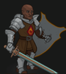
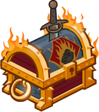

[Back to Main](index.md)

    
        Portait
    
    
        Model
    

# Duke Ravengard

Ulder Ravengard is the leader of the Flaming Fist and the Grand Duke of Baldur's Gate. His primary concerns are the stability and prosperity of Baldur's Gate, and he's been a voice of reason and common sense among the ruling council. In recent years, he has been a target of fiendish plots in unsuccessful attempts to take over the city.

# Basic Information

Duke Ravengard will be a new champion in the Dragondown event on 5 June 2024.

    
        
            **Seat**:
        
        
            8
        
        
            **Stat**
        
        
            **Value**
        
        
            **Day 1 Trials**
        
        
            **Patrons**
        
    
    
        
            **Race**:
        
        
            Human
        
        
            **Strength**:
        
        
            17
        
        
            Yes
        
        
            -
        
    
    
        
            **Class**:
        
        
            Fighter
        
        
            **Dexterity**:
        
        
            14
        
        
            Yes
        
        
            Vajra
        
    
    
        
            **Roles**:
        
        
            Support
        
        
            **Constitution**:
        
        
            16
        
        
            Yes
        
        
            Strahd (with Feat)
        
    
    
        
            **Age**:
        
        
            53
        
        
            **Intelligence**:
        
        
            11
        
        
            Yes
        
        
            Zariel
        
    
    
        
            **Gender**:
        
        
            Male
        
        
            **Wisdom**:
        
        
            10
        
        
            Yes
        
        
            Elminster
        
    
    
        
            **Alignment**:
        
        
            Lawful Neutral
        
        
            **Charisma**:
        
        
            17
        
        
            Yes
        
        
            &nbsp;
        
    
    
        
            **Affiliation**:
        
        
            -
        
        
            **Total**:
        
        
            85
        
        
            Champion ID:
        
        
            149
        
    

# Formation

    <svg xmlns="http://www.w3.org/2000/svg" id="Duke Ravengard" fill="#aaa" data-formationName="Duke Ravengard" data-campaignName="Dragondown" width="368" height="140"><circle cx="135" cy="25" r="15"/><circle cx="135" cy="65" r="15"/><circle cx="135" cy="105" r="15"/><circle cx="95" cy="45" r="15"/><circle cx="95" cy="85" r="15"/><circle cx="95" cy="125" r="15"/><circle cx="55" cy="25" r="15"/><circle cx="55" cy="65" r="15"/><circle cx="55" cy="105" r="15"/><circle cx="15" cy="85" r="15"/><text x="165" y="25" fill="#dcdcdc" font-size="25" font-family="Arial" font-weight="bold">Duke Ravengard</text><text x="165" y="65" fill="#dcdcdc" font-size="15" font-family="Arial" font-weight="bold">Dragondown</text></svg>

# Abilities

 **Base Attack: Duke's Longsword** (Melee)
> Duke Ravengard attacks the closest enemy for one hit with his longsword.  
> Cooldown: 4s (Cap 1s)

<em>Raw Data</em>

<pre>
{
    "id": 756,
    "name": "Duke's Longsword",
    "description": "Duke Ravengard attacks the closest enemy for one hit with his longsword.",
    "long_description": "",
    "graphic_id": 0,
    "target": "front",
    "num_targets": 1,
    "aoe_radius": 0,
    "damage_modifier": 1,
    "cooldown": 4,
    "animations": [
        {
            "type": "melee_attack",
            "target_offset_x": -40,
            "start_frame": 5,
            "damage_frame": 12,
            "jump_sound": 30,
            "sound_frames": {
                "2": 194
            }
        }
    ],
    "tags": [
        "melee"
    ],
    "damage_types": [
        "melee"
    ]
}
</pre>

 **Base Attack: Duke's Shield Bash** (Melee)
> Duke Ravengard attacks the closest enemy for one hit with his longsword. If he scores a critical hit, he follows up by smashing the enemy with his shield, knocking them back a short distance.  
> Cooldown: 4s (Cap 1s)

<em>Raw Data</em>

<pre>
{
    "id": 757,
    "name": "Duke's Shield Bash",
    "description": "Duke Ravengard attacks the closest enemy for one hit with his longsword. If he scores a critical hit, he follows up by smashing the enemy with his shield, knocking them back a short distance.",
    "long_description": "",
    "graphic_id": 0,
    "target": "front",
    "num_targets": 1,
    "aoe_radius": 0,
    "damage_modifier": 1,
    "cooldown": 4,
    "animations": [
        {
            "type": "melee_attack",
            "special_melee": "ravengard_lead_the_charge",
            "target_offset": [
                -75,
                0
            ],
            "shield_bash_effect": {
                "effect_string": "reduce_target_base_attack_cooldown_by_percent_action,100",
                "targets": [
                    "adj"
                ],
                "filter_targets": [
                    {
                        "type": "hero_expr",
                        "hero_expr": "HasAttackDamageType(`melee`)"
                    }
                ]
            }
        }
    ],
    "tags": [
        "melee"
    ],
    "damage_types": [
        "melee"
    ]
}
</pre>

 **Ultimate Attack: Duke's Fire Shield** (Level: 0)
> Duke Ravengard's magical armor ignites in flames for 20 seconds, causing any attacking melee enemies to take damage as well as increasing his own damage.  
> Cooldown: 200s (Cap 50s)

<em>Raw Data</em>

<pre>
{
    "id": 758,
    "name": "Duke's Fire Shield",
    "description": "Duke Ravengard ignites in flames for 20 seconds, damaging attacking melee enemies and increasing his damage.",
    "long_description": "Duke Ravengard's magical armor ignites in flames for 20 seconds, causing any attacking melee enemies to take damage as well as increasing his own damage.",
    "graphic_id": 23613,
    "target": "none",
    "num_targets": 1,
    "aoe_radius": 0,
    "damage_modifier": 0.03,
    "cooldown": 200,
    "animations": [
        {
            "type": "ultimate_attack",
            "ultimate": "duke_ravengard",
            "no_damage_display": true
        }
    ],
    "tags": [
        "ultimate"
    ],
    "damage_types": [
        "magic"
    ]
}
</pre>

**Critical Hit** (Level: 0)
> Duke Ravengard's base chance to Critical Hit is 20%.

<em>Raw Data</em>

<pre>
{
    "id": 15027,
    "hero_id": 149,
    "required_level": 0,
    "required_upgrade_id": 0,
    "upgrade_type": "unlock_ability",
    "effect": "effect_def,1968",
    "static_dps_mult": null,
    "default_enabled": 1,
    "name": "Critical Hit"
}
{
    "id": 1968,
    "flavour_text": "",
    "description": {
        "desc": "Duke Ravengard's base chance to Critical Hit is $(amount)%."
    },
    "effect_keys": [
        {
            "effect_string": "set_base_crit_chance,20"
        }
    ],
    "requirements": "",
    "graphic_id": 0,
    "large_graphic_id": 0,
    "properties": {
        "is_formation_ability": true,
        "owner_use_outgoing_description": true,
        "formation_circle_icon": false
    }
}
</pre>

 **Marshal of the Flaming Fist** (Level: 20)
> Duke Ravengard gains a Command stack for each Champion with a melee base attack in the formation (including himself). Each stack increases the damage of these Champions by 400%, stacking multiplicatively.

<em>Upgrade Data</em>

<pre>
Upgrades:
       70: 100%

    Total Upgrade Bonus: 100%
</pre>

<em>Raw Data</em>

<pre>
{
    "id": 15028,
    "hero_id": 149,
    "required_level": 20,
    "required_upgrade_id": 0,
    "upgrade_type": "unlock_ability",
    "effect": "effect_def,1969",
    "static_dps_mult": null,
    "default_enabled": 1,
    "name": "Marshal of the Flaming Fist",
    "tip_text": "Duke Ravengard's support abilities grow stronger as you include more heroes that use melee attacks."
}
{
    "id": 1969,
    "flavour_text": "",
    "description": {
        "desc": "Duke Ravengard gains a Command stack for each Champion with a melee base attack in the formation (including himself). Each stack increases the damage of these Champions by $(not_buffed amount)%, stacking multiplicatively."
    },
    "effect_keys": [
        {
            "effect_string": "hero_dps_multiplier_mult,400",
            "targets": [
                "all"
            ],
            "filter_targets": [
                {
                    "type": "hero_expr",
                    "hero_expr": "HasAttackDamageType(`melee`)"
                }
            ],
            "amount_func": "mult",
            "show_bonus": true,
            "stack_func": "per_hero_attribute",
            "per_hero_expr": "HasAttackDamageType(`melee`)",
            "per_hero_targets": [
                "all"
            ],
            "amount_updated_listeners": [
                "slot_changed",
                "feat_changed",
                "attack_changed"
            ],
            "use_computed_amount_for_description": true,
            "off_when_benched": true
        }
    ],
    "requirements": "",
    "graphic_id": 23608,
    "large_graphic_id": 23605,
    "properties": {
        "is_formation_ability": true,
        "owner_use_outgoing_description": true
    }
}
</pre>

 **Position of Power** (Level: 30)
> Duke Ravengard increases the effect of the outgoing positional formation abilities of all Champions with a melee base attack by 25% for each Command stack he has, stacking additively.

<em>Raw Data</em>

<pre>
{
    "id": 15029,
    "hero_id": 149,
    "required_level": 30,
    "required_upgrade_id": 0,
    "upgrade_type": "unlock_ability",
    "effect": "effect_def,1970",
    "static_dps_mult": null,
    "default_enabled": 1,
    "name": "Position of Power"
}
{
    "id": 1970,
    "flavour_text": "",
    "description": {
        "desc": "Duke Ravengard increases the effect of the outgoing positional formation abilities of all Champions with a melee base attack by $(not_buffed amount)% for each Command stack he has, stacking additively."
    },
    "effect_keys": [
        {
            "off_when_benched": true,
            "effect_string": "buff_positional_formation_abilities,25",
            "targets": [
                "all"
            ],
            "filter_targets": [
                {
                    "type": "hero_expr",
                    "hero_expr": "HasAttackDamageType(`melee`)"
                }
            ],
            "include_escorts": true,
            "stacks_multiply": false,
            "amount_func": "add",
            "stack_func": "per_hero_attribute",
            "per_hero_expr": "HasAttackDamageType(`melee`)",
            "per_hero_targets": [
                "all"
            ],
            "amount_updated_listeners": [
                "slot_changed",
                "feat_changed",
                "attack_changed"
            ],
            "show_bonus": true,
            "use_computed_amount_for_description": true,
            "override_key_desc": "Increases the effect of $target's outgoing Positional Formation Abilities by $amount%",
            "stack_title": "Command Stacks"
        }
    ],
    "requirements": "",
    "graphic_id": 23609,
    "large_graphic_id": 23606,
    "properties": {
        "is_formation_ability": true,
        "owner_use_outgoing_description": true
    }
}
</pre>

 **Critical Teamwork** (Level: 40)
> Whenever a Champion with a melee base attack gets a critical hit, increase the effect of Marshal of the Flaming Fist by 100% and additively increase the odds of all Champions in the formation getting critical hits by 1%. Both effects stack additively up to 50 times and reset when changing areas.

<em>Upgrade Data</em>

<pre>
Upgrades:
       80: 100%

    Total Upgrade Bonus: 100%
</pre>

<em>Raw Data</em>

<pre>
{
    "id": 15030,
    "hero_id": 149,
    "required_level": 40,
    "required_upgrade_id": 0,
    "upgrade_type": "unlock_ability",
    "effect": "effect_def,1971",
    "static_dps_mult": null,
    "default_enabled": 1,
    "name": "Critical Teamwork",
    "tip_text": "Duke Ravengard's support abilities grow stronger in an area each time a Champion scores a critical hit!"
}
{
    "id": 1971,
    "flavour_text": "",
    "description": {
        "desc": "Whenever a Champion with a melee base attack gets a critical hit, increase the effect of Marshal of the Flaming Fist by $(not_buffed amount)% and additively increase the odds of all Champions in the formation getting critical hits by $(not_buffed amount___2)%. Both effects stack additively up to 50 times and reset when changing areas."
    },
    "effect_keys": [
        {
            "effect_string": "buff_upgrade,100,15028",
            "off_when_benched": true,
            "max_stacks": 50,
            "total_title": "Total Marshal of the Flaming Fist Bonus",
            "stacks_multiply": false,
            "show_bonus": true,
            "stacks_on_trigger": "on_broadcast_stacks,melee_hero_crit",
            "more_triggers": [
                {
                    "trigger": "area_changed",
                    "action": {
                        "type": "reduce_percent",
                        "percent": 100
                    }
                }
            ]
        },
        {
            "effect_string": "global_buff_base_crit_chance_add,1",
            "off_when_benched": true,
            "max_stacks": 50,
            "total_title": "Total Increased Crit Chance",
            "stacks_multiply": false,
            "show_bonus": true,
            "stacks_on_trigger": "on_broadcast_stacks,melee_hero_crit",
            "more_triggers": [
                {
                    "trigger": "area_changed",
                    "action": {
                        "type": "reduce_percent",
                        "percent": 100
                    }
                }
            ],
            "skip_effect_key_desc": true
        },
        {
            "effect_string": "broadcast_on_trigger,melee_hero_crit,pre_target_attack_crit",
            "off_when_benched": true,
            "targets": [
                "all"
            ],
            "filter_targets": [
                {
                    "type": "hero_expr",
                    "hero_expr": "HasAttackDamageType(`melee`)"
                }
            ],
            "override_key_desc": "Each time $target deals a Critical Hit, they contribute a Critical Teamwork stack to $(source_hero)"
        }
    ],
    "requirements": "",
    "graphic_id": 23607,
    "large_graphic_id": 23604,
    "properties": {
        "is_formation_ability": true,
        "owner_use_outgoing_description": true,
        "indexed_effect_properties": true,
        "per_effect_index_bonuses": true
    }
}
</pre>

**Ultimate** (Level: 60)
> Unlock Ravengard's Fire Shield Ultimate Attack.

<em>Raw Data</em>

<pre>
{
    "id": 15034,
    "hero_id": 149,
    "required_level": 60,
    "required_upgrade_id": 0,
    "upgrade_type": "unlock_ultimate",
    "effect": "effect_def,1983",
    "static_dps_mult": null,
    "default_enabled": 1,
    "name": "Ultimate"
}
{
    "id": 1983,
    "flavour_text": "",
    "description": {
        "desc": "Unlock $(source_hero)'s Fire Shield Ultimate Attack"
    },
    "effect_keys": [
        {
            "effect_string": "duke_ravengard_fire_shield",
            "duration": 20,
            "base_graphic": 23493
        },
        {
            "apply_manually": true,
            "effect_string": "base_attack_deal_bonus_damage,25",
            "immediately_after_damage": true
        },
        {
            "apply_manually": true,
            "effect_string": "deal_bud_damage_when_hit,25",
            "targets": [
                "all"
            ],
            "target_filters": [
                {
                    "type": "hero_expr",
                    "per_hero_expr": "is_in_front_most_column"
                }
            ],
            "filter_damage_types": [
                "melee"
            ],
            "is_ultimate": true
        },
        {
            "effect_string": "set_ultimate_attack"
        }
    ],
    "requirements": "",
    "graphic_id": 0,
    "large_graphic_id": 0,
    "properties": {
        "show_incoming": false,
        "indexed_effect_properties": true,
        "per_effect_index_bonuses": true,
        "default_bonus_index": 0,
        "formation_circle_icon": false
    }
}
</pre>

# Specialisations

 **Lead The Charge** (Level: 50)
> When Ravengard gets a critical hit, he follows up by bashing the enemy with his shield, knocking it back a short distance. When this occurs, all melee Champions adjacent to Duke Ravengard have their base attack cooldowns immediately reset.

<em>Raw Data</em>

<pre>
{
    "id": 15031,
    "hero_id": 149,
    "required_level": 50,
    "required_upgrade_id": 0,
    "upgrade_type": "unlock_ability",
    "effect": "effect_def,1972",
    "static_dps_mult": null,
    "default_enabled": 1,
    "name": "Lead The Charge",
    "specialization_name": "Lead The Charge",
    "specialization_description": "Duke Ravengard leads the attack, causing his followers to attack more often.",
    "specialization_graphic_id": 23610
}
{
    "id": 1972,
    "flavour_text": "",
    "description": {
        "desc": "When $(source_hero) gets a critical hit, he follows up by bashing the enemy with his shield, knocking it back a short distance. When this occurs, all melee Champions adjacent to Duke Ravengard have their base attack cooldowns immediately reset."
    },
    "effect_keys": [
        {
            "effect_string": "change_base_attack,757"
        }
    ],
    "requirements": "",
    "graphic_id": 0,
    "large_graphic_id": 0,
    "properties": {
        "is_formation_ability": true,
        "owner_use_outgoing_description": true,
        "formation_circle_icon": false
    }
}
</pre>

 **Legacy of Ravengard** (Level: 50)
> If Wyll is in the formation, anyone affected by Wyll's Folk Hero benefit gains an additional stack, but the maximum remains at 4 stacks.

<em>Raw Data</em>

<pre>
{
    "id": 15033,
    "hero_id": 149,
    "required_level": 50,
    "required_upgrade_id": 0,
    "upgrade_type": "unlock_ability",
    "effect": "effect_def,1974",
    "static_dps_mult": null,
    "default_enabled": 1,
    "name": "Legacy of Ravengard",
    "specialization_name": "Legacy of Ravengard",
    "specialization_description": "Ulder supports Wyll, making them a powerful force together.",
    "specialization_graphic_id": 23611
}
{
    "id": 1974,
    "flavour_text": "",
    "description": {
        "desc": "If Wyll is in the formation, anyone affected by Wyll's Folk Hero benefit gains an additional stack, but the maximum remains at 4 stacks."
    },
    "effect_keys": [
        {
            "effect_string": "do_nothing",
            "off_when_benched": true
        }
    ],
    "requirements": "",
    "graphic_id": 0,
    "large_graphic_id": 0,
    "properties": {
        "is_formation_ability": true,
        "owner_use_outgoing_description": true,
        "formation_circle_icon": false
    }
}
</pre>

 **Strength of Baldur's Gate** (Level: 50)
> Champions with a melee base attack have their crit chance additively increased by 20% and crit damage increased by 1000%.

<em>Raw Data</em>

<pre>
{
    "id": 15032,
    "hero_id": 149,
    "required_level": 50,
    "required_upgrade_id": 0,
    "upgrade_type": "unlock_ability",
    "effect": "effect_def,1973",
    "static_dps_mult": null,
    "default_enabled": 1,
    "name": "Strength of Baldur's Gate",
    "specialization_name": "Strength of Baldur's Gate",
    "specialization_description": "Ulder shows the other Champions how to strike vulnerable points to deal more damage.",
    "specialization_graphic_id": 23612
}
{
    "id": 1973,
    "flavour_text": "",
    "description": {
        "desc": "Champions with a melee base attack have their crit chance additively increased by 20% and crit damage increased by 1000%."
    },
    "effect_keys": [
        {
            "effect_string": "buff_base_crit_chance_add,20",
            "targets": [
                "all"
            ],
            "filter_targets": [
                {
                    "type": "hero_expr",
                    "hero_expr": "HasAttackDamageType(`melee`)"
                }
            ],
            "off_when_benched": true
        },
        {
            "effect_string": "buff_base_crit_damage_mult,1000",
            "targets": [
                "all"
            ],
            "filter_targets": [
                {
                    "type": "hero_expr",
                    "hero_expr": "HasAttackDamageType(`melee`)"
                }
            ],
            "off_when_benched": true
        }
    ],
    "requirements": "",
    "graphic_id": 0,
    "large_graphic_id": 0,
    "properties": {
        "is_formation_ability": true,
        "owner_use_outgoing_description": true,
        "formation_circle_icon": false
    }
}
</pre>

# Items

    
        
            **Icons**
        
        
            **Slot**
        
        
            **Epic Name**
        
        
            **Effect**
        
    
    
        
            **Reliable Blade**For the good of the realm...<code>global_dps_multiplier_mult,10</code>**Guardsmen's Sword**...and the protection of Baldur's Gate.<code>global_dps_multiplier_mult,65</code>**Baldur's Resolve**This city shall never fall - not while I draw breath!<code>global_dps_multiplier_mult,120</code>**Lathander's Might**I found this in a chapel of Lathander after Elturel fell.<code>global_dps_multiplier_mult,230</code>&nbsp;
        
        
            1
        
        
            Lathander's Might
        
        
            All Champion Damage
        
    
    
        
            **Weight of the City**Baldur's Gate is counting on you...<code>global_dps_multiplier_mult,10</code>**Protective Helmet**...don't let them down. Fight to the end.<code>global_dps_multiplier_mult,65</code>**Reinforced Helm**I can tell you where each of these marks came from.<code>global_dps_multiplier_mult,120</code>**Helm of Torm's Sight**What was once my prison now serves me for the good of Baldur's Gate.<code>global_dps_multiplier_mult,230</code>
        
        
            2
        
        
            Helm of Torm's Sight
        
        
            All Champion Damage
        
    
    
        
            **Oath of Justice**Do you swear to uphold the laws of Baldur's Gate?<code>buff_upgrade,25,15028</code>**Flame Badge**To protect its walls and its people?<code>buff_upgrade,87.5,15028</code>**Blaze Talisman**To do no wrong while you are in its service?<code>buff_upgrade,150,15028</code>**Marshall Medallion**To lay down your life if the city needed it?<code>buff_upgrade,275,15028</code>
        
        
            3
        
        
            Marshall Medallion
        
        
            Marshal of the Flaming Fist
        
    
    
        
            **The First Line**Not every situation can be solved with a sword.<code>buff_upgrade,25,15030,0</code>**Sturdy Buckler**Ask any Flaming Fist how many times their shield has saved them.<code>buff_upgrade,87.5,15030,0</code>**Flame Resistant Shield**A gift from the Grand Duke when I became a Blaze.<code>buff_upgrade,150,15030,0</code>**Aegis of Baldur's Gate**It is said this shield was wielded by Baldur himself.<code>buff_upgrade,275,15030,0</code>
        
        
            4
        
        
            Aegis of Baldur's Gate
        
        
            Critical Teamwork
        
    
    
        
            **People's Protector**They should look to you for hope, not fear.<code>buff_upgrade,25,15034,1 buff_upgrade,25,15034,2 </code>**Flaming Fist Chainmail**The city is its people. Protect it.<code>buff_upgrade,87.5,15034,1 buff_upgrade,87.5,15034,2 </code>**Blaze Armor**It is an honor to wear this.<code>buff_upgrade,150,15034,1 buff_upgrade,150,15034,2 </code>**Plate of High Command**The Dead Three will not take this city! Attack!<code>buff_upgrade,275,15034,1 buff_upgrade,275,15034,2 </code>
        
        
            5
        
        
            Plate of High Command
        
        
            Ultimate
        
    
    
        
            **Fallen Hero**You will not be forgotten...<code>reduce_ultimate_cooldown,10</code>**Torn Tabard**...for the sacrifice you made.<code>reduce_ultimate_cooldown,20</code>**Minotaur Horns**A souvenir from the adventurers that saved me.<code>reduce_ultimate_cooldown,40</code>**Hellrider Dagger**A Hellrider gave me this to remind me of the oath they take.<code>reduce_ultimate_cooldown,100</code>
        
        
            6
        
        
            Hellrider Dagger
        
        
            Ultimate Cooldown Reduction Cap: 501 dull / 251 shiny / 126 golden.
        
    

<em>Item Names and Descriptions</em>

<pre>
Slot 1:
        Reliable Blade: For the good of the realm...
     Guardsmen's Sword: ...and the protection of Baldur's Gate.
      Baldur's Resolve: This city shall never fall - not while I draw breath!
     Lathander's Might: I found this in a chapel of Lathander after Elturel fell.

Slot 2:
    Weight of the City: Baldur's Gate is counting on you...
     Protective Helmet: ...don't let them down. Fight to the end.
       Reinforced Helm: I can tell you where each of these marks came from.
  Helm of Torm's Sight: What was once my prison now serves me for the good of Baldur's Gate.

Slot 3:
       Oath of Justice: Do you swear to uphold the laws of Baldur's Gate?
           Flame Badge: To protect its walls and its people?
        Blaze Talisman: To do no wrong while you are in its service?
    Marshall Medallion: To lay down your life if the city needed it?

Slot 4:
        The First Line: Not every situation can be solved with a sword.
        Sturdy Buckler: Ask any Flaming Fist how many times their shield has saved them.
Flame Resistant Shield: A gift from the Grand Duke when I became a Blaze.
Aegis of Baldur's Gate: It is said this shield was wielded by Baldur himself.

Slot 5:
    People's Protector: They should look to you for hope, not fear.
Flaming Fist Chainmail: The city is its people. Protect it.
           Blaze Armor: It is an honor to wear this.
 Plate of High Command: The Dead Three will not take this city! Attack!

Slot 6:
           Fallen Hero: You will not be forgotten...
           Torn Tabard: ...for the sacrifice you made.
        Minotaur Horns: A souvenir from the adventurers that saved me.
      Hellrider Dagger: A Hellrider gave me this to remind me of the oath they take.
</pre>

 

# Feats

This list will only show feats that are going to be available on the release of this champion. The separate [Feats](feats.md) page may show others that could be available later if they exist.

    
        
            **Feat**
        
        
            **Effect**
        
        
            **Source**
        
    
    
        
            **Selflessness (Ravengard)**Elturel may not be my city, but I will lay down my life to protect its people.<code>global_dps_multiplier_mult,10</code>Selflessness
        
        
            10% All Champion Damage
        
        
            Free
        
    
    
        
            **Inspiring Leader (Ravengard)**Show the fiends of Avernus what it means to be a Hellrider!<code>global_dps_multiplier_mult,25</code>Inspiring Leader
        
        
            25% All Champion Damage
        
        
            Free
        
    
    
        
            **Form Up (Ravengard)**We shall be the front line of defense against the forces of the Hells!<code>buff_upgrade,20,15028</code>Form Up
        
        
            20% Marshal of the Flaming Fist
        
        
            Free
        
    
    
        
            **Last Stand (Ravengard)**We are the last hope of Elturel.<code>buff_upgrade,40,15028</code>Last Stand
        
        
            40% Marshal of the Flaming Fist
        
        
            Free
        
    
    
        
            **Strength in Numbers (Ravengard)**We are stronger together!<code>buff_upgrade,20,15029</code>Strength in Numbers
        
        
            20% Position of Power
        
        
            Free
        
    
    
        
            **Battle Formations (Ravengard)**Knowing our strengths is how we will win.<code>buff_upgrade,40,15029</code>Battle Formations
        
        
            40% Position of Power
        
        
            Free
        
    
    
        
            **Crucial Weakness (Ravengard)**There! Their formation is weakening - attack!<code>buff_upgrade,20,15030,0</code>Crucial Weakness
        
        
            20% Critical Teamwork
        
        
            Free
        
    
    
        
            **Turning the Tide (Ravengard)**This is it - victory is nearly at hand!<code>buff_upgrade,40,15030,0</code>Turning the Tide
        
        
            40% Critical Teamwork
        
        
            Free
        
    
    
        
            **Work Together (Ravengard)**Let's show these cultists what it means to be a Baldurian!<code>buff_upgrade_effect_stacks_max_add,10,15030</code>Work Together
        
        
            +10 Max Stacks to Critical Teamwork
        
        
            Free
        
    
    
        
            **Spirit of Confidence (Ravengard)**One person can change the entire battle.<code>persist_effect_stacks,20,15030</code>Spirit of Confidence
        
        
            20% of Critical Teamwork Stacks Persist When Reset
        
        
            Free
        
    
    
        
            **Heart of Battle (Ravengard)**Let hope strengthen your blades and deliver us victory!<code>persist_effect_stacks,40,15030</code>Heart of Battle
        
        
            40% of Critical Teamwork Stacks Persist When Reset
        
        
            Free
        
    
    
        
            **Illithid Tadpole (Ravengard)**I... I had the strangest dream... Why does my head hurt?<code>global_dps_multiplier_mult,25 add_global_ceremorphosis_stacks,1</code>Illithid Tadpole
        
        
            25% All Champion Damage & +1 Ceremorphosis Stack
        
        
            Free
        
    
    
        
            **Scholar (Ravengard)**I always cherish my time in Candlekeep.<code>increase_ability_score,int,2</code>Scholar
        
        
            Stat: +2 Intelligence
        
        
            Free
        
    
    
        
            **Morale Boost (Ravengard)**This is what our soldiers needed - hope.<code>buff_upgrade_effect_stacks_max_add,20,15030</code>Morale Boost
        
        
            +20 Max Stacks to Critical Teamwork
        
        
            Free
        
    

# Legendaries

* Increases the damage of all Champions by 100%.
* Increases the damage of all Female Champions by 125%.
* Increases the damage of all Champions by 30% for each Human Champion in the formation.
* Increases the damage of all Champions by 20% for each Champion with a CHA score of 11 or higher in the formation.
* Increases the damage of all Champions with a CHA score of 11 or higher by 100%.
* Increases the damage of all Melee Champions by 150%.

<em>DPS Applicable</em>

<pre>
     Arkhan: 5 / 6
    Artemis: 5 / 6
    Asharra: 5 / 6
      Azaka: 6 / 6
     Binwin: 5 / 6
   Birdsong: 6 / 6
Black Viper: 6 / 6
 Catti-brie: 5 / 6
     D'hani: 5 / 6
  Dark Urge: 5 / 6
    Dhadius: 4 / 6
     Drizzt: 5 / 6
    Farideh: 5 / 6
        Fen: 6 / 6
     Gromma: 6 / 6
       Ishi: 6 / 6
    Jaheira: 6 / 6
    Jamilah: 6 / 6
   Jarlaxle: 5 / 6
        Jim: 4 / 6
    Karlach: 6 / 6
       Kent: 5 / 6
      Krond: 4 / 6
       Krux: 4 / 6
    Lae'zel: 5 / 6
     Lucius: 4 / 6
      Makos: 4 / 6
      Minsc: 4 / 6
      NERDS: 5 / 6
     Nahara: 5 / 6
      Nixie: 5 / 6
     Orisha: 5 / 6
   Prudence: 5 / 6
      Rosie: 6 / 6
      Strix: 5 / 6
    Torogar: 5 / 6
     Warden: 5 / 6
     Yorven: 5 / 6
      Zorbu: 4 / 6
</pre>

<em>Non-DPS Applicable</em>

<pre>
          Aila: 5 / 6
       Alyndra: 5 / 6
       Antrius: 4 / 6
      Astarion: 3 / 6
         Avren: 4 / 6
          BBEG: 4 / 6
       Baeloth: 4 / 6
      Barrowin: 5 / 6
       Blooshi: 5 / 6
          Brig: 5 / 6
          Briv: 5 / 6
       Bruenor: 5 / 6
      Calliope: 5 / 6
       Celeste: 4 / 6
     Certainty: 5 / 6
        Deekin: 4 / 6
       Desmond: 5 / 6
         Diana: 6 / 6
           Dob: 4 / 6
        Donaar: 4 / 6
    Dragonbait: 5 / 6
Dungeon Master: 4 / 6
      Dynaheir: 5 / 6
        Egbert: 4 / 6
      Ellywick: 5 / 6
       Evandra: 6 / 6
        Evelyn: 6 / 6
     Ezmerelda: 5 / 6
        Freely: 4 / 6
          Gale: 4 / 6
       Gazrick: 4 / 6
       Havilar: 6 / 6
         Imoen: 5 / 6
      K'thriss: 4 / 6
         Korth: 5 / 6
         Krull: 5 / 6
        Krydle: 5 / 6
       Lazaapz: 5 / 6
         Mehen: 5 / 6
          Melf: 4 / 6
      Merilwen: 5 / 6
         Miria: 5 / 6
        Môrgæn: 4 / 6
        Nayeli: 6 / 6
         Nerys: 6 / 6
        Nordom: 3 / 6
          Nova: 6 / 6
          Omin: 5 / 6
        Orkira: 5 / 6
       Paultin: 4 / 6
      Penelope: 6 / 6
        Presto: 4 / 6
         Pwent: 4 / 6
        Qillek: 4 / 6
     Ravengard: 5 / 6
         Regis: 5 / 6
          Reya: 6 / 6
          Rust: 5 / 6
        Selise: 6 / 6
        Sentry: 6 / 6
     Sgt. Knox: 5 / 6
   Shadowheart: 4 / 6
         Shaka: 4 / 6
       Shandie: 5 / 6
      Sisaspia: 5 / 6
        Solaak: 4 / 6
         Spurt: 3 / 6
         Stoki: 6 / 6
   Strongheart: 5 / 6
         Talin: 5 / 6
      Thellora: 6 / 6
        Turiel: 4 / 6
         Tyril: 5 / 6
       Ulkoria: 5 / 6
         Uriah: 4 / 6
     Valentine: 5 / 6
            Vi: 5 / 6
       Viconia: 5 / 6
      Vin Ursa: 4 / 6
        Virgil: 4 / 6
      Voronika: 5 / 6
        Widdle: 5 / 6
       Wulfgar: 5 / 6
          Wyll: 5 / 6
        Xander: 5 / 6
      Xerophon: 5 / 6
</pre>

 

# Adventures and Variants

 **Unlock Adventure: Free Play (Duke Ravengard)** (Free Play - Reset whenever you wish)
> Attempt to calm down a very angry bronze dragon.

 **Variant 1: Might of Melee** (Complete Area 75)
> Duke Ravengard starts in the formation. He can be moved, but not removed.  
> You may only use Champions with a melee base attack.  
> Getting to Know Duke Ravengard: As an experienced Soldier, Duke Ravengard understands melee combat. Use Champions with Melee attacks to make the most of his buffs!

 **Variant 2: Critical Combat** (Complete Area 125)
> Duke Ravengard starts in the formation. He can be moved, but not removed.  
> You may only use Champions with a melee base attack.  
> At the start of each area, all Champions have their damage reduced to 1 until someone in the formation scores a critical hit. Every 200 areas, the number of critical hits required to remove this damage reduction debuff is increased by 1.  
> Getting to Know Duke Ravengard: Duke Ravengard's buffs grow more potent as your Champions score critical hits. Use Champions with improved critical hit chances to make the most of this!

 **Variant 3: That's a Whole Lot of Goblins** (Complete Area 175)
> Duke Ravengard starts in the formation. He can be moved, but not removed.  
> Duke Ravengard's Ultimate starts unlocked and the cooldown is reduced by 75%.  
> You may only use Champions with a melee base attack.  
> In the first wave of each non-boss area, there is a 20% chance that 30 goblins immediately spawn. These goblins do not drop gold or count toward quest progress.  
> Getting to Know Duke Ravengard: When facing a lot of enemies at one time, Duke Ravengard's Fire Shield ultimate can help even the score!

# Other Champion Images

    
        
            Console Portait
        
    
    
        
            Gold Chest Icon
        
        
            Silver Chest Icon
        
    

[Back to Top](#top)

*Last Modified: {{ site.time }}*