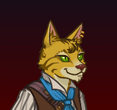

[Back to Main](index.md)

    
        Portait
    

# Rust

Rust on the Harbour is a former pirate who gave up a life at sea because it was far too wet. Now trying life as an adventurer on land, he'll lend his roguish skills to anyone who can give him that which his heart desires most: one gold piece.

# Changes

Rust is potentially a reworked champion in the Ahghairon's Day event on 7 August 2024.

Only abilities that have seen some changes will be displayed here - and be aware that there's a lot of guesswork involved. Some abilities may not have names - some may have the *wrong* names - or specialisations might not be marked as such - etc.. Focus on the effect data itself.

Please do me a favour and don't get all melodramatic about what you find here. I - and CNE - don't appreciate it. These are spoilers and will almost certainly change before release - likely multiple times. That and we don't have access to any upgrade data prior to release. Making assumptions on how the champions will turn out based on this information would be premature.

# Abilities

**Rags to Riches** (Guess)
> Unknown.

<em>Raw Data</em>

<pre>
{
    "id": 24169,
    "graphic": "Icons/Champions/Rebalance/Rust/Icon_Rust_Formation_RagstoRiches",
    "v": 2,
    "fs": 0,
    "p": 0,
    "type": 1,
    "export_params": {
        "uses": [
            "icon"
        ],
        "quantize": true
    }
}
</pre>

**Specialisation: Even More Riches** (Guess)
> Unknown.

<em>Raw Data</em>

<pre>
{
    "id": 24170,
    "graphic": "Icons/Champions/Rebalance/Rust/Icon_Specialization_RustEvenMoreRiches",
    "v": 2,
    "fs": 0,
    "p": 0,
    "type": 1,
    "export_params": {
        "uses": [
            "icon"
        ],
        "quantize": true
    }
}
</pre>

**Specialisation: Fever Dream** (Guess)
> Unknown.

<em>Raw Data</em>

<pre>
{
    "id": 24169,
    "graphic": "Icons/Champions/Rebalance/Rust/Icon_Rust_Formation_RagstoRiches",
    "v": 2,
    "fs": 0,
    "p": 0,
    "type": 1,
    "export_params": {
        "uses": [
            "icon"
        ],
        "quantize": true
    }
}
</pre>

**Specialisation: Get Rich Quick** (Guess)
> Unknown.

<em>Raw Data</em>

<pre>
{
    "id": 24169,
    "graphic": "Icons/Champions/Rebalance/Rust/Icon_Rust_Formation_RagstoRiches",
    "v": 2,
    "fs": 0,
    "p": 0,
    "type": 1,
    "export_params": {
        "uses": [
            "icon"
        ],
        "quantize": true
    }
}
</pre>

# Adventures and Variants

 **Unlock Adventure: Deadwinter Day (Rust)** (Complete Area 50)
> Patrol the outskirts of Longsaddle on Deadwinter Day.

 **Variant 1: Gold Devourer** (Complete Area 75)
> Rust begins in the formation. He can't be moved or removed from the formation.   
> The Devourer appears as a secondary boss on area 25. It must be defeated in order to advance.  
> Gold Find is reduced by 99%.  
> Gold Find is increased by 200% for each Champion with the "Gold" role, stacking multiplicatively.  
> Getting to know Rust: Rust increases your damage based on your total gold find. Use gold find buffing Champions in your formation to boost his support abilities!

 **Variant 2: Deadwinter Drama** (Complete Area 125)
> Only Champions with CON of 14 or higher can be used.   
> Every area, frozen skeleton archers that attack a random Champion from range appear. These enemies do not drop gold, nor do they count towards quest progress.   
> If any undead enemy attacks a Champion, that Champion is stunned for 1 second.

 **Variant 3: Heads or Tails** (Complete Area 175)
> Rust begins in the formation (slot 6). He can't be moved or removed from the formation.   
> When Rust is not holding his shiny gold piece, adjacent champions damage is disabled  
> When Rust is holding his shiny gold piece, non-adjacent champion damage is disabled

# Formation

    <svg xmlns="http://www.w3.org/2000/svg" id="Rust" fill="#aaa" data-formationName="Rust" data-campaignName="Midwinter" width="320" height="160"><circle cx="215" cy="125" r="15"/><circle cx="175" cy="105" r="15"/><circle cx="135" cy="45" r="15"/><circle cx="135" cy="125" r="15"/><circle cx="95" cy="25" r="15"/><circle cx="95" cy="65" r="15"/><circle cx="95" cy="105" r="15"/><circle cx="95" cy="145" r="15"/><circle cx="55" cy="125" r="15"/><circle cx="15" cy="105" r="15"/><text x="245" y="25" fill="#dcdcdc" font-size="25" font-family="Arial" font-weight="bold">Rust</text><text x="245" y="65" fill="#dcdcdc" font-size="15" font-family="Arial" font-weight="bold">Midwinter</text></svg>

[Back to Top](#top)

*Last Modified: {{ site.time }}*