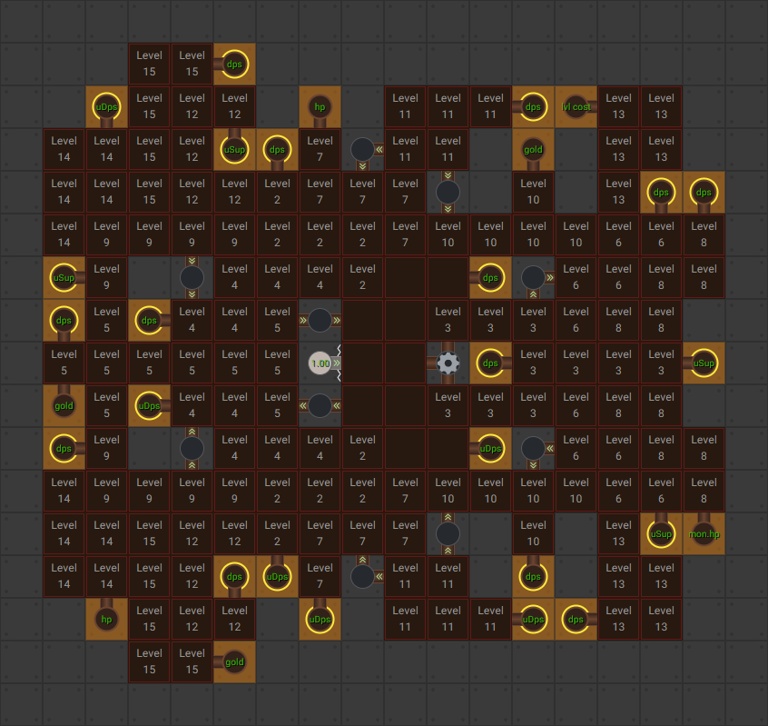
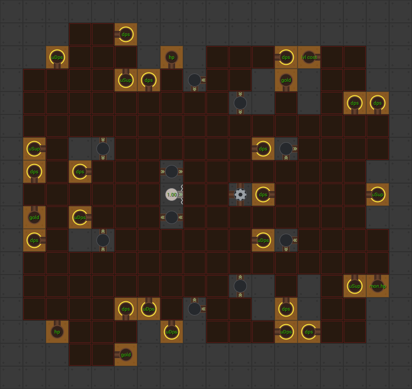

[Back to Main](index.md)

# Season 3

Season 2 will be ending on 1 March 2023 - and Season 3 is likely to start around 2-4 weeks later depending on CNE's schedule. Mid-to-late March is a safe guess.

The season 3 skins are currently dated 8 March 2023 - which means the season 3 preview could start at the same time the season 2 'cooling off' week ends. If that's the case then the ***speculative*** Season 3 start date will be 15 March 2023.

Of course they could also overlap the season 2 'cooling off' week and the season 3 preview week. If they do that then the season 3 start date will be 8 March 2023.

# Theme

The Season 3 chests (`Gold Ancient Lawbringer Chests`) have been added to the data and they confirm that Spurt Hew Maan Barrowin Birdsong and Turiel are all season 3 champions.

It seems to be that this new season will be an Unaffiliated / Lawful themed season. This tracks with some of the "new" abilities and specialisations these champions are getting.

# Changes

The information below is raw data on the "new" abilities that the champions might be getting. Some may be complete reworks - some may look copy-paste from old abilities that haven't seen reworks yet (and might not get reworked).

Please do me a favour and don't get all melodramatic about what you find here. I - and CNE - don't appreciate it. These are spoilers and will almost certainly change before release - likely multiple times. Making assumptions on how the champions will turn out based on this information would be premature.

# Modron: Unaffiliated Core

With the current numbers - this core is looking really very good for unaffiliated dps champions. It also gets automation at level 1 - which will be handy for people who run background parties.

### Bonus Breakdown

These tables are assuming that every node that can be supercharged is fully supercharged at 500% (which is possible). The left group are based on using an unaffiliated DPS champion - the right group are using a dps champion that has an affiliation.

| With Unaffiliated DPS Num Unaffiliated in Formation | Bonus |   | With Affiliated DPS Num Unaffiliated in Formation | Bonus |
|--:|--:|---|--:|--:|
| 1 | 1.15e49% |   | 0 | 8.01e28% |
| 2 | 1.74e50% |   | 1 | 1.39e35% |
| 3 | 8.63e50% |   | 2 | 2.10e36% |
| 4 | 2.70e51% |   | 3 | 1.04e37% |
| 5 | 6.56e51% |   | 4 | 3.27e37% |
| 6 | 1.35e52% |   | 5 | 7.93e37% |
| 7 | 2.50e52% |   | 6 | 1.64e38% |
| 8 | 4.26e52% |   | 7 | 3.03e38% |
| 9 | 6.81e52% |   | 8 | 5.15e38% |
| 10 | 1.04e53% |   | 9 | 8.24e38% |

### Level 1

### Level 15

# Spurt

**Ultimate: You Dead!**
> Spurt tosses a wasp nest at a stalking giant, and then is immediately killed by a giant hammer, which damages all Enemies on screen. Spurt then comes back as a spirit, increasing the effects of his abilities until he revives.

<em>Raw Data</em>

<pre>
{
    "description": "Spurt tosses a wasp nest at a stalking giant, and then is immediately killed.",
    "long_description": "Spurt tosses a wasp nest at a stalking giant, and then is immediately killed by a giant hammer, which damages all Enemies on screen. Spurt then comes back as a spirit, increasing the effects of his abilities until he revives.",
    "damage_modifier": 0.03,
    "damage_types": ["ranged"],
    "graphic_id": 5454,
    "target": "all",
    "aoe_radius": 0,
    "tags": [
        "ranged",
        "ultimate"
    ],
    "num_targets": 1,
    "animations": [{
        "powerup_after_jump": true,
        "damage_frame": 80,
        "effect_frames": {"jump_back": {
            "activate_on_animation_cancelled": true,
            "apply_to_hero": true,
            "effect_string": "effect_def,1429"
        }},
        "fade_back_in": true,
        "visual_effect_frames": {"-22": {
            "effect": "animated_clip",
            "scale": 1.15,
            "graphic_id": 5490
        }},
        "power_up_sequence": {
            "visual_effect_frames": {"19": {
                "projectile_details": {"projectile_graphic_id": 5476},
                "effect": "projectile",
                "offset_x": 1600,
                "projectile": "wasp_bag",
                "offset_y": -200
            }},
            "animation_sequence_name": "attack"
        },
        "jump_center": true,
        "require_targets_to_start": false,
        "refresh_damage_targets_at_hit": true,
        "type": "melee_attack"
    }],
    "name": "You Dead!",
    "cooldown": 120,
    "id": 605
}
</pre>

 

**Centipede Net** (Guess)
> Spurt increases the damage of adjacent Champions by `$amount%`.

<em>Raw Data</em>

<pre>
{
    "effect_keys": [{
        "off_when_benched": true,
        "effect_string": "hero_dps_multiplier_mult,100",
        "targets": ["adj"]
    }],
    "requirements": [],
    "description": {
        "pre": {"conditions": [
            {
                "condition": "upgrade_purchased 10682",
                "desc": "Spurt increases the damage of Champions two slots away by $amount%"
            },
            {"desc": "Spurt increases the damage of adjacent Champions by $amount%"}
        ]},
        "post": {"conditions": [{
            "condition": "spurt_is_spirit_v2",
            "desc": "^^({Spirit:}#99C7F7 This effect is increased by 2% for each second of Spurt's maximum Ultimate cooldown, stacking multiplicatively)"
        }]}
    },
    "id": 1426,
    "flavour_text": "",
    "graphic_id": 5448,
    "properties": []
}
</pre>

 

**Wa-spiration** (Guess)
> Spurt gains a stack of Wa-spiration every time he attacks. Every `$(stacks_until_effect)` Wa-spiration stacks, Spurt invents a random effect. Effects can stack up to `$(max_effect_stacks)` times each and persist until the area changes.

<em>Raw Data</em>

<pre>
{
    "effect_keys": [{
        "wasp_scale": 1,
        "wasp_y_offset": -85,
        "wasp_y_offset_when_spirit": -110,
        "stacks_until_effect": 10,
        "min_wasp_speed": 3,
        "wasp_radius": 60,
        "effect_string": "spurt_waspiration_v2",
        "wasp_float_speed": 10,
        "max_effect_stacks": 5,
        "effects": [
            {
                "base_amount": 200,
                "effect_id": 1433,
                "buffed_amount": 400
            },
            {
                "base_amount": 200,
                "effect_id": 1434,
                "buffed_amount": 400
            },
            {
                "base_amount": 0.1,
                "effect_id": 1435,
                "buffed_amount": 0.2
            }
        ],
        "wasp_default_graphic": 18378,
        "max_wasp_speed": 6,
        "wasp_max_float_radius": 20
    }],
    "requirements": [],
    "description": {
        "pre": "Spurt gains a stack of Wa-spiration every time he attacks. Every $(stacks_until_effect) Wa-spiration stacks, Spurt invents a random effect. Effects can stack up to $(max_effect_stacks) times each and persist until the area changes.",
        "post": {"conditions": [{
            "condition": "not static_desc",
            "desc": "^^$(spurt_waspiration_v2_desc)"
        }]},
        "desc": {"conditions": [{
            "condition": "spurt_is_spirit_v2",
            "desc": "^^({Spirit:}#99C7F7 Wa-spiration stacks are gained when an adjacent Champion attacks and the base multipliers of the invented effects are increased by 100%)"
        }]}
    },
    "id": 1428,
    "flavour_text": "",
    "graphic_id": 5451,
    "properties": {
        "use_outgoing_description": true,
        "is_formation_ability": true,
        "show_incoming": false
    }
}
</pre>

 

**Spurt's Spirit** (Guess)
> Increases the damage of all Champions by `$amount%`  
>   
> While in Spirit form:  
> Centipede Net: Buffed by 2% for each second of ultimate cooldown that Spurt has  
> Wa-spiration: Stacks are gained every time an adjacent Champion attacks and the base multipliers of the invented effects are increased by 100%  
> Pack Tactics: The base multiplier is increased by 100%.

<em>Raw Data</em>

<pre>
{
    "effect_keys": [
        {
            "spurt_ult_attack_id": 605,
            "pack_tactics_buff_effect_id": 1431,
            "centipede_net_buff_effect_id": 1432,
            "effect_string": "spurt_spirit_v2",
            "centipede_net_upgrade_id": 10678,
            "seconds_left_on_ult_to_remove_spirit": 10,
            "spirit_graphic_id": 5477,
            "pack_tactics_upgrade_id": 10680
        },
        {"effect_string": "global_dps_multiplier_mult,400"},
        {
            "effect_string": "change_base_attack,201",
            "targets": ["self"]
        }
    ],
    "requirements": [],
    "description": {"desc": "Increases the damage of all Champions by $amount%^^While in Spirit form:^Centipede Net: Buffed by 2% for each second of ultimate cooldown that Spurt has^Wa-spiration: Stacks are gained every time an adjacent Champion attacks and the base multipliers of the invented effects are increased by 100%^Pack Tactics: The base multiplier is increased by 100%"},
    "id": 1429,
    "flavour_text": "",
    "graphic_id": 0,
    "properties": {
        "use_outgoing_description": true,
        "is_formation_ability": true,
        "effect_name": "Spurt's Spirit",
        "show_incoming": false
    }
}
</pre>

 

**Pack Tactics** (Guess)
> Increases the damage of all Champions by `$(not_buffed amount)%` for every Kobold in the formation, including Spurt.

<em>Raw Data</em>

<pre>
{
    "effect_keys": [{
        "stack_title": "Kobolds in the formation",
        "stacks_multiply": true,
        "off_when_benched": true,
        "effect_string": "global_dps_mult_by_tag_mult,100,kobold"
    }],
    "requirements": [],
    "description": {
        "pre": {"conditions": [
            {
                "condition": "upgrade_purchased 10683",
                "desc": "Increases the damage of all Champions by $(not_buffed amount)% for every Kobold and Unaffiliated Non-Kobold in the formation, including Spurt."
            },
            {"desc": "Increases the damage of all Champions by $(not_buffed amount)% for every Kobold in the formation, including Spurt."}
        ]},
        "post": {"conditions": [{
            "condition": "spurt_is_spirit_v2",
            "desc": "^^({Spirit:}#99C7F7 Base multiplier increased by 100%)"
        }]}
    },
    "id": 1430,
    "flavour_text": "",
    "graphic_id": 5450,
    "properties": {
        "use_outgoing_description": true,
        "is_formation_ability": true,
        "show_incoming": false
    }
}
</pre>

 

**Kobold Family** (Guess)
> Increases the base multiplier of Pack Tactics by 100%.

<em>Raw Data</em>

<pre>
{
    "effect_keys": [{
        "data": {"amount": 200},
        "effect_string": "change_upgrade_data,10680"
    }],
    "requirements": [],
    "description": {"desc": "Increases the base multiplier of Pack Tactics by 100%."},
    "id": 1431,
    "flavour_text": "",
    "graphic_id": 0,
    "properties": []
}
</pre>

 

**Wa-spiration: Stingy** (Guess)
> Champions that attack with melee attacks deal `$amount%` additional damage.

<em>Raw Data</em>

<pre>
{
    "effect_keys": [
        {
            "stacks_multiply": true,
            "off_when_benched": true,
            "effect_string": "hero_dps_multiplier_mult,200",
            "clear_stacks_on_deactivate": false,
            "max_stacks": 5,
            "targets": [{
                "attack": "melee",
                "type": "attack_type"
            }],
            "stacks_on_trigger": "will_manually_stack"
        },
        {
            "amount": 200,
            "stacks_multiply": true,
            "off_when_benched": true,
            "show_bonus": true,
            "effect_string": "show_in_spurt_outgoing",
            "clear_stacks_on_deactivate": false,
            "max_stacks": 5,
            "stacks_on_trigger": "will_manually_stack",
            "targets": [{
                "hero_ids": [
                    43,
                    132
                ],
                "type": "heroes"
            }]
        }
    ],
    "requirements": [],
    "description": {"desc": "Champions that attack with melee attacks deal $amount% additional damage"},
    "id": 1433,
    "flavour_text": "",
    "graphic_id": 5451,
    "properties": {
        "use_outgoing_description": false,
        "is_formation_ability": true,
        "show_in_owner_outgoing": true,
        "effect_name": "Wa-spiration: Stingy",
        "owner_use_outgoing_description": true
    }
}
</pre>

 

**Wa-spiration: Skunky** (Guess)
> Enemies that approach the party take an extra `$amount%` damage.

<em>Raw Data</em>

<pre>
{
    "effect_keys": [
        {
            "stacks_multiply": true,
            "off_when_benched": true,
            "active_graphic_id": 2654,
            "effect_string": "increase_monster_damage_percent_to_party,200,80",
            "clear_stacks_on_deactivate": false,
            "max_stacks": 5,
            "stacks_on_trigger": "will_manually_stack"
        },
        {
            "amount": 200,
            "stacks_multiply": true,
            "off_when_benched": true,
            "show_bonus": true,
            "effect_string": "show_in_spurt_outgoing",
            "clear_stacks_on_deactivate": false,
            "max_stacks": 5,
            "stacks_on_trigger": "will_manually_stack",
            "targets": [{
                "hero_ids": [
                    43,
                    132
                ],
                "type": "heroes"
            }]
        }
    ],
    "requirements": [],
    "description": {"desc": "Enemies that approach the party take an extra $amount% damage"},
    "id": 1434,
    "flavour_text": "",
    "graphic_id": 5451,
    "properties": {
        "use_outgoing_description": true,
        "is_formation_ability": true,
        "show_in_owner_outgoing": true,
        "effect_name": "Wa-spiration: Skunky"
    }
}
</pre>

 

**Wa-spiration: Grubby** (Guess)
> All Champions' base attack cooldowns are reduced by `$amount seconds`.

<em>Raw Data</em>

<pre>
{
    "effect_keys": [
        {
            "off_when_benched": true,
            "effect_string": "reduce_attack_cooldown,0.1",
            "clear_stacks_on_deactivate": false,
            "max_stacks": 5,
            "stacks_on_trigger": "will_manually_stack"
        },
        {
            "amount": 0.1,
            "bonus_is_seconds": true,
            "off_when_benched": true,
            "show_bonus": true,
            "effect_string": "show_in_spurt_outgoing",
            "clear_stacks_on_deactivate": false,
            "max_stacks": 5,
            "stacks_on_trigger": "will_manually_stack",
            "total_bonus_amount_prefix": "-",
            "targets": [{
                "hero_ids": [
                    43,
                    132
                ],
                "type": "heroes"
            }]
        }
    ],
    "requirements": [],
    "description": {"desc": "All Champions' base attack cooldowns are reduced by $amount seconds"},
    "id": 1435,
    "flavour_text": "",
    "graphic_id": 5451,
    "properties": {
        "use_outgoing_description": true,
        "is_formation_ability": true,
        "show_in_owner_outgoing": true,
        "effect_name": "Wa-spiration: Grubby"
    }
}
</pre>

 

**Specialisation: Unknown** (Guess)
> Increases the effect of Pack Tactics by `$amount%`.

<em>Raw Data</em>

<pre>
{
    "effect_keys": [{"effect_string": "buff_upgrade,400,10680"}],
    "requirements": [],
    "description": {"desc": "Increases the effect of Pack Tactics by $amount%"},
    "id": 1436,
    "flavour_text": "",
    "graphic_id": 0,
    "properties": {"is_formation_ability": true}
}
</pre>

 

**Specialisation: Unknown** (Guess)
> Centipede Net instead affects champions who are 2 formation slots away from Spurt and its effect is increased by `$amount%`.

<em>Raw Data</em>

<pre>
{
    "effect_keys": [
        {
            "data": {"targets": [{
                "comparison": "=",
                "distance": 2,
                "type": "distance"
            }]},
            "effect_string": "change_upgrade_data,10678"
        },
        {"effect_string": "buff_upgrade,600,10678"}
    ],
    "requirements": [],
    "description": {"desc": "Centipede Net instead affects champions who are 2 formation slots away from Spurt and its effect is increased by $amount%"},
    "id": 1437,
    "flavour_text": "",
    "graphic_id": 0,
    "properties": {
        "is_formation_ability": true,
        "owner_use_outgoing_description": true
    }
}
</pre>

 

**Specialisation: Unknown** (Guess)
> Unaffiliated Non-Kobold Champions count as Kobolds for the purposes of Pack Tactics.

<em>Raw Data</em>

<pre>
{
    "effect_keys": [
        {
            "data": {
                "stack_title": "Kobolds and Unaffiliated Non-Kobolds in the formation",
                "tag": "kobold|unaffiliated"
            },
            "effect_string": "change_upgrade_data,10680"
        },
        {
            "stack_func": "per_hero",
            "dev_note": "this effect key is just for getting the number of champions targetted in the formation for the spec option post apply info",
            "effect_string": "do_nothing,0",
            "tag": "unaffiliated^!kobold"
        }
    ],
    "requirements": [],
    "description": {"desc": "Unaffiliated Non-Kobold Champions count as Kobolds for the purposes of Pack Tactics"},
    "id": 1438,
    "flavour_text": "",
    "graphic_id": 0,
    "properties": {
        "indexed_effect_properties": true,
        "is_formation_ability": true,
        "spec_option_post_apply_info": "Unaffiliated Non-Kobold Champions: $num_stacks___2",
        "default_bonus_index": 0,
        "owner_use_outgoing_description": true,
        "per_effect_index_bonuses": true
    }
}
</pre>

 

# Hew Maan

**Carefully Balanced** (Guess)
> Increases the effect of {Zrang's}#955d81 Teamwork ability by `$(amount)%` for each Champion adjacent to the kobolds (stacks additively and then applied to Teamwork multiplicatively).

<em>Raw Data</em>

<pre>
{
    "effect_keys": [
        {
            "off_when_benched": true,
            "effect_string": "hewmaan_carefully_balanced,5"
        },
        {
            "manual_stacking": true,
            "stacks_are_bonus": false,
            "show_bonus": true,
            "effect_string": "buff_upgrade,0,10648,1"
        }
    ],
    "requirements": "",
    "description": {"desc": "Increases the effect of {Zrang's}#955d81 Teamwork ability by $(amount)% for each Champion adjacent to the kobolds (stacks additively and then applied to Teamwork multiplicatively)."},
    "id": 1446,
    "flavour_text": "",
    "graphic_id": 9764,
    "properties": {
        "indexed_effect_properties": true,
        "is_formation_ability": true,
        "default_bonus_index": 0,
        "owner_use_outgoing_description": true,
        "per_effect_index_bonuses": true
    }
}
</pre>

 

**Impressive Coatwork** (Guess)
> The effect of all Teamwork abilities are increased by `$(amount)%`.

<em>Raw Data</em>

<pre>
{
    "effect_keys": [{
        "off_when_benched": true,
        "effect_string": "buff_upgrade,100,10648"
    }],
    "requirements": "",
    "description": {"desc": "The effect of all Teamwork abilities are increased by $(amount)%"},
    "id": 1447,
    "flavour_text": "",
    "graphic_id": 9769,
    "properties": {
        "is_formation_ability": true,
        "owner_use_outgoing_description": true
    }
}
</pre>

 

**Specialisation: Unknown** (Guess)
> The Hello, Fellow Humans ability now uses the most populous race in your formation instead of Humans.

<em>Raw Data</em>

<pre>
{
    "effect_keys": [
        {"effect_string": "hew_maan_did_we_say_humans_spec_post_apply_info"},
        {
            "off_when_benched": true,
            "effect_string": "hewmaan_did_we_say_humans,0"
        }
    ],
    "requirements": "",
    "description": {
        "pre": "The Hello, Fellow Humans ability now uses the most populous race in your formation instead of Humans.",
        "post": {"conditions": [{
            "condition": "not static_desc",
            "desc": "^^$(hewmaan_most_populous_race_and_count)"
        }]}
    },
    "id": 1403,
    "flavour_text": "",
    "graphic_id": 9768,
    "properties": {
        "is_formation_ability": true,
        "spec_option_post_apply_info": "$active_effect_key_handler_custom_spec_hint",
        "owner_use_outgoing_description": true
    }
}
</pre>

 

**Specialisation: Unknown** (Guess)
> The Hello, Fellow Humans ability now uses the number of Lawful Champions in the formation instead of Humans.

<em>Raw Data</em>

<pre>
{
    "effect_keys": [
        {
            "off_when_benched": true,
            "effect_string": "hewmaan_law_maan,0"
        },
        {
            "stack_func": "per_hero",
            "dev_note": "this effect key is just for getting the number of champions targetted in the formation for the spec option post apply info",
            "effect_string": "do_nothing,0",
            "tag": "lawful"
        }
    ],
    "requirements": "",
    "description": {
        "pre": "The Hello, Fellow Humans ability now uses the number of Lawful Champions in the formation instead of Humans.",
        "post": {"conditions": [{
            "condition": "not static_desc",
            "desc": "^^$(hewmaan_lawful_champions_count)"
        }]}
    },
    "id": 1404,
    "flavour_text": "",
    "graphic_id": 0,
    "properties": {
        "indexed_effect_properties": true,
        "is_formation_ability": true,
        "spec_option_post_apply_info": "Lawful Champions: $num_stacks___2",
        "default_bonus_index": 0,
        "owner_use_outgoing_description": true,
        "per_effect_index_bonuses": true
    }
}
</pre>

 

**Specialisation: Unknown** (Guess)
> The Hello, Fellow Humans ability now uses the number of unaffiliated Champions in the formation instead of Humans.

<em>Raw Data</em>

<pre>
{
    "effect_keys": [
        {
            "off_when_benched": true,
            "effect_string": "hewmaan_hello_fellow_mercenaries,0"
        },
        {
            "stack_func": "per_hero",
            "dev_note": "this effect key is just for getting the number of champions targetted in the formation for the spec option post apply info",
            "effect_string": "do_nothing,0",
            "tag": "unaffiliated"
        }
    ],
    "requirements": "",
    "description": {
        "pre": "The Hello, Fellow Humans ability now uses the number of unaffiliated Champions in the formation instead of Humans",
        "post": {"conditions": [{
            "condition": "not static_desc",
            "desc": "^^$(hewmaan_unaffiliated_champions_count)"
        }]}
    },
    "id": 1405,
    "flavour_text": "",
    "graphic_id": 0,
    "properties": {
        "indexed_effect_properties": true,
        "is_formation_ability": true,
        "spec_option_post_apply_info": "Unaffiliated Champions: $num_stacks___2",
        "default_bonus_index": 0,
        "owner_use_outgoing_description": true,
        "per_effect_index_bonuses": true
    }
}
</pre>

 

# Barrowin

**Base Attack: Mighty Hammer**
> Barrowin smashes the nearest enemy with her mighty warhammer.

<em>Raw Data</em>

<pre>
{
    "description": "Barrowin smashes the nearest enemy with her mighty warhammer.",
    "long_description": "",
    "damage_modifier": 1,
    "damage_types": ["melee"],
    "graphic_id": 0,
    "target": "front",
    "aoe_radius": 0,
    "tags": ["melee"],
    "num_targets": 1,
    "animations": [{
        "damage_frame": 6,
        "sound_frames": {"2": 199},
        "target_offset_x": -60,
        "type": "melee_attack"
    }],
    "name": "Mighty Hammer",
    "cooldown": 4.6,
    "id": 606
}
</pre>

 

**Ultimate: Holy Weapon**
> Barrowin infuses her hammer with holy energy and throws it at a random enemy, stunning it for 5 seconds. For the next 15 seconds, the base effect of Blessed Hammer is increased by 100%.

<em>Raw Data</em>

<pre>
{
    "description": "Barrowin infuses her hammer with holy energy, stunning a random enemy and buffing Blessed Hammer.",
    "long_description": "Barrowin infuses her hammer with holy energy and throws it at a random enemy, stunning it for 5 seconds. For the next 15 seconds, the base effect of Blessed Hammer is increased by 100%.",
    "damage_modifier": 0.03,
    "damage_types": ["ranged"],
    "graphic_id": 1872,
    "target": "random",
    "aoe_radius": 0,
    "tags": [
        "melee",
        "ultimate"
    ],
    "num_targets": 1,
    "animations": [{
        "effect_frames": {"projectile": {"effect_string": "barrowin_ultimate_action_v2"}},
        "hit_sound": 133,
        "blessed_hammer_buff_time": 15,
        "shoot_sound": 149,
        "stun_on_hit": 5,
        "projectile_graphic_id": 1,
        "blessed_hammer_bonus_amount": 100,
        "type": "ranged_attack",
        "projectile": "holy_weapon",
        "hold_shoot_frame": true,
        "shoot_frame": 28
    }],
    "name": "Holy Weapon",
    "cooldown": 360,
    "id": 607
}
</pre>

 

**Blessed Hammer** (Guess)
> Barrowin increases the damage of Champions behind her by `$(not_buffed amount)%` for each Champion in the formation who has an equal or higher base attack cooldown, stacking multiplicatively.

<em>Raw Data</em>

<pre>
{
    "effect_keys": [
        {
            "amount_updated_listeners": [
                "slot_changed",
                "attack_changed",
                "base_attack_cooldown_changed"
            ],
            "stacks_multiply": true,
            "off_when_benched": true,
            "show_bonus": true,
            "amount_func": "mult",
            "stack_func": "per_hero",
            "use_computed_amount_for_description": true,
            "effect_string": "hero_dps_multiplier_mult,400",
            "stack_func_data": {"target_filters": [{
                "comparison": ">=",
                "type": "attack_cooldown",
                "value": {"base_attack_cooldown_from_hero_id": 130}
            }]},
            "targets": ["behind"]
        },
        {
            "base_dps_buff_amount": 400,
            "dps_buff_effect_key_index": 0,
            "effect_string": "barrowin_blessed_hammer",
            "hammer_of_the_law_upg_id": 10691
        }
    ],
    "requirements": [],
    "description": {"desc": "Barrowin increases the damage of Champions behind her by $(not_buffed amount)% for each Champion in the formation who has an equal or higher base attack cooldown, stacking multiplicatively."},
    "id": 1439,
    "flavour_text": "",
    "graphic_id": 1867,
    "properties": {
        "is_formation_ability": true,
        "owner_use_outgoing_description": true
    }
}
</pre>

 

**Unknown**
> Barrowin has a number of Vigilance stacks equal to the number of Champions in the formation that are either lawful or dwarves. She increases the health of other Champions in the formation by `$amount%` of her max health for each Vigilance stack.

<em>Raw Data</em>

<pre>
{
    "effect_keys": [{
        "amount_updated_listeners": [
            "max_health_changed",
            "slot_changed",
            "stacks_changed"
        ],
        "stacks_multiply": false,
        "total_title": "Bonus Health",
        "amount_func": "source_percent_health_add",
        "stack_func": "per_hero",
        "use_computed_amount_for_description": true,
        "effect_string": "increase_health_by_source_percent,5",
        "targets": ["other"],
        "stack_title": "Vigilance Stacks",
        "show_bonus": true,
        "percent_values": false,
        "stack_func_data": {"target_filters": [{
            "type": "tags",
            "tags": "lawful|dwarf"
        }]},
        "show_current_value_bonus_desc": false,
        "override_key_desc": "Increases the Health of $target by $amount",
        "round_bonus_value": true
    }],
    "requirements": [],
    "description": {"desc": "Barrowin has a number of Vigilance stacks equal to the number of Champions in the formation that are either lawful or dwarves. She increases the health of other Champions in the formation by $amount% of her max health for each Vigilance stack."},
    "id": 1440,
    "flavour_text": "",
    "graphic_id": 18593,
    "properties": {"is_formation_ability": true}
}
</pre>

 

**Healing Word** (Guess)
> Barrowin heals Champions in her column, including herself, for `$(not_buffed amount)` health per second for each stack of Vigilance she has. After Barrowin attacks, her next Healing Word also applies a temporary health bonus of the same amount.

<em>Raw Data</em>

<pre>
{
    "effect_keys": [
        {
            "amount_updated_listeners": [
                "slot_changed",
                "stacks_changed"
            ],
            "stacks_multiply": false,
            "total_title": "Healing Per Second",
            "amount_func": "add",
            "stack_func": "per_hero",
            "use_computed_amount_for_description": true,
            "effect_string": "heal,2",
            "targets": ["col"],
            "stack_title": "Vigilance Stacks",
            "off_when_benched": true,
            "show_bonus": true,
            "percent_values": false,
            "stack_func_data": {"target_filters": [{
                "type": "tags",
                "tags": "lawful|dwarf"
            }]},
            "show_current_value_bonus_desc": false
        },
        {
            "heal_effect_key_index": 0,
            "off_when_benched": true,
            "effect_string": "barrowin_healing_word"
        }
    ],
    "requirements": [],
    "description": {"desc": "Barrowin heals Champions in her column, including herself, for $(not_buffed amount) health per second for each stack of Vigilance she has. After Barrowin attacks, her next Healing Word also applies a temporary health bonus of the same amount."},
    "id": 1441,
    "flavour_text": "",
    "graphic_id": 1868,
    "properties": {
        "indexed_effect_properties": true,
        "is_formation_ability": true,
        "default_bonus_index": 0,
        "owner_use_outgoing_description": true,
        "per_effect_index_bonuses": true
    }
}
</pre>

 

**Specialisation: Unknown** (Guess)
> Barrowin attacks `$amount seconds faster for each stack of Vigilance she has`. Additionally, when a Champion that is eligible for Healing Word is hit by an enemy, Barrowin attacks 1 second faster for her next two attacks.

<em>Raw Data</em>

<pre>
{
    "effect_keys": [
        {
            "amount_updated_listeners": [
                "slot_changed",
                "stacks_changed"
            ],
            "stacks_multiply": false,
            "bonus_is_seconds": true,
            "amount_func": "add",
            "stack_func": "per_hero",
            "effect_string": "reduce_attack_cooldown,0.25",
            "stack_title": "Vigilance Stacks",
            "off_when_benched": true,
            "show_bonus": true,
            "percent_values": false,
            "stack_func_data": {"target_filters": [{
                "type": "tags",
                "tags": "lawful|dwarf"
            }]},
            "show_current_value_bonus_desc": false,
            "total_bonus_amount_prefix": "-"
        },
        {
            "buff_attack_count": 2,
            "healing_word_heal_handler_index": 0,
            "effect_string": "barrowin_even_temper",
            "buff_effect_string": "reduce_attack_cooldown,1",
            "healing_word_upg_id": 10686
        }
    ],
    "requirements": [],
    "description": {"desc": "Barrowin attacks $amount seconds faster for each stack of Vigilance she has. Additionally, when a Champion that is eligible for Healing Word is hit by an enemy, Barrowin attacks 1 second faster for her next two attacks."},
    "id": 1442,
    "flavour_text": "",
    "graphic_id": 4437,
    "properties": {
        "is_formation_ability": true,
        "owner_use_outgoing_description": true
    }
}
</pre>

 

**Specialisation: Unknown** (Guess)
> Barrowin remembers the largest number of enemies she's had to tank at once in the current area. Blessed Hammer is increased by `$amount%` multiplied by that number.

<em>Raw Data</em>

<pre>
{
    "effect_keys": [
        {
            "stacks_multiply": false,
            "effect_string": "buff_upgrade,100,10684",
            "stacks_on_trigger": "will_manually_stack"
        },
        {
            "effect_string": "barrowin_hammer_time",
            "buff_effect_key_index": 0
        }
    ],
    "requirements": [],
    "description": {
        "post": {"conditions": [{
            "condition": "not static_desc",
            "desc": "^^$(barrowin_hammer_time_desc)"
        }]},
        "desc": "Barrowin remembers the largest number of enemies she's had to tank at once in the current area. Blessed Hammer is increased by $amount% multiplied by that number."
    },
    "id": 1443,
    "flavour_text": "",
    "graphic_id": 18592,
    "properties": {
        "is_formation_ability": true,
        "owner_use_outgoing_description": true
    }
}
</pre>

 

**Specialisation: Unknown** (Guess)
> Barrowin's Blessed Hammer base effect is additively increased by `$(amount_per_stack)%` for each Vigilance stack she has.

<em>Raw Data</em>

<pre>
{
    "effect_keys": [{
        "off_when_benched": true,
        "amount_per_stack": 20,
        "effect_string": "barrowin_hammer_of_the_law",
        "count_hero_tag_expr": "lawful|dwarf"
    }],
    "requirements": [],
    "description": {"desc": "Barrowin's Blessed Hammer base effect is additively increased by $(amount_per_stack)% for each Vigilance stack she has."},
    "id": 1444,
    "flavour_text": "",
    "graphic_id": 0,
    "properties": {"owner_use_outgoing_description": true}
}
</pre>

 

**Specialisation: Unknown** (Guess)
> Barrowin's Blessed Hammer is buffed by `$amount%`.

<em>Raw Data</em>

<pre>
{
    "effect_keys": [{"effect_string": "buff_upgrade,400,10684"}],
    "requirements": [],
    "description": {"desc": "Barrowin's Blessed Hammer is buffed by $amount%"},
    "id": 1450,
    "flavour_text": "",
    "graphic_id": 0,
    "properties": {"is_formation_ability": true}
}
</pre>

 

**Specialisation: Unknown** (Guess)
> Barrowin's Healing Word is buffed by `$amount%`.

<em>Raw Data</em>

<pre>
{
    "effect_keys": [{"effect_string": "buff_upgrade,100,10686"}],
    "requirements": [],
    "description": {"desc": "Barrowin's Healing Word is buffed by $amount%"},
    "id": 1451,
    "flavour_text": "",
    "graphic_id": 0,
    "properties": {"is_formation_ability": true}
}
</pre>

 

# Birdsong

**Base Attack: Flashing Blades**
> Birdsong leaps out with a cat's grace and attacks the nearest enemies with her sword.

<em>Raw Data</em>

<pre>
{
    "description": "Birdsong leaps out with a cat's grace and attacks the nearest enemies with her sword.",
    "long_description": "",
    "damage_modifier": 1,
    "damage_types": ["melee"],
    "graphic_id": 0,
    "target": "front",
    "aoe_radius": 100,
    "tags": [
        "melee",
        "aoe"
    ],
    "num_targets": 1,
    "animations": [{
        "type": "melee_attack",
        "sequences": [{
            "damage_frame": 2,
            "hit_frames": [2],
            "sound_frames": {"2": 199},
            "target_offset_x": -60,
            "end_frame": 25,
            "start_frame": 0
        }],
        "animation": "split_sequence_multi_target"
    }],
    "name": "Flashing Blades",
    "cooldown": 4.6,
    "id": 609
}
</pre>

 

**Ultimate: Cat's Agility**
> Birdsong leaps from enemy to enemy 5 times, dealing damage and stunning them for 5 seconds. Enemies she attacks during her ultimate take 200% extra damage from all Champions for 15 seconds.

<em>Raw Data</em>

<pre>
{
    "description": "Birdsong leaps from enemy to enemy, dealing damage and stunning them.",
    "long_description": "Birdsong leaps from enemy to enemy 5 times, dealing damage and stunning them for 5 seconds. Enemies she attacks during her ultimate take 200% extra damage from all Champions for 15 seconds.",
    "damage_modifier": 0.0325,
    "damage_types": ["melee"],
    "graphic_id": 2125,
    "target": "random",
    "aoe_radius": 0,
    "tags": [
        "melee",
        "ultimate"
    ],
    "num_targets": 5,
    "animations": [{
        "shake_on_hit": 0.1,
        "target_offset_x": -80,
        "stun_on_hit": 5,
        "type": "melee_attack",
        "sequences": [{
            "damage_frame": 20,
            "hit_frames": [
                2,
                20
            ],
            "sound_frames": {
                "2": 199,
                "20": 199
            },
            "target_offset_x": -60,
            "end_frame": 27,
            "start_frame": 0,
            "effects_on_monsters": [{
                "for_time": 15,
                "active_graphic_y": -90,
                "active_graphic_id": 18603,
                "effect_string": "increase_monster_damage,200"
            }]
        }],
        "stun_graphic": 1509,
        "animation": "split_sequence_multi_target"
    }],
    "name": "Cat's Agility",
    "cooldown": 180,
    "id": 611
}
</pre>

 

**Song of Battle** (Guess)
> Increases the damage of Champions within two slots of Birdsong by `$(amount)%`, including Birdsong herself.

<em>Raw Data</em>

<pre>
{
    "effect_keys": [{
        "effect_string": "hero_dps_multiplier_mult,100",
        "targets": [{
            "comparison": "<=",
            "distance": 2,
            "type": "distance"
        }]
    }],
    "requirements": "",
    "description": {"desc": "Increases the damage of Champions within two slots of $(source_hero) by $(amount)%, including Birdsong herself."},
    "id": 1452,
    "flavour_text": "",
    "graphic_id": 2119,
    "properties": {"is_formation_ability": true}
}
</pre>

 

**Unknown**
> Increases the effect of `$(upgrade_name id)` by `$(amount)%` for each positional formation ability affecting Birdsong that comes from a Champion who has no affiliation, stacking multiplicatively.

<em>Raw Data</em>

<pre>
{
    "effect_keys": [{
        "stack_title": "Positional Formation Abilities",
        "amount_updated_listeners": [
            "slot_changed",
            "positional_formation_ability_changed"
        ],
        "show_bonus": true,
        "amount_func": "mult",
        "stack_func": "per_positional_formation_ability",
        "effect_string": "buff_upgrade,100,10774",
        "stack_func_data": {
            "exclude_self": true,
            "tag": "unaffiliated"
        }
    }],
    "requirements": "",
    "description": {"desc": "Increases the effect of $(upgrade_name id) by $(amount)% for each positional formation ability affecting $(source_hero) that comes from a Champion who has no affiliation, stacking multiplicatively."},
    "id": 1453,
    "flavour_text": "",
    "graphic_id": 18594,
    "properties": {
        "is_formation_ability": true,
        "owner_use_outgoing_description": true
    }
}
</pre>

 

**Unknown**
> Increases the effect of `$(upgrade_name id___2)` by `$(amount)%` whenever any Champion affected by `$(upgrade_name id___2)` gets the killing blow on an enemy. This effect can stack up to `$(max_stacks___2)` times, once for each kill. Stacks multiplicatively. Stacks are reset when changing areas.

<em>Raw Data</em>

<pre>
{
    "effect_keys": [
        {"effect_string": "pre_stack_amount,100"},
        {
            "amount_expr": "upgrade_amount(10776,0)",
            "stacks_multiply": true,
            "show_bonus": true,
            "effect_string": "buff_upgrade,0,10774",
            "more_triggers": [
                {
                    "action": {"type": "reset"},
                    "trigger": "area_changed"
                },
                {
                    "action": {"type": "add_stacks"},
                    "trigger": "on_broadcast_stacks,crescendo_trigger"
                }
            ],
            "max_stacks": 10,
            "stacks_on_trigger": "killed_by_hero_affected_by_upgrade,10774"
        }
    ],
    "requirements": "",
    "description": {"desc": "Increases the effect of $(upgrade_name id___2) by $(amount)% whenever any Champion affected by $(upgrade_name id___2) gets the killing blow on an enemy. This effect can stack up to $(max_stacks___2) times, once for each kill. Stacks multiplicatively. Stacks are reset when changing areas."},
    "id": 1454,
    "flavour_text": "",
    "graphic_id": 0,
    "properties": {
        "indexed_effect_properties": true,
        "is_formation_ability": true,
        "default_bonus_index": 0,
        "owner_use_outgoing_description": true,
        "formation_circle_icon": false,
        "per_effect_index_bonuses": true
    }
}
</pre>

 

**Impressive Bladework** (Guess)
> When Birdsong attacks she makes one bonus attack against a random boss enemy, dealing `$(seconds_plural amount)` of BUD-based damage.

<em>Raw Data</em>

<pre>
{
    "effect_keys": [{
        "attack_id": 610,
        "effect_string": "birdsong_impressive_bladework,5"
    }],
    "requirements": "",
    "description": {"desc": "When $(source_hero) attacks she makes one bonus attack against a random boss enemy, dealing $(seconds_plural amount) of BUD-based damage."},
    "id": 1455,
    "flavour_text": "",
    "graphic_id": 2118,
    "properties": {
        "is_formation_ability": true,
        "owner_use_outgoing_description": true
    }
}
</pre>

 

**Specialisation: Theme of Valor** (Guess)
> Increases the effect of `$(upgrade_name upgrade_id)` on Good Champions by `$(amount)%`.

<em>Raw Data</em>

<pre>
{
    "effect_keys": [{
        "effect_string": "buff_effects_from_upgrade_fa,400,10774",
        "targets": [{
            "type": "by_tags",
            "tags": "good"
        }]
    }],
    "requirements": "",
    "description": {"desc": "Increases the effect of $(upgrade_name upgrade_id) on Good Champions by $(amount)%."},
    "id": 1456,
    "flavour_text": "",
    "graphic_id": 0,
    "properties": {
        "is_formation_ability": true,
        "owner_use_outgoing_description": true,
        "type": "upgrade",
        "formation_circle_icon": false
    }
}
</pre>

 

**Specialisation: Theme of Consideration** (Guess)
> Increases the effect of `$(upgrade_name upgrade_id)` on Neutral (Good/Evil axis) Champions by `$(amount)%`.

<em>Raw Data</em>

<pre>
{
    "effect_keys": [{
        "effect_string": "buff_effects_from_upgrade_fa,400,10774",
        "targets": [{
            "type": "by_tags",
            "tags": "geneutral"
        }]
    }],
    "requirements": "",
    "description": {"desc": "Increases the effect of $(upgrade_name upgrade_id) on Neutral (Good/Evil axis) Champions by $(amount)%."},
    "id": 1457,
    "flavour_text": "",
    "graphic_id": 0,
    "properties": {
        "is_formation_ability": true,
        "owner_use_outgoing_description": true,
        "type": "upgrade",
        "formation_circle_icon": false
    }
}
</pre>

 

**Specialisation: Theme of Deception** (Guess)
> Increases the effect of `$(upgrade_name upgrade_id)` on Evil Champions by `$(amount)%`.

<em>Raw Data</em>

<pre>
{
    "effect_keys": [{
        "effect_string": "buff_effects_from_upgrade_fa,400,10774",
        "targets": [{
            "type": "by_tags",
            "tags": "evil"
        }]
    }],
    "requirements": "",
    "description": {"desc": "Increases the effect of $(upgrade_name upgrade_id) on Evil Champions by $(amount)%."},
    "id": 1458,
    "flavour_text": "",
    "graphic_id": 0,
    "properties": {
        "is_formation_ability": true,
        "owner_use_outgoing_description": true,
        "type": "upgrade",
        "formation_circle_icon": false
    }
}
</pre>

 

**Specialisation: Crescendo** (Guess)
> Birdsong starts each area with Crescendo stacks equal to the number of Lawful Champions in the formation.

<em>Raw Data</em>

<pre>
{
    "effect_keys": [
        {
            "stack_func": "per_hero",
            "effect_string": "counter",
            "show_stacks": true,
            "tag": "lawful"
        },
        {"effect_string": "broadcast_stacks_trigger,0,crescendo_trigger,post_area_changed"}
    ],
    "requirements": "",
    "description": {"desc": "$(source_hero) starts each area with Crescendo stacks equal to the number of Lawful Champions in the formation."},
    "id": 1459,
    "flavour_text": "",
    "graphic_id": 0,
    "properties": {
        "indexed_effect_properties": true,
        "is_formation_ability": true,
        "spec_option_post_apply_info": "Lawful Champions: $num_stacks",
        "owner_use_outgoing_description": true,
        "type": "upgrade",
        "formation_circle_icon": false,
        "per_effect_index_bonuses": true
    }
}
</pre>

 

**Specialisation: One Woman Show** (Guess)
> Birdsong starts each area with Crescendo stacks equal to the number of Female Champions in the formation.

<em>Raw Data</em>

<pre>
{
    "effect_keys": [
        {
            "stack_func": "per_hero",
            "effect_string": "counter",
            "show_stacks": true,
            "tag": "female"
        },
        {"effect_string": "broadcast_stacks_trigger,0,crescendo_trigger,post_area_changed"}
    ],
    "requirements": "",
    "description": {"desc": "$(source_hero) starts each area with Crescendo stacks equal to the number of Female Champions in the formation."},
    "id": 1460,
    "flavour_text": "",
    "graphic_id": 0,
    "properties": {
        "indexed_effect_properties": true,
        "is_formation_ability": true,
        "spec_option_post_apply_info": "Female Champions: $num_stacks",
        "owner_use_outgoing_description": true,
        "type": "upgrade",
        "formation_circle_icon": false,
        "per_effect_index_bonuses": true
    }
}
</pre>

 

**Specialisation: Concertino** (Guess)
> Birdsong starts each area with Crescendo stacks equal to the number of Bard Champions in the formation.

<em>Raw Data</em>

<pre>
{
    "effect_keys": [
        {
            "stack_func": "per_hero",
            "effect_string": "counter",
            "show_stacks": true,
            "tag": "bard"
        },
        {"effect_string": "broadcast_stacks_trigger,0,crescendo_trigger,post_area_changed"}
    ],
    "requirements": "",
    "description": {"desc": "$(source_hero) starts each area with Crescendo stacks equal to the number of Bard Champions in the formation."},
    "id": 1461,
    "flavour_text": "",
    "graphic_id": 0,
    "properties": {
        "indexed_effect_properties": true,
        "is_formation_ability": true,
        "spec_option_post_apply_info": "Bard Champions: $num_stacks",
        "owner_use_outgoing_description": true,
        "type": "upgrade",
        "formation_circle_icon": false,
        "per_effect_index_bonuses": true
    }
}
</pre>

 

# Turiel

**Embodiment of the Law**
> Turiel increases the damage of all Champions by 100% for each column they are behind him, stacking multiplicatively.

<em>Raw Data</em>

<pre>
{
    "effect_keys": [{
        "off_when_benched": true,
        "use_computed_amount_for_description": true,
        "effect_string": "hero_dps_mult_per_col_behind,100",
        "targets": ["behind"]
    }],
    "requirements": [],
    "description": {"desc": "Turiel increases the damage of all Champions by 100% for each column they are behind him, stacking multiplicatively."},
    "id": 1407,
    "flavour_text": "",
    "graphic_id": 6274,
    "properties": {
        "is_formation_ability": true,
        "default_bonus_index": 0,
        "per_effect_index_bonuses": true
    }
}
</pre>

 

**Order's Demand**
> When an enemy attempts to attack Turiel, they instead attack a different valid target, if one is available. When this occurs, Turiel increases the effect of Embodiment of the Law by `$amount%`, stacking multiplicatively up to 30 times and resetting stacks when changing areas.

<em>Raw Data</em>

<pre>
{
    "effect_keys": [
        {
            "stacks_multiply": true,
            "show_bonus": true,
            "effect_string": "buff_upgrade,30,10657",
            "max_stacks": 30,
            "stacks_on_trigger": "will_stack_manually"
        },
        {
            "overlay_lower_id": 6236,
            "overlay_upper_id": 6235,
            "effect_string": "orders_demand_v2",
            "embodiment_buff_effect_key_index": 0,
            "overlay_offset": -80
        }
    ],
    "requirements": [],
    "description": {"desc": "When an enemy attempts to attack Turiel, they instead attack a different valid target, if one is available. When this occurs, Turiel increases the effect of Embodiment of the Law by $amount%, stacking multiplicatively up to 30 times and resetting stacks when changing areas."},
    "id": 1408,
    "flavour_text": "",
    "graphic_id": 6275,
    "properties": {
        "indexed_effect_properties": true,
        "use_outgoing_description": true,
        "is_formation_ability": true,
        "default_bonus_index": 0,
        "per_effect_index_bonuses": true
    }
}
</pre>

 

**Unflinching Hatred**
> Fiends are Turiel's Favored Foe. After attacking a fiend-type enemy, Embodiment of the Law is increased by `$amount%`. When Order's Demand redirects the attack of a fiend-type enemy, its effect is increased by `$amount%` as well. Both effects last until you change areas.

<em>Raw Data</em>

<pre>
{
    "effect_keys": [
        {
            "embodiment_buff_key_index": 1,
            "orders_demand_buff_key_index": 2,
            "effect_string": "unflinching_hatred_v2,400",
            "tag": "fiend"
        },
        {
            "amount_expr": "upgrade_amount(10660,0)",
            "effect_string": "buff_upgrade,0,10657",
            "apply_manually": true
        },
        {
            "amount_expr": "upgrade_amount(10660,0)",
            "effect_string": "buff_upgrade,0,10659",
            "apply_manually": true
        },
        {
            "effect_string": "favored_foe,fiend",
            "apply_manually": true
        }
    ],
    "requirements": [],
    "description": {
        "pre": "Fiends are Turiel's Favored Foe. After attacking a fiend-type enemy, Embodiment of the Law is increased by $amount%. When Order's Demand redirects the attack of a fiend-type enemy, its effect is increased by $amount% as well. Both effects last until you change areas.",
        "post": {"conditions": [{
            "condition": "not static_desc",
            "desc": "^^$(unflinching_hatred_v2_desc)"
        }]}
    },
    "id": 1409,
    "flavour_text": "",
    "graphic_id": 6276,
    "properties": {
        "indexed_effect_properties": true,
        "use_outgoing_description": true,
        "is_formation_ability": true,
        "default_bonus_index": 0,
        "per_effect_index_bonuses": true
    }
}
</pre>

 

**March of the Rakshasa** (Guess)
> Turiel has a keen eye for deception; `$amount%` of non-boss enemies that spawn are actually duplicitous Rakshasa, fiend enemies who have shape-shifted into other forms. These enemies count as fiends (in addition to their original enemy type) for the purpose of Favored Foe mechanics and Turiel's Unflinching Hatred.

<em>Raw Data</em>

<pre>
{
    "effect_keys": [{
        "rakshasa_monster_graphics": [
            18375,
            18376,
            18377
        ],
        "rakshasa_graphic_offset": {
            "x": 0,
            "y": 0
        },
        "filter_targets_by_tags": "!boss^!static",
        "debuff_effects": [{
            "active_graphic_y": -60,
            "active_graphic_id": 18402,
            "effect_string": "turiel_march_of_the_rakshasa_debuff",
            "tags": ["fiend"]
        }],
        "off_when_benched": true,
        "effect_string": "turiel_march_of_the_rakshasa,20",
        "rakshasa_get_hit_seq": 3,
        "rakshasa_fade_time": 0.5
    }],
    "requirements": [],
    "description": {"desc": "Turiel has a keen eye for deception; $amount% of non-boss enemies that spawn are actually duplicitous Rakshasa, fiend enemies who have shape-shifted into other forms. These enemies count as fiends (in addition to their original enemy type) for the purpose of Favored Foe mechanics and Turiel's Unflinching Hatred."},
    "id": 1413,
    "flavour_text": "",
    "graphic_id": 18596,
    "properties": {
        "is_formation_ability": true,
        "owner_use_outgoing_description": true
    }
}
</pre>

 

**Specialisation: A Lawful Mission** (Guess)
> Increases the effect of Embodiment of the Law by `$amount%` for each Lawful Champion in the formation.

<em>Raw Data</em>

<pre>
{
    "effect_keys": [{"effect_string": "buff_upgrade_per_any_tagged_crusader_mult,200,10657,lawful"}],
    "requirements": [],
    "description": {"desc": "Increases the effect of Embodiment of the Law by $amount% for each Lawful Champion in the formation"},
    "id": 1410,
    "flavour_text": "",
    "graphic_id": 6274,
    "properties": {
        "use_outgoing_description": true,
        "is_formation_ability": true,
        "spec_option_post_apply_info": "Champions in Formation Targeted: $num_stacks",
        "show_incoming": false,
        "use_outgoing_multiplier": false
    }
}
</pre>

 

**Specialisation: Hearty Constitution** (Guess)
> All Champions deal bonus damage based on their individual CON scores (+`$(not_buffed amount)%` per point of CON above `$optional_min_stat`, stacking multiplicatively).

<em>Raw Data</em>

<pre>
{
    "effect_keys": [{
        "off_when_benched": true,
        "use_computed_amount_for_description": true,
        "effect_string": "hero_dps_multiplier_by_stat_diff,400,con,10",
        "zero_if_diff_is_less_than_or_equal_to_0": true,
        "targets": ["all"],
        "override_key_desc": "Increases the damage of $target by $amount%"
    }],
    "requirements": [],
    "description": {"desc": "All Champions deal bonus damage based on their individual CON scores (+$(not_buffed amount)% per point of CON above $optional_min_stat, stacking multiplicatively)."},
    "id": 1415,
    "flavour_text": "",
    "graphic_id": 0,
    "properties": {
        "is_formation_ability": true,
        "effect_name": "Voice of Resilience"
    }
}
</pre>

 

**Specialisation: Unknown** (Guess)
> All Champions deal bonus damage based on their individual CHA scores (+`$(not_buffed amount)%` per point of CHA above `$optional_min_stat`, stacking multiplicatively).

<em>Raw Data</em>

<pre>
{
    "effect_keys": [{
        "off_when_benched": true,
        "use_computed_amount_for_description": true,
        "effect_string": "hero_dps_multiplier_by_stat_diff,400,cha,10",
        "zero_if_diff_is_less_than_or_equal_to_0": true,
        "targets": ["all"],
        "override_key_desc": "Increases the damage of $target by $amount%"
    }],
    "requirements": [],
    "description": {"desc": "All Champions deal bonus damage based on their individual CHA scores (+$(not_buffed amount)% per point of CHA above $optional_min_stat, stacking multiplicatively)."},
    "id": 1416,
    "flavour_text": "",
    "graphic_id": 0,
    "properties": {
        "is_formation_ability": true,
        "effect_name": "Voice of Authority"
    }
}
</pre>

 

# Milestones Quests

### Defeat X Boss enemies

| Tier | Amount | Points |
|--:|--:|--:|
| 1 | 56,000 | 300 |
| 2 | 84,000 | 300 |
| 3 | 112,000 | 300 |
| 4 | 182,000 | 300 |
| 5 | 266,000 | 300 |
| 6 | 392,000 | 300 |
| 7 | 574,000 | 300 |
| 8 | 840,000 | 300 |
| 9 | 1,246,000 | 300 |
| 10 | 1,848,000 | 300 |
| Total | 5,600,000 | 3,000 |

### Complete X areas in free play adventures

| Tier | Amount | Points |
|--:|--:|--:|
| 1 | 1,400 | 300 |
| 2 | 2,100 | 300 |
| 3 | 280 | 300 |
| 4 | 4,550 | 300 |
| 5 | 6,650 | 300 |
| 6 | 9,800 | 300 |
| 7 | 14,350 | 300 |
| 8 | 21,000 | 300 |
| 9 | 31,150 | 300 |
| 10 | 46,200 | 300 |
| Total | 137,480 | 3,000 |

### Complete X areas with Birdsong as your BUD-setting Champion

| Tier | Amount | Points |
|--:|--:|--:|
| 1 | 350 | 300 |
| 2 | 525 | 300 |
| 3 | 700 | 300 |
| 4 | 1,138 | 300 |
| 5 | 1,663 | 300 |
| 6 | 2,450 | 300 |
| 7 | 3,588 | 300 |
| 8 | 5,250 | 300 |
| 9 | 7,788 | 300 |
| 10 | 11,550 | 300 |
| Total | 35,002 | 3,000 |

### Defeat X enemies with at least three Lawful Champions in your formation

| Tier | Amount | Points |
|--:|--:|--:|
| 1 | 14,000 | 300 |
| 2 | 21,000 | 300 |
| 3 | 27,000 | 300 |
| 4 | 45,500 | 300 |
| 5 | 66,500 | 300 |
| 6 | 98,000 | 300 |
| 7 | 143,500 | 300 |
| 8 | 210,000 | 300 |
| 9 | 311,500 | 300 |
| 10 | 462,000 | 300 |
| Total | 1,399,000 | 3,000 |

### Complete X adventures, variants, or free plays after completing area 50 or higher

| Tier | Amount | Points |
|--:|--:|--:|
| 1 | 3 | 300 |
| 2 | 4 | 300 |
| 3 | 6 | 300 |
| 4 | 9 | 300 |
| 5 | 13 | 300 |
| 6 | 20 | 300 |
| 7 | 29 | 300 |
| 8 | 42 | 300 |
| 9 | 62 | 300 |
| 10 | 92 | 300 |
| Total | 280 | 3,000 |

### Use the ultimate ability of any Unaffiliated Champion X times

| Tier | Amount | Points |
|--:|--:|--:|
| 1 | 350 | 300 |
| 2 | 525 | 300 |
| 3 | 700 | 300 |
| 4 | 1,138 | 300 |
| 5 | 1,663 | 300 |
| 6 | 2,450 | 300 |
| 7 | 3,588 | 300 |
| 8 | 5,250 | 300 |
| 9 | 7,788 | 300 |
| 10 | 11,550 | 300 |
| Total | 35,002 | 3,000 |

### Level up an Unaffiliated Lawful Champion X times

| Tier | Amount | Points |
|--:|--:|--:|
| 1 | 5,600 | 300 |
| 2 | 8,400 | 300 |
| 3 | 11,200 | 300 |
| 4 | 18,200 | 300 |
| 5 | 26,600 | 300 |
| 6 | 39,200 | 300 |
| 7 | 57,400 | 300 |
| 8 | 84,000 | 300 |
| 9 | 124,600 | 300 |
| 10 | 184,800 | 300 |
| Total | 560,000 | 3,000 |

### Invent X effects with Spurt's Wa-spiration ability

| Tier | Amount | Points |
|--:|--:|--:|
| 1 | 350 | 300 |
| 2 | 525 | 300 |
| 3 | 700 | 300 |
| 4 | 1,138 | 300 |
| 5 | 1,663 | 300 |
| 6 | 2,450 | 300 |
| 7 | 3,588 | 300 |
| 8 | 5,250 | 300 |
| 9 | 7,788 | 300 |
| 10 | 11,550 | 300 |
| Total | 35,002 | 3,000 |

### Trigger Zrang (Hew Maan)'s Teamwork ability X times

| Tier | Amount | Points |
|--:|--:|--:|
| 1 | 350 | 300 |
| 2 | 525 | 300 |
| 3 | 700 | 300 |
| 4 | 1,138 | 300 |
| 5 | 1,663 | 300 |
| 6 | 2,450 | 300 |
| 7 | 3,588 | 300 |
| 8 | 5,250 | 300 |
| 9 | 7,788 | 300 |
| 10 | 11,550 | 300 |
| Total | 35,002 | 3,000 |

### Complete X patron variants or free play after completing area 100 or higher

| Tier | Amount | Points |
|--:|--:|--:|
| 1 | 1 | 300 |
| 2 | 1 | 300 |
| 3 | 1 | 300 |
| 4 | 2 | 300 |
| 5 | 3 | 300 |
| 6 | 5 | 300 |
| 7 | 7 | 300 |
| 8 | 11 | 300 |
| 9 | 16 | 300 |
| 10 | 23 | 300 |
| Total | 70 | 3,000 |

 

# Seasonals

| Week | Goal | Points |
|---|---|--:|
| 1 | Complete 2,000 areas with at least three Lawful members in the formation | 600 |
| 1 | Complete 4 adventures or variants (not free plays) in an Event or Time Gate | 600 |
| 1 | Complete 5,000 areas while Birdsong is your BUD-setting Champion | 600 |
| 1 | Defeat 5,000 Boss enemies | 600 |
| 1 | Defeat a Frost Giant 100 times | 600 |
| 1 | Kill Spurt using his Ultimate ability 50 times | 600 |
| 1 | Unlock a new Champion | 600 |
| 2 | Complete 3,000 areas with at least three unaffiliated members in the formation | 600 |
| 2 | Complete 500 areas with Turiel and Barrowin in the front-most column of the formation | 600 |
| 2 | Complete 6 Daily Quests | 600 |
| 2 | Defeat 10,000 enemies that attack with ranged or magic attacks | 600 |
| 2 | Defeat 175,000 Undead enemies | 600 |
| 2 | Defeat 4,500 Boss enemies | 600 |
| 2 | Trigger Zrang (Hew Maan)'s Teamwork ability 500 times | 600 |
| 3 | Complete 1,000 areas with Barrowin at 5 or more Vigilance stacks | 600 |
| 3 | Complete 5 Time Gate adventures. | 600 |
| 3 | Complete 5,000 areas in free play adventures | 600 |
| 3 | Defeat 100 Fiend-type boss | 600 |
| 3 | Defeat 150,000 Humanoid enemies | 600 |
| 3 | Defeat 4,000 Boss enemies | 600 |
| 3 | Kill 100 bosses with the extra attack from Birdsong's Impressive Bladework ability | 600 |
| 4 | Complete 2,000 areas with at least five Lawful Champions in your formation | 600 |
| 4 | Defeat 125,000 Beast enemies | 600 |
| 4 | Defeat 3,500 Boss enemies | 600 |
| 4 | Defeat an Owlbear 100 times. | 600 |
| 4 | Deflect the attacks of 1,000 enemies using Turiel's Order's Demand | 600 |
| 4 | Earn 5 Champion specific chests (for any Champion) of any type (silver or gold). | 600 |
| 4 | Invent 500 effects with Spurt's Wa-spiration ability | 600 |
| 5 | Complete 1,000 areas with Hew Maan's Law Maan specialization chosen | 600 |
| 5 | Complete 3,000 areas with at least seven Lawful or unaffiliated Champions in your formation | 600 |
| 5 | Complete 5,000 areas with Birdsong at 10 Crescendo stacks | 600 |
| 5 | Complete 6 Daily Quests | 600 |
| 5 | Defeat 100,000 Humanoid enemies | 600 |
| 5 | Defeat 3,000 Boss enemies. | 600 |
| 5 | Defeat the Elder Brain 100 times | 600 |
| 6 | Complete 20 Patron Challenges | 600 |
| 6 | Complete 5 Free Plays at level 201 or beyond. | 600 |
| 6 | Complete 500 areas with Spurt and Turiel buffing Birdsong with positional formation abilities at the same time | 600 |
| 6 | Defeat 2,500 Boss enemies | 600 |
| 6 | Defeat 75,000 Fiend enemies. | 600 |
| 6 | Earn 5 Champion specific chests (for any Champion) of any type (silver or gold) | 600 |
| 6 | Have Barrowin attack 5,000 times while her base attack cooldown is lower than 1.5 seconds | 600 |
| 7 | Break 2,000 segmented health. (armored or hit-based) | 600 |
| 7 | Complete 25 free plays at area 51 or higher. | 600 |
| 7 | Complete 5 Time Gate adventures. | 600 |
| 7 | Complete 5,000 areas with only Lawful or unaffiliated Champions in your formation | 600 |
| 7 | Defeat 2,000 Boss enemies | 600 |
| 7 | Defeat 50,000 Humanoid enemies | 600 |
| 7 | Spot 5,000 Rakshasa enemies in disguise with Turiel's March of the Rakshasa ability | 600 |
| 8 | Complete 1,000 areas while Hew Maan's Hello, Fellow Humans ability is at maximum effectiveness | 600 |
| 8 | Complete 2,500 areas with Birdsong buffing your BUD-setting Champion with Song of Battle (could be herself) | 600 |
| 8 | Defeat 1,500 Boss enemies | 600 |
| 8 | Defeat 25,000 Monstrosity enemies | 600 |
| 8 | Defeat Bailiearyl Tavebent 100 times. | 600 |
| 8 | Earn 5 Champion specific chests (for any Champion) of any type (silver or gold) | 600 |
| 8 | Use the ultimate ability of any Unaffiliated Champion 500 times | 600 |
| 9 | Break 5,000 armor chunks | 600 |
| 9 | Complete 2,000 areas with at least five Lawful Champions in your formation | 600 |
| 9 | Complete 2,000 areas with at least five Unaffiliated Champions in your formation | 600 |
| 9 | Complete 2,500 areas in free play adventures | 600 |
| 9 | Defeat 1,000 Boss enemies. | 600 |
| 9 | Defeat 10,000 Humanoid enemies | 600 |
| 9 | Kill Spurt using his Ultimate ability 100 times | 600 |
| 10 | Complete 1,000 areas while Barrowin is in the front-most column with 2 other Champions | 600 |
| 10 | Complete 2,000 areas with Spurt's Centipede Net buffing your BUD-setting Champion | 600 |
| 10 | Complete 3,000 areas with Birdsong in the back-most column of the formation | 600 |
| 10 | Complete 4,000 areas with all five season Champions in the formation | 600 |
| 10 | Complete 6 Daily Quests. | 600 |
| 10 | Defeat 500 Boss enemies | 600 |
| 10 | Kill 5,000 Fiends while Turiel is in the formation | 600 |

[Back to Top](#top)

*Last Modified: {{ site.time }}*