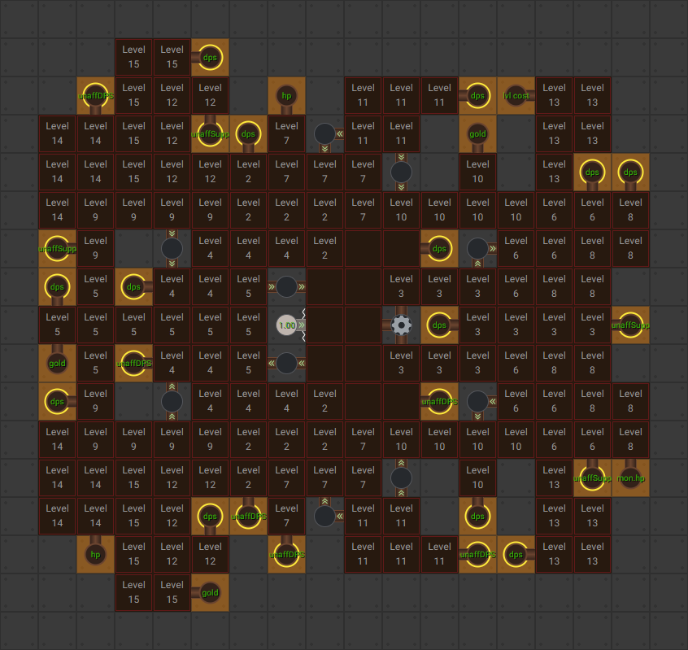
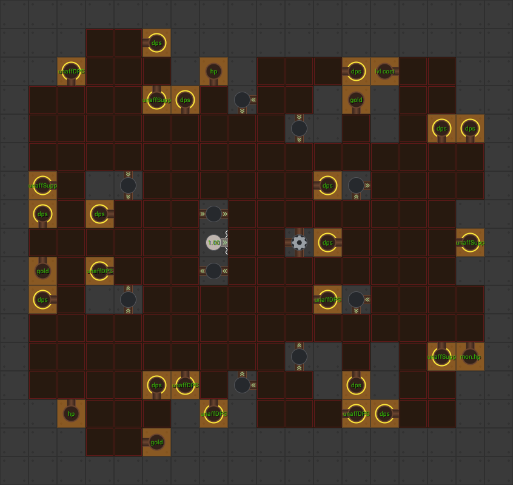

[Back to Main](index.md)

# Season 3

Season 2 will be ending on 1 March 2023 - and Season 3 is likely to start around 2-4 weeks later depending on CNE's schedule. Mid-to-late March is a safe guess.

The season 3 skins are currently dated 8 March 2023 - which means the season 3 preview could start at the same time the season 2 'cooling off' week ends. If that's the case then the ***speculative*** Season 3 start date will be 15 March 2023.


The champion changes and time gate cost reduction will all be going live on #DATEPREVIEW - while the actual Season 2 start date will be #DATEACTUAL.


# Theme

All five of Spurt Hew Maan Barrowin Birdsong and Turiel have now received "new" abilities in the data that suggest they are all part of season 3. Given that they are also all getting `Lawbringer` and `Ancient` skins on the same date just makes that far more likely.

It seems to be that this new season will be an Unaffiliated / Lawful themed season. This tracks with some of the "new" abilities and specialisations these champions are getting.

# Changes

The information below is raw data on the "new" abilities that the champions might be getting. Some may be complete reworks - some may look copy-paste from old abilities that haven't seen reworks yet (and might not get reworked).

Please do me a favour and don't get all melodramatic about what you find here. I - and CNE - don't appreciate it. These are spoilers and will almost certainly change before release - likely multiple times. Making assumptions on how the champions will turn out based on this information would be premature.

# Modron: Unaffiliated Core

This core is currently bugged - with nodes pointing the wrong way - and having the wrong numbers. It also appears to be missing some tiles and a node. Because of this it's not possible to tell how much damage it will be doing yet. I will update the pictures and data when/if they're fixed.

### Level 1

### Level 15

# Spurt

**You Dead!**
> Spurt tosses a wasp nest at a stalking giant, and then is immediately killed by a giant hammer, which damages all Enemies on screen. Spurt then comes back as a spirit, increasing the effects of his abilities until he revives.

<em>Raw Data</em>

<pre>
{
	"description": "Spurt tosses a wasp nest at a stalking giant, and then is immediately killed.",
	"long_description": "Spurt tosses a wasp nest at a stalking giant, and then is immediately killed by a giant hammer, which damages all Enemies on screen. Spurt then comes back as a spirit, increasing the effects of his abilities until he revives.",
	"damage_modifier": 0.03,
	"damage_types": ["ranged"],
	"graphic_id": 5454,
	"target": "all",
	"aoe_radius": 0,
	"tags": [
		"ranged",
		"ultimate"
	],
	"num_targets": 1,
	"animations": [{
		"powerup_after_jump": true,
		"damage_frame": 80,
		"effect_frames": {"jump_back": {
			"activate_on_animation_cancelled": true,
			"apply_to_hero": true,
			"effect_string": "effect_def,1429"
		}},
		"fade_back_in": true,
		"visual_effect_frames": {"-22": {
			"effect": "animated_clip",
			"scale": 1.15,
			"graphic_id": 5490
		}},
		"power_up_sequence": {
			"visual_effect_frames": {"19": {
				"projectile_details": {"projectile_graphic_id": 5476},
				"effect": "projectile",
				"offset_x": 1600,
				"projectile": "wasp_bag",
				"offset_y": -200
			}},
			"animation_sequence_name": "attack"
		},
		"jump_center": true,
		"require_targets_to_start": false,
		"refresh_damage_targets_at_hit": true,
		"type": "melee_attack"
	}],
	"name": "You Dead!",
	"cooldown": 120,
	"id": 605
}
</pre>

 

**Centipede Net** (Guess)
> Spurt increases the damage of adjacent Champions by 100%.
> 
> While in Spirit form:  
> - This effect is increased by 2% for each second of Spurt's maximum Ultimate cooldown, stacking multiplicatively.

<em>Raw Data</em>

<pre>
{
    "effect_keys": [{
        "off_when_benched": true,
        "effect_string": "hero_dps_multiplier_mult,100",
        "targets": ["adj"]
    }],
    "requirements": [],
    "description": {
        "pre": {"conditions": [
            {
                "condition": "upgrade_purchased 10682",
                "desc": "Spurt increases the damage of Champions two slots away by $amount%"
            },
            {"desc": "Spurt increases the damage of adjacent Champions by $amount%"}
        ]},
        "post": {"conditions": [{
            "condition": "spurt_is_spirit_v2",
            "desc": "^^({Spirit:}#99C7F7 This effect is increased by 2% for each second of Spurt's maximum Ultimate cooldown, stacking multiplicatively)"
        }]}
    },
    "id": 1426,
    "flavour_text": "",
    "graphic_id": 5448,
    "properties": []
}
</pre>

 

**Wa-spiration** (Guess)
> Spurt gains a stack of Wa-spiration every time he attacks. Every 2 Wa-spiration stacks, Spurt invents a random effect. Effects can stack up to 5 times each and persist until the area changes.
> 
> While in Spirit form:  
> - Wa-spiration stacks are gained when an adjacent Champion attacks and the base multipliers of the invented effects are increased by 100%.

<em>Raw Data</em>

<pre>
{
    "effect_keys": [{
        "wasp_scale": 1,
        "wasp_y_offset": -85,
        "wasp_y_offset_when_spirit": -110,
        "stacks_until_effect": 10,
        "min_wasp_speed": 3,
        "wasp_radius": 60,
        "effect_string": "spurt_waspiration_v2",
        "wasp_float_speed": 10,
        "max_effect_stacks": 5,
        "effects": [
            {
                "base_amount": 200,
                "effect_id": 1433,
                "buffed_amount": 400
            },
            {
                "base_amount": 200,
                "effect_id": 1434,
                "buffed_amount": 400
            },
            {
                "base_amount": 0.1,
                "effect_id": 1435,
                "buffed_amount": 0.2
            }
        ],
        "wasp_default_graphic": 18378,
        "max_wasp_speed": 6,
        "wasp_max_float_radius": 20
    }],
    "requirements": [],
    "description": {
        "pre": "Spurt gains a stack of Wa-spiration every time he attacks. Every $(stacks_until_effect) Wa-spiration stacks, Spurt invents a random effect. Effects can stack up to $(max_effect_stacks) times each and persist until the area changes.",
        "post": {"conditions": [{
            "condition": "not static_desc",
            "desc": "^^$(spurt_waspiration_v2_desc)"
        }]},
        "desc": {"conditions": [{
            "condition": "spurt_is_spirit_v2",
            "desc": "^^({Spirit:}#99C7F7 Wa-spiration stacks are gained when an adjacent Champion attacks and the base multipliers of the invented effects are increased by 100%)"
        }]}
    },
    "id": 1428,
    "flavour_text": "",
    "graphic_id": 5451,
    "properties": {
        "use_outgoing_description": true,
        "is_formation_ability": true,
        "show_incoming": false
    }
}
</pre>

 

**Spurt's Spirit** (Guess)
> Increases the damage of all Champions by `$amount%`.
> 
> While in Spirit form:  
> - Centipede Net: Buffed by 2% for each second of ultimate cooldown that Spurt has.
> - Wa-spiration: Stacks are gained every time an adjacent Champion attacks and the base multipliers of the invented effects are increased by 100%.
> - Pack Tactics: The base multiplier is increased by 100%

<em>Raw Data</em>

<pre>
{
	"effect_keys": [
		{
			"spurt_ult_attack_id": 605,
			"pack_tactics_buff_effect_id": 1431,
			"centipede_net_buff_effect_id": 1432,
			"effect_string": "spurt_spirit_v2",
			"centipede_net_upgrade_id": 10678,
			"seconds_left_on_ult_to_remove_spirit": 10,
			"spirit_graphic_id": 5477,
			"pack_tactics_upgrade_id": 10680
		},
		{"effect_string": "global_dps_multiplier_mult,400"},
		{
			"effect_string": "change_base_attack,201",
			"targets": ["self"]
		}
	],
	"requirements": [],
	"description": {"desc": "Increases the damage of all Champions by $amount%^^While in Spirit form:^Centipede Net: Buffed by 2% for each second of ultimate cooldown that Spurt has^Wa-spiration: Stacks are gained every time an adjacent Champion attacks and the base multipliers of the invented effects are increased by 100%^Pack Tactics: The base multiplier is increased by 100%"},
	"id": 1429,
	"flavour_text": "",
	"graphic_id": 0,
	"properties": {
		"use_outgoing_description": true,
		"is_formation_ability": true,
		"effect_name": "Spurt's Spirit",
		"show_incoming": false
	}
}
</pre>

 

**Pack Tactics** (Guess)
> Increases the damage of all Champions by 100% for every Kobold in the formation, including Spurt.
> 
> While in Spirit form:  
> - Base multiplier increased by 100%.

<em>Raw Data</em>

<pre>
{
    "effect_keys": [{
        "stack_title": "Kobolds in the formation",
        "stacks_multiply": true,
        "off_when_benched": true,
        "effect_string": "global_dps_mult_by_tag_mult,100,kobold"
    }],
    "requirements": [],
    "description": {
        "pre": {"conditions": [
            {
                "condition": "upgrade_purchased 10683",
                "desc": "Increases the damage of all Champions by $(not_buffed amount)% for every Kobold and Unaffiliated Non-Kobold in the formation, including Spurt."
            },
            {"desc": "Increases the damage of all Champions by $(not_buffed amount)% for every Kobold in the formation, including Spurt."}
        ]},
        "post": {"conditions": [{
            "condition": "spurt_is_spirit_v2",
            "desc": "^^({Spirit:}#99C7F7 Base multiplier increased by 100%)"
        }]}
    },
    "id": 1430,
    "flavour_text": "",
    "graphic_id": 5450,
    "properties": {
        "use_outgoing_description": true,
        "is_formation_ability": true,
        "show_incoming": false
    }
}
</pre>

 

**Kobold Family** (Guess)
> Increases the base multiplier of Pack Tactics by 100%.

<em>Raw Data</em>

<pre>
{
    "effect_keys": [{
        "data": {"amount": 200},
        "effect_string": "change_upgrade_data,10680"
    }],
    "requirements": [],
    "description": {"desc": "Increases the base multiplier of Pack Tactics by 100%."},
    "id": 1431,
    "flavour_text": "",
    "graphic_id": 0,
    "properties": []
}
</pre>

 

**Wa-spiration: Stingy** (Guess)
> Champions that attack with melee attacks deal 200% additional damage.

<em>Raw Data</em>

<pre>
{
    "effect_keys": [
        {
            "stacks_multiply": true,
            "off_when_benched": true,
            "effect_string": "hero_dps_multiplier_mult,200",
            "clear_stacks_on_deactivate": false,
            "max_stacks": 5,
            "targets": [{
                "attack": "melee",
                "type": "attack_type"
            }],
            "stacks_on_trigger": "will_manually_stack"
        },
        {
            "amount": 200,
            "stacks_multiply": true,
            "off_when_benched": true,
            "show_bonus": true,
            "effect_string": "show_in_spurt_outgoing",
            "clear_stacks_on_deactivate": false,
            "max_stacks": 5,
            "stacks_on_trigger": "will_manually_stack",
            "targets": [{
                "hero_ids": [
                    43,
                    132
                ],
                "type": "heroes"
            }]
        }
    ],
    "requirements": [],
    "description": {"desc": "Champions that attack with melee attacks deal $amount% additional damage"},
    "id": 1433,
    "flavour_text": "",
    "graphic_id": 5451,
    "properties": {
        "use_outgoing_description": false,
        "is_formation_ability": true,
        "show_in_owner_outgoing": true,
        "effect_name": "Wa-spiration: Stingy",
        "owner_use_outgoing_description": true
    }
}
</pre>

 

**Wa-spiration: Skunky** (Guess)
> Enemies that approach the party take an extra 200% damage.

<em>Raw Data</em>

<pre>
{
    "effect_keys": [
        {
            "stacks_multiply": true,
            "off_when_benched": true,
            "active_graphic_id": 2654,
            "effect_string": "increase_monster_damage_percent_to_party,200,80",
            "clear_stacks_on_deactivate": false,
            "max_stacks": 5,
            "stacks_on_trigger": "will_manually_stack"
        },
        {
            "amount": 200,
            "stacks_multiply": true,
            "off_when_benched": true,
            "show_bonus": true,
            "effect_string": "show_in_spurt_outgoing",
            "clear_stacks_on_deactivate": false,
            "max_stacks": 5,
            "stacks_on_trigger": "will_manually_stack",
            "targets": [{
                "hero_ids": [
                    43,
                    132
                ],
                "type": "heroes"
            }]
        }
    ],
    "requirements": [],
    "description": {"desc": "Enemies that approach the party take an extra $amount% damage"},
    "id": 1434,
    "flavour_text": "",
    "graphic_id": 5451,
    "properties": {
        "use_outgoing_description": true,
        "is_formation_ability": true,
        "show_in_owner_outgoing": true,
        "effect_name": "Wa-spiration: Skunky"
    }
}
</pre>

 

**Wa-spiration: Grubby** (Guess)
> All Champions' base attack cooldowns are reduced by 0.1 seconds.

<em>Raw Data</em>

<pre>
{
    "effect_keys": [
        {
            "off_when_benched": true,
            "effect_string": "reduce_attack_cooldown,0.1",
            "clear_stacks_on_deactivate": false,
            "max_stacks": 5,
            "stacks_on_trigger": "will_manually_stack"
        },
        {
            "amount": 0.1,
            "bonus_is_seconds": true,
            "off_when_benched": true,
            "show_bonus": true,
            "effect_string": "show_in_spurt_outgoing",
            "clear_stacks_on_deactivate": false,
            "max_stacks": 5,
            "stacks_on_trigger": "will_manually_stack",
            "total_bonus_amount_prefix": "-",
            "targets": [{
                "hero_ids": [
                    43,
                    132
                ],
                "type": "heroes"
            }]
        }
    ],
    "requirements": [],
    "description": {"desc": "All Champions' base attack cooldowns are reduced by $amount seconds"},
    "id": 1435,
    "flavour_text": "",
    "graphic_id": 5451,
    "properties": {
        "use_outgoing_description": true,
        "is_formation_ability": true,
        "show_in_owner_outgoing": true,
        "effect_name": "Wa-spiration: Grubby"
    }
}
</pre>

 

**Specialisation: Unknown** (Guess)
> Increases the effect of Pack Tactics by 400%.

<em>Raw Data</em>

<pre>
{
    "effect_keys": [{"effect_string": "buff_upgrade,400,10680"}],
    "requirements": [],
    "description": {"desc": "Increases the effect of Pack Tactics by $amount%"},
    "id": 1436,
    "flavour_text": "",
    "graphic_id": 0,
    "properties": {"is_formation_ability": true}
}
</pre>

 

**Specialisation: Unknown** (Guess)
> Centipede Net instead affects champions who are 2 formation slots away from Spurt and its effect is increased by 600%.

<em>Raw Data</em>

<pre>
{
    "effect_keys": [
        {
            "data": {"targets": [{
                "comparison": "=",
                "distance": 2,
                "type": "distance"
            }]},
            "effect_string": "change_upgrade_data,10678"
        },
        {"effect_string": "buff_upgrade,600,10678"}
    ],
    "requirements": [],
    "description": {"desc": "Centipede Net instead affects champions who are 2 formation slots away from Spurt and its effect is increased by $amount%"},
    "id": 1437,
    "flavour_text": "",
    "graphic_id": 0,
    "properties": {
        "is_formation_ability": true,
        "owner_use_outgoing_description": true
    }
}
</pre>

 

**Specialisation: Unknown** (Guess)
> Unaffiliated Non-Kobold Champions count as Kobolds for the purposes of Pack Tactics.

<em>Raw Data</em>

<pre>
{
    "effect_keys": [
        {
            "data": {
                "stack_title": "Kobolds and Unaffiliated Non-Kobolds in the formation",
                "tag": "kobold|unaffiliated"
            },
            "effect_string": "change_upgrade_data,10680"
        },
        {
            "stack_func": "per_hero",
            "dev_note": "this effect key is just for getting the number of champions targetted in the formation for the spec option post apply info",
            "effect_string": "do_nothing,0",
            "tag": "unaffiliated^!kobold"
        }
    ],
    "requirements": [],
    "description": {"desc": "Unaffiliated Non-Kobold Champions count as Kobolds for the purposes of Pack Tactics"},
    "id": 1438,
    "flavour_text": "",
    "graphic_id": 0,
    "properties": {
        "indexed_effect_properties": true,
        "is_formation_ability": true,
        "spec_option_post_apply_info": "Unaffiliated Non-Kobold Champions: $num_stacks___2",
        "default_bonus_index": 0,
        "owner_use_outgoing_description": true,
        "per_effect_index_bonuses": true
    }
}
</pre>

 

# Hew Maan

**Impressive Coatwork** (Guess)
> The effect of all Teamwork abilities are increased by 100%.

<em>Raw Data</em>

<pre>
{
    "effect_keys": [{
        "off_when_benched": true,
        "effect_string": "buff_upgrade,100,10648"
    }],
    "requirements": "",
    "description": {"desc": "The effect of all Teamwork abilities are increased by $(amount)%"},
    "id": 1447,
    "flavour_text": "",
    "graphic_id": 9769,
    "properties": {
        "is_formation_ability": true,
        "owner_use_outgoing_description": true
    }
}
</pre>

 

**Carefully Balanced**
> Increases the effect of Zrang's Teamwork ability by 5% for each Champion adjacent to the kobolds (stacks additively and then applied to Teamwork multiplicatively).

<em>Raw Data</em>

<pre>
{
    "effect_keys": [
        {
            "off_when_benched": true,
            "effect_string": "hewmaan_carefully_balanced,5"
        },
        {
            "manual_stacking": true,
            "stacks_are_bonus": false,
            "show_bonus": true,
            "effect_string": "buff_upgrade,0,10648,1"
        }
    ],
    "requirements": "",
    "description": {"desc": "Increases the effect of {Zrang's}#955d81 Teamwork ability by $(amount)% for each Champion adjacent to the kobolds (stacks additively and then applied to Teamwork multiplicatively)."},
    "id": 1446,
    "flavour_text": "",
    "graphic_id": 9764,
    "properties": {
        "indexed_effect_properties": true,
        "is_formation_ability": true,
        "default_bonus_index": 0,
        "owner_use_outgoing_description": true,
        "per_effect_index_bonuses": true
    }
}
</pre>

 

**Specialisation: Unknown** (Guess)
> The Hello, Fellow Humans ability now uses the number of Lawful Champions in the formation instead of Humans.

<em>Raw Data</em>

<pre>
{
    "effect_keys": [
        {
            "off_when_benched": true,
            "effect_string": "hewmaan_law_maan,0"
        },
        {
            "stack_func": "per_hero",
            "dev_note": "this effect key is just for getting the number of champions targetted in the formation for the spec option post apply info",
            "effect_string": "do_nothing,0",
            "tag": "lawful"
        }
    ],
    "requirements": "",
    "description": {
        "pre": "The Hello, Fellow Humans ability now uses the number of Lawful Champions in the formation instead of Humans.",
        "post": {"conditions": [{
            "condition": "not static_desc",
            "desc": "^^$(hewmaan_lawful_champions_count)"
        }]}
    },
    "id": 1404,
    "flavour_text": "",
    "graphic_id": 0,
    "properties": {
        "indexed_effect_properties": true,
        "is_formation_ability": true,
        "spec_option_post_apply_info": "Lawful Champions: $num_stacks___2",
        "default_bonus_index": 0,
        "owner_use_outgoing_description": true,
        "per_effect_index_bonuses": true
    }
}
</pre>

 

**Specialisation: Unknown** (Guess)
> The Hello, Fellow Humans ability now uses the most populous race in your formation instead of Humans.

<em>Raw Data</em>

<pre>
{
    "effect_keys": [
        {"effect_string": "hew_maan_did_we_say_humans_spec_post_apply_info"},
        {
            "off_when_benched": true,
            "effect_string": "hewmaan_did_we_say_humans,0"
        }
    ],
    "requirements": "",
    "description": {
        "pre": "The Hello, Fellow Humans ability now uses the most populous race in your formation instead of Humans.",
        "post": {"conditions": [{
            "condition": "not static_desc",
            "desc": "^^$(hewmaan_most_populous_race_and_count)"
        }]}
    },
    "id": 1403,
    "flavour_text": "",
    "graphic_id": 9768,
    "properties": {
        "is_formation_ability": true,
        "spec_option_post_apply_info": "$active_effect_key_handler_custom_spec_hint",
        "owner_use_outgoing_description": true
    }
}
</pre>

 

**Specialisation: Unknown** (Guess)
> The Hello, Fellow Humans ability now uses the number of unaffiliated Champions in the formation instead of Humans.

<em>Raw Data</em>

<pre>
{
    "effect_keys": [
        {
            "off_when_benched": true,
            "effect_string": "hewmaan_hello_fellow_mercenaries,0"
        },
        {
            "stack_func": "per_hero",
            "dev_note": "this effect key is just for getting the number of champions targetted in the formation for the spec option post apply info",
            "effect_string": "do_nothing,0",
            "tag": "unaffiliated"
        }
    ],
    "requirements": "",
    "description": {
        "pre": "The Hello, Fellow Humans ability now uses the number of unaffiliated Champions in the formation instead of Humans",
        "post": {"conditions": [{
            "condition": "not static_desc",
            "desc": "^^$(hewmaan_unaffiliated_champions_count)"
        }]}
    },
    "id": 1405,
    "flavour_text": "",
    "graphic_id": 0,
    "properties": {
        "indexed_effect_properties": true,
        "is_formation_ability": true,
        "spec_option_post_apply_info": "Unaffiliated Champions: $num_stacks___2",
        "default_bonus_index": 0,
        "owner_use_outgoing_description": true,
        "per_effect_index_bonuses": true
    }
}
</pre>

 

# Barrowin

**Might Hammer**
> Barrowin smashes the nearest enemy with her mighty warhammer.

<em>Raw Data</em>

<pre>
{
	"description": "Barrowin smashes the nearest enemy with her mighty warhammer.",
	"long_description": "",
	"damage_modifier": 1,
	"damage_types": ["melee"],
	"graphic_id": 0,
	"target": "front",
	"aoe_radius": 0,
	"tags": ["melee"],
	"num_targets": 1,
	"animations": [{
		"damage_frame": 6,
		"sound_frames": {"2": 199},
		"target_offset_x": -60,
		"type": "melee_attack"
	}],
	"name": "Might Hammer",
	"cooldown": 4.6,
	"id": 606
}
</pre>

 

**Holy Weapon**
> Barrowin infuses her hammer with holy energy and throws it at a random enemy, stunning it for 5 seconds. For the next 15 seconds, the base effect of Blessed Hammer is increased by 100%.

<em>Raw Data</em>

<pre>
{
    "description": "Barrowin infuses her hammer with holy energy, stunning a random enemy and buffing Blessed Hammer.",
    "long_description": "Barrowin infuses her hammer with holy energy and throws it at a random enemy, stunning it for 5 seconds. For the next 15 seconds, the base effect of Blessed Hammer is increased by 100%.",
    "damage_modifier": 0.03,
    "damage_types": ["ranged"],
    "graphic_id": 1872,
    "target": "random",
    "aoe_radius": 0,
    "tags": [
        "melee",
        "ultimate"
    ],
    "num_targets": 1,
    "animations": [{
        "effect_frames": {"projectile": {"effect_string": "barrowin_ultimate_action_v2"}},
        "hit_sound": 133,
        "blessed_hammer_buff_time": 15,
        "shoot_sound": 149,
        "stun_on_hit": 5,
        "projectile_graphic_id": 1,
        "blessed_hammer_bonus_amount": 100,
        "type": "ranged_attack",
        "projectile": "holy_weapon",
        "hold_shoot_frame": true,
        "shoot_frame": 28
    }],
    "name": "Holy Weapon",
    "cooldown": 360,
    "id": 607
}
</pre>

 

**Blessed Hammer** (Guess)
> Barrowin increases the damage of Champions behind her by `$(not_buffed amount)%` for each Champion in the formation who has an equal or higher base attack cooldown, stacking multiplicatively.

<em>Raw Data</em>

<pre>
{
    "effect_keys": [
        {
            "amount_updated_listeners": [
                "slot_changed",
                "attack_changed",
                "base_attack_cooldown_changed"
            ],
            "stacks_multiply": true,
            "off_when_benched": true,
            "show_bonus": true,
            "amount_func": "mult",
            "stack_func": "per_hero",
            "use_computed_amount_for_description": true,
            "effect_string": "hero_dps_multiplier_mult,400",
            "stack_func_data": {"target_filters": [{
                "comparison": ">=",
                "type": "attack_cooldown",
                "value": {"base_attack_cooldown_from_hero_id": 130}
            }]},
            "targets": ["behind"]
        },
        {
            "base_dps_buff_amount": 400,
            "dps_buff_effect_key_index": 0,
            "effect_string": "barrowin_blessed_hammer",
            "hammer_of_the_law_upg_id": 10691
        }
    ],
    "requirements": [],
    "description": {"desc": "Barrowin increases the damage of Champions behind her by $(not_buffed amount)% for each Champion in the formation who has an equal or higher base attack cooldown, stacking multiplicatively."},
    "id": 1439,
    "flavour_text": "",
    "graphic_id": 1867,
    "properties": {
        "is_formation_ability": true,
        "owner_use_outgoing_description": true
    }
}
</pre>

 

**Unknown**
> Barrowin has a number of Vigilance stacks equal to the number of Champions in the formation that are either lawful or dwarves. She increases the health of other Champions in the formation by 5% of her max health for each Vigilance stack.

<em>Raw Data</em>

<pre>
{
    "effect_keys": [{
        "amount_updated_listeners": [
            "max_health_changed",
            "slot_changed",
            "stacks_changed"
        ],
        "stacks_multiply": false,
        "total_title": "Bonus Health",
        "amount_func": "source_percent_health_add",
        "stack_func": "per_hero",
        "use_computed_amount_for_description": true,
        "effect_string": "increase_health_by_source_percent,5",
        "targets": ["other"],
        "stack_title": "Vigilance Stacks",
        "show_bonus": true,
        "percent_values": false,
        "stack_func_data": {"target_filters": [{
            "type": "tags",
            "tags": "lawful|dwarf"
        }]},
        "show_current_value_bonus_desc": false,
        "override_key_desc": "Increases the Health of $target by $amount",
        "round_bonus_value": true
    }],
    "requirements": [],
    "description": {"desc": "Barrowin has a number of Vigilance stacks equal to the number of Champions in the formation that are either lawful or dwarves. She increases the health of other Champions in the formation by $amount% of her max health for each Vigilance stack."},
    "id": 1440,
    "flavour_text": "",
    "graphic_id": 0,
    "properties": {"is_formation_ability": true}
}
</pre>

 

**Healing Word** (Guess)
> Barrowin heals Champions in her column, including herself, for `$(not_buffed amount)` health per second for each stack of Vigilance she has. After Barrowin attacks, her next Healing Word also applies a temporary health bonus of the same amount.

<em>Raw Data</em>

<pre>
{
    "effect_keys": [
        {
            "amount_updated_listeners": [
                "slot_changed",
                "stacks_changed"
            ],
            "stacks_multiply": false,
            "total_title": "Healing Per Second",
            "amount_func": "add",
            "stack_func": "per_hero",
            "use_computed_amount_for_description": true,
            "effect_string": "heal,2",
            "targets": ["col"],
            "stack_title": "Vigilance Stacks",
            "off_when_benched": true,
            "show_bonus": true,
            "percent_values": false,
            "stack_func_data": {"target_filters": [{
                "type": "tags",
                "tags": "lawful|dwarf"
            }]},
            "show_current_value_bonus_desc": false
        },
        {
            "heal_effect_key_index": 0,
            "off_when_benched": true,
            "effect_string": "barrowin_healing_word"
        }
    ],
    "requirements": [],
    "description": {"desc": "Barrowin heals Champions in her column, including herself, for $(not_buffed amount) health per second for each stack of Vigilance she has. After Barrowin attacks, her next Healing Word also applies a temporary health bonus of the same amount."},
    "id": 1441,
    "flavour_text": "",
    "graphic_id": 1868,
    "properties": {
        "indexed_effect_properties": true,
        "is_formation_ability": true,
        "default_bonus_index": 0,
        "owner_use_outgoing_description": true,
        "per_effect_index_bonuses": true
    }
}
</pre>

 

**Unknown**
> Barrowin attacks 0.25 seconds faster for each stack of Vigilance she has. Additionally, when a Champion that is eligible for Healing Word is hit by an Enemy, Barrowin attacks 1 second faster for her next two attacks.

<em>Raw Data</em>

<pre>
{
    "effect_keys": [
        {
            "amount_updated_listeners": [
                "slot_changed",
                "stacks_changed"
            ],
            "stacks_multiply": false,
            "bonus_is_seconds": true,
            "amount_func": "add",
            "stack_func": "per_hero",
            "effect_string": "reduce_attack_cooldown,0.25",
            "stack_title": "Vigilance Stacks",
            "off_when_benched": true,
            "show_bonus": true,
            "percent_values": false,
            "stack_func_data": {"target_filters": [{
                "type": "tags",
                "tags": "lawful|dwarf"
            }]},
            "show_current_value_bonus_desc": false,
            "total_bonus_amount_prefix": "-"
        },
        {
            "buff_attack_count": 2,
            "healing_word_heal_handler_index": 0,
            "effect_string": "barrowin_even_temper",
            "buff_effect_string": "reduce_attack_cooldown,1",
            "healing_word_upg_id": 10686
        }
    ],
    "requirements": [],
    "description": {"desc": "Barrowin attacks $amount seconds faster for each stack of Vigilance she has. Additionally, when a Champion that is eligible for Healing Word is hit by an Enemy, Barrowin attacks 1 second faster for her next two attacks."},
    "id": 1442,
    "flavour_text": "",
    "graphic_id": 4437,
    "properties": {
        "is_formation_ability": true,
        "owner_use_outgoing_description": true
    }
}
</pre>

 

**Specialisation: Unknown** (Guess)
> Barrowin remembers the largest number of enemies she's had to tank at once in the current area. Blessed Hammer is increased by 100% multiplied by that number.

<em>Raw Data</em>

<pre>
{
    "effect_keys": [
        {
            "stacks_multiply": false,
            "effect_string": "buff_upgrade,100,10684",
            "stacks_on_trigger": "will_manually_stack"
        },
        {
            "effect_string": "barrowin_hammer_time",
            "buff_effect_key_index": 0
        }
    ],
    "requirements": [],
    "description": {
        "post": {"conditions": [{
            "condition": "not static_desc",
            "desc": "^^$(barrowin_hammer_time_desc)"
        }]},
        "desc": "Barrowin remembers the largest number of enemies she's had to tank at once in the current area. Blessed Hammer is increased by $amount% multiplied by that number."
    },
    "id": 1443,
    "flavour_text": "",
    "graphic_id": 0,
    "properties": {
        "is_formation_ability": true,
        "owner_use_outgoing_description": true
    }
}
</pre>

 

**Specialisation: Unknown** (Guess)
> Barrowin's Blessed Hammer base effect is additively increased by 20% for each Vigilance stack she has.

<em>Raw Data</em>

<pre>
{
    "effect_keys": [{
        "off_when_benched": true,
        "amount_per_stack": 20,
        "effect_string": "barrowin_hammer_of_the_law",
        "count_hero_tag_expr": "lawful|dwarf"
    }],
    "requirements": [],
    "description": {"desc": "Barrowin's Blessed Hammer base effect is additively increased by $(amount_per_stack)% for each Vigilance stack she has."},
    "id": 1444,
    "flavour_text": "",
    "graphic_id": 0,
    "properties": {"owner_use_outgoing_description": true}
}
</pre>

 

**Specialisation: Unknown** (Guess)
> Barrowin's Blessed Hammer is buffed by 400%.

<em>Raw Data</em>

<pre>
{
    "effect_keys": [{"effect_string": "buff_upgrade,400,10684"}],
    "requirements": [],
    "description": {"desc": "Barrowin's Blessed Hammer is buffed by $amount%"},
    "id": 1450,
    "flavour_text": "",
    "graphic_id": 0,
    "properties": {"is_formation_ability": true}
},
</pre>

 

**Specialisation: Unknown** (Guess)
> Barrowin's Healing Word is buffed by 100%.

<em>Raw Data</em>

<pre>
{
    "effect_keys": [{"effect_string": "buff_upgrade,100,10686"}],
    "requirements": [],
    "description": {"desc": "Barrowin's Healing Word is buffed by $amount%"},
    "id": 1451,
    "flavour_text": "",
    "graphic_id": 0,
    "properties": {"is_formation_ability": true}
}
</pre>

 

# Birdsong

**Base Attack: Flashing Blades**
> Birdsong leaps out with a cat's grace and attacks the nearest enemies with her sword.

<em>Raw Data</em>

<pre>
{
    "description": "Birdsong leaps out with a cat's grace and attacks the nearest enemies with her sword.",
    "long_description": "",
    "damage_modifier": 1,
    "damage_types": ["melee"],
    "graphic_id": 0,
    "target": "front",
    "aoe_radius": 100,
    "tags": [
        "melee",
        "aoe"
    ],
    "num_targets": 1,
    "animations": [{
        "type": "melee_attack",
        "sequences": [{
            "damage_frame": 2,
            "hit_frames": [2],
            "sound_frames": {"2": 199},
            "target_offset_x": -60,
            "end_frame": 25,
            "start_frame": 0
        }],
        "animation": "split_sequence_multi_target"
    }],
    "name": "Flashing Blades",
    "cooldown": 4.6,
    "id": 609
}
</pre>

 

**Ultimate: Cat's Agility**
> Birdsong leaps from enemy to enemy 5 times, dealing damage and stunning them for 5 seconds. Enemies she attacks during her ultimate take 200% extra damage from all Champions for 15 seconds.

<em>Raw Data</em>

<pre>
{
    "description": "Birdsong leaps from enemy to enemy, dealing damage and stunning them.",
    "long_description": "Birdsong leaps from enemy to enemy 5 times, dealing damage and stunning them for 5 seconds. Enemies she attacks during her ultimate take 200% extra damage from all Champions for 15 seconds.",
    "damage_modifier": 0.0325,
    "damage_types": ["melee"],
    "graphic_id": 2125,
    "target": "random",
    "aoe_radius": 0,
    "tags": [
        "melee",
        "ultimate"
    ],
    "num_targets": 5,
    "animations": [{
        "shake_on_hit": 0.1,
        "target_offset_x": -80,
        "stun_on_hit": 5,
        "type": "melee_attack",
        "sequences": [{
            "damage_frame": 20,
            "hit_frames": [
                2,
                20
            ],
            "sound_frames": {
                "2": 199,
                "20": 199
            },
            "target_offset_x": -60,
            "end_frame": 27,
            "start_frame": 0,
            "effects_on_monsters": [{
                "for_time": 15,
                "active_graphic_y": -90,
                "active_graphic_id": 1,
                "effect_string": "increase_monster_damage,200"
            }]
        }],
        "stun_graphic": 1509,
        "animation": "split_sequence_multi_target"
    }],
    "name": "Cat's Agility",
    "cooldown": 180,
    "id": 611
}
</pre>

 

**Song of Battle** (Guess)
> Increases the damage of Champions within two slots of Birdsong by 100%, including Birdsong herself.

<em>Raw Data</em>

<pre>
{
    "effect_keys": [{
        "effect_string": "hero_dps_multiplier_mult,100",
        "targets": [{
            "comparison": "<=",
            "distance": 2,
            "type": "distance"
        }]
    }],
    "requirements": "",
    "description": {"desc": "Increases the damage of Champions within two slots of $(source_hero) by $(amount)%, including Birdsong herself."},
    "id": 1452,
    "flavour_text": "",
    "graphic_id": 2119,
    "properties": {"is_formation_ability": true}
}
</pre>

 

**Unknown**
> Increases the effect of `$(upgrade_name id)` by 100% for each positional formation ability affecting Birdsong that comes from a Champion who has no affiliation, stacking multiplicatively.

<em>Raw Data</em>

<pre>
{
    "effect_keys": [{
        "stack_title": "Positional Formation Abilities",
        "amount_updated_listeners": [
            "slot_changed",
            "positional_formation_ability_changed"
        ],
        "show_bonus": true,
        "amount_func": "mult",
        "stack_func": "per_positional_formation_ability",
        "effect_string": "buff_upgrade,100,10774",
        "stack_func_data": {
            "exclude_self": true,
            "tag": "unaffiliated"
        }
    }],
    "requirements": "",
    "description": {"desc": "Increases the effect of $(upgrade_name id) by $(amount)% for each positional formation ability affecting $(source_hero) that comes from a Champion who has no affiliation, stacking multiplicatively."},
    "id": 1453,
    "flavour_text": "",
    "graphic_id": 0,
    "properties": {
        "is_formation_ability": true,
        "owner_use_outgoing_description": true
    }
}
</pre>

 

**Unknown**
> Increases the effect of `$(upgrade_name id___2)` by 100% whenever any Champion affected by `$(upgrade_name id___2)` gets the killing blow on an enemy. This effect can stack up to 10 times, once for each kill. Stacks multiplicatively. Stacks are reset when changing areas.

<em>Raw Data</em>

<pre>
{
    "effect_keys": [
        {"effect_string": "pre_stack_amount,100"},
        {
            "amount_expr": "upgrade_amount(10776,0)",
            "stacks_multiply": true,
            "show_bonus": true,
            "effect_string": "buff_upgrade,0,10774",
            "more_triggers": [
                {
                    "action": {"type": "reset"},
                    "trigger": "area_changed"
                },
                {
                    "action": {"type": "add_stacks"},
                    "trigger": "on_broadcast_stacks,crescendo_trigger"
                }
            ],
            "max_stacks": 10,
            "stacks_on_trigger": "killed_by_hero_affected_by_upgrade,10774"
        }
    ],
    "requirements": "",
    "description": {"desc": "Increases the effect of $(upgrade_name id___2) by $(amount)% whenever any Champion affected by $(upgrade_name id___2) gets the killing blow on an enemy. This effect can stack up to $(max_stacks___2) times, once for each kill. Stacks multiplicatively. Stacks are reset when changing areas."},
    "id": 1454,
    "flavour_text": "",
    "graphic_id": 0,
    "properties": {
        "indexed_effect_properties": true,
        "is_formation_ability": true,
        "default_bonus_index": 0,
        "owner_use_outgoing_description": true,
        "per_effect_index_bonuses": true
    }
}
</pre>

 

**Impressive Bladework** (Guess)
> When Birdsong attacks she makes one bonus attack against a random boss enemy, dealing 5s of BUD-based damage.

<em>Raw Data</em>

<pre>
{
    "effect_keys": [{
        "attack_id": 610,
        "effect_string": "birdsong_impressive_bladework,5"
    }],
    "requirements": "",
    "description": {"desc": "When $(source_hero) attacks she makes one bonus attack against a random boss enemy, dealing $(seconds_plural amount) of BUD-based damage."},
    "id": 1455,
    "flavour_text": "",
    "graphic_id": 2118,
    "properties": {
        "is_formation_ability": true,
        "owner_use_outgoing_description": true
    }
}
</pre>

 

**Specialisation: Theme of Valor** (Guess)
> Increases the effect of `$(upgrade_name upgrade_id)` on Good Champions by 400%.

<em>Raw Data</em>

<pre>
{
    "effect_keys": [{
        "effect_string": "buff_effects_from_upgrade_fa,400,10774",
        "targets": [{
            "type": "by_tags",
            "tags": "good"
        }]
    }],
    "requirements": "",
    "description": {"desc": "Increases the effect of $(upgrade_name upgrade_id) on Good Champions by $(amount)%."},
    "id": 1456,
    "flavour_text": "",
    "graphic_id": 0,
    "properties": {
        "is_formation_ability": true,
        "owner_use_outgoing_description": true,
        "type": "upgrade",
        "formation_circle_icon": false
    }
}
</pre>

 

**Specialisation: Theme of Consideration** (Guess)
> Increases the effect of `$(upgrade_name upgrade_id)` on Neutral (Good/Evil axis) Champions by 400%.

<em>Raw Data</em>

<pre>
{
    "effect_keys": [{
        "effect_string": "buff_effects_from_upgrade_fa,400,10774",
        "targets": [{
            "type": "by_tags",
            "tags": "geneutral"
        }]
    }],
    "requirements": "",
    "description": {"desc": "Increases the effect of $(upgrade_name upgrade_id) on Neutral (Good/Evil axis) Champions by $(amount)%."},
    "id": 1457,
    "flavour_text": "",
    "graphic_id": 0,
    "properties": {
        "is_formation_ability": true,
        "owner_use_outgoing_description": true,
        "type": "upgrade",
        "formation_circle_icon": false
    }
}
</pre>

 

**Specialisation: Theme of Deception** (Guess)
> Increases the effect of `$(upgrade_name upgrade_id)` on Evil Champions by 400%.

<em>Raw Data</em>

<pre>
{
    "effect_keys": [{
        "effect_string": "buff_effects_from_upgrade_fa,400,10774",
        "targets": [{
            "type": "by_tags",
            "tags": "evil"
        }]
    }],
    "requirements": "",
    "description": {"desc": "Increases the effect of $(upgrade_name upgrade_id) on Evil Champions by $(amount)%."},
    "id": 1458,
    "flavour_text": "",
    "graphic_id": 0,
    "properties": {
        "is_formation_ability": true,
        "owner_use_outgoing_description": true,
        "type": "upgrade",
        "formation_circle_icon": false
    }
}
</pre>

 

**Specialisation: Unknown**
> Birdsong starts each area with Crescendo stacks equal to the number of Lawful Champions in the formation.

<em>Raw Data</em>

<pre>
{
    "effect_keys": [
        {
            "stack_func": "per_hero",
            "effect_string": "counter",
            "show_stacks": true,
            "tag": "lawful"
        },
        {"effect_string": "broadcast_stacks_trigger,0,crescendo_trigger,post_area_changed"}
    ],
    "requirements": "",
    "description": {"desc": "$(source_hero) starts each area with Crescendo stacks equal to the number of Lawful Champions in the formation."},
    "id": 1459,
    "flavour_text": "",
    "graphic_id": 0,
    "properties": {
        "indexed_effect_properties": true,
        "is_formation_ability": true,
        "spec_option_post_apply_info": "Lawful Champions: $num_stacks",
        "owner_use_outgoing_description": true,
        "type": "upgrade",
        "formation_circle_icon": false,
        "per_effect_index_bonuses": true
    }
}
</pre>

 

**Specialisation: Unknown**
> Birdsong starts each area with Crescendo stacks equal to the number of Female Champions in the formation.

<em>Raw Data</em>

<pre>
{
    "effect_keys": [
        {
            "stack_func": "per_hero",
            "effect_string": "counter",
            "show_stacks": true,
            "tag": "female"
        },
        {"effect_string": "broadcast_stacks_trigger,0,crescendo_trigger,post_area_changed"}
    ],
    "requirements": "",
    "description": {"desc": "$(source_hero) starts each area with Crescendo stacks equal to the number of Female Champions in the formation."},
    "id": 1460,
    "flavour_text": "",
    "graphic_id": 0,
    "properties": {
        "indexed_effect_properties": true,
        "is_formation_ability": true,
        "spec_option_post_apply_info": "Female Champions: $num_stacks",
        "owner_use_outgoing_description": true,
        "type": "upgrade",
        "formation_circle_icon": false,
        "per_effect_index_bonuses": true
    }
}
</pre>

 

**Specialisation: Unknown**
> Birdsong starts each area with Crescendo stacks equal to the number of Bard Champions in the formation.

<em>Raw Data</em>

<pre>
{
    "effect_keys": [
        {
            "stack_func": "per_hero",
            "effect_string": "counter",
            "show_stacks": true,
            "tag": "bard"
        },
        {"effect_string": "broadcast_stacks_trigger,0,crescendo_trigger,post_area_changed"}
    ],
    "requirements": "",
    "description": {"desc": "$(source_hero) starts each area with Crescendo stacks equal to the number of Bard Champions in the formation."},
    "id": 1461,
    "flavour_text": "",
    "graphic_id": 0,
    "properties": {
        "indexed_effect_properties": true,
        "is_formation_ability": true,
        "spec_option_post_apply_info": "Bard Champions: $num_stacks",
        "owner_use_outgoing_description": true,
        "type": "upgrade",
        "formation_circle_icon": false,
        "per_effect_index_bonuses": true
    }
}
</pre>

 

# Turiel

**Embodiment of the Law**
> Turiel increases the damage of all Champions by 100% for each column they are behind him, stacking multiplicatively.

<em>Raw Data</em>

<pre>
{
    "effect_keys": [{
        "off_when_benched": true,
        "effect_string": "hero_dps_mult_per_col_behind,100",
        "targets": ["behind"]
    }],
    "requirements": [],
    "description": {"desc": "Turiel increases the damage of all Champions by 100% for each column they are behind him, stacking multiplicatively."},
    "id": 1407,
    "flavour_text": "",
    "graphic_id": 6274,
    "properties": {
        "is_formation_ability": true,
        "default_bonus_index": 0,
        "per_effect_index_bonuses": true
    }
}
</pre>

 

**Order's Demand**
> When an enemy attempts to attack Turiel, they instead attack a different valid target, if one is available. When this occurs, Turiel increases the effect of Embodiment of the Law by 30%, stacking multiplicatively up to 30 times and resetting stacks when changing areas.

<em>Raw Data</em>

<pre>
{
    "effect_keys": [
        {
            "stacks_multiply": true,
            "show_bonus": true,
            "effect_string": "buff_upgrade,30,10657",
            "max_stacks": 30,
            "stacks_on_trigger": "will_stack_manually"
        },
        {
            "overlay_lower_id": 6236,
            "overlay_upper_id": 6235,
            "effect_string": "orders_demand_v2",
            "embodiment_buff_effect_key_index": 0,
            "overlay_offset": -80
        }
    ],
    "requirements": [],
    "description": {"desc": "When an enemy attempts to attack Turiel, they instead attack a different valid target, if one is available. When this occurs, Turiel increases the effect of Embodiment of the Law by $amount%, stacking multiplicatively up to 30 times and resetting stacks when changing areas."},
    "id": 1408,
    "flavour_text": "",
    "graphic_id": 6275,
    "properties": {
        "indexed_effect_properties": true,
        "use_outgoing_description": true,
        "is_formation_ability": true,
        "default_bonus_index": 0,
        "per_effect_index_bonuses": true
    }
}
</pre>

 

**Unflinching Hatred**
> Fiends are Turiel's Favored Foe. After attacking a fiend-type enemy, Embodiment of the Law is increased by `$amount%`. When Order's Demand redirects the attack of a fiend-type enemy, its effect is increased by `$amount%` as well. Both effects last until you change areas.

<em>Raw Data</em>

<pre>
{
    "effect_keys": [
        {
            "embodiment_buff_key_index": 1,
            "orders_demand_buff_key_index": 2,
            "effect_string": "unflinching_hatred_v2,400",
            "tag": "fiend"
        },
        {
            "amount_expr": "upgrade_amount(10660,0)",
            "effect_string": "buff_upgrade,0,10657",
            "apply_manually": true
        },
        {
            "amount_expr": "upgrade_amount(10660,0)",
            "effect_string": "buff_upgrade,0,10659",
            "apply_manually": true
        },
        {
            "effect_string": "favored_foe,fiend",
            "apply_manually": true
        }
    ],
    "requirements": [],
    "description": {
        "pre": "Fiends are Turiel's Favored Foe. After attacking a fiend-type enemy, Embodiment of the Law is increased by $amount%. When Order's Demand redirects the attack of a fiend-type enemy, its effect is increased by $amount% as well. Both effects last until you change areas.",
        "post": {"conditions": [{
            "condition": "not static_desc",
            "desc": "^^$(unflinching_hatred_v2_desc)"
        }]}
    },
    "id": 1409,
    "flavour_text": "",
    "graphic_id": 6276,
    "properties": {
        "indexed_effect_properties": true,
        "use_outgoing_description": true,
        "is_formation_ability": true,
        "default_bonus_index": 0,
        "per_effect_index_bonuses": true
    }
}
</pre>

 

**March of the Rakshasa** (Guess)
> Turiel has a keen eye for deception; 20% of non-boss enemies that spawn are actually duplicitous Rakshasa, fiend enemies who have shape-shifted into other forms. These enemies count as fiends (in addition to their original enemy type) for the purpose of Favored Foe mechanics and Turiel's Unflinching Hatred.

<em>Raw Data</em>

<pre>
{
    "effect_keys": [{
        "rakshasa_monster_graphics": [
            18375,
            18376,
            18377
        ],
        "rakshasa_graphic_offset": {
            "x": 0,
            "y": 0
        },
        "filter_targets_by_tags": "!boss^!static",
        "debuff_effects": [{
            "active_graphic_y": -60,
            "active_graphic_id": 18402,
            "effect_string": "turiel_march_of_the_rakshasa_debuff",
            "tags": ["fiend"]
        }],
        "off_when_benched": true,
        "effect_string": "turiel_march_of_the_rakshasa,20",
        "rakshasa_get_hit_seq": 3,
        "rakshasa_fade_time": 0.5
    }],
    "requirements": [],
    "description": {"desc": "Turiel has a keen eye for deception; $amount% of non-boss enemies that spawn are actually duplicitous Rakshasa, fiend enemies who have shape-shifted into other forms. These enemies count as fiends (in addition to their original enemy type) for the purpose of Favored Foe mechanics and Turiel's Unflinching Hatred."},
    "id": 1413,
    "flavour_text": "",
    "graphic_id": 0,
    "properties": {
        "is_formation_ability": true,
        "owner_use_outgoing_description": true
    }
}
</pre>

 

**Specialisation: A Lawful Mission** (Guess)
> Increases the effect of Embodiment of the Law by 200% for each Lawful Champion in the formation.

<em>Raw Data</em>

<pre>
{
    "effect_keys": [{"effect_string": "buff_upgrade_per_any_tagged_crusader_mult,200,10657,lawful"}],
    "requirements": [],
    "description": {"desc": "Increases the effect of Embodiment of the Law by $amount% for each Lawful Champion in the formation"},
    "id": 1410,
    "flavour_text": "",
    "graphic_id": 6274,
    "properties": {
        "use_outgoing_description": true,
        "is_formation_ability": true,
        "spec_option_post_apply_info": "Champions in Formation Targeted: $num_stacks",
        "show_incoming": false,
        "use_outgoing_multiplier": false
    }
}
</pre>

 

**Specialisation: Hearty Constitution** (Guess)
> All Champions deal bonus damage based on their individual CON scores (+400% per point of CON above 10, stacking multiplicatively).

<em>Raw Data</em>

<pre>
{
    "effect_keys": [{
        "off_when_benched": true,
        "use_computed_amount_for_description": true,
        "effect_string": "hero_dps_multiplier_by_stat_diff,400,con,10",
        "zero_if_diff_is_less_than_or_equal_to_0": true,
        "targets": ["all"],
        "override_key_desc": "Increases the damage of $target by $amount%"
    }],
    "requirements": [],
    "description": {"desc": "All Champions deal bonus damage based on their individual CON scores ($amount% per point of CON above $optional_min_stat, stacking multiplicatively)."},
    "id": 1415,
    "flavour_text": "",
    "graphic_id": 0,
    "properties": {
        "is_formation_ability": true,
        "effect_name": "Voice of Resilience"
    }
}
</pre>

 

**Specialisation: Unknown** (Guess)
> All Champions deal bonus damage based on their individual CHA scores (+400% per point of CHA above 10, stacking multiplicatively).

<em>Raw Data</em>

<pre>
{
    "effect_keys": [{
        "off_when_benched": true,
        "use_computed_amount_for_description": true,
        "effect_string": "hero_dps_multiplier_by_stat_diff,400,cha,10",
        "zero_if_diff_is_less_than_or_equal_to_0": true,
        "targets": ["all"],
        "override_key_desc": "Increases the damage of $target by $amount%"
    }],
    "requirements": [],
    "description": {"desc": "All Champions deal bonus damage based on their individual CHA scores ($amount% per point of CHA above $optional_min_stat, stacking multiplicatively)."},
    "id": 1416,
    "flavour_text": "",
    "graphic_id": 0,
    "properties": {
        "is_formation_ability": true,
        "effect_name": "Voice of Authority"
    }
}
</pre>

 



# Champion

**Unknown**
> Unknown effect.

<em>Raw Data</em>

<pre>
</pre>

 


[Back to Top](#top)

*Last Modified: {{ site.time }}*