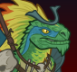
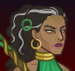

[Back to Main](index.md)

# Index

* [Season 6](#season-6)
* [Theme](#theme)
* [Changes](#changes)
* [Dungeon Master](#dungeon-master)
* [Korth](#korth)
* [Nrakk](#nrakk)
* [Sisaspia](#sisaspia)
* [Warden](#warden)
* [Zorbu](#zorbu)
 

# Season 6

Season 6 is guesstimated to start on 15 November 2023 with the preview week (and the data changes) arriving one week prior on 08 November 2023.

# Theme

We believe the six seasonal champions this time around are likely to be Dungeon Master, Korth, Nrakk, Sisaspia, Warden and Zorbu.

# Changes

Only abilities that have seen some changes will be displayed here - and be aware that there's a lot of guesswork involved. Some abilities may not have names - or specialisations might not be marked as such - etc..

Please do me a favour and don't get all melodramatic about what you find here. I - and CNE - don't appreciate it. These are spoilers and will almost certainly change before release - likely multiple times. Making assumptions on how the champions will turn out based on this information would be premature.

# Dungeon Master

No changes as of yet.

# Korth

No changes as of yet.

# Nrakk

No changes as of yet.

# Sisaspia

No changes as of yet.

# Warden

No changes as of yet.

# Zorbu

No changes as of yet.

[Back to Top](#top)

*Last Modified: {{ site.time }}*