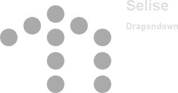

[Back to Main](index.md)

# Index

* [Season 7](#season-7)
* [Theme](#theme)
* [Changes](#changes)
* [Shaka](#shaka)
* [Selise](#selise)
* [D'hani](#d'hani)
 

# Season 7

Season 7 is guesstimated to start on 17 January 2024.

# Theme

We only have data for three seasonal champions so far. They are Shaka, Selise and D'hani. The rest are as yet unknown.

# Changes

Only abilities that have seen some changes will be displayed here - and be aware that there's a lot of guesswork involved. Some abilities may not have names - some may have the *wrong* names - or specialisations might not be marked as such - etc.. Focus on the effect data itself.

Please do me a favour and don't get all melodramatic about what you find here. I - and CNE - don't appreciate it. These are spoilers and will almost certainly change before release - likely multiple times. That and we don't have access to any upgrade data prior to release. Making assumptions on how the champions will turn out based on this information would be premature.

# Shaka

 [formation]
    
        
    

**Unknown** (Guess)
> Shaka attempts to solve a celestial puzzle with the potential for great rewards. Four random slots in the formation are assigned a random tag. For each Champion in those slots that match the slot's tag, Shaka increases the damage of all Champions by 400%, stacking multiplicatively. A fifth slot is chosen but remains locked with an unknown tag until a specialization is chosen.

ⓘ *Note: This ability might be prestack.*

<em>Raw Data</em>

<pre>
{
    "effect_keys": [{"effect_string": "pre_stack_amount,400"}],
    "requirements": "",
    "description": {"desc": "Shaka attempts to solve a celestial puzzle with the potential for great rewards. Four random slots in the formation are assigned a random tag. For each Champion in those slots that match the slot's tag, Shaka increases the damage of all Champions by $(amount)%, stacking multiplicatively. A fifth slot is chosen but remains locked with an unknown tag until a specialization is chosen."},
    "id": 1784,
    "flavour_text": "",
    "graphic_id": 10368,
    "properties": {
        "indexed_effect_properties": true,
        "use_outgoing_description": true,
        "is_formation_ability": true,
        "default_bonus_index": 1,
        "per_effect_index_bonuses": true
    }
}
</pre>

**Celestial Resistance** (Guess)
> Shaka adds $(amount___3) temporary health to the entire party when changing areas, and refreshes them every 10 seconds. The amount of hit points is increased by 25% for each A Celestial Puzzle slot that is filled properly, stacking additively.
>  
> - Total Temporary Health: 10.

<em>Raw Data</em>

<pre>
{
    "effect_keys": [
        {
            "off_when_benched": true,
            "effect_string": "grant_all_instant_temporary_hp,10",
            "on_trigger": "on_broadcast_trigger,celestial_resistance_trigger",
            "targets": ["all"]
        },
        {
            "amount_updated_listeners": ["slot_changed"],
            "has_effect_key": "shaka_puzzle_match",
            "show_bonus": true,
            "amount_func": "add",
            "stack_func": "per_slot",
            "effect_string": "buff_upgrade,25,13417,0"
        },
        {
            "effect_string": "do_nothing,10",
            "comment": "This effect key is just so we have a base amount for the description. Things that buff celestial resistance should also buff this key."
        },
        {"effect_string": "broadcast_on_trigger,celestial_resistance_trigger,area_changed"},
        {
            "trigger_name": "on_timer",
            "effect_string": "broadcast_on_trigger,celestial_resistance_trigger",
            "trigger_params": ["10"]
        }
    ],
    "requirements": "",
    "description": {
        "post": {"conditions": [{
            "condition": "not static_desc",
            "desc": "^^Total Temporary Health: $(amount)"
        }]},
        "desc": "Shaka adds $(amount___3) temporary health to the entire party when changing areas, and refreshes them every 10 seconds. The amount of hit points is increased by $(not_buffed amount___2)% for each A Celestial Puzzle slot that is filled properly, stacking additively."
    },
    "id": 1785,
    "flavour_text": "",
    "graphic_id": 10355,
    "properties": {
        "indexed_effect_properties": true,
        "use_outgoing_description": true,
        "is_formation_ability": true,
        "default_bonus_index": 0,
        "per_effect_index_bonuses": true
    }
}
</pre>

**Feast or Famine** (Guess)
> Shaka increases the base effect of A Celestial Puzzle by 20% for each puzzle slot he's adjacent to, stacking multiplicatively.

<em>Raw Data</em>

<pre>
{
    "effect_keys": [{
        "amount_updated_listeners": ["slot_changed"],
        "has_effect_key": "shaka_puzzle",
        "show_bonus": true,
        "amount_func": "mult",
        "stack_func": "per_slot",
        "effect_string": "buff_upgrade,20,13416",
        "target": "adj"
    }],
    "requirements": "",
    "description": {"desc": "Shaka increases the base effect of A Celestial Puzzle by $(not_buffed amount)% for each puzzle slot he's adjacent to, stacking multiplicatively."},
    "id": 1786,
    "flavour_text": "",
    "graphic_id": 0,
    "properties": []
}
</pre>

**Riddling Rivals** (Guess)
> The base effect of A Celestial Puzzle is increased by $(not_buffed amount)% for each other Rivals of Waterdeep Champion in the formation, stacking multiplicatively.

<em>Raw Data</em>

<pre>
{
    "effect_keys": [],
    "requirements": "",
    "description": {"desc": "The base effect of A Celestial Puzzle is increased by $(not_buffed amount)% for each other Rivals of Waterdeep Champion in the formation, stacking multiplicatively."},
    "id": 1787,
    "flavour_text": "",
    "graphic_id": 0,
    "properties": []
}
</pre>

**Child's Play** (Guess)
> 

<em>Raw Data</em>

<pre>
{
    "effect_keys": [],
    "requirements": "",
    "description": {"desc": ""},
    "id": 1788,
    "flavour_text": "",
    "graphic_id": 0,
    "properties": []
}
</pre>

**Pen and Paper** (Guess)
> 

<em>Raw Data</em>

<pre>
{
    "effect_keys": [],
    "requirements": "",
    "description": {"desc": ""},
    "id": 1789,
    "flavour_text": "",
    "graphic_id": 0,
    "properties": []
}
</pre>

**Sunday Edition** (Guess)
> 

<em>Raw Data</em>

<pre>
{
    "effect_keys": [],
    "requirements": "",
    "description": {"desc": ""},
    "id": 1790,
    "flavour_text": "",
    "graphic_id": 0,
    "properties": []
}
</pre>

**Brain Break** (Guess)
> 

<em>Raw Data</em>

<pre>
{
    "effect_keys": [],
    "requirements": "",
    "description": {"desc": ""},
    "id": 1791,
    "flavour_text": "",
    "graphic_id": 0,
    "properties": []
}
</pre>

**Unknown** (Guess)
> Increases the effect of Celestial Resistance by 70%.

<em>Raw Data</em>

<pre>
{
    "effect_keys": [
        {"effect_string": "buff_upgrade,70,13417,1"},
        {
            "show_description": false,
            "effect_string": "buff_upgrade,70,13417,3"
        }
    ],
    "requirements": "",
    "description": {"desc": "Increases the effect of Celestial Resistance by $amount%"},
    "id": 1799,
    "flavour_text": "",
    "graphic_id": 0,
    "properties": []
}
</pre>

# Selise

 [formation]
    
        
    

No changes as of yet.

# D'hani

 [formation]
    
        
    

No changes as of yet.

[Back to Top](#top)

*Last Modified: {{ site.time }}*