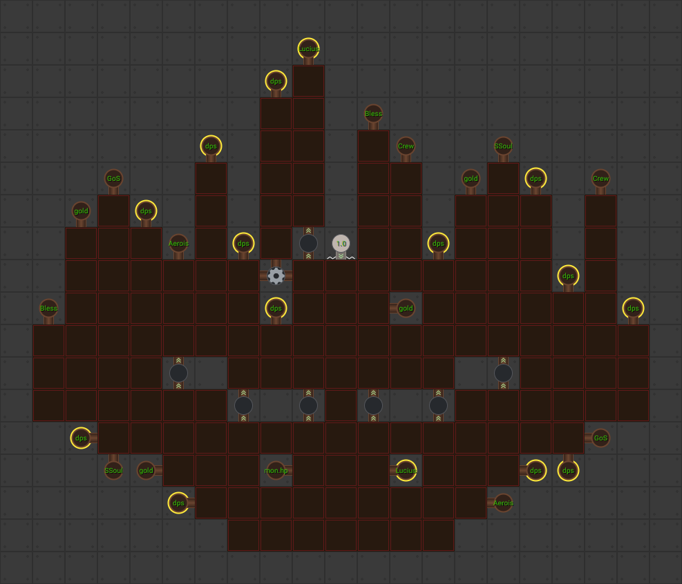

# Seasons
Seasons are a thing that was apparently in their previous game - the name of which escapes me at the moment. I personally know very little about this feature other than it comes with a few other things. Though we do have the Seasons FAQ for you to browse through.

## General Information
The seasons mostly seems to be about completing quests - kind of like Patron chores - to progress through Season Tiers. I believe each tier will have different rewards - including a Season Currency. You can then use that Season Currency to purchase other things.

Because this game is run by a business - of course they've implemented some monetisation for it.

Season Pass: (Cost: $9.99)
> Unlock exclusive rewards in the current Season by purchasing the Season Pass!

Season Boost: (Cost: $4.99)
> Grants enough XP to unlock the next rewards tier in the current Season, along with the appropriate favor and 10,000 Season currency!

## Aerois Changes and Modron Core
As you'll probably discover if you read the seasons FAQ below - each season seems to be built around a certain theme. The theme of the first season is the Heroes of Aerois affiliation.

### Aerois Rework
There are more changes here than I care to go into - but here are the key points.

#### Aerois Synergy Buff
This is the primary source for the reworks in most of the Aerois champions. It's getting modified to be easier to buff for each Aerois champion.

#### Nova Nerf
Nova's `Discovery` ability - the one that makes her as good as she is (because it's multiplicative) - is getting replaced by a new ability `The Crew` - that is entirely additive. So she will very likely be considerably worse than she is now. Probably even Dismantle worthy.

The Crew
> Nova increases the damage of Champions within two slots by 0.1% for each Champion level on the affected Champions, stacking additively. Each Champion's contribution caps at 1000 levels after their last available upgrade.

And there will be a specialisation for it.
> The Crew now applies to all Champions within 3 slots, but the extra Champions are only counted towards its levels total at 50% effectiveness.

#### Misc
The rest of the Aerois champions will be getting some minor tweaks that shouldn't impact them *too* much. Though Aila's shielding may be seeing a nerf too.

#### Modron Core
The Aerois Core will be arriving with the seasons as well - and frankly - I don't know why anyone would bother with it. It's only going to be useful for when you run an entire Aerois team - and will probably still be eclipsed by the Magic Core.

There are only two good things I can think of about this modron core.
1. It starts with the Automation node at level 1 - which is a big deal. This means people don't need to get the Strong core to automate all their background parties.
2. It makes the Infinite Cosmic Power achievement possible.

Anyway - here is the general layout of the core.

As you can see - it's coming with some of it's own unique nodes too.
* Lucis: Increase the damage of Lucius
* Aerois: Buff the effect of all Aerois Synergy abilities
* The Crew: Buff the effect of Nova's The Crew ability
* Storm Soul: Buff the effect of Aila's Storm Soul ability
* Bless: Buff the effect of Qillek's Bless ability
* Guardian of Solwyn: Buff the effect of Sentry's Guardian of Solwyn ability

It also suffers from the same problem the Magic core does. It has no HP nodes.

## FAQ

### What are Seasons?
> Seasons are temporary events that run for roughly 10 weeks. During a Season you can complete daily, weekly, and Season-long quests, increase your Season level, and purchase Season Rewards from the Season Shop. Seasons have a wide variety of rewards for players of all levels, including exclusive skins, feats, and even modron cores!
>
> Each season focuses on a group of five existing Champions. The chosen Champions receive (potentially major) balance changes at the start of the Season, and the rewards for the season are focused on those five Champions.

### What can I earn during Seasons?
> Season rewards include basic items like potions, chests, and contracts, but also include unique items such as skins, feats, and even a modron core. There are also exclusive one-time item level boosts for the Season Champions, meaning those Season Champions will come out of the Season with a significant amount of power!
>
> There is also a Season-long Buff that gets more powerful as you level up your Season level or buy rewards, and focuses on buffing the season Champions. If a Season has a modron core as a reward, the core's outputs will usually mimic some of the Champion-specific power gained from the Season Buff.
>
> At the end of the Season you can convert your Season favor into favor for ALL of your permanent campaigns deities. It's like a super event in that respect, so even if the other rewards don't get you excited, there's still something useful to farm for.

### Do I need to buy a Season Pass to participate?
> A Season pass is not required to participate in the Season system, though many of the more exclusive rewards (which would normally be included in DLC packs) require it. You can complete Season quests, claim many rewards, and convert your Season favor when the Season ends all without a Season pass.

### What are Season Quests?
> Season Quests are like patron challenges. They come in three varieties: Daily Quests, Seasonal Quests, and Milestone Quests. All Season Quests reward Season XP, Season Favor, and Season Currency when completed.
>
> Three new Daily Quests are made available every day. These are simple quests that can be completed quickly and easily. If you get a Daily Quests you don't want you can optionally replace it with another, though you can only do this once per day for each Daily Quest slot.
>
> Seven Seasonal Quests are released each week. You have until the end of the Season to complete these quests, though only ten of them can be active at a time, so don't delay! These are generally more challenging quests that will require a bit more time or imagination to complete.
>
> Ten Milestone Quests are available from the very beginning of the season, each of which has ten tiers. Completing one tier of a Milestone Quest will unlock the next tier of that Milestone Quest. These are challenging long-term Quests which will require significant investment to complete all ten tiers.

### What is Season XP?
> Season XP is earned by completing Season Quests and is used to increase your Season Level. When you level up you unlock an additional effect for your Season Buff and may unlock new reward tiers.

### What is Season Favor?
> Season Favor is earned by completing Season Quests. When a Season ends, you will convert your Season Favor into favor for all of your unlocked permanent campaigns, so the more you have the bigger your boost will be!

### What is Season Currency?
> Season Currency is earned by completing Season Quests and is used to purchase Season Rewards from the Season Rewards Shop.

### How do I unlock new reward tiers?
> New Reward Tiers are unlocked in the Season Rewards Shop by leveling up your Season Level. You can do this simply by completing Season Quests!

### What happens when a Season ends?
> When a Season ends all incomplete Season Quests are abandoned, any unpurchased rewards are forfeited, and your Season Favor can be converted into favor for all of your unlocked permanent campaign deities (this must be done within a week of the season ending, just like at the event of events).
>
> Unpurchased premium items will be added to the wild offer pool at some time in the future.

### Will there be more Seasons in the future?
> Our current plan is to run four Seasons per year, using them as an opportunity to highlight and potentially majorly rework up to twenty Champions per year.