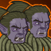

[Back to Main](index.md)

    
        
            
        
        
        Portrait
        
    

# Sgt. Knox

The imposing presence of Sergeant Knox came to Neverwinter when the Mintarn mercenaries were hired to retake the city following the eruption of Mount Hotenow. Soon he became a daily presence and mentor for new Adventurers in the city. Celeste reached out to her old friend following the catastrophic events at Elturel, hoping the veteran mercenary would join the Champions as they face the greatest foe the Sword Coast has ever seen!

# Changes

Sgt. Knox will be a reworked champion in the Feast of the Moon event on 6 November 2024.

Only abilities that have seen some changes will be displayed here - and be aware that there's a lot of guesswork involved. Some abilities may not have names - some may have the *wrong* names - or specialisations might not be marked as such - etc.. Focus on the effect data itself.

Please do me a favour and don't get all melodramatic about what you find here. I - and CNE - don't appreciate it. These are spoilers and will almost certainly change before release - likely multiple times. That and we don't have access to any upgrade data prior to release. Making assumptions on how the champions will turn out based on this information would be premature.

# Attacks

**Base Attack: Battleaxe** (Guess)
> Sgt. Knox swings his enormous Battleaxe through a random group of enemies.  
> Cooldown: 8s (Cap 2s)

<em>Raw Data</em>

<pre>
{
    "id": 817,
    "name": "Battleaxe",
    "description": "Sgt. Knox swings his enormous Battleaxe through a random group of enemies.",
    "long_description": "Sgt. Knox swings his enormous Battleaxe through a random group of enemies.",
    "graphic_id": 0,
    "target": "random",
    "num_targets": 1,
    "aoe_radius": 150,
    "damage_modifier": 1,
    "cooldown": 8,
    "animations": [
        {
            "type": "melee_attack",
            "target_offset_x": -75,
            "damage_frame": 18,
            "jump_sound": 30,
            "sound_frames": {
                "15": 189
            }
        }
    ],
    "tags": [
        "melee"
    ],
    "damage_types": [
        "melee"
    ]
}
</pre>

**Base Attack: For The Greater Good** (Guess)
>   
> Cooldown: 5s (Cap 1.25s)

<em>Raw Data</em>

<pre>
{
    "id": 816,
    "name": "For The Greater Good",
    "description": "",
    "long_description": "",
    "graphic_id": 1,
    "target": "random",
    "num_targets": 5,
    "aoe_radius": 0,
    "damage_modifier": 1,
    "cooldown": 5,
    "animations": [
        {
            "type": "makos_knox_attack",
            "start_shoot_frame": 18,
            "end_shoot_frame": 41,
            "visual_damage_start_frame": 24,
            "num_attacks": 5,
            "shoot_offset": {
                "x": 120,
                "y": -75
            },
            "target_offset_x": -100,
            "target_offset_y": -50,
            "impact_graphic_id": 751,
            "beam_graphic_id": [
                752
            ]
        }
    ],
    "tags": [
        "ranged"
    ],
    "damage_types": [
        "magic"
    ]
}
</pre>

# Abilities

**Rallying Cry** (Guess)
> Increase the damage of Champions in all the columns behind Sgt. Knox by 100 for each positional formation ability affecting them, stacking multiplicatively and including this one.

ⓘ *Note: This ability is prestack.*

<em>Raw Data</em>

<pre>
{
    "id": 2128,
    "flavour_text": "",
    "description": {
        "desc": "Increase the damage of Champions in all the columns behind $source by $(not_buffed amount) for each positional formation ability affecting them, stacking multiplicatively and including this one."
    },
    "effect_keys": [
        {
            "effect_string": "pre_stack,100"
        },
        {
            "effect_string": "hero_dps_multiplier_mult,100",
            "amount_expr": "upgrade_amount(15953,0)",
            "targets": [
                "behind"
            ],
            "amount_func": "mult",
            "stack_func": "per_positional_formation_ability",
            "show_bonus": true,
            "stack_title": "Positional Formation Abilities",
            "show_stats_on_receiver": true,
            "show_bonus_on_receiver_only": true,
            "off_when_benched": true,
            "override_key_desc": "Increases the damage of $target by $(not_buffed amount)% for every positional formation ability"
        }
    ],
    "requirements": "",
    "graphic_id": 10775,
    "large_graphic_id": 0,
    "properties": {
        "is_formation_ability": true,
        "owner_use_outgoing_description": true,
        "default_bonus_index": 0
    }
}
</pre>

**Defence of Neverwinter** (Guess)
> When Sgt. Knox is in the formation, Celeste and Makos become eligible for the current adventure, even if a Patron, Variant, or other restriction would say otherwise.

<em>Raw Data</em>

<pre>
{
    "id": 2129,
    "flavour_text": "",
    "description": {
        "desc": "When $source is in the formation, Celeste and Makos become eligible for the current adventure, even if a Patron, Variant, or other restriction would say otherwise."
    },
    "effect_keys": [
        {
            "off_when_benched": true,
            "effect_string": "force_allow_hero",
            "hero_ids": [
                2,
                9
            ]
        }
    ],
    "requirements": "",
    "graphic_id": 24880,
    "large_graphic_id": 24874,
    "properties": []
}
</pre>

**Squad Leader** (Guess)
> If they are in the formation, Sgt. Knox increases the effect of Celeste's Crusader's Mantle and Makos' Specialization Choice by 100% for each completed base Grand Tour adventure, stacking multiplicatively.

<em>Raw Data</em>

<pre>
{
    "id": 2130,
    "flavour_text": "",
    "description": {
        "desc": "If they are in the formation, $source increases the effect of Celeste's Crusader's Mantle and Makos' Specialization Choice by $amount% for each completed base Grand Tour adventure, stacking multiplicatively."
    },
    "effect_keys": [
        {
            "off_when_benched": true,
            "effect_string": "buff_upgrades,100,24,139,140",
            "targets": [
                "other"
            ],
            "stacks_multiply": true,
            "amount_func": "mult",
            "stack_func": "get_stat",
            "stat": "GrandTourBaseAdventuresCompleted",
            "ided_stat_id": 1,
            "ided_stat_handler": "CompletedBaseAdventures",
            "use_computed_amount_for_description": true,
            "skip_effect_key_desc": true,
            "amount_updated_listeners": [
                "stat_changed,GrandTourBaseAdventuresCompleted"
            ]
        }
    ],
    "requirements": "",
    "graphic_id": 24881,
    "large_graphic_id": 24875,
    "properties": {
        "is_formation_ability": true,
        "owner_use_outgoing_description": true
    }
}
</pre>

**Hero of Neverwinter** (Guess)
> Increases the Health of all other Champions by 25% of Sgt. Knox's Max Health. If affected by Celeste's Mass Cure Wounds, Sgt. Knox takes 25% less damage from all attacks, excluding attacks that instantly kill him.

<em>Raw Data</em>

<pre>
{
    "id": 2131,
    "flavour_text": "",
    "description": {
        "desc": "Increases the Health of all other Champions by $amount% of $source's Max Health. If affected by Celeste's Mass Cure Wounds, $source takes 25% less damage from all attacks, excluding attacks that instantly kill him."
    },
    "effect_keys": [
        {
            "effect_string": "increase_health_by_source_percent,25",
            "targets": [
                "other"
            ],
            "off_when_benched": true
        },
        {
            "effect_string": "effect_def,868"
        }
    ],
    "requirements": "",
    "graphic_id": 10774,
    "large_graphic_id": 0,
    "properties": {
        "is_buff_incoming_formation_abilities_target": false
    }
}
</pre>

**Unknown** (Guess)
> Sgt. Knox keeps track of the highest number of enemies that have been attacking him at one time and the highest number of enrage stacks there have been in the current area. The effect of Squad Leader is increased by 100% for each enemy and enrage stack, stacking additively.

<em>Raw Data</em>

<pre>
{
    "id": 2132,
    "flavour_text": "",
    "description": {
        "desc": "$source keeps track of the highest number of enemies that have been attacking him at one time and the highest number of enrage stacks there have been in the current area. The effect of Squad Leader is increased by 100% for each enemy and enrage stack, stacking additively."
    },
    "effect_keys": [
        {
            "effect_string": "buff_upgrade,100,15955",
            "manual_stacking": true,
            "stacks_multiply": false,
            "show_bonus": true,
            "stack_title": "Defender Stacks",
            "active_graphic_id": 3036,
            "active_graphic_y": -180,
            "active_graphic_any_amount_frame": 1,
            "active_graphic_sort_offset": 3
        },
        {
            "effect_string": "monster_attack_enrage_stacker,0"
        }
    ],
    "requirements": "",
    "graphic_id": 1,
    "large_graphic_id": 0,
    "properties": {
        "is_formation_ability": true
    }
}
</pre>

**Unknown** (Guess)
> The effect of Celeste's Crusader's Mantle is increased by 100% for each unaffiliated Champion in the formation, stacking multiplicatively.

<em>Raw Data</em>

<pre>
{
    "id": 2133,
    "flavour_text": "",
    "description": {
        "desc": "The effect of Celeste's Crusader's Mantle is increased by $amount% for each unaffiliated Champion in the formation, stacking multiplicatively."
    },
    "effect_keys": [
        {
            "effect_string": "buff_upgrade,100,24",
            "stack_func": "per_hero",
            "amount_func": "mult",
            "tag": "unaffiliated"
        }
    ],
    "requirements": "",
    "graphic_id": 1,
    "large_graphic_id": 0,
    "properties": {
        "is_formation_ability": true
    }
}
</pre>

**Unknown** (Guess)
> Makos completes his quest to become a lich and gains the Undead tag. His damage is increased by 400% and his critical hit damage is increased by 100%. His base attack now targets up to 5 enemies at once, and he has a 20% higher chance to critically hit.

<em>Raw Data</em>

<pre>
{
    "id": 2134,
    "flavour_text": "",
    "description": {
        "desc": "Makos completes his quest to become a lich and gains the Undead tag. His damage is increased by $(amount___2)% and his critical hit damage is increased by $(amount___3)%. His base attack now targets up to 5 enemies at once, and he has a $(amount___5)% higher chance to critically hit."
    },
    "effect_keys": [
        {
            "effect_string": "appear_dead",
            "targets": [
                "self_slot"
            ]
        },
        {
            "effect_string": "hero_dps_multiplier_mult,400",
            "targets": [
                "self_slot"
            ]
        },
        {
            "effect_string": "buff_base_crit_damage_mult,100",
            "targets": [
                "self_slot"
            ]
        },
        {
            "effect_string": "change_base_attack,816",
            "off_when_benched": true,
            "targets": [
                "self_slot"
            ]
        },
        {
            "effect_string": "buff_base_crit_chance_add,20",
            "off_when_benched": true,
            "targets": [
                "self_slot"
            ]
        }
    ],
    "requirements": [
        {
            "requirement": "hero_in_formation",
            "target_hero_id": 9
        }
    ],
    "graphic_id": 1,
    "large_graphic_id": 0,
    "properties": {
        "is_formation_ability": true,
        "owner_use_outgoing_description": false,
        "use_owner_override": true,
        "indexed_effect_properties": true,
        "per_effect_index_bonuses": true
    }
}
</pre>

**Unknown** (Guess)
> Increase the max health of Sgt. Knox by 200%. His base attack now taunts enemies he hits to target him.

<em>Raw Data</em>

<pre>
{
    "id": 2135,
    "flavour_text": "",
    "description": {
        "desc": "Increase the max health of $source by 200%. His base attack now taunts enemies he hits to target him."
    },
    "effect_keys": [
        {
            "effect_string": "health_mult,200"
        },
        {
            "effect_string": "taunt,0",
            "base_attack_taunts": true,
            "base_attack_always_taunts": true
        }
    ],
    "requirements": "",
    "graphic_id": 1,
    "large_graphic_id": 0,
    "properties": {
        "is_formation_ability": true
    }
}
</pre>

**Unknown** (Guess)
> Makos completes his quest to become a lich and gains the Undead tag. His damage is increased by 400% and his critical hit damage is increased by 100%. His base attack now targets up to 5 enemies at once, and he has a 20% higher chance to critically hit.

<em>Raw Data</em>

<pre>
{
    "id": 2134,
    "flavour_text": "",
    "description": {
        "desc": "Makos completes his quest to become a lich and gains the Undead tag. His damage is increased by $(amount___2)% and his critical hit damage is increased by $(amount___3)%. His base attack now targets up to 5 enemies at once, and he has a $(amount___5)% higher chance to critically hit."
    },
    "effect_keys": [
        {
            "effect_string": "appear_dead",
            "targets": [
                "self_slot"
            ]
        },
        {
            "effect_string": "hero_dps_multiplier_mult,400",
            "targets": [
                "self_slot"
            ]
        },
        {
            "effect_string": "buff_base_crit_damage_mult,100",
            "targets": [
                "self_slot"
            ]
        },
        {
            "effect_string": "change_base_attack,816",
            "off_when_benched": true,
            "targets": [
                "self_slot"
            ]
        },
        {
            "effect_string": "buff_base_crit_chance_add,20",
            "off_when_benched": true,
            "targets": [
                "self_slot"
            ]
        }
    ],
    "requirements": [
        {
            "requirement": "hero_in_formation",
            "target_hero_id": 9
        }
    ],
    "graphic_id": 1,
    "large_graphic_id": 0,
    "properties": {
        "is_formation_ability": true,
        "owner_use_outgoing_description": false,
        "use_owner_override": true,
        "indexed_effect_properties": true,
        "per_effect_index_bonuses": true
    }
}
</pre>

# Adventures and Variants

**Unlock Adventure: Party Crashers (Sergeant Knox)** (Complete Area 50)
> Save Waterdeep from the chaos of a Founders' Day gone awry.

 **Variant 1: Neverwinter Defenders** (Complete Area 75)
> Sergeant Knox starts in the formation. He cannot be moved or removed.   
> The damage of all Champions is increased by 50% if Celeste is in the formation, and an additional 50% if Makos is in the formation.  
> Enemy damage & Speed is increased by 100%.   
> Getting to know Sergeant Knox: Knox works best with his fellow Neverwinter Allies Celeste & Makos in the formation. Place them directly behind Knox to maximize their benefit!

 **Variant 2: Afterparty** (Complete Area 125)
> A pair of Bearded Devils join the formation. They're just here for the souvenirs.    
> Quest goals are doubled.

 **Variant 3: Blast from the Past** (Complete Area 175)
> Only Champions with INT of 12 or higher can be used.   
> Sergeant Knox starts in the formation. He cannot be moved or removed.   
> Each area, zombies aligned with Valindra attack. They do not drop gold, nor do they count towards quest progress.  
> Valindra Shadowmantle replaces Zariel in area 50.

[Back to Top](#top)

*Last Modified: {{ site.time }}*