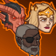

[Back to Main](index.md)

    
        Portrait
    

# Sgt. Knox

The imposing presence of Sergeant Knox came to Neverwinter when the Mintarn mercenaries were hired to retake the city following the eruption of Mount Hotenow. Soon he became a daily presence and mentor for new Adventurers in the city. Celeste reached out to her old friend following the catastrophic events at Elturel, hoping the veteran mercenary would join the Champions as they face the greatest foe the Sword Coast has ever seen!

# Changes

Sgt. Knox is potentially a reworked champion in the Liars' Night event on 2 October 2024.

Only abilities that have seen some changes will be displayed here - and be aware that there's a lot of guesswork involved. Some abilities may not have names - some may have the *wrong* names - or specialisations might not be marked as such - etc.. Focus on the effect data itself.

Please do me a favour and don't get all melodramatic about what you find here. I - and CNE - don't appreciate it. These are spoilers and will almost certainly change before release - likely multiple times. That and we don't have access to any upgrade data prior to release. Making assumptions on how the champions will turn out based on this information would be premature.

# Abilities

**Defence of Neverwinter** (Guess)
> Unknown.

<em>Raw Data</em>

<pre>
{
    "id": 24880,
    "graphic": "Icons/Events/2017FeastOfTheMoon/Y8/Icon_Formation_SgtKnox_DefenceofNeverwinter",
    "v": 2,
    "fs": 0,
    "p": 0,
    "type": 1,
    "export_params": {
        "uses": [
            "icon"
        ],
        "quantize": true
    }
}
</pre>

**Squad Leader** (Guess)
> Unknown.

<em>Raw Data</em>

<pre>
{
    "id": 24881,
    "graphic": "Icons/Events/2017FeastOfTheMoon/Y8/Icon_Formation_SgtKnox_SquadLeader",
    "v": 2,
    "fs": 0,
    "p": 0,
    "type": 1,
    "export_params": {
        "uses": [
            "icon"
        ],
        "quantize": true
    }
}
</pre>

# Specialisations

**Specialisation: For the GreaterGood** (Guess)
> Unknown.

<em>Raw Data</em>

<pre>
{
    "id": 24885,
    "graphic": "Icons/Events/2017FeastOfTheMoon/Y8/Icon_Specialization_SgtKnox_FortheGreaterGood",
    "v": 2,
    "fs": 0,
    "p": 0,
    "type": 1,
    "export_params": {
        "uses": [
            "icon"
        ],
        "quantize": true
    }
}
</pre>

**Specialisation: Impromptu Allies** (Guess)
> Unknown.

<em>Raw Data</em>

<pre>
{
    "id": 24886,
    "graphic": "Icons/Events/2017FeastOfTheMoon/Y8/Icon_Specialization_SgtKnox_ImpromptuAllies",
    "v": 2,
    "fs": 0,
    "p": 0,
    "type": 1,
    "export_params": {
        "uses": [
            "icon"
        ],
        "quantize": true
    }
}
</pre>

# Adventures and Variants

**Unlock Adventure: Party Crashers (Sergeant Knox)** (Complete Area 50)
> Save Waterdeep from the chaos of a Founders' Day gone awry.

 **Variant 1: Neverwinter Defenders** (Complete Area 75)
> Sergeant Knox starts in the formation. He cannot be moved or removed.   
> The damage of all Champions is increased by 50% if Celeste is in the formation, and an additional 50% if Makos is in the formation.  
> Enemy damage & Speed is increased by 100%.   
> Getting to know Sergeant Knox: Knox works best with his fellow Neverwinter Allies Celeste & Makos in the formation. Place them directly behind Knox to maximize their benefit!

 **Variant 2: Afterparty** (Complete Area 125)
> A pair of Bearded Devils join the formation. They're just here for the souvenirs.    
> Quest goals are doubled.

 **Variant 3: Blast from the Past** (Complete Area 175)
> Only Champions with INT of 12 or higher can be used.   
> Sergeant Knox starts in the formation. He cannot be moved or removed.   
> Each area, zombies aligned with Valindra attack. They do not drop gold, nor do they count towards quest progress.  
> Valindra Shadowmantle replaces Zariel in area 50.

[Back to Top](#top)

*Last Modified: {{ site.time }}*