[Back to Main](index.md)

    
        Portait
    

# Shadowheart

A loyal cleric of Shar, Shadowheart is the sole survivor of a holy mission undertaken on the Mistress of the Night's behest. She alone must deliver a relic of immense power to her coven in Baldur's Gate, while threatened by a strange new magic that is burgeoning from within.

[BG3 Wiki](https://baldursgate3.wiki.fextralife.com/Shadowheart)

# Basic Information

Shadowheart will be the new champion in the Simril event on 29 November 2023.

    
        
            **Seat**:
        
        
            Unknown
        
    
    
        
            **Race**:
        
        
            Half-Elf (Guess)
        
    
    
        
            **Class**:
        
        
            Cleric (Guess)
        
    
    
        
            **Roles**:
        
        
            Support / Healing (Guess)
        
    
    
        
            **Age**:
        
        
            Unknown
        
    
    
        
            **Gender**:
        
        
            Female (Guess)
        
    
    
        
            **Alignment**:
        
        
            Unknown
        
    
    
        
            **Affiliation**:
        
        
            Absolute Adversaries (Guess)
        
    

# Formation

Unknown.


    



# Abilities

**Base Attack: Sacred Flame** (Magic)
> Unknown effect.  
> Cooldown: 6s (Cap 1.5s)

<em>Raw Data</em>

<pre>
{
    "description": "",
    "long_description": "",
    "damage_modifier": 1,
    "damage_types": ["magic"],
    "graphic_id": 0,
    "target": "random",
    "aoe_radius": 0,
    "tags": ["ranged"],
    "num_targets": 1,
    "animations": [{
        "damage_frame": 2,
        "jump_sound": 30,
        "sound_frames": {"2": 154},
        "target_offset_x": -34,
        "type": "melee_attack"
    }],
    "name": "Sacred Flame",
    "cooldown": 6,
    "id": 701
}
</pre>

**Base Attack: Guidance** (Magic)
> Unknown effect.  
> Cooldown: 6s (Cap 1.5s)

<em>Raw Data</em>

<pre>
{
    "description": "",
    "long_description": "",
    "damage_modifier": 1,
    "damage_types": ["magic"],
    "graphic_id": 0,
    "target": "none",
    "aoe_radius": 0,
    "tags": ["ranged"],
    "num_targets": 0,
    "animations": [{
        "damage_frame": 2,
        "jump_sound": 30,
        "sound_frames": {"2": 154},
        "target_offset_x": -34,
        "type": "melee_attack"
    }],
    "name": "Guidance",
    "cooldown": 6,
    "id": 702
}
</pre>

**Ultimate Attack: Absolute Sanctuary**
> Unknown effect.  
> Cooldown: 300s (Cap 75s)

<em>Raw Data</em>

<pre>
{
    "description": "",
    "long_description": "",
    "damage_modifier": 1,
    "damage_types": ["magic"],
    "graphic_id": 21370,
    "target": "all",
    "aoe_radius": 0,
    "tags": [
        "ranged",
        "ultimate"
    ],
    "num_targets": 0,
    "animations": [{
        "damage_frame": 2,
        "jump_sound": 30,
        "sound_frames": {"2": 154},
        "target_offset_x": -34,
        "type": "melee_attack"
    }],
    "name": "Absolute Sanctuary",
    "cooldown": 300,
    "id": 703
}
</pre>

**Twilight Trickery**
> Shadowheart increases the damage of Champions within two slots of her by 100%.

<em>Raw Data</em>

<pre>
{
    "effect_keys": [{
        "effect_string": "hero_dps_multiplier_mult,100",
        "targets": [{
            "distance": 2,
            "type": "distance"
        }]
    }],
    "requirements": "",
    "description": {"desc": "Shadowheart increases the damage of Champions within two slots of her by $(amount)%."},
    "id": 1754,
    "flavour_text": "",
    "graphic_id": 21366,
    "properties": {
        "is_formation_ability": true,
        "owner_use_outgoing_description": false
    }
}
</pre>

**Ceremorphosis**
> Your formation gains one Ceremorphosis stack due to the mind flayer tadpole in Shadowheart's brain. Shadowheart increases the effect of Twilight Trickery by 100% for each Ceremorphosis stack, stacking multiplicatively.

ⓘ *Note: This ability might be prestack.*

<em>Raw Data</em>

<pre>
{
    "effect_keys": [
        {"effect_string": "pre_stack_amount,100"},
        {
            "amount_expr": "upgrade_amount(13276,0)",
            "stack_title": "Total Ceremorphosis Stacks",
            "amount_updated_listeners": ["slot_changed"],
            "stacks_multiply": true,
            "total_title": "Total Bonus",
            "off_when_benched": true,
            "show_bonus": true,
            "amount_func": "mult",
            "stack_func": "per_ceremorphosis_stacks",
            "effect_string": "buff_upgrade,0,13275",
            "desc_forced_order": 2
        },
        {
            "stack_title": "Shadowheart Ceremorphosis Stacks",
            "manual_stacking": true,
            "stacks_multiply": false,
            "off_when_benched": true,
            "outgoing_buffs": false,
            "effect_string": "shadowheart_ceremorphosis_stacks,1",
            "show_stacks": true,
            "desc_forced_order": 1
        }
    ],
    "requirements": "",
    "description": {"desc": "Your formation gains one Ceremorphosis stack due to the mind flayer tadpole in Shadowheart's brain. Shadowheart increases the effect of Twilight Trickery by $(amount)% for each Ceremorphosis stack, stacking multiplicatively."},
    "id": 1755,
    "flavour_text": "",
    "graphic_id": 21363,
    "properties": {
        "indexed_effect_properties": true,
        "retain_on_slot_changed": true,
        "is_formation_ability": true,
        "default_bonus_index": 0,
        "owner_use_outgoing_description": true,
        "per_effect_index_bonuses": true
    }
}
</pre>

**Light in the Dark**
> Shadowheart heals Champions in the two columns ahead of her for 10 every second.

<em>Raw Data</em>

<pre>
{
    "effect_keys": [{
        "effect_string": "heal,10",
        "targets": ["next_two_col"]
    }],
    "requirements": "",
    "description": {"desc": "Shadowheart heals Champions in the two columns ahead of her for $(amount) every second."},
    "id": 1756,
    "flavour_text": "",
    "graphic_id": 21365,
    "properties": {
        "is_formation_ability": true,
        "owner_use_outgoing_description": false
    }
}
</pre>

**Invoke Duplicity**
> Shadowheart creates an illusory duplicate of herself which hides in the formation and applies Twilight Trickery and Light in the Dark to Champions relative to itself with half the range as normal. The duplicate positions itself in the same formation slot as the Champion in the formation with the highest DEX score. Ties go to the Champion in the highest bench seat.

<em>Raw Data</em>

<pre>
{
    "effect_keys": [{
        "off_when_benched": true,
        "duplicity_effects": [
            {
                "amount_expr": "upgrade_amount(13275,0)",
                "off_when_benched": true,
                "effect_string": "hero_dps_multiplier_mult,0",
                "targets": [{
                    "distance": 1,
                    "type": "distance"
                }]
            },
            {
                "amount_expr": "upgrade_amount(13277,0)",
                "off_when_benched": true,
                "effect_string": "heal,0",
                "targets": ["next_col"]
            }
        ],
        "effect_string": "shadowheart_invoke_duplicity"
    }],
    "requirements": "",
    "description": {"desc": "Shadowheart creates an illusory duplicate of herself which hides in the formation and applies Twilight Trickery and Light in the Dark to Champions relative to itself with half the range as normal. The duplicate positions itself in the same formation slot as the Champion in the formation with the highest DEX score. Ties go to the Champion in the highest bench seat."},
    "id": 1757,
    "flavour_text": "",
    "graphic_id": 21364,
    "properties": {
        "is_formation_ability": true,
        "owner_use_outgoing_description": false
    }
}
</pre>

# Specialisations

**Specialisation: Find Yourself** (Guess)
> Unknown effect.

<em>Raw Data</em>

<pre>
{
    "effect_keys": [{"effect_string": "do_nothing"}],
    "requirements": "",
    "description": {"desc": ""},
    "id": 1758,
    "flavour_text": "",
    "graphic_id": 0,
    "properties": {
        "is_formation_ability": true,
        "owner_use_outgoing_description": true
    }
}
</pre>

**Specialisation: Guidance** (Guess)
> Unknown effect.

<em>Raw Data</em>

<pre>
{
    "effect_keys": [{"effect_string": "do_nothing"}],
    "requirements": "",
    "description": {"desc": ""},
    "id": 1759,
    "flavour_text": "",
    "graphic_id": 0,
    "properties": {
        "is_formation_ability": true,
        "owner_use_outgoing_description": true
    }
}
</pre>

**Specialisation: Sister of Darkness** (Guess)
> Unknown effect.

<em>Raw Data</em>

<pre>
{
    "effect_keys": [{"effect_string": "do_nothing"}],
    "requirements": "",
    "description": {"desc": ""},
    "id": 1760,
    "flavour_text": "",
    "graphic_id": 0,
    "properties": {
        "is_formation_ability": true,
        "owner_use_outgoing_description": true
    }
}
</pre>

# Items

    
        
            **Icons**
        
        
            **Name**
        
    
    
        
            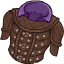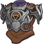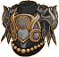
        
        
            Armor
        
    
    
        
            
        
        
            Headgear
        
    
    
        
            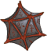
        
        
            Mysterious Artefact
        
    
    
        
            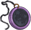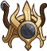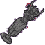
        
        
            Shar Stuff
        
    
    
        
            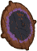
        
        
            Shield
        
    
    
        
            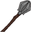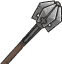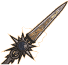
        
        
            Weapon
        
    

# Feats

Unknown.

# Legendaries

Unknown.

# Other Champion Images

    
        
            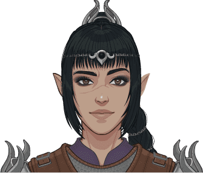Console Portait
        
    
    
        
            Gold Chest Icon
        
        
            Silver Chest Icon
        
    

[Back to Top](#top)

*Last Modified: {{ site.time }}*