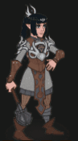

[Back to Main](index.md)

    
        Portait
    
    
        Model
    

# Shadowheart

A devoted cleric of Shar, goddess of darkness and loss, Shadowheart agreed to have her memories wiped as part of a holy mission. Now its sole survivor, she must deliver a powerful relic back to her kin in order to win Shar's love and have her memories restored - but all the while, she is tormented by strange, painful magic that she struggles to understand.

# Basic Information

Shadowheart will be the new champion in the Simril event on 29 November 2023.

    
        
            **Seat**:
        
        
            6
        
        
            **Stat**
        
        
            **Value**
        
        
            **Day 1 Trials**
        
        
            **Patrons**
        
    
    
        
            **Race**:
        
        
            Half-Elf
        
        
            **Strength**:
        
        
            12
        
        
            Yes
        
        
            -
        
    
    
        
            **Class**:
        
        
            Cleric
        
        
            **Dexterity**:
        
        
            14
        
        
            Yes
        
        
            Vajra
        
    
    
        
            **Roles**:
        
        
            Support / Healing
        
        
            **Constitution**:
        
        
            14
        
        
            Yes
        
        
            -
        
    
    
        
            **Age**:
        
        
            48
        
        
            **Intelligence**:
        
        
            10
        
        
            Yes
        
        
            -
        
    
    
        
            **Gender**:
        
        
            Female
        
        
            **Wisdom**:
        
        
            16
        
        
            Yes
        
        
            &nbsp;
        
    
    
        
            **Alignment**:
        
        
            Lawful Neutral
        
        
            **Charisma**:
        
        
            10
        
        
            -
        
        
            &nbsp;
        
    
    
        
            **Affiliation**:
        
        
            Absolute Adversaries
        
        
            **Total**:
        
        
            76
        
        
            Champion ID:
        
        
            141
        
    

# Formation

    

# Abilities

 **Base Attack: Sacred Flame** (Magic)
> Shadowheart casts Sacred Flame on a random enemy, dealing 1 hit.  
> Cooldown: 6s (Cap 1.5s)

<em>Raw Data</em>

<pre>
{
    "id": 701,
    "name": "Sacred Flame",
    "description": "Shadowheart casts Sacred Flame on a random enemy, dealing 1 hit.",
    "long_description": "",
    "graphic_id": 0,
    "target": "random",
    "num_targets": 1,
    "aoe_radius": 0,
    "damage_modifier": 1,
    "cooldown": 6,
    "animations": [
        {
            "type": "ranged_attack",
            "projectile": "pd_generic_projectile",
            "shoot_frame": 10,
            "shoot_sound": 164,
            "hit_sound": 133,
            "projectile_details": {
                "hash": "220b7624ef8bba01663706bfc0b44e70",
                "projectile_speed": 10000,
                "projectile_hit_graphic_id": 21569
            }
        }
    ],
    "tags": [
        "ranged"
    ],
    "damage_types": [
        "magic"
    ]
}
</pre>

 **Base Attack: Guidance** (Magic)
> Shadowheart casts Guidance on your BUD-setting Champion, increasing their next attack's damage.  
> Cooldown: 6s (Cap 1.5s)

<em>Raw Data</em>

<pre>
{
    "id": 702,
    "name": "Guidance",
    "description": "Shadowheart casts Guidance on your BUD-setting Champion, increasing their next attack's damage.",
    "long_description": "",
    "graphic_id": 0,
    "target": "none",
    "num_targets": 0,
    "aoe_radius": 0,
    "damage_modifier": 1,
    "cooldown": 6,
    "animations": [
        {
            "type": "melee_attack",
            "no_damage_display": true,
            "no_jump": true,
            "no_cooldown_display": false,
            "animation_sequence_name": "attack_b"
        }
    ],
    "tags": [
        "ranged"
    ],
    "damage_types": [
        "magic"
    ]
}
</pre>

 **Ultimate Attack: Absolute Sanctuary** (Level: 9999)
> Shadowheart's mysterious relic strikes back enemies and prevents all damage to your Champions for a short while.  
> Cooldown: 300s (Cap 75s)

<em>Raw Data</em>

<pre>
{
    "id": 703,
    "name": "Absolute Sanctuary",
    "description": "Shadowheart's mysterious relic prevents all damage for a short while.",
    "long_description": "Shadowheart's mysterious relic strikes back enemies and prevents all damage to your Champions for a short while.",
    "graphic_id": 21370,
    "target": "all",
    "num_targets": 0,
    "aoe_radius": 0,
    "damage_modifier": 0.03,
    "cooldown": 300,
    "animations": [
        {
            "type": "ultimate_attack",
            "ultimate": "shadowheart"
        }
    ],
    "tags": [
        "ranged",
        "ultimate"
    ],
    "damage_types": [
        "magic"
    ]
}
</pre>

 **Twilight Trickery** (Level: 20)
> Shadowheart increases the damage of Champions within two slots of her by 100%.

<em>Upgrade Data</em>

<pre>
Upgrades:
       80: 100%
      130: 100%
      200: 100%
      330: 100%
      460: 100%
      610: 100%
      750: 100%
      890: 100%
    1,030: 100%
    1,160: 100%
    1,300: 100%
    1,440: 100%
    1,570: 100%
    1,710: 100%
    1,840: 100%
    1,990: 100%
    2,120: 100%
    2,260: 100%
    2,400: 100%
    2,500: 100%
    2,590: 100%

    Total Upgrade Bonus: 2.10e08%
</pre>

<em>Raw Data</em>

<pre>
{
    "id": 13275,
    "hero_id": 141,
    "required_level": 20,
    "required_upgrade_id": 0,
    "upgrade_type": "unlock_ability",
    "effect": "effect_def,1754",
    "static_dps_mult": null,
    "default_enabled": 1,
    "name": "Twilight Trickery",
    "tip_text": "Shadowheart increases the damage of Champions within two slots of her."
}
{
    "id": 1754,
    "flavour_text": "",
    "description": {
        "desc": "Shadowheart increases the damage of Champions within two slots of her by $(amount)%."
    },
    "effect_keys": [
        {
            "effect_string": "hero_dps_multiplier_mult,100",
            "targets": [
                {
                    "type": "distance",
                    "distance": 2
                }
            ]
        }
    ],
    "requirements": "",
    "graphic_id": 21366,
    "properties": {
        "is_formation_ability": true,
        "owner_use_outgoing_description": false
    }
}
</pre>

 **Light In The Dark** (Level: 50)
> Shadowheart heals Champions in the two columns ahead of her for 10 every second.

<em>Upgrade Data</em>

<pre>
Upgrades:
       70: 70%
      280: 70%
      470: 70%
      620: 70%
      850: 70%
    1,100: 70%
    1,350: 70%
    1,600: 70%
    1,850: 70%
    2,100: 70%
    2,350: 70%
    2,600: 70%

    Total Upgrade Bonus: 5.82e04%
</pre>

<em>Raw Data</em>

<pre>
{
    "id": 13277,
    "hero_id": 141,
    "required_level": 50,
    "required_upgrade_id": 0,
    "upgrade_type": "unlock_ability",
    "effect": "effect_def,1756",
    "static_dps_mult": null,
    "default_enabled": 1,
    "name": "Light In The Dark",
    "tip_text": "Shadowheart heals Champions in the two columns ahead of her every second."
}
{
    "id": 1756,
    "flavour_text": "",
    "description": {
        "desc": "Shadowheart heals Champions in the two columns ahead of her for $(amount) every second."
    },
    "effect_keys": [
        {
            "effect_string": "heal,10",
            "targets": [
                "next_two_col"
            ]
        }
    ],
    "requirements": "",
    "graphic_id": 21365,
    "properties": {
        "is_formation_ability": true,
        "owner_use_outgoing_description": false
    }
}
</pre>

 **Ceremorphosis** (Level: 100)
> Your formation gains one Ceremorphosis stack due to the mind flayer tadpole in Shadowheart's brain. Shadowheart increases the effect of Twilight Trickery by 100% for each Ceremorphosis stack, stacking multiplicatively.

ⓘ *Note: This ability might be prestack.*

<em>Raw Data</em>

<pre>
{
    "id": 13276,
    "hero_id": 141,
    "required_level": 100,
    "required_upgrade_id": 0,
    "upgrade_type": "unlock_ability",
    "effect": "effect_def,1755",
    "static_dps_mult": null,
    "default_enabled": 1,
    "name": "Ceremorphosis"
}
{
    "id": 1755,
    "flavour_text": "",
    "description": {
        "desc": "Your formation gains one Ceremorphosis stack due to the mind flayer tadpole in Shadowheart's brain. Shadowheart increases the effect of Twilight Trickery by $(amount)% for each Ceremorphosis stack, stacking multiplicatively."
    },
    "effect_keys": [
        {
            "effect_string": "pre_stack_amount,100"
        },
        {
            "off_when_benched": true,
            "effect_string": "buff_upgrade,0,13275",
            "amount_expr": "upgrade_amount(13276,0)",
            "stack_func": "per_ceremorphosis_stacks",
            "amount_func": "mult",
            "stacks_multiply": true,
            "show_bonus": true,
            "stack_title": "Total Ceremorphosis Stacks",
            "total_title": "Total Bonus",
            "desc_forced_order": 2,
            "amount_updated_listeners": [
                "upgrade_unlocked",
                "slot_changed",
                "feat_changed"
            ]
        },
        {
            "off_when_benched": true,
            "outgoing_buffs": false,
            "effect_string": "shadowheart_ceremorphosis_stacks,1",
            "manual_stacking": true,
            "stacks_multiply": false,
            "show_stacks": true,
            "stack_title": "Shadowheart Ceremorphosis Stacks",
            "desc_forced_order": 1
        }
    ],
    "requirements": "",
    "graphic_id": 21363,
    "properties": {
        "is_formation_ability": true,
        "owner_use_outgoing_description": true,
        "indexed_effect_properties": true,
        "per_effect_index_bonuses": true,
        "default_bonus_index": 0,
        "retain_on_slot_changed": true
    }
}
</pre>

 **Invoke Duplicity** (Level: 150)
> Shadowheart creates an Illusory Duplicate of herself which hides in the formation and applies Twilight Trickery and Light in the Dark to Champions relative to itself with half the range as normal. The duplicate positions itself in the same formation slot as the Champion in the formation with the highest DEX score. Ties go to the Champion in the highest bench seat.
>  
> - Illusory Duplicate Source:
> - Twilight Trickery Damage Buff: ???%
> - Light In The Dark Heal Amount: ???.

<em>Raw Data</em>

<pre>
{
    "id": 13278,
    "hero_id": 141,
    "required_level": 150,
    "required_upgrade_id": 0,
    "upgrade_type": "unlock_ability",
    "effect": "effect_def,1757",
    "static_dps_mult": null,
    "default_enabled": 1,
    "name": "Invoke Duplicity"
}
{
    "id": 1757,
    "flavour_text": "",
    "description": {
        "desc": "Shadowheart creates an Illusory Duplicate of herself which hides in the formation and applies Twilight Trickery and Light in the Dark to Champions relative to itself with half the range as normal. The duplicate positions itself in the same formation slot as the Champion in the formation with the highest DEX score. Ties go to the Champion in the highest bench seat.",
        "post": {
            "conditions": [
                {
                    "condition": "not static_desc",
                    "desc": "^^Illusory Duplicate Source: $shadowheart_illusory_duplicate_target^Twilight Trickery Damage Buff: $shadowheart_twilight_trickery_amount%^Light In The Dark Heal Amount: $shadowheart_light_in_the_dark_amount"
                }
            ]
        }
    },
    "effect_keys": [
        {
            "off_when_benched": true,
            "effect_string": "shadowheart_invoke_duplicity",
            "targets": [
                "self_slot"
            ],
            "skip_effect_key_desc": true
        },
        {
            "off_when_benched": true,
            "effect_string": "hero_dps_multiplier_mult,0",
            "override_key_desc": "Twilight Trickery - Increases the damage of $target by $amount%",
            "amount_expr": "upgrade_amount(13275,0)",
            "targets": [
                {
                    "type": "distance",
                    "distance": 1
                }
            ],
            "use_computed_amount_for_description": true
        },
        {
            "off_when_benched": true,
            "effect_string": "heal,0",
            "override_key_desc": "Light In The Dark - Heals $target for $amount every second",
            "amount_expr": "upgrade_amount(13277,0)",
            "targets": [
                "next_col"
            ],
            "use_computed_amount_for_description": true
        }
    ],
    "requirements": "",
    "graphic_id": 21364,
    "properties": {
        "is_formation_ability": true,
        "is_positional_ability": true,
        "owner_use_outgoing_description": false,
        "use_owner_override": true,
        "indexed_effect_properties": true,
        "per_effect_index_bonuses": true
    }
}
</pre>

# Specialisations

 **Find Yourself** (Level: 180)
> The effects of Twilight Trickery and Light In The Dark from Shadowheart's Illusory Duplicate are increased by 100% for each formation slot away from Shadowheart the duplicate is (following the shortest path), stacking multiplicatively.

<em>Raw Data</em>

<pre>
{
    "id": 13281,
    "hero_id": 141,
    "required_level": 180,
    "required_upgrade_id": 0,
    "upgrade_type": "unlock_ability",
    "effect": "effect_def,1760",
    "static_dps_mult": null,
    "default_enabled": 1,
    "name": "Find Yourself",
    "specialization_name": "Find Yourself",
    "specialization_description": "Sometimes you need to seek out the things you've forgotten.",
    "specialization_graphic_id": 21367
}
{
    "id": 1760,
    "flavour_text": "",
    "description": {
        "desc": "The effects of Twilight Trickery and Light In The Dark from Shadowheart's Illusory Duplicate are increased by $(not_buffed amount)% for each formation slot away from Shadowheart the duplicate is (following the shortest path), stacking multiplicatively."
    },
    "effect_keys": [
        {
            "effect_string": "buff_upgrade,100,13278",
            "amount_func": "mult",
            "stack_func": "shadowheart_invoke_duplicity_dist",
            "stacks_multiply": true,
            "show_bonus": true,
            "amount_updated_listeners": [
                "slot_changed",
                "ability_score_changed"
            ]
        }
    ],
    "requirements": "",
    "graphic_id": 0,
    "properties": {
        "is_formation_ability": true,
        "owner_use_outgoing_description": true,
        "formation_circle_icon": false
    }
}
</pre>

 **Guidance** (Level: 180)
> Shadowheart's base attack is replaced by Guidance. When she casts Guidance, she increases the damage of your BUD-setting Champion's next attack by 200%. Stacks multiplicatively up to 5 times.

<em>Raw Data</em>

<pre>
{
    "id": 13279,
    "hero_id": 141,
    "required_level": 180,
    "required_upgrade_id": 0,
    "upgrade_type": "unlock_ability",
    "effect": "effect_def,1758",
    "static_dps_mult": null,
    "default_enabled": 1,
    "name": "Guidance",
    "specialization_name": "Guidance",
    "specialization_description": "Shadowheart stops attacking and instead casts Guidance, repeatedly...",
    "specialization_graphic_id": 21368
}
{
    "id": 1758,
    "flavour_text": "",
    "description": {
        "desc": "Shadowheart's base attack is replaced by Guidance. When she casts Guidance, she increases the damage of your BUD-setting Champion's next attack by $(not_buffed amount)%. Stacks multiplicatively up to $(max_stacks) times."
    },
    "effect_keys": [
        {
            "effect_string": "do_nothing,200",
            "stacks_multiply": true,
            "show_bonus": true,
            "stacks_on_trigger": "owner_base_attack",
            "more_triggers": [
                {
                    "trigger": "on_broadcast_stacks,shadowheart_guidance_trigger",
                    "action": {
                        "type": "reset_stacks"
                    }
                }
            ],
            "max_stacks": 5,
            "stack_title": "Guidance Stacks"
        },
        {
            "effect_string": "change_base_attack,702"
        },
        {
            "off_when_benched": true,
            "effect_string": "hero_dps_multiplier_mult,0",
            "active_graphic_id": 21571,
            "active_graphic_sort": "bottom",
            "amount_expr": "upgrade_amount(13279,0)",
            "targets": [
                "bud_setter"
            ]
        },
        {
            "effect_string": "broadcast_on_trigger,shadowheart_guidance_trigger,pre_target_attack",
            "skip_effect_key_desc": true,
            "targets": [
                "bud_setter"
            ]
        }
    ],
    "requirements": "",
    "graphic_id": 0,
    "properties": {
        "is_formation_ability": true,
        "owner_use_outgoing_description": true,
        "indexed_effect_properties": true,
        "per_effect_index_bonuses": true,
        "default_bonus_index": 0,
        "retain_on_slot_changed": true,
        "formation_circle_icon": false
    }
}
</pre>

 **Sister of Darkness** (Level: 180)
> If Shadowheart's Illusory Duplicate is placed in the same slot as she is, the effect of Twilight Trickery is increased by 400%.

<em>Raw Data</em>

<pre>
{
    "id": 13280,
    "hero_id": 141,
    "required_level": 180,
    "required_upgrade_id": 0,
    "upgrade_type": "unlock_ability",
    "effect": "effect_def,1759",
    "static_dps_mult": null,
    "default_enabled": 1,
    "name": "Sister of Darkness",
    "specialization_name": "Sister of Darkness",
    "specialization_description": "Shadowheart's buff greatly increases when she's standing beside herself!",
    "specialization_graphic_id": 21369
}
{
    "id": 1759,
    "flavour_text": "",
    "description": {
        "desc": "If Shadowheart's Illusory Duplicate is placed in the same slot as she is, the effect of Twilight Trickery is increased by $(amount)%."
    },
    "effect_keys": [
        {
            "effect_string": "buff_upgrade,400,13275"
        }
    ],
    "requirements": [
        {
            "requirement": "shadowheart_is_duplicity_target"
        }
    ],
    "graphic_id": 0,
    "properties": {
        "is_formation_ability": true,
        "owner_use_outgoing_description": true,
        "formation_circle_icon": false
    }
}
</pre>

# Items

    
        
            **Icons**
        
        
            **Slot**
        
        
            **Epic Name**
        
        
            **Effect**
        
    
    
        
            &nbsp;
        
        
            1
        
        
            Spear of Night
        
        
            All Champion Damage
        
    
    
        
            
        
        
            2
        
        
            Dark Justiciar Half-Plate
        
        
            Twilight Trickery
        
    
    
        
            
        
        
            3
        
        
            Justiciar Coronet
        
        
            Ceremorphosis
        
    
    
        
            
        
        
            4
        
        
            Pain's Affinity
        
        
            Light In The Dark
        
    
    
        
            
        
        
            5
        
        
            Idol of Shar
        
        
            Ultimate Damage
        
    
    
        
            
        
        
            6
        
        
            The Weapon
        
        
            Ultimate Cooldown Reduction Cap: 501 dull / 251 shiny / 126 golden.
        
    

<em>Item Names and Descriptions</em>

<pre>
Slot 1:
              Only Option: There's something familiar about this, but right now it's all I
                           have.
          Cleric's Weapon: Hardly stylish, but it will get the job done.
          Masterwork Mace: Trickery and stealth can't solve every problem.
           Spear of Night: I am her Chosen. Her Dark Justiciar.

Slot 2:
          Nothing Special: One day I will be adorned in the armor of a Dark Justiciar.
          Studded Leather: I've trained enough. I'm ready.
        Sharran Chainmail: I wear these with honor and reverence for Shar.
Dark Justiciar Half-Plate: I have proven myself and answered the Lady's highest calling.

Slot 3:
         Reminder of Loss: When I look at this, I can't help but feel sad. Is that Lady Shar's
                           will?
    Dark Lady's Headpiece: This may have little point, but it does look good on me, don't you
                           think?
    Eternal Night Circlet: Sometimes I see things in the darkness of this stone...
        Justiciar Coronet: My pain is my power.

Slot 4:
          Familiar Weight: I have no memory of learning how to wield this, but my muscles do.
          Sharran Buckler: For those who must fight but have not shown their usefulness to the
                           Dark Lady.
         Chionthar Shield: It doesn't represent Lady Shar, but it will have to do.
          Pain's Affinity: Her Shadows strengthen and the darkness takes all.

Slot 5:
       Forgotten Memories: I don't know when or where I was given this. But I treasure it.
           Amulet of Shar: Few recognize this, but those that are important do.
        Anointed Pauldron: Blessed by the Mother Superior herself.
             Idol of Shar: In the end, Lady Shar claims everything.

Slot 6:
           Sacred Mission: I must not fail the Mother Superior.
         Mysterious Prism: I... I think it wanted me to find it.
      Whispering Artifact: Something is trying to speak with me. Can it be trusted?
               The Weapon: The Absolute means nothing to the power I wield.
</pre>

# Feats

This list will only show feats that are going to be available on the release of this champion. The separate [Feats](feats.md) page may show others that could be available later if they exist.

    
        
            **Feat**
        
        
            **Effect**
        
        
            **Source**
        
    
    
        
            Selflessness
        
        
            10% All Champion Damage
        
        
            Free
        
    
    
        
            Inspiring Leader
        
        
            25% All Champion Damage
        
        
            Gold Chest
        
    
    
        
            Shar's Blessing
        
        
            20% Twilight Trickery
        
        
            Free
        
    
    
        
            Nightbringer
        
        
            40% Twilight Trickery
        
        
            12,500 Gems
        
    
    
        
            Eternal Night's Grace
        
        
            80% Twilight Trickery
        
        
            50,000 Gems
        
    
    
        
            Illithid Bond
        
        
            20% Ceremorphosis
        
        
            Free
        
    
    
        
            Absolute's Favor
        
        
            40% Ceremorphosis
        
        
            12,500 Gems
        
    
    
        
            Life from Pain
        
        
            20% Light In The Dark
        
        
            Free
        
    
    
        
            Shar's Embrace
        
        
            40% Light In The Dark
        
        
            Gold Chest
        
    

# Legendaries

* Increases the damage of all Champions by 10% for each Champion in the formation.
* Increases the damage of all Male Champions by 125%.
* Increases the damage of all Half-Elf Champions by 150%.
* Increases the damage of all Champions by 20% for each Champion with a DEX score of 11 or higher in the formation.
* Increases the damage of all Champions with a DEX score of 11 or higher by 100%.
* Increases the damage of all Champions by 30% for each Champion in the formation with a LAWFUL alignment.

<em>DPS Applicable</em>

<pre>
     Arkhan: 5 / 6
    Artemis: 5 / 6
      Azaka: 4 / 6
     Binwin: 4 / 6
   Birdsong: 4 / 6
Black Viper: 4 / 6
 Catti-brie: 4 / 6
     D'hani: 4 / 6
     Delina: 4 / 6
    Dhadius: 5 / 6
     Drizzt: 5 / 6
    Farideh: 4 / 6
      Grimm: 5 / 6
     Gromma: 3 / 6
       Ishi: 4 / 6
    Jaheira: 5 / 6
    Jamilah: 4 / 6
   Jarlaxle: 5 / 6
        Jim: 5 / 6
       Kent: 5 / 6
       Krux: 5 / 6
    Lae'zel: 4 / 6
     Lucius: 5 / 6
      Makos: 4 / 6
      Minsc: 5 / 6
      NERDS: 4 / 6
     Nahara: 4 / 6
      Nixie: 4 / 6
     Orisha: 4 / 6
   Prudence: 4 / 6
      Rosie: 4 / 6
      Strix: 4 / 6
    Torogar: 5 / 6
     Warden: 4 / 6
    Warduke: 5 / 6
     Yorven: 5 / 6
      Zorbu: 5 / 6
</pre>

<em>Non-DPS Applicable</em>

<pre>
       Aila: 4 / 6
    Antrius: 5 / 6
   Astarion: 5 / 6
      Avren: 6 / 6
       BBEG: 5 / 6
    Baeloth: 5 / 6
   Barrowin: 4 / 6
     Beadle: 5 / 6
    Blooshi: 4 / 6
       Brig: 5 / 6
       Briv: 5 / 6
    Bruenor: 4 / 6
   Calliope: 5 / 6
    Celeste: 3 / 6
  Certainty: 5 / 6
    Corazón: 5 / 6
     Deekin: 5 / 6
    Desmond: 5 / 6
        Dob: 5 / 6
     Donaar: 4 / 6
 Dragonbait: 5 / 6
     Egbert: 5 / 6
   Ellywick: 4 / 6
    Evandra: 5 / 6
  Ezmerelda: 4 / 6
     Freely: 5 / 6
    Gazrick: 4 / 6
    Havilar: 4 / 6
   Hew Maan: 5 / 6
      Hitch: 5 / 6
      Imoen: 4 / 6
   Jang Sao: 4 / 6
   K'thriss: 5 / 6
      Korth: 5 / 6
     Krydle: 6 / 6
    Lazaapz: 4 / 6
      Mehen: 4 / 6
       Melf: 5 / 6
   Merilwen: 4 / 6
      Miria: 4 / 6
     Môrgæn: 4 / 6
     Nayeli: 4 / 6
      Nerys: 4 / 6
     Nordom: 4 / 6
       Nova: 4 / 6
      Nrakk: 5 / 6
       Omin: 5 / 6
     Orkira: 4 / 6
    Paultin: 5 / 6
   Penelope: 4 / 6
      Pwent: 5 / 6
     Qillek: 5 / 6
      Regis: 5 / 6
       Rust: 5 / 6
     Selise: 4 / 6
     Sentry: 3 / 6
Shadowheart: 5 / 6
      Shaka: 5 / 6
   Sisaspia: 4 / 6
     Solaak: 5 / 6
      Spurt: 5 / 6
      Stoki: 4 / 6
Strongheart: 5 / 6
      Talin: 5 / 6
    Tatyana: 4 / 6
   Thellora: 4 / 6
     Turiel: 5 / 6
      Tyril: 5 / 6
    Ulkoria: 4 / 6
      Uriah: 4 / 6
  Valentine: 5 / 6
         Vi: 4 / 6
    Viconia: 4 / 6
   Vin Ursa: 4 / 6
     Virgil: 5 / 6
    Vlahnya: 4 / 6
   Voronika: 4 / 6
     Walnut: 4 / 6
     Widdle: 4 / 6
    Wulfgar: 5 / 6
     Xander: 5 / 6
   Xerophon: 4 / 6
</pre>

 

# Other Champion Images

    
        
            Console Portait
        
    
    
        
            Gold Chest Icon
        
        
            Silver Chest Icon
        
    

[Back to Top](#top)

*Last Modified: {{ site.time }}*