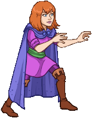

[Back to Main](index.md)

    
        
            
        
        
        Portrait
        
    
    
        
            
        
        
        Model
        
    

# Sheila

Sheila is the compassionate heart of a group of young friends whisked away to the magical world of Dungeons & Dragons. She reluctantly took on the role of Thief, using her Cloak of Invisibility to move unseen. Sensitive and loyal, Sheila strives to keep her loved ones safe, especially her younger brother, Bobby. Her supportive spirit is a powerful force as they journey together in search of a way back home.

# Basic Information

Sheila will be a new champion in the Fleetswake event on 12 March 2025 (guesstimated a week after event start potentially due to the Worst the Wait event augment).

    
        
            **Seat**:
        
        
            7
        
        
            **Stat**
        
        
            **Value**
        
        
            **Day 1 Trials**
        
        
            **Patrons**
        
    
    
        
            **Species**:
        
        
            Human
        
        
            **Strength**:
        
        
            10
        
        
            Yes
        
        
            Mirt
        
    
    
        
            **Class**:
        
        
            Rogue
        
        
            **Dexterity**:
        
        
            14
        
        
            Yes
        
        
            -
        
    
    
        
            **Roles**:
        
        
            Support / Debuff
        
        
            **Constitution**:
        
        
            11
        
        
            -
        
        
            Strahd (with Feat)
        
    
    
        
            **Age**:
        
        
            13
        
        
            **Intelligence**:
        
        
            11
        
        
            Yes
        
        
            Zariel (with Feat)
        
    
    
        
            **Gender**:
        
        
            Female
        
        
            **Wisdom**:
        
        
            15
        
        
            Yes
        
        
            Elminster
        
    
    
        
            **Alignment**:
        
        
            Neutral Good
        
        
            **Charisma**:
        
        
            12
        
        
            Yes
        
        
            &nbsp;
        
    
    
        
            **Affiliation**:
        
        
            Saturday Morning Squad
        
        
            **Total**:
        
        
            73
        
        
            Champion ID:
        
        
            160
        
    

# Formation

    <svg xmlns="http://www.w3.org/2000/svg" id="Sheila" fill="#aaa" data-formationName="Sheila" data-campaignName="Fleetswake" width="330" height="160"><circle cx="215" cy="85" r="15"/><circle cx="175" cy="65" r="15"/><circle cx="175" cy="105" r="15"/><circle cx="135" cy="85" r="15"/><circle cx="95" cy="65" r="15"/><circle cx="95" cy="105" r="15"/><circle cx="55" cy="45" r="15"/><circle cx="55" cy="125" r="15"/><circle cx="15" cy="25" r="15"/><circle cx="15" cy="145" r="15"/><text x="245" y="25" fill="#dcdcdc" font-size="25" font-family="Arial" font-weight="bold">Sheila</text><text x="245" y="65" fill="#dcdcdc" font-size="15" font-family="Arial" font-weight="bold">Fleetswake</text></svg>

# Attacks

 **Base Attack: Unseen Strike** (Melee)
> Sheila turns invisible and deals 1 hit to the closest enemy.  
> Cooldown: 6s (Cap 1.5s)

<em>Raw Data</em>

<pre>
{
    "id": 838,
    "name": "Unseen Strike",
    "description": "Sheila turns invisible and deals 1 hit to the closest enemy.",
    "long_description": "",
    "graphic_id": 0,
    "target": "front",
    "num_targets": 1,
    "aoe_radius": 0,
    "damage_modifier": 1,
    "cooldown": 6,
    "animations": [
        {
            "type": "melee_attack",
            "animation": "simple_teleport",
            "damage_frame": 34,
            "teleport_to_frame": 34,
            "teleport_from_frame": 37,
            "hit_frames": [
                34
            ]
        }
    ],
    "tags": [
        "melee"
    ],
    "damage_types": [
        "melee"
    ]
}
</pre>

 **Ultimate Attack: Ultimate Invisibility** (Level: 150)
> Sheila turns invisible for a short while and attacks each enemy.  
> Cooldown: 360s (Cap 90s)

<em>Raw Data</em>

<pre>
{
    "id": 839,
    "name": "Ultimate Invisibility",
    "description": "Sheila turns invisible and attacks each enemy.",
    "long_description": "Sheila turns invisible for a short while and attacks each enemy.",
    "graphic_id": 25742,
    "target": "all",
    "num_targets": 1,
    "aoe_radius": 0,
    "damage_modifier": 1,
    "cooldown": 360,
    "animations": [
        {
            "type": "ultimate_attack",
            "ultimate": "sheila"
        }
    ],
    "tags": [
        "melee",
        "ultimate"
    ],
    "damage_types": [
        "melee"
    ]
}
</pre>

# Abilities

 **Kind Heart** (Level: 20)
> Sheila increases the damage of all Good Champions by 100%.

<em>Raw Data</em>

<pre>
{
    "id": 16538,
    "hero_id": 160,
    "required_level": 20,
    "required_upgrade_id": 0,
    "upgrade_type": "unlock_ability",
    "effect": "effect_def,2229",
    "static_dps_mult": null,
    "default_enabled": 1,
    "name": "Kind Heart",
    "tip_text": "Sheila's inherently good nature supports other good Champions in the formation."
}
{
    "id": 2229,
    "flavour_text": "",
    "description": {
        "desc": "Sheila increases the damage of all Good Champions by $amount%."
    },
    "effect_keys": [
        {
            "effect_string": "hero_dps_multiplier_mult,100",
            "targets": [
                "all"
            ],
            "filter_targets": [
                {
                    "type": "hero_expr",
                    "hero_expr": "HasTag(`good`)"
                }
            ],
            "off_when_benched": true,
            "formation_arrows_for_effected_only": true,
            "retarget_when_any_hero_slot_changed": true,
            "retarget_when_hero_tags_changed": true
        }
    ],
    "requirements": "",
    "graphic_id": 25727,
    "large_graphic_id": 25720,
    "properties": {
        "is_formation_ability": true,
        "owner_use_outgoing_description": true
    }
}
</pre>

 **Cloak of Invisibility** (Level: 40)
> Every time Sheila attacks, the enemies become less coordinated, opening them up to more critical hits. For each attack, increase the Critical Hit Chance of all Champions by 2%, and increase their Critical Hit Damage by 10%, stacking additively up to 10 times and resetting every time you change areas.

<em>Raw Data</em>

<pre>
{
    "id": 16539,
    "hero_id": 160,
    "required_level": 40,
    "required_upgrade_id": 0,
    "upgrade_type": "unlock_ability",
    "effect": "effect_def,2228",
    "static_dps_mult": null,
    "default_enabled": 1,
    "name": "Cloak of Invisibility"
}
{
    "id": 2228,
    "flavour_text": "",
    "description": {
        "desc": "Every time Sheila attacks, the enemies become less coordinated, opening them up to more critical hits. For each attack, increase the Critical Hit Chance of all Champions by $(not_buffed amount)%, and increase their Critical Hit Damage by $(not_buffed amount___2)%, stacking additively up to $max_stacks times and resetting every time you change areas."
    },
    "effect_keys": [
        {
            "effect_string": "global_buff_base_crit_chance_add,2",
            "max_stacks": 10,
            "stacks_on_trigger": "owner_base_attack",
            "more_triggers": [
                {
                    "trigger": "area_changed",
                    "action": {
                        "type": "reset"
                    }
                }
            ],
            "off_when_benched": true,
            "show_bonus": true,
            "total_title": "Total Crit Chance Bonus"
        },
        {
            "effect_string": "global_buff_base_crit_damage,10",
            "max_stacks": 10,
            "stacks_on_trigger": "owner_base_attack",
            "more_triggers": [
                {
                    "trigger": "area_changed",
                    "action": {
                        "type": "reset"
                    }
                }
            ],
            "off_when_benched": true,
            "show_bonus": true,
            "total_title": "Total Crit Damage Bonus"
        }
    ],
    "requirements": "",
    "graphic_id": 25726,
    "large_graphic_id": 25719,
    "properties": {
        "is_formation_ability": true,
        "formation_circle_icon": false,
        "owner_use_outgoing_description": true,
        "indexed_effect_properties": true,
        "per_effect_index_bonuses": true,
        "default_bonus_index": 1
    }
}
</pre>

 **Potion Reagent Scavenger** (Level: 130)
> Sheila can help scavenge up to 2500 additional Potion Reagents when killing bosses. While this cap is not reached, Sheila has a 10% chance of scavenging 5 Potion Reagents each time a boss is defeated. The cap increases by 100 every day.

<em>Raw Data</em>

<pre>
{
    "id": 16540,
    "hero_id": 160,
    "required_level": 130,
    "required_upgrade_id": 0,
    "upgrade_type": "unlock_ability",
    "effect": "effect_def,2227",
    "static_dps_mult": null,
    "default_enabled": 1,
    "name": "Potion Reagent Scavenger",
    "tip_text": "Sheila has a chance to uncover Potion Reagents with each defeated boss, with a cap that increases every day."
}
{
    "id": 2227,
    "flavour_text": "",
    "description": {
        "desc": "Sheila can help scavenge up to $(current_scavenge_cap sheila_potion_reagent_scavenger floor) additional Potion Reagents when killing bosses. While this cap is not reached, Sheila has a $amount% chance of scavenging $amount_per_drop Potion Reagents each time a boss is defeated. The cap increases by $cap_increase_per_day every day.",
        "post": {
            "conditions": [
                {
                    "condition": "not static_desc",
                    "desc": "^^Potion Reagents Scavenged: $(stat_value sheila_reagents_collected 0 none) ($(stat_value sheila_reagents_collected_this_adventure 1 none) this adventure)"
                }
            ]
        }
    },
    "effect_keys": [
        {
            "off_when_benched": true,
            "effect_string": "scavenge_items,10",
            "id": "sheila_potion_reagent_scavenger",
            "item_type": "potion_reagents",
            "initial_cap": 2500,
            "cap_increase_per_day": 100,
            "start_date": "2025-01-01 12:00:00",
            "total_collected_stat": "sheila_reagents_collected",
            "adventure_collected_stat": "sheila_reagents_collected_this_adventure",
            "upgrade_id": 16540,
            "amount_per_drop": 5
        }
    ],
    "requirements": "",
    "graphic_id": 25728,
    "large_graphic_id": 25721,
    "properties": {
        "is_formation_ability": true,
        "formation_circle_icon": false,
        "owner_use_outgoing_description": true
    }
}
</pre>

# Specialisations

 **Meekly Meeting** (Level: 90)
> Sheila increases the damage bonus of Kind Heart by 100% for each Champion in the formation with a total ability score of 78 or less, stacking multiplicatively.

ⓘ *Note: This ability is prestack.*

<em>Raw Data</em>

<pre>
{
    "id": 16541,
    "hero_id": 160,
    "required_level": 90,
    "required_upgrade_id": 0,
    "upgrade_type": null,
    "effect": "effect_def,2226",
    "static_dps_mult": null,
    "default_enabled": 1,
    "name": "Meekly Meeting",
    "specialization_name": "Meekly Meeting",
    "specialization_description": "Sheila teams up with a bunch of underestimated heroes.",
    "specialization_graphic_id": 25737
}
{
    "id": 2226,
    "flavour_text": "",
    "description": {
        "desc": "Sheila increases the damage bonus of Kind Heart by $amount% for each Champion in the formation with a total ability score of 78 or less, stacking multiplicatively."
    },
    "effect_keys": [
        {
            "effect_string": "pre_stack,100",
            "off_when_benched": true
        },
        {
            "effect_string": "buff_upgrade,0,16538",
            "off_when_benched": true,
            "amount_expr": "upgrade_amount(16541,0)",
            "amount_func": "mult",
            "stack_func": "per_hero_attribute",
            "per_hero_expr": "GetStat(`total_ability_score`) <= 78",
            "show_bonus": true,
            "amount_updated_listeners": [
                "slot_changed",
                "ability_score_changed"
            ]
        }
    ],
    "requirements": "",
    "graphic_id": 0,
    "large_graphic_id": 25737,
    "properties": {
        "is_formation_ability": true,
        "formation_circle_icon": false,
        "owner_use_outgoing_description": true,
        "default_bonus_index": 0,
        "indexed_effect_properties": true,
        "per_effect_index_bonuses": true,
        "spec_option_post_apply_info": "Qualified Champions: $num_stacks___2"
    }
}
</pre>

 **Youthful Allies** (Level: 90)
> Sheila increases the damage bonus of Kind Heart by 100% for each Champion in the formation with an age of 20 or less, stacking multiplicatively.

ⓘ *Note: This ability is prestack.*

<em>Raw Data</em>

<pre>
{
    "id": 16542,
    "hero_id": 160,
    "required_level": 90,
    "required_upgrade_id": 0,
    "upgrade_type": null,
    "effect": "effect_def,2225",
    "static_dps_mult": null,
    "default_enabled": 1,
    "name": "Youthful Allies",
    "specialization_name": "Youthful Allies",
    "specialization_description": "Sheila's youthful friends are a force to be reckoned with.",
    "specialization_graphic_id": 25738
}
{
    "id": 2225,
    "flavour_text": "",
    "description": {
        "desc": "Sheila increases the damage bonus of Kind Heart by $amount% for each Champion in the formation with an age of 20 or less, stacking multiplicatively."
    },
    "effect_keys": [
        {
            "effect_string": "pre_stack,100",
            "off_when_benched": true
        },
        {
            "effect_string": "buff_upgrade,0,16538",
            "off_when_benched": true,
            "amount_expr": "upgrade_amount(16542,0)",
            "amount_func": "mult",
            "stack_func": "per_hero_attribute",
            "per_hero_expr": "min_age <= 20 && hero_id != 146",
            "show_bonus": true,
            "amount_updated_listeners": [
                "slot_changed",
                "ability_score_changed"
            ]
        }
    ],
    "requirements": "",
    "graphic_id": 0,
    "large_graphic_id": 25738,
    "properties": {
        "is_formation_ability": true,
        "formation_circle_icon": false,
        "owner_use_outgoing_description": true,
        "default_bonus_index": 0,
        "indexed_effect_properties": true,
        "per_effect_index_bonuses": true,
        "spec_option_post_apply_info": "Qualified Champions: $num_stacks___2"
    }
}
</pre>

 **A Rosy Outlook** (Level: 90)
> Sheila increases the damage bonus of Kind Heart by 100% for each Female or Non-Binary Champion in the formation, stacking multiplicatively.

ⓘ *Note: This ability is prestack.*

<em>Raw Data</em>

<pre>
{
    "id": 16543,
    "hero_id": 160,
    "required_level": 90,
    "required_upgrade_id": 0,
    "upgrade_type": null,
    "effect": "effect_def,2224",
    "static_dps_mult": null,
    "default_enabled": 1,
    "name": "A Rosy Outlook",
    "specialization_name": "A Rosy Outlook",
    "specialization_description": "Sheila's allies prove there's power in solidarity.",
    "specialization_graphic_id": 25733
}
{
    "id": 2224,
    "flavour_text": "",
    "description": {
        "desc": "Sheila increases the damage bonus of Kind Heart by $amount% for each Female or Non-Binary Champion in the formation, stacking multiplicatively."
    },
    "effect_keys": [
        {
            "effect_string": "pre_stack,100",
            "off_when_benched": true
        },
        {
            "effect_string": "buff_upgrade,0,16538",
            "off_when_benched": true,
            "amount_expr": "upgrade_amount(16543,0)",
            "amount_func": "mult",
            "stack_func": "per_hero_attribute",
            "per_hero_expr": "HasTag(`female`) || HasTag(`non_binary`)",
            "show_bonus": true,
            "amount_updated_listeners": [
                "slot_changed",
                "ability_score_changed"
            ]
        }
    ],
    "requirements": "",
    "graphic_id": 0,
    "large_graphic_id": 25733,
    "properties": {
        "is_formation_ability": true,
        "formation_circle_icon": false,
        "owner_use_outgoing_description": true,
        "default_bonus_index": 0,
        "indexed_effect_properties": true,
        "per_effect_index_bonuses": true,
        "spec_option_post_apply_info": "Qualified Champions: $num_stacks___2"
    }
}
</pre>

 **Frightening Strike** (Level: 200)
> Sheila's base and ultimate attacks frighten her targets. Frightened enemies take 100% more damage from critical hits, stacking multiplicatively up to 8 times per enemy.

<em>Raw Data</em>

<pre>
{
    "id": 16544,
    "hero_id": 160,
    "required_level": 200,
    "required_upgrade_id": 0,
    "upgrade_type": null,
    "effect": "effect_def,2223",
    "static_dps_mult": null,
    "default_enabled": 1,
    "name": "Frightening Strike",
    "specialization_name": "Frightening Strike",
    "specialization_description": "Sheila's attacks frighten her targets, leaving them vulnerable to critical attacks.",
    "specialization_graphic_id": 25736
}
{
    "id": 2223,
    "flavour_text": "",
    "description": {
        "desc": "Sheila's base and ultimate attacks frighten her targets. Frightened enemies take $(not_buffed amount)% more damage from critical hits, stacking multiplicatively up to 8 times per enemy."
    },
    "effect_keys": [
        {
            "effect_string": "sheila_frightening_strike,100",
            "off_when_benched": true,
            "debuff_before_damage": true,
            "debuffing_attack_ids": [
                838,
                839
            ],
            "debuff_effects": [
                {
                    "effect_string": "buff_incoming_crit_damage,100",
                    "max_stacks": 8,
                    "stacks_multiply": true,
                    "active_graphic_id": 25745,
                    "active_graphic_y": -120,
                    "use_collection_source": true,
                    "stacks_on_reapply": true,
                    "manual_stacking": true,
                    "use_stack_as_alpha": true,
                    "min_stack_alpha": 0.4,
                    "pre_max_stack_alpha": 0.8
                }
            ]
        }
    ],
    "requirements": "",
    "graphic_id": 0,
    "large_graphic_id": 25736,
    "properties": {
        "is_formation_ability": true,
        "formation_circle_icon": false,
        "owner_use_outgoing_description": true,
        "retain_on_slot_changed": true
    }
}
</pre>

 **Enraging Strike** (Level: 200)
> Sheila's base and ultimate attacks enrage her targets. The damage enraged enemies take increases by 15% every 2 seconds, stacking multiplicatively up to 30 times. The stacks reset when the enemy takes out their anger by attacking a Champion.

<em>Raw Data</em>

<pre>
{
    "id": 16545,
    "hero_id": 160,
    "required_level": 200,
    "required_upgrade_id": 0,
    "upgrade_type": null,
    "effect": "effect_def,2222",
    "static_dps_mult": null,
    "default_enabled": 1,
    "name": "Enraging Strike",
    "specialization_name": "Enraging Strike",
    "specialization_description": "Sheila's attacks anger her opponents, making them take additional damage until they strike back.",
    "specialization_graphic_id": 25735
}
{
    "id": 2222,
    "flavour_text": "",
    "description": {
        "desc": "Sheila's base and ultimate attacks enrage her targets. The damage enraged enemies take increases by 15% every 2 seconds, stacking multiplicatively up to 30 times. The stacks reset when the enemy takes out their anger by attacking a Champion."
    },
    "effect_keys": [
        {
            "effect_string": "sheila_enraging_strike",
            "off_when_benched": true,
            "debuff_before_damage": true,
            "debuffing_attack_ids": [
                838,
                839
            ],
            "debuff_effects": [
                {
                    "effect_string": "increase_monster_damage,15",
                    "max_stacks": "30",
                    "stacks_multiply": true,
                    "stacks_on_trigger": "on_timer,2",
                    "more_triggers": [
                        {
                            "trigger": "hero_attacked",
                            "target": "all_slots",
                            "action": {
                                "type": "reset"
                            }
                        }
                    ],
                    "active_graphic_id": 25744,
                    "active_graphic_y": -120,
                    "use_collection_source": true,
                    "use_stack_as_alpha": true,
                    "min_stack_alpha": 0.4,
                    "pre_max_stack_alpha": 0.8
                }
            ]
        }
    ],
    "requirements": "",
    "graphic_id": 0,
    "large_graphic_id": 25735,
    "properties": {
        "is_formation_ability": true,
        "formation_circle_icon": false,
        "owner_use_outgoing_description": true,
        "retain_on_slot_changed": true
    }
}
</pre>

 **Confusing Strike** (Level: 200)
> Sheila gains the Control role. Sheila's base and ultimate attacks confuse her targets for 3 seconds. Confused enemies are stunned, take 1000% additional damage, and face the other direction.

<em>Raw Data</em>

<pre>
{
    "id": 16546,
    "hero_id": 160,
    "required_level": 200,
    "required_upgrade_id": 0,
    "upgrade_type": null,
    "effect": "effect_def,2221",
    "static_dps_mult": null,
    "default_enabled": 1,
    "name": "Confusing Strike",
    "specialization_name": "Confusing Strike",
    "specialization_description": "Sheila's attacks confuse her foes, halting their advance for a few seconds and causing them to take additional damage.",
    "specialization_graphic_id": 25734
}
{
    "id": 2221,
    "flavour_text": "",
    "description": {
        "desc": "Sheila gains the Control role. Sheila's base and ultimate attacks confuse her targets for 3 seconds. Confused enemies are stunned, take $amount% additional damage, and face the other direction."
    },
    "effect_keys": [
        {
            "effect_string": "sheila_confusing_strike,1000",
            "off_when_benched": true,
            "debuff_before_damage": true,
            "debuffing_attack_ids": [
                838,
                839
            ],
            "debuff_effects": [
                {
                    "effect_string": "increase_monster_damage,1000",
                    "for_time": 3,
                    "use_collection_source": true
                }
            ]
        },
        {
            "effect_string": "add_attack_stun,100,3,1509",
            "off_when_benched": true
        },
        {
            "effect_string": "add_hero_tags,0,control",
            "off_when_benched": true
        }
    ],
    "requirements": "",
    "graphic_id": 0,
    "large_graphic_id": 25734,
    "properties": {
        "is_formation_ability": true,
        "formation_circle_icon": false,
        "owner_use_outgoing_description": true,
        "default_bonus_index": 0,
        "indexed_effect_properties": true,
        "per_effect_index_bonuses": true,
        "retain_on_slot_changed": true
    }
}
</pre>

# Items

    
        
            **Icons**
        
        
            **Slot**
        
        
            **Epic Name**
        
        
            **Effect**
        
    
    
        
            ID: 3794**Oversized Dress**Maybe I'll grow into it?<code>global_dps_multiplier_mult,10 allow_ge:true</code>ID: 3795**Fitted Flared Dress**Perfect for a day at the amusement park!<code>global_dps_multiplier_mult,65 allow_ge:true</code>ID: 3796**Pretty Purple Dress**Dungeon Master did a great job picking this out for me.<code>global_dps_multiplier_mult,120 allow_ge:true</code>ID: 3797**Garb of the Benevolent Thief**Now I'm ready for anything this world can throw at me.<code>global_dps_multiplier_mult,230 allow_ge:true</code>&nbsp;
        
        
            1
        
        
            Garb of the Benevolent Thief
        
        
            All Champion Damage
        
    
    
        
            ID: 3798**Runaway Present**Hey, they're getting away! Better hurry, Bobby!<code>buff_upgrade,25,16538 allow_ge:false</code>ID: 3799**Happy Hoppers**Eric says he found these in the jungle. They're kind of cute!<code>buff_upgrade,87.5,16538 allow_ge:false</code>ID: 3800**Mystery Gifts**Bobby! You forgot to open Hank and Uni's presents!<code>buff_upgrade,150,16538 allow_ge:false</code>ID: 3801**A Friendly Surprise**Thanks, guys. I haven't seen Bobby that happy in a long time.<code>buff_upgrade,275,16538 allow_ge:false</code>
        
        
            2
        
        
            A Friendly Surprise
        
        
            Kind Heart
        
    
    
        
            ID: 3802**Patchy Rags**Oh no, not another tear!<code>buff_upgrade,25,16539 allow_ge:false</code>ID: 3803**Mended Mantle**I'll be more careful with this one.<code>buff_upgrade,87.5,16539 allow_ge:false</code>ID: 3804**Cloak of Invisibility**When I put on the hood, I vanish! Watch!<code>buff_upgrade,150,16539 allow_ge:false</code>ID: 3805**Cloak of Perfect Concealment**I'll be like a ghost. Venger will never find me now.<code>buff_upgrade,275,16539 allow_ge:false</code>
        
        
            3
        
        
            Cloak of Perfect Concealment
        
        
            Cloak of Invisibility
        
    
    
        
            ID: 3806**Poorly Made Boots**These old things are ready to fall apart.<code>buff_upgrades,10,16541,16542,16543 allow_ge:false</code>ID: 3807**Just Right Boots**That's much better! No more tripping!<code>buff_upgrades,30,16541,16542,16543 allow_ge:false</code>ID: 3808**Adventuring Boots**These boots were made for adventuring, and that's just what I'll do!<code>buff_upgrades,50,16541,16542,16543 allow_ge:false</code>ID: 3809**Boots of Silent Passage**I'll be as quiet as a mouse, and ten times more dangerous.<code>buff_upgrades,100,16541,16542,16543 allow_ge:false</code>
        
        
            4
        
        
            Boots of Silent Passage
        
        
            All First Specialisations (Prestack)
        
    
    
        
            ID: 3810**Sad Little Sash**It lost its color weeks ago.<code>buff_upgrades,25,16544,16545,16546 allow_ge:false</code>ID: 3811**Functional Sash**As long as it works, I won't complain.<code>buff_upgrades,87.5,16544,16545,16546 allow_ge:false</code>ID: 3812**Bright Belt**Who knew green and purple could go so well together?<code>buff_upgrades,150,16544,16545,16546 allow_ge:false</code>ID: 3813**Waistguard of Grace**I feel so light with this on, like I could even dance on the clouds!<code>buff_upgrades,275,16544,16545,16546 allow_ge:false</code>
        
        
            5
        
        
            Waistguard of Grace
        
        
            All Second Specialisations
        
    
    
        
            ID: 3814**Danger Pin**Ouch! It keeps poking me!<code>reduce_ultimate_cooldown,9 allow_ge:false</code>ID: 3815**Safety Pin**One of these can help keep anything in place.<code>reduce_ultimate_cooldown,18 allow_ge:false</code>ID: 3816**Stylish Clasp**This keeps my cloak from falling off no matter what dangers we face.<code>reduce_ultimate_cooldown,36 allow_ge:false</code>ID: 3817**Clasp of Protection**The less I have to worry about myself, the more I can focus on Bobby.<code>reduce_ultimate_cooldown,90 allow_ge:false</code>
        
        
            6
        
        
            Clasp of Protection
        
        
            Ultimate Cooldown Reduction Cap: 501 dull / 251 shiny / 126 golden.
        
    

<em>Item Names and Descriptions</em>

<pre>
Slot 1:
             Oversized Dress: Maybe I'll grow into it?
         Fitted Flared Dress: Perfect for a day at the amusement park!
         Pretty Purple Dress: Dungeon Master did a great job picking this out for me.
Garb of the Benevolent Thief: Now I'm ready for anything this world can throw at me.

Slot 2:
             Runaway Present: Hey, they're getting away! Better hurry, Bobby!
               Happy Hoppers: Eric says he found these in the jungle. They're kind of cute!
               Mystery Gifts: Bobby! You forgot to open Hank and Uni's presents!
         A Friendly Surprise: Thanks, guys. I haven't seen Bobby that happy in a long time.

Slot 3:
                 Patchy Rags: Oh no, not another tear!
               Mended Mantle: I'll be more careful with this one.
       Cloak of Invisibility: When I put on the hood, I vanish! Watch!
Cloak of Perfect Concealment: I'll be like a ghost. Venger will never find me now.

Slot 4:
           Poorly Made Boots: These old things are ready to fall apart.
            Just Right Boots: That's much better! No more tripping!
           Adventuring Boots: These boots were made for adventuring, and that's just what I'll
                              do!
     Boots of Silent Passage: I'll be as quiet as a mouse, and ten times more dangerous.

Slot 5:
             Sad Little Sash: It lost its color weeks ago.
             Functional Sash: As long as it works, I won't complain.
                 Bright Belt: Who knew green and purple could go so well together?
         Waistguard of Grace: I feel so light with this on, like I could even dance on the
                              clouds!

Slot 6:
                  Danger Pin: Ouch! It keeps poking me!
                  Safety Pin: One of these can help keep anything in place.
               Stylish Clasp: This keeps my cloak from falling off no matter what dangers we
                              face.
         Clasp of Protection: The less I have to worry about myself, the more I can focus on
                              Bobby.
</pre>

 

# Feats

This list will only show feats that are going to be available on the release of this champion. The separate [Feats](feats.md) page may show others that could be available later if they exist.

    
        
            **Feat**
        
        
            **Effect**
        
        
            **Source**
        
    
    
        
            ID: 2109**Selflessness (Sheila)**I have to help my little brother. That's what big sisters do.<code>global_dps_multiplier_mult,10</code>Selflessness
        
        
            10% All Champion Damage
        
        
            Free
        
    
    
        
            ID: 2110**Inspiring Leader (Sheila)**Come on, everyone! We can't give up now! What would Dungeon Master say?<code>global_dps_multiplier_mult,25</code>Inspiring Leader
        
        
            25% All Champion Damage
        
        
            12,500 Gems
        
    
    
        
            ID: 2111**Heart of Copper (Sheila)**Any friend of Bobby is a friend of mine.<code>buff_upgrade,20,16538</code>Heart of Copper
        
        
            20% Kind Heart
        
        
            Free
        
    
    
        
            ID: 2112**Heart of Silver (Sheila)**We have to help those villagers. They can't defend themselves!<code>buff_upgrade,40,16538</code>Heart of Silver
        
        
            40% Kind Heart
        
        
            12,500 Gems
        
    
    
        
            ID: 2114**Unseen Advantage (Sheila)**They can't dodge so easily with their boot laces tied together!<code>buff_upgrade,40,16539,0</code>Unseen Advantage
        
        
            40% Cloak of Invisibility
        
        
            Gold Chest
        
    
    
        
            ID: 2115**Unseen Danger (Sheila)**It would be a shame if their armor fell off right as they charged, huh?<code>buff_upgrade,40,16539,1</code>Unseen Danger
        
        
            40% Cloak of Invisibility
        
        
            Gold Chest
        
    
    
        
            ID: 2116**Making Friends (Sheila)**We'll need all the help we can get if we want to make it back home.<code>buff_upgrades,20,16541,16542,16543</code>Making Friends
        
        
            20% All First Specialisations (Prestack)
        
        
            Free
        
    
    
        
            ID: 2117**Better Friends (Sheila)**With friends like mine, I know we'll make it through anything!<code>buff_upgrades,40,16541,16542,16543</code>Better Friends
        
        
            40% All First Specialisations (Prestack)
        
        
            Gold Chest
        
    
    
        
            ID: 2118**Mischief Maker (Sheila)**You can do lots of tricky things when no one can see you!<code>buff_upgrades,20,16544,16545,16546</code>Mischief Maker
        
        
            20% All Second Specialisations
        
        
            Free
        
    
    
        
            ID: 2119**Sneaky Saboteur (Sheila)**Venger's minions won't even know what hit them.<code>buff_upgrades,40,16544,16545,16546</code>Sneaky Saboteur
        
        
            40% All Second Specialisations
        
        
            12,500 Gems
        
    
    
        
            ID: 2120**Actor (Sheila)**I'm going to join the drama club at school when we get home!<code>increase_ability_score,cha,1</code>Actor
        
        
            Stat: +1 Charisma
        
        
            Event Bonus
        
    
    
        
            ID: 2121**Scholar (Sheila)**If this world is testing us, I'll have to study extra hard to pass.<code>increase_ability_score,int,2</code>Scholar
        
        
            Stat: +2 Intelligence
        
        
            Event Bonus
        
    

# Legendaries

* Increases the damage of all Champions by 10% for each Champion in the formation.
* Increases the damage of all Female Champions by 125%.
* Increases the damage of all Human Champions by 150%.
* Increases the damage of all Champions by 30% for each Champion with a WIS score of 13 or higher in the formation.
* Increases the damage of all Champions by 20% for each Champion with a CHA score of 11 or higher in the formation.
* Increases the damage of all Neutral Champions by 150%.

<em>DPS Applicable</em>

<pre>
        Arkhan: 4 / 6
       Artemis: 4 / 6
       Asharra: 5 / 6
         Azaka: 6 / 6
Beadle & Grimm: 4 / 6
        Binwin: 3 / 6
      Birdsong: 5 / 6
         Bobby: 4 / 6
        D'hani: 4 / 6
     Dark Urge: 3 / 6
        Delina: 4 / 6
       Dhadius: 5 / 6
        Drizzt: 3 / 6
           Fen: 4 / 6
         Grimm: 4 / 6
        Gromma: 5 / 6
          Ishi: 4 / 6
       Jaheira: 5 / 6
       Jamilah: 6 / 6
      Jarlaxle: 4 / 6
       Karlach: 4 / 6
           Kas: 5 / 6
          Kent: 4 / 6
         Krond: 3 / 6
          Krux: 3 / 6
       Lae'zel: 4 / 6
         Makos: 4 / 6
         NERDS: 4 / 6
        Nahara: 5 / 6
         Nixie: 5 / 6
        Orisha: 5 / 6
      Prudence: 4 / 6
         Rosie: 4 / 6
         Strix: 4 / 6
       Torogar: 3 / 6
        Warden: 3 / 6
       Warduke: 4 / 6
          Wren: 5 / 6
        Yorven: 4 / 6
         Zorbu: 3 / 6
</pre>

<em>Non-DPS Applicable</em>

<pre>
          Aeon: 4 / 6
          Aila: 5 / 6
       Alyndra: 5 / 6
       Antrius: 4 / 6
      Astarion: 4 / 6
         Avren: 4 / 6
          BBEG: 3 / 6
       Baeloth: 3 / 6
      Barrowin: 4 / 6
        Beadle: 4 / 6
       Blooshi: 5 / 6
          Brig: 4 / 6
          Briv: 3 / 6
       Bruenor: 4 / 6
      Calliope: 4 / 6
       Celeste: 5 / 6
     Certainty: 5 / 6
       Corazón: 5 / 6
        Deekin: 4 / 6
       Desmond: 4 / 6
         Diana: 5 / 6
           Dob: 3 / 6
        Donaar: 3 / 6
    Dragonbait: 3 / 6
Dungeon Master: 4 / 6
      Dynaheir: 5 / 6
      Ellywick: 5 / 6
          Eric: 5 / 6
       Evandra: 5 / 6
        Evelyn: 6 / 6
     Ezmerelda: 5 / 6
          Gale: 5 / 6
        Halsin: 4 / 6
       Havilar: 4 / 6
      Hew Maan: 5 / 6
         Hitch: 4 / 6
         Imoen: 6 / 6
      Jang Sao: 5 / 6
      K'thriss: 4 / 6
         Kalix: 3 / 6
         Korth: 4 / 6
         Krull: 3 / 6
        Krydle: 3 / 6
       Lazaapz: 5 / 6
         Mehen: 4 / 6
          Melf: 4 / 6
      Merilwen: 5 / 6
      Minthara: 5 / 6
         Miria: 4 / 6
        Môrgæn: 5 / 6
        Nayeli: 5 / 6
         Nerys: 5 / 6
        Nordom: 4 / 6
          Nova: 4 / 6
         Nrakk: 4 / 6
          Omin: 4 / 6
        Orkira: 4 / 6
       Paultin: 5 / 6
      Penelope: 4 / 6
        Presto: 5 / 6
         Pwent: 3 / 6
        Qillek: 3 / 6
     Ravengard: 5 / 6
         Regis: 4 / 6
          Reya: 5 / 6
          Rust: 4 / 6
        Selise: 6 / 6
        Sentry: 4 / 6
     Sgt. Knox: 5 / 6
   Shadowheart: 5 / 6
         Shaka: 4 / 6
       Shandie: 4 / 6
        Sheila: 6 / 6
      Sisaspia: 5 / 6
        Solaak: 4 / 6
         Spurt: 3 / 6
         Stoki: 5 / 6
   Strongheart: 4 / 6
         Talin: 3 / 6
       Tatyana: 5 / 6
      Thellora: 5 / 6
        Turiel: 3 / 6
         Tyril: 4 / 6
       Ulkoria: 5 / 6
         Uriah: 4 / 6
     Valentine: 5 / 6
            Vi: 5 / 6
       Viconia: 5 / 6
        Virgil: 4 / 6
       Vlahnya: 5 / 6
          Volo: 4 / 6
      Voronika: 4 / 6
        Walnut: 5 / 6
        Widdle: 5 / 6
       Wulfgar: 4 / 6
          Wyll: 5 / 6
        Xander: 4 / 6
</pre>

 

# Adventures and Variants

**Unlock Adventure: The Unfair Sea (Sheila)** (Complete Area 50)
> Search for some missing ships during Fleetswake in Waterdeep.

 **Variant 1: Thief!** (Complete Area 75)
> Sheila starts in the formation. She can be moved, but not removed.  
> You may only use Good champions.  
> Getting to know Sheila: Sheila's kind heart supports the abilities of the good Champions in your formation. Build the best formation to take advantage of this!

 **Variant 2: Citadel of Shadow** (Complete Area 125)
> Sheila starts in the formation. She can be moved, but not removed.  
> Karena joins the formation. Good Champions next to Karena deal no damage.  
> You may only use Champions that have an age of 20 or younger, a total ability score of 78 or lower, or Female and/or non-binary Champions.  
> Getting to know Sheila: Sheila's first specialization choice further refines which allies she works best with. Make sure you still use a Good aligned DPS to make the most of her buff!

 **Variant 3: Venger the Destroyer** (Complete Area 175)
> Sheila starts in the formation. She can be moved, but not removed.  
> At the start of each Boss area, Venger arrives on his nightmare as an additional boss that must be defeated.  
> Starting in area 51, enemies that don't have an active debuff reduce all normal attack damage to just 1 point of damage.  
> Getting to know Sheila: Sheila's second specialization choice lets you pick a different way to debuff your enemies. Use her and other debuffing Champions to defeat these enemies!

# Other Champion Images

    
        
            Console Portrait
        
    
    
        
            Gold Chest Icon
        
        
            Silver Chest Icon
        
    

[Back to Top](#top)

*Last Modified: {{ site.time }}*