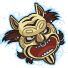

[Back to Main](index.md)

    
        
            
        
        
        Portrait
        
    
    
        
            
        
        
        Model
        
    

# Sheila

Sheila, the Thief, aged 13, has the Cloak of Invisibility which makes her invisible when the hood is raised over her head. Although occasionally emotionally vulnerable and with a great fear of being alone in the realm, Sheila regularly utilizes the stealth attributes of her cloak at great peril to herself for the benefit of the common goals of her group.

[D&D (TV Series) - Wikipedia](https://en.wikipedia.org/wiki/Dungeons_%26_Dragons_(TV_series))

# Basic Information

Sheila will be a new champion in the Fleetswake event on 5 March 2025.

    
        
            **Seat**:
        
        
            Unknown
        
    
    
        
            **Species**:
        
        
            Human (Guess)
        
    
    
        
            **Class**:
        
        
            Rogue (Guess)
        
    
    
        
            **Roles**:
        
        
            Unknown
        
    
    
        
            **Age**:
        
        
            13 (Guess)
        
    
    
        
            **Gender**:
        
        
            Female (Guess)
        
    
    
        
            **Alignment**:
        
        
            Unknown
        
    
    
        
            **Affiliation**:
        
        
            Saturday Morning Squad (Guess)
        
    

# Formation

Unknown.


    



# Attacks

Unknown.

# Abilities

**Cloak of Invisibility** (Guess)
> Unknown effect.

<em>Raw Data</em>

<pre>
{
    "id": 25726,
    "graphic": "Icons/Events/2018Fleetswake/Fleetswake_Y8/Icon_Formation_Sheila_CloakofInvisibility",
    "v": 2,
    "fs": 0,
    "p": 0,
    "type": 1,
    "export_params": {
        "uses": [
            "icon"
        ],
        "quantize": true
    }
}
</pre>

**Kind Heart** (Guess)
> Unknown effect.

<em>Raw Data</em>

<pre>
{
    "id": 25727,
    "graphic": "Icons/Events/2018Fleetswake/Fleetswake_Y8/Icon_Formation_Sheila_KindHeart",
    "v": 2,
    "fs": 0,
    "p": 0,
    "type": 1,
    "export_params": {
        "uses": [
            "icon"
        ],
        "quantize": true
    }
}
</pre>

**Potion Regent Scavenger** (Guess)
> Unknown effect.

<em>Raw Data</em>

<pre>
{
    "id": 25728,
    "graphic": "Icons/Events/2018Fleetswake/Fleetswake_Y8/Icon_Formation_Sheila_PotionRegentScavenger",
    "v": 2,
    "fs": 0,
    "p": 0,
    "type": 1,
    "export_params": {
        "uses": [
            "icon"
        ],
        "quantize": true
    }
}
</pre>

# Specialisations

**A Rosy Outlook** (Guess)
> Unknown effect.

<em>Raw Data</em>

<pre>
{
    "id": 25733,
    "graphic": "Icons/Events/2018Fleetswake/Fleetswake_Y8/Icon_Specialization_Sheila_ARosyOutlook",
    "v": 2,
    "fs": 0,
    "p": 0,
    "type": 1,
    "export_params": {
        "uses": [
            "icon"
        ],
        "quantize": true
    }
}
</pre>

**MeeklyMeeting** (Guess)
> Unknown effect.

<em>Raw Data</em>

<pre>
{
    "id": 25737,
    "graphic": "Icons/Events/2018Fleetswake/Fleetswake_Y8/Icon_Specialization_Sheila_MeeklyMeeting",
    "v": 2,
    "fs": 0,
    "p": 0,
    "type": 1,
    "export_params": {
        "uses": [
            "icon"
        ],
        "quantize": true
    }
}
</pre>

**Youthful Allies** (Guess)
> Unknown effect.

<em>Raw Data</em>

<pre>
{
    "id": 25738,
    "graphic": "Icons/Events/2018Fleetswake/Fleetswake_Y8/Icon_Specialization_Sheila_YouthfulAllies",
    "v": 2,
    "fs": 0,
    "p": 0,
    "type": 1,
    "export_params": {
        "uses": [
            "icon"
        ],
        "quantize": true
    }
}
</pre>

**Confusing Strike** (Guess)
> Unknown effect.

<em>Raw Data</em>

<pre>
{
    "id": 25734,
    "graphic": "Icons/Events/2018Fleetswake/Fleetswake_Y8/Icon_Specialization_Sheila_ConfusingStrike",
    "v": 2,
    "fs": 0,
    "p": 0,
    "type": 1,
    "export_params": {
        "uses": [
            "icon"
        ],
        "quantize": true
    }
}
</pre>

**Enraging Strike** (Guess)
> Unknown effect.

<em>Raw Data</em>

<pre>
{
    "id": 25735,
    "graphic": "Icons/Events/2018Fleetswake/Fleetswake_Y8/Icon_Specialization_Sheila_EnragingStrike",
    "v": 2,
    "fs": 0,
    "p": 0,
    "type": 1,
    "export_params": {
        "uses": [
            "icon"
        ],
        "quantize": true
    }
}
</pre>

**Frightning Strike** (Guess)
> Unknown effect.

<em>Raw Data</em>

<pre>
{
    "id": 25736,
    "graphic": "Icons/Events/2018Fleetswake/Fleetswake_Y8/Icon_Specialization_Sheila_FrightningStrike",
    "v": 2,
    "fs": 0,
    "p": 0,
    "type": 1,
    "export_params": {
        "uses": [
            "icon"
        ],
        "quantize": true
    }
}
</pre>

# Items

    
        
            **Icons**
        
        
            **Name**
        
    
    
        
            
        
        
            Belt
        
    
    
        
            
        
        
            Bobby Birthday Presents
        
    
    
        
            
        
        
            Boots
        
    
    
        
            
        
        
            Clasp
        
    
    
        
            
        
        
            Cloak Of Invisibility
        
    
    
        
            
        
        
            Clothing
        
    

# Feats

Unknown.

# Legendaries

Unknown.

# Adventures and Variants

**Unlock Adventure: The Missing Merchants (???)** (Complete Area 50)
> Discover the fate of some merchants in the jungles of Chult.

**Variant 1: TBD** (Complete Area 75)
> 

**Variant 2: TBD** (Complete Area 125)
> 

**Variant 3: TBD** (Complete Area 175)
> 

# Other Champion Images

    
        
            Console Portrait
        
    
    
        
            Gold Chest Icon
        
        
            Silver Chest Icon
        
    

[Back to Top](#top)

*Last Modified: {{ site.time }}*