[Back to Main](index.md)

# Skins

Skins that are upcoming. Most skins are real money purchases only.

Please be aware that the developers recently removed most future skins from the defines to stop Jim from being able to select them with his Wand of Wonder. This means that getting the upcoming skins has become a lot trickier for me - and so this page might not be as accurate as it once was.

ⓘ *Note: The skin portraits have tooltips which can include an animated model. Skin models can sometimes exist even when the portrait does not.*

    
        
            ID: 518**Dashing Ishi (Ishi)**
        
        
            Dashing Ishi
        
        
            Dashing Ishi Theme Pack
        
        
            3,830p
        
        
            12 Feb 2025
        
    
    
        
            ID: 519**Prom Night Presto (Presto)**
        
        
            Prom Night Presto
        
        
            Prom Night Presto Skin & Feat Pack
        
        
            1,680p
        
        
            12 Feb 2025
        
    
    
        
            ID: 520**Ballroom Vi (Vi)**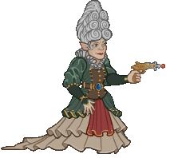
        
        
            Ballroom Vi
        
        
            Ballroom Vi Skin & Feat Pack
        
        
            1,680p
        
        
            19 Feb 2025
        
    
    
        
            ID: 521**Formal Birdsong (Birdsong)**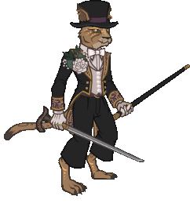
        
        
            Formal Birdsong
        
        
            Formal Birdsong Skin & Feat Pack
        
        
            1,680p
        
        
            19 Feb 2025
        
    
    
        
            ID: 523**Dragonlance BBEG (BBEG)**
        
        
            Dragonlance BBEG
        
        
            Dragonlance BBEG Skin & Feat Pack
        
        
            1,680p
        
        
            26 Feb 2025
        
    
    
        
            ID: 522**Dragonlance Thellora (Thellora)**
        
        
            Dragonlance Thellora
        
        
            Dragonlance Thellora Skin & Feat Pack
        
        
            1,680p
        
        
            26 Feb 2025
        
    
    
        
            ID: 527**Bane's Chosen Gale (Gale)**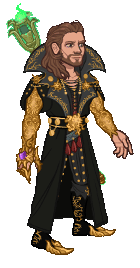
        
        
            Bane's Chosen Gale
        
        
            Bane's Chosen Gale Skin & Feat Pack
        
        
            1,680p
        
        
            05 Mar 2025
        
    
    
        
            ID: 526**Privateer Volo (Volo)**
        
        
            Privateer Volo
        
        
            Privateer Volo Theme Pack
        
        
            3,830p
        
        
            05 Mar 2025
        
    
    
        
            ID: 516**Tuxedo Kalix (Kalix)**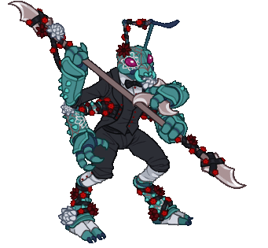
        
        
            Tuxedo Kalix
        
        
            [Weekend](weekends.md) (Guess)
        
        
            ???
        
        
            07 Mar 2025
        
    
    
        
            ID: 529**Swashbuckler Orkira (Orkira)**
        
        
            Swashbuckler Orkira
        
        
            Swashbuckler Orkira Skin & Feat Pack
        
        
            1,680p
        
        
            12 Mar 2025
        
    
    
        
            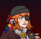ID: 528**Swashbuckler Sheila (Sheila)**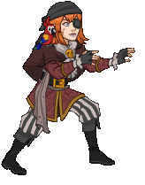
        
        
            Swashbuckler Sheila
        
        
            Swashbuckler Sheila Theme Pack
        
        
            3,830p
        
        
            12 Mar 2025
        
    
    
        
            ID: 531**Pirate Lord Nrakk (Nrakk)**
        
        
            Pirate Lord Nrakk
        
        
            Pirate Lord Nrakk Skin & Feat Pack
        
        
            1,680p
        
        
            19 Mar 2025
        
    
    
        
            ID: 530**Pirate Queen Sisaspia (Sisaspia)**
        
        
            Pirate Queen Sisaspia
        
        
            Pirate Queen Sisaspia Skin & Feat Pack
        
        
            1,680p
        
        
            19 Mar 2025
        
    
    
        
            ID: 538**Kittenlord Blooshi (Blooshi)**
        
        
            Kittenlord Blooshi
        
        
            Kittenlord Blooshi Skin & Feat Pack
        
        
            1,680p
        
        
            26 Mar 2025
        
    
    
        
            ID: 539**Lich Makos (Makos)**
        
        
            Lich Makos
        
        
            Lich Makos Skin & Feat Pack
        
        
            1,680p
        
        
            26 Mar 2025
        
    
    
        
            ID: 534**Psychomancer Beadle (Y4E15)**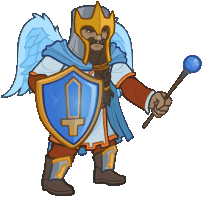
        
        
            Psychomancer Beadle
        
        
            ???
        
        
            ???
        
        
            02 Apr 2025
        
    
    
        
            ID: 535**Psychomancer Grimm (Grimm)**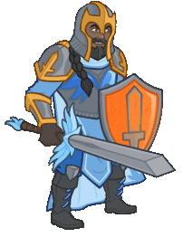
        
        
            Psychomancer Grimm
        
        
            ???
        
        
            ???
        
        
            02 Apr 2025
        
    
    
        
            ID: 533**Tavern Owner Beadle (Y4E15)**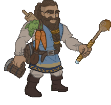
        
        
            Tavern Owner Beadle
        
        
            ???
        
        
            ???
        
        
            02 Apr 2025
        
    
    
        
            ID: 532**Tavern Owner Grimm (Grimm)**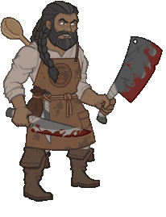
        
        
            Tavern Owner Grimm
        
        
            ???
        
        
            ???
        
        
            02 Apr 2025
        
    
    
        
            ID: 536**Vampire Hunter Beadle (Y4E15)**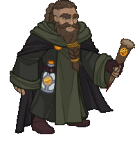
        
        
            Vampire Hunter Beadle
        
        
            ???
        
        
            ???
        
        
            02 Apr 2025
        
    
    
        
            ID: 537**Vampire Hunter Grimm (Grimm)**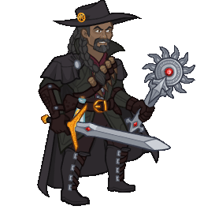
        
        
            Vampire Hunter Grimm
        
        
            ???
        
        
            ???
        
        
            02 Apr 2025
        
    
    
        
            ID: 503**Red Dragon Rider Lae'zel (Lae'zel)**
        
        
            Red Dragon Rider Lae'zel
        
        
            ???
        
        
            ???
        
        
            10 Apr 2025
        
    

[Back to Top](#top)

*Last Modified: {{ site.time }}*