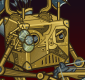
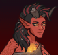
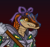

[Back to Main](index.md)

# Skins

Skins that are upcoming. Most skins are real money purchases only.

Please be aware that the developers recently removed most future skins from the defines to stop Jim from being able to select them with his Wand of Wonder. This means that getting the upcoming skins has become a lot trickier for me - and so this page might not be as accurate as it once was.

ⓘ *Note: Skins with missing portraits simply don't have that data available yet.*

    
        
            Action Figure Melf
        
        
            Action Figure Melf Skin & Feat Pack
        
        
            $11.99
        
        
            17 Apr 2024
        
    
    
        
            Chibi Spurt
        
        
            Chibi Spurt Skin & Feat Pack
        
        
            $11.99
        
        
            17 Apr 2024
        
    
    
        
            Plushie Antrius
        
        
            Plushie Antrius Skin & Feat Pack
        
        
            $11.99
        
        
            17 Apr 2024
        
    
    
        
            Aarakocra Glitch Orkira
        
        
            Aarakocra Glitch Orkira Skin & Feat Pack
        
        
            $11.99
        
        
            24 Apr 2024
        
    
    
        
            Mythic Diana
        
        
            Mythic Diana Theme Pack
        
        
            $27.99
        
        
            01 May 2024
        
    
    
        
            Painted Tortle Gromma
        
        
            Painted Tortle Gromma Theme Pack
        
        
            $27.99
        
        
            01 May 2024
        
    
    
        
            First Edition Nordom
        
        
            Classic Nordom Skin & Feat Pack
        
        
            $11.99
        
        
            08 May 2024
        
    
    
        
            Fourth Edition Nordom
        
        
            Classic Nordom Skin & Feat Pack
        
        
            $11.99
        
        
            08 May 2024
        
    
    
        
            High Harper Jaheira
        
        
            High Harper Jaheira Skin & Feat Pack
        
        
            $11.99
        
        
            08 May 2024
        
    
    
        
            Plushie Evandra
        
        
            Plushie Evandra Skin & Feat Pack
        
        
            $11.99
        
        
            15 May 2024
        
    
    
        
            Plushie Nixie
        
        
            Plushie Nixie Skin & Feat Pack
        
        
            $11.99
        
        
            15 May 2024
        
    
    
        
            Casual Karlach
        
        
            Casual Karlach Skin & Feat Pack
        
        
            $11.99
        
        
            29 May 2024
        
    
    
        
            Icewind Dale Artemis
        
        
            Icewind Dale Artemis Skin & Feat Pack
        
        
            $11.99
        
        
            29 May 2024
        
    
    
        
            Robe of the Weave Gale
        
        
            Gem Shop
        
        
            20,000
        
        
            15 Jun 2024
        
    
    
        
            Yuan-ti Glitch Havilar
        
        
            ???
        
        
            ???
        
        
            24 Jul 2024
        
    
    
        
            Wyrm Slayer Warduke
        
        
            ???
        
        
            ???
        
        
            ???
        
    

[Back to Top](#top)

*Last Modified: {{ site.time }}*