[Back to Main](index.md)

# Skins

Skins that are upcoming. Most skins are real money purchases only.

Please be aware that the developers recently removed most future skins from the defines to stop Jim from being able to select them with his Wand of Wonder. This means that getting the upcoming skins has become a lot trickier for me - and so this page might not be as accurate as it once was.

ⓘ *Note: Skins with missing portraits simply don't have that data available yet.*

    
        
            ID: 497**Sharran Celeste (Celeste)**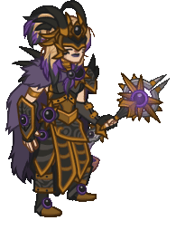
        
        
            Sharran Celeste
        
        
            Sharran Celeste Skin & Feat Pack
        
        
            1,680p
        
        
            26 Dec 2024
        
    
    
        
            ID: 498**Yule Log Nordom (Nordom)**
        
        
            Yule Log Nordom
        
        
            Yule Log Nordom Skin & Feat Pack
        
        
            1,680p
        
        
            26 Dec 2024
        
    
    
        
            ID: 506**Glasswork Golem Artemis (Artemis)**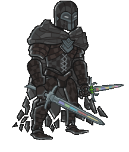
        
        
            Glasswork Golem Artemis
        
        
            Glasswork Golem Artemis Skin & Feat Pack
        
        
            1,680p
        
        
            01 Jan 2025
        
    
    
        
            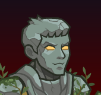ID: 505**Stone Golem Eric (Eric)**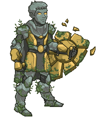
        
        
            Stone Golem Eric
        
        
            Stone Golem Eric Theme Pack
        
        
            3,830p
        
        
            01 Jan 2025
        
    
    
        
            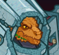ID: 507**Crystal Titan Mehen (Mehen)**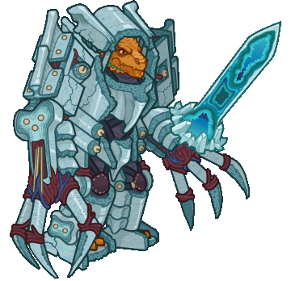
        
        
            Crystal Titan Mehen
        
        
            Crystal Titan Mehen Theme Pack
        
        
            3,830p
        
        
            08 Jan 2025
        
    
    
        
            ID: 508**Magen Baeloth (Baeloth)**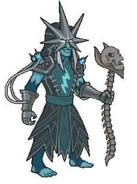
        
        
            Magen Baeloth
        
        
            Magen Baeloth Skin & Feat Pack
        
        
            1,680p
        
        
            08 Jan 2025
        
    
    
        
            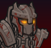ID: 509**Iron Golem Barrowin (Barrowin)**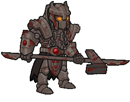
        
        
            Iron Golem Barrowin
        
        
            Iron Golem Barrowin Skin & Feat Pack
        
        
            1,680p
        
        
            15 Jan 2025
        
    
    
        
            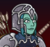ID: 510**Magen Imoen (Imoen)**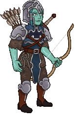
        
        
            Magen Imoen
        
        
            Magen Imoen Skin & Feat Pack
        
        
            1,680p
        
        
            15 Jan 2025
        
    
    
        
            ID: 512**Autognome Stoki (Stoki)**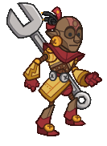
        
        
            Autognome Stoki
        
        
            Autognome Stoki Skin & Feat Pack
        
        
            1,680p
        
        
            22 Jan 2025
        
    
    
        
            ID: 514**Modron Ellywick (Ellywick)**
        
        
            Modron Ellywick
        
        
            Emergence 10
        
        
            ???
        
        
            22 Jan 2025
        
    
    
        
            ID: 515**Modron Vin Ursa (Vin Ursa)**
        
        
            Modron Vin Ursa
        
        
            Emergence 10
        
        
            ???
        
        
            22 Jan 2025
        
    
    
        
            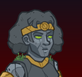ID: 511**Stone Golem Diana (Diana)**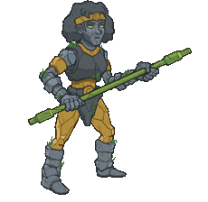
        
        
            Stone Golem Diana
        
        
            Stone Golem Diana Skin & Feat Pack
        
        
            1,680p
        
        
            22 Jan 2025
        
    
    
        
            ID: 513**Android Kent (Kent)**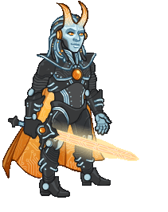
        
        
            Android Kent
        
        
            Android Kent Skin & Feat Pack
        
        
            1,680p
        
        
            29 Jan 2025
        
    
    
        
            ID: 517**Demilich Hew Maan (Hew Maan)**
        
        
            Demilich Hew Maan
        
        
            Demilich Hew Maan Skin & Feat Pack
        
        
            1,680p
        
        
            05 Feb 2025
        
    
    
        
            ID: 516**Tuxedo Kalix (Kalix)**
        
        
            Tuxedo Kalix
        
        
            Tuxedo Kalix Theme Pack
        
        
            3,830p
        
        
            05 Feb 2025
        
    
    
        
            ID: 518**Dashing Ishi (Y4E15)**
        
        
            Dashing Ishi
        
        
            Dashing Ishi Theme Pack
        
        
            3,830p
        
        
            12 Feb 2025
        
    
    
        
            ID: 519**Prom Night Presto (Presto)**
        
        
            Prom Night Presto
        
        
            Prom Night Presto Skin & Feat Pack
        
        
            1,680p
        
        
            12 Feb 2025
        
    
    
        
            ID: 520**Ballroom Vi (Vi)**
        
        
            Ballroom Vi
        
        
            Ballroom Vi Skin & Feat Pack
        
        
            1,680p
        
        
            19 Feb 2025
        
    
    
        
            ID: 521**Formal Birdsong (Birdsong)**
        
        
            Formal Birdsong
        
        
            Formal Birdsong Skin & Feat Pack
        
        
            1,680p
        
        
            19 Feb 2025
        
    
    
        
            ID: 523**Dragonlance BBEG (BBEG)**
        
        
            Dragonlance BBEG
        
        
            Dragonlance BBEG Skin & Feat Pack
        
        
            1,680p
        
        
            26 Feb 2025
        
    
    
        
            ID: 522**Dragonlance Thellora (Thellora)**
        
        
            Dragonlance Thellora
        
        
            Dragonlance Thellora Skin & Feat Pack
        
        
            1,680p
        
        
            26 Feb 2025
        
    
    
        
            ID: 503**Red Dragon Rider Lae'zel (Lae'zel)**
        
        
            Red Dragon Rider Lae'zel
        
        
            ???
        
        
            ???
        
        
            04 Dec 2032
        
    

[Back to Top](#top)

*Last Modified: {{ site.time }}*