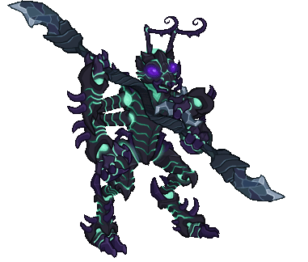
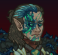
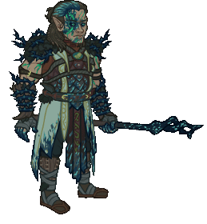
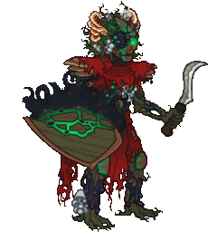
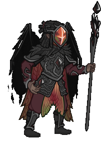
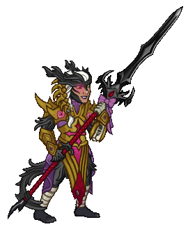
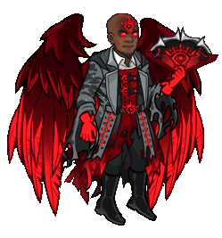

[Back to Main](index.md)

# Skins

Skins that are upcoming. Most skins are real money purchases only.

ⓘ *Note: The skin portraits have tooltips which can include an animated model. Skin models can sometimes exist even when the portrait does not. A ❌ indicates a skin with a portrait but no model - while a ✔️ indicates a skin with a model but no portrait.*

    
        
            ID: 614**Shadowfell Kalix (Kalix)**
        
        
            Shadowfell Kalix
        
        
            Emergence 13
        
        
            ???
        
        
            22 Oct 2025
        
    
    
        
            ID: 615**Shadow-Cursed Halsin (Halsin)**
        
        
            Shadow-Cursed Halsin
        
        
            Shadow-Cursed Halsin Skin & Feat Pack
        
        
            1,680p
        
        
            29 Oct 2025
        
    
    
        
            ID: 616**Action Figure Skylla (Skylla)**❌
        
        
            Action Figure Skylla
        
        
            Action Figure Skylla Theme Pack
        
        
            3,830p
        
        
            05 Nov 2025
        
    
    
        
            ID: 617**Entropic Sentry (Sentry)**
        
        
            Entropic Sentry
        
        
            Entropic Sentry Skin & Feat Pack
        
        
            1,680p
        
        
            05 Nov 2025
        
    
    
        
            ID: 618**Hemomancer Widdle (Widdle)**
        
        
            Hemomancer Widdle
        
        
            Hemomancer Widdle Skin & Feat Pack
        
        
            1,680p
        
        
            05 Nov 2025
        
    
    
        
            ID: 620**Turiel the Fallen (Turiel)**✔️
        
        
            Turiel the Fallen
        
        
            Turiel the Fallen Skin & Feat Pack
        
        
            1,680p
        
        
            12 Nov 2025
        
    
    
        
            ID: 619**Twice Cursed Havilar (Havilar)**
        
        
            Twice Cursed Havilar
        
        
            Twice Cursed Havilar Theme Pack
        
        
            3,830p
        
        
            12 Nov 2025
        
    
    
        
            ID: 621**Witch Queen Minthara (Minthara)**
        
        
            Witch Queen Minthara
        
        
            Witch Queen Minthara Skin & Feat Pack
        
        
            1,680p
        
        
            12 Nov 2025
        
    
    
        
            ID: 623**Dark Pact Virgil (Virgil)**
        
        
            Dark Pact Virgil
        
        
            Dark Pact Virgil Skin & Feat Pack
        
        
            1,680p
        
        
            19 Nov 2025
        
    
    
        
            ID: 622**Star Blight Jang Sao (Jang Sao)**
        
        
            Star Blight Jang Sao
        
        
            Star Blight Jang Sao Skin & Feat Pack
        
        
            1,680p
        
        
            19 Nov 2025
        
    
    
        
            ID: 624**Trickster Sheila (Sheila)**
        
        
            Trickster Sheila
        
        
            Trickster Sheila Skin & Feat Pack
        
        
            1,680p
        
        
            26 Nov 2025
        
    
    
        
            ID: 633**Cozy Lark (Lark)**
        
        
            Cozy Lark
        
        
            Cozy Lark Theme Pack
        
        
            3,830p
        
        
            03 Dec 2025
        
    
    
        
            ID: 625**Cozy Regis (Regis)**
        
        
            Cozy Regis
        
        
            Cozy Regis Skin & Feat Pack
        
        
            1,680p
        
        
            03 Dec 2025
        
    
    
        
            ID: 626**Winter Gloom Shadowheart (Shadowheart)**
        
        
            Winter Gloom Shadowheart
        
        
            Winter Gloom Shadowheart Skin & Feat Pack
        
        
            1,680p
        
        
            03 Dec 2025
        
    
    
        
            ID: 627**Winter Gloom Yorven (Yorven)**
        
        
            Winter Gloom Yorven
        
        
            Winter Gloom Yorven Skin & Feat Pack
        
        
            1,680p
        
        
            03 Dec 2025
        
    
    
        
            ID: 629**Cozy Halsin (Halsin)**
        
        
            Cozy Halsin
        
        
            Cozy Halsin Skin & Feat Pack
        
        
            1,680p
        
        
            10 Dec 2025
        
    
    
        
            ID: 628**Cozy Nordom (Nordom)**
        
        
            Cozy Nordom
        
        
            Cozy Nordom Theme Pack
        
        
            3,830p
        
        
            10 Dec 2025
        
    
    
        
            ID: 630**Warmduke (Warduke)**
        
        
            Warmduke
        
        
            Warmduke Skin & Feat Pack
        
        
            1,680p
        
        
            10 Dec 2025
        
    
    
        
            ID: 632**Cozy Hunter Vin Ursa (Vin Ursa)**
        
        
            Cozy Hunter Vin Ursa
        
        
            Cozy Hunter Vin Ursa Skin & Feat Pack
        
        
            1,680p
        
        
            30 Dec 2025
        
    

[Back to Top](#top)

*Last Modified: {{ site.time }}*