[Back to Main](index.md)

# Skins

Skins that are upcoming. Most skins are real money purchases only.

Please be aware that the developers recently removed most future skins from the defines to stop Jim from being able to select them with his Wand of Wonder. This means that getting the upcoming skins has become a lot trickier for me - and so this page might not be as accurate as it once was.

ⓘ *Note: The skin portraits have tooltips which can include an animated model. Skin models can sometimes exist even when the portrait does not.*

    
        
            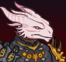ID: 542**Helldusk The Dark Urge (Dark Urge)**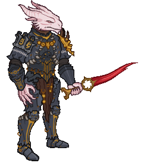
        
        
            Helldusk The Dark Urge
        
        
            Helldusk The Dark Urge Skin & Feat Pack
        
        
            1,680p
        
        
            09 Apr 2025
        
    
    
        
            ID: 543**Storm Giant Catti-brie (Catti-brie)**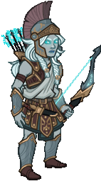
        
        
            Storm Giant Catti-brie
        
        
            Storm Giant Catti-brie Skin & Feat Pack
        
        
            1,680p
        
        
            09 Apr 2025
        
    
    
        
            ID: 568**Death Giant Kas (Kas)**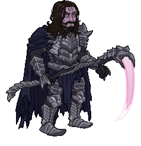
        
        
            Death Giant Kas
        
        
            Feast of the Giants Celebration (Guess)
        
        
            ???
        
        
            10 Apr 2025
        
    
    
        
            ID: 516**Tuxedo Kalix (Kalix)**
        
        
            Tuxedo Kalix
        
        
            ???
        
        
            ???
        
        
            10 Apr 2025
        
    
    
        
            ID: 545**Eternal Flame Strix (Strix)**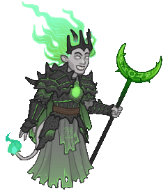
        
        
            Eternal Flame Strix
        
        
            Eternal Flame Strix Skin & Feat Pack
        
        
            1,680p
        
        
            16 Apr 2025
        
    
    
        
            ID: 544**Thunder Lord Briv (Briv)**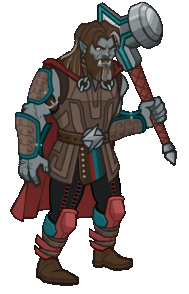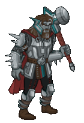
        
        
            Thunder Lord Briv
        
        
            Thunder Lord Briv Skin & Feat Pack
        
        
            1,680p
        
        
            16 Apr 2025
        
    
    
        
            ID: 546**Champion of Avernus Reya (Reya)**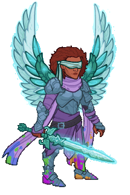
        
        
            Champion of Avernus Reya
        
        
            Champion of Avernus Reya Skin & Feat Pack
        
        
            1,680p
        
        
            23 Apr 2025
        
    
    
        
            ID: 558**Dragonlance Spurt (Spurt)**
        
        
            Dragonlance Spurt
        
        
            Emergence 11
        
        
            ???
        
        
            23 Apr 2025
        
    
    
        
            ID: 557**Highlord Miria (Miria)**
        
        
            Highlord Miria
        
        
            Emergence 11
        
        
            ???
        
        
            23 Apr 2025
        
    
    
        
            ID: 548**Mind Flayer Halsin (Halsin)**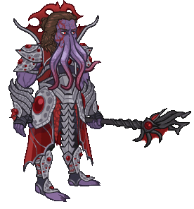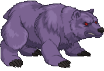
        
        
            Mind Flayer Halsin
        
        
            Mind Flayer Halsin Skin & Feat Pack
        
        
            1,680p
        
        
            30 Apr 2025
        
    
    
        
            ID: 547**Mind Flayer Minthara (Minthara)**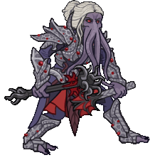
        
        
            Mind Flayer Minthara
        
        
            Mind Flayer Minthara Skin & Feat Pack
        
        
            1,680p
        
        
            30 Apr 2025
        
    
    
        
            ID: 551**Brigadier Evandra (Evandra)**
        
        
            Brigadier Evandra
        
        
            Brigadier Evandra Skin & Feat Pack
        
        
            1,680p
        
        
            07 May 2025
        
    
    
        
            ID: 503**Red Dragon Rider Lae'zel (Lae'zel)**
        
        
            Red Dragon Rider Lae'zel
        
        
            ???
        
        
            ???
        
        
            07 May 2025
        
    
    
        
            ID: 550**Tairnadal Jaheira (Jaheira)**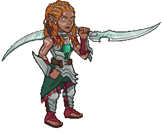
        
        
            Tairnadal Jaheira
        
        
            Tairnadal Jaheira Skin & Feat Pack
        
        
            1,680p
        
        
            07 May 2025
        
    
    
        
            ID: 549**Tempest Noble Vlithryn (Vlithryn)**
        
        
            Tempest Noble Vlithryn
        
        
            Tempest Noble Vlithryn Theme Pack
        
        
            3,830p
        
        
            07 May 2025
        
    
    
        
            ID: 552**Nomad Yorven (Yorven)**
        
        
            Nomad Yorven
        
        
            Nomad Yorven Theme Pack
        
        
            3,830p
        
        
            14 May 2025
        
    
    
        
            ID: 553**Valaes Tairn Melf (Melf)**
        
        
            Valaes Tairn Melf
        
        
            Valaes Tairn Melf Skin & Feat Pack
        
        
            1,680p
        
        
            14 May 2025
        
    
    
        
            ID: 554**Lamplighter Nixie (Nixie)**
        
        
            Lamplighter Nixie
        
        
            Lamplighter Nixie Skin & Feat Pack
        
        
            1,680p
        
        
            21 May 2025
        
    
    
        
            ID: 555**Warforged Evelyn (Evelyn)**
        
        
            Warforged Evelyn
        
        
            Warforged Evelyn Skin & Feat Pack
        
        
            1,680p
        
        
            21 May 2025
        
    
    
        
            ID: 556**Prodigal Son Wyll (Wyll)**
        
        
            Prodigal Son Wyll
        
        
            Prodigal Son Wyll Skin & Feat Pack
        
        
            1,680p
        
        
            28 May 2025
        
    
    
        
            ID: 559**Dracolich Duke Ravengard (Ravengard)**
        
        
            Dracolich Duke Ravengard
        
        
            Dracolich Duke Ravengard Skin & Feat Pack
        
        
            1,680p
        
        
            04 Jun 2025
        
    
    
        
            ID: 560**Dragonslayer Hank (Hank)**
        
        
            Dragonslayer Hank
        
        
            Dragonslayer Hank Theme Pack
        
        
            3,830p
        
        
            04 Jun 2025
        
    
    
        
            ID: 561**Dragon Rider Krond (Krond)**
        
        
            Dragon Rider Krond
        
        
            Dragon Rider Krond Theme Pack
        
        
            3,830p
        
        
            11 Jun 2025
        
    
    
        
            ID: 562**Reaper BBEG (BBEG)**
        
        
            Reaper BBEG
        
        
            Reaper BBEG Skin & Feat Pack
        
        
            1,680p
        
        
            11 Jun 2025
        
    
    
        
            ID: 565**Cosmic Dragon Nova (Nova)**
        
        
            Cosmic Dragon Nova
        
        
            Cosmic Dragon Nova Skin & Feat Pack
        
        
            1,680p
        
        
            18 Jun 2025
        
    
    
        
            ID: 563**Dragon King Dungeon Master (DM)**
        
        
            Dragon King Dungeon Master
        
        
            Dragon King Dungeon Master Skin & Feat Pack
        
        
            1,680p
        
        
            18 Jun 2025
        
    
    
        
            ID: 564**Skypirate Antrius (Antrius)**
        
        
            Skypirate Antrius
        
        
            Skypirate Antrius Skin & Feat Pack
        
        
            1,680p
        
        
            18 Jun 2025
        
    
    
        
            ID: 566**Cataclysmic Kas (Kas)**
        
        
            Cataclysmic Kas
        
        
            Cataclysmic Kas Skin & Feat Pack
        
        
            1,680p
        
        
            25 Jun 2025
        
    
    
        
            ID: 567**Dragonskull Bobby (Bobby)**
        
        
            Dragonskull Bobby
        
        
            Dragonskull Bobby Skin & Feat Pack
        
        
            1,680p
        
        
            25 Jun 2025
        
    

[Back to Top](#top)

*Last Modified: {{ site.time }}*