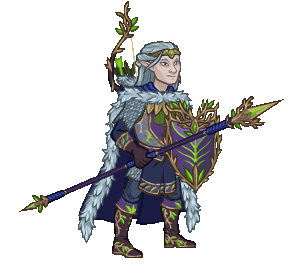
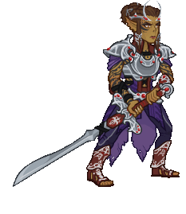
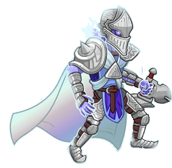
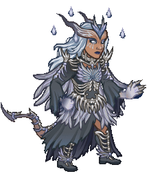
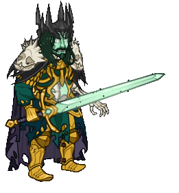

[Back to Main](index.md)

# Skins

Skins that are upcoming. Most skins are real money purchases only.

ⓘ *Note: The skin portraits have tooltips which can include an animated model. Skin models can sometimes exist even when the portrait does not. A ❌ indicates a skin with a portrait but no model - while a ✔️ indicates a skin with a model but no portrait.*

    
        
            ID: 603**Prince Brightflame (Melf)**
        
        
            Prince Brightflame
        
        
            Adventure: An Acidic Welcome
        
        
            Free
        
        
            24 Sept 2025
        
    
    
        
            ID: 604**Knight of the Comet Lae'zel (Lae'zel)**
        
        
            Knight of the Comet Lae'zel
        
        
            Adventure: For Victory
        
        
            Free
        
        
            24 Sept 2025
        
    
    
        
            ID: 605**Guardian of Illefarn (King of Shadows)**
        
        
            Guardian of Illefarn
        
        
            King of Shadows Origin Theme Pack
        
        
            0p
        
        
            01 Oct 2025
        
    
    
        
            ID: 606**Raven Queen Astarion (Astarion)**
        
        
            Raven Queen Astarion
        
        
            Raven Queen Astarion Skin & Feat Pack
        
        
            1,680p
        
        
            01 Oct 2025
        
    
    
        
            ID: 607**Raven Queen Thellora (Thellora)**
        
        
            Raven Queen Thellora
        
        
            Raven Queen Thellora Skin & Feat Pack
        
        
            1,680p
        
        
            01 Oct 2025
        
    
    
        
            ID: 608**Darklord Farideh (Farideh)**✔️
        
        
            Darklord Farideh
        
        
            Darklord Farideh Theme Pack
        
        
            3,830p
        
        
            08 Oct 2025
        
    
    
        
            ID: 609**Lord of Undeath Kas (Kas)**
        
        
            Lord of Undeath Kas
        
        
            Lord of Undeath Kas Skin & Feat Pack
        
        
            1,680p
        
        
            08 Oct 2025
        
    
    
        
            ID: 610**Shadowfell Ezmerelda (Ezmerelda)**
        
        
            Shadowfell Ezmerelda
        
        
            Shadowfell Ezmerelda Skin & Feat Pack
        
        
            1,680p
        
        
            08 Oct 2025
        
    
    
        
            ID: 611**Avren in a Jar (Avren)**
        
        
            Avren in a Jar
        
        
            Avren in a Jar Skin & Feat Pack
        
        
            1,680p
        
        
            15 Oct 2025
        
    
    
        
            ID: 612**Nightwalker Krond (Krond)**
        
        
            Nightwalker Krond
        
        
            Nightwalker Krond Skin & Feat Pack
        
        
            1,680p
        
        
            15 Oct 2025
        
    
    
        
            ID: 615**Shadow-Cursed Halsin (Halsin)**
        
        
            Shadow-Cursed Halsin
        
        
            Shadow-Cursed Halsin Skin & Feat Pack
        
        
            1,680p
        
        
            29 Oct 2025
        
    
    
        
            ID: 616**Action Figure Skylla (Skylla)**
        
        
            Action Figure Skylla
        
        
            Action Figure Skylla Theme Pack
        
        
            3,830p
        
        
            05 Nov 2025
        
    
    
        
            ID: 617**Entropic Sentry (Sentry)**
        
        
            Entropic Sentry
        
        
            Entropic Sentry Skin & Feat Pack
        
        
            1,680p
        
        
            05 Nov 2025
        
    
    
        
            ID: 618**Hemomancer Widdle (Widdle)**
        
        
            Hemomancer Widdle
        
        
            Hemomancer Widdle Skin & Feat Pack
        
        
            1,680p
        
        
            05 Nov 2025
        
    
    
        
            ID: 620**Turiel the Fallen (Turiel)**
        
        
            Turiel the Fallen
        
        
            Turiel the Fallen Skin & Feat Pack
        
        
            1,680p
        
        
            12 Nov 2025
        
    
    
        
            ID: 619**Twice Cursed Havilar (Havilar)**
        
        
            Twice Cursed Havilar
        
        
            Twice Cursed Havilar Theme Pack
        
        
            3,830p
        
        
            12 Nov 2025
        
    
    
        
            ID: 621**Witch Queen Minthara (Minthara)**
        
        
            Witch Queen Minthara
        
        
            Witch Queen Minthara Skin & Feat Pack
        
        
            1,680p
        
        
            12 Nov 2025
        
    
    
        
            ID: 623**Dark Pact Virgil (Virgil)**
        
        
            Dark Pact Virgil
        
        
            Dark Pact Virgil Skin & Feat Pack
        
        
            1,680p
        
        
            19 Nov 2025
        
    
    
        
            ID: 622**Star Blight Jang Sao (Jang Sao)**
        
        
            Star Blight Jang Sao
        
        
            Star Blight Jang Sao Skin & Feat Pack
        
        
            1,680p
        
        
            19 Nov 2025
        
    
    
        
            ID: 624**Trickster Sheila (Sheila)**
        
        
            Trickster Sheila
        
        
            Trickster Sheila Skin & Feat Pack
        
        
            1,680p
        
        
            26 Nov 2025
        
    
    
        
            ID: 633**Cozy Lark (Lark)**
        
        
            Cozy Lark
        
        
            Cozy Lark Theme Pack
        
        
            3,830p
        
        
            03 Dec 2025
        
    
    
        
            ID: 625**Cozy Regis (Regis)**
        
        
            Cozy Regis
        
        
            Cozy Regis Skin & Feat Pack
        
        
            1,680p
        
        
            03 Dec 2025
        
    
    
        
            ID: 626**Winter Gloom Shadowheart (Shadowheart)**
        
        
            Winter Gloom Shadowheart
        
        
            Winter Gloom Shadowheart Skin & Feat Pack
        
        
            1,680p
        
        
            03 Dec 2025
        
    
    
        
            ID: 627**Winter Gloom Yorven (Yorven)**
        
        
            Winter Gloom Yorven
        
        
            Winter Gloom Yorven Skin & Feat Pack
        
        
            1,680p
        
        
            03 Dec 2025
        
    
    
        
            ID: 629**Cozy Halsin (Halsin)**
        
        
            Cozy Halsin
        
        
            Cozy Halsin Skin & Feat Pack
        
        
            1,680p
        
        
            10 Dec 2025
        
    
    
        
            ID: 628**Cozy Nordom (Nordom)**
        
        
            Cozy Nordom
        
        
            Cozy Nordom Theme Pack
        
        
            3,830p
        
        
            10 Dec 2025
        
    
    
        
            ID: 630**Warmduke (Warduke)**
        
        
            Warmduke
        
        
            Warmduke Skin & Feat Pack
        
        
            1,680p
        
        
            10 Dec 2025
        
    
    
        
            ID: 632**Cozy Hunter Vin Ursa (Vin Ursa)**
        
        
            Cozy Hunter Vin Ursa
        
        
            Cozy Hunter Vin Ursa Skin & Feat Pack
        
        
            1,680p
        
        
            30 Dec 2025
        
    

[Back to Top](#top)

*Last Modified: {{ site.time }}*