[Back to Main](index.md)

# Skins

Skins that are upcoming. Most skins are real money purchases only.

ⓘ *Note: The skin portraits have tooltips which can include an animated model. Skin models can sometimes exist even when the portrait does not. A ❌ indicates a skin with a portrait but no model - while a ✔️ indicates a skin with a model but no portrait.*

    
        
            ID: 640**Oerth Kas (Kas)**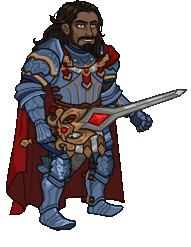
        
        
            Oerth Kas
        
        
            Adventure: No Rest for the Wicked
        
        
            Free
        
        
            23 Dec 2025
        
    
    
        
            ID: 631**Pirate Kalix (Kalix)**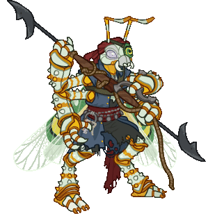
        
        
            Pirate Kalix
        
        
            Champions of Renown: Year 8 All Star Pack
        
        
            8,000p
        
        
            23 Dec 2025
        
    
    
        
            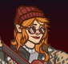ID: 635**Cozy Calliope (Calliope)**
        
        
            Cozy Calliope
        
        
            Emergence 14
        
        
            ???
        
        
            23 Dec 2025
        
    
    
        
            ID: 639**Simril Siren Ellywick (Ellywick)**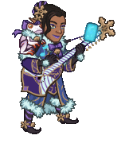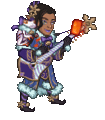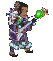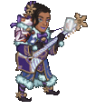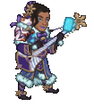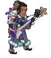
        
        
            Simril Siren Ellywick
        
        
            Newsletter
        
        
            ???
        
        
            23 Dec 2025
        
    
    
        
            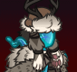ID: 632**Cozy Hunter Vin Ursa (Vin Ursa)**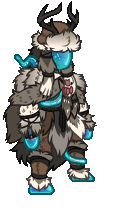
        
        
            Cozy Hunter Vin Ursa
        
        
            Cozy Hunter Vin Ursa Skin & Feat Pack
        
        
            1,680p
        
        
            30 Dec 2025
        
    
    
        
            ID: 644**Winter Wraith Artemis (Artemis)**
        
        
            Winter Wraith Artemis
        
        
            Winter Wraith Artemis Skin & Feat Pack
        
        
            1,680p
        
        
            07 Jan 2026
        
    
    
        
            ID: 643**Wintershield Knight Anson (Anson)**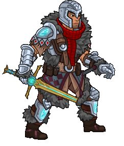
        
        
            Wintershield Knight Anson
        
        
            Wintershield Knight Anson Theme Pack
        
        
            3,830p
        
        
            07 Jan 2026
        
    
    
        
            ID: 647**Blade of the North Wyll (Wyll)**
        
        
            Blade of the North Wyll
        
        
            Blade of the North Wyll Skin & Feat Pack
        
        
            1,680p
        
        
            14 Jan 2026
        
    
    
        
            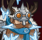ID: 645**Cold Brew Binwin (Binwin)**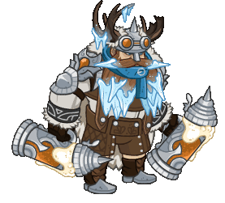
        
        
            Cold Brew Binwin
        
        
            Cold Brew Binwin Theme Pack
        
        
            3,830p
        
        
            14 Jan 2026
        
    
    
        
            ID: 646**Heroic Eric (Eric)**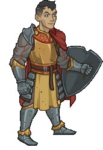
        
        
            Heroic Eric
        
        
            Heroic Eric Skin & Feat Pack
        
        
            1,680p
        
        
            14 Jan 2026
        
    
    
        
            ID: 649**Winter Nightmare Viconia (Viconia)**
        
        
            Winter Nightmare Viconia
        
        
            Winter Nightmare Viconia Skin & Feat Pack
        
        
            1,680p
        
        
            21 Jan 2026
        
    
    
        
            ID: 648**Wintershield Knight Baeloth (Baeloth)**
        
        
            Wintershield Knight Baeloth
        
        
            Wintershield Knight Baeloth Skin & Feat Pack
        
        
            1,680p
        
        
            21 Jan 2026
        
    
    
        
            ID: 641**Blood War Duke Ravengard (Ravengard)**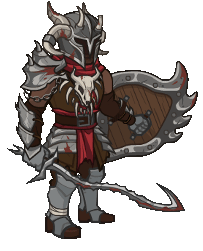
        
        
            Blood War Duke Ravengard
        
        
            Tales of the Champions (Guess)
        
        
            ???
        
        
            28 Jan 2026
        
    
    
        
            ID: 642**Pirate King Spurt (Spurt)**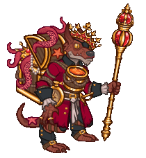
        
        
            Pirate King Spurt
        
        
            Tales of the Champions (Guess)
        
        
            ???
        
        
            28 Jan 2026
        
    
    
        
            ID: 650**Pirate Dragonbait (Dragonbait)**
        
        
            Pirate Dragonbait
        
        
            Pirate Dragonbait Skin & Feat Pack
        
        
            1,680p
        
        
            28 Jan 2026
        
    
    
        
            ID: 651**Scarlet Corsair Dark Urge (Dark Urge)**
        
        
            Scarlet Corsair Dark Urge
        
        
            Scarlet Corsair Dark Urge Skin & Feat Pack
        
        
            1,680p
        
        
            28 Jan 2026
        
    
    
        
            ID: 652**Ancient Hew Maan (Hew Maan)**
        
        
            Ancient Hew Maan
        
        
            Ancient Hew Maan Skin & Feat Pack
        
        
            1,680p
        
        
            04 Feb 2026
        
    
    
        
            ID: 661**Ancient Kyre (Kyre)**
        
        
            Ancient Kyre
        
        
            Ancient Kyre Theme Pack
        
        
            3,830p
        
        
            04 Feb 2026
        
    
    
        
            ID: 653**Primordial Fire Karlach (Karlach)**
        
        
            Primordial Fire Karlach
        
        
            Primordial Fire Karlach Skin & Feat Pack
        
        
            1,680p
        
        
            04 Feb 2026
        
    
    
        
            ID: 656**Ancient Magus Presto (Presto)**
        
        
            Ancient Magus Presto
        
        
            Ancient Magus Presto Skin & Feat Pack
        
        
            1,680p
        
        
            11 Feb 2026
        
    
    
        
            ID: 654**Mountain Donaar (Donaar)**
        
        
            Mountain Donaar
        
        
            Mountain Donaar Theme Pack
        
        
            3,830p
        
        
            11 Feb 2026
        
    
    
        
            ID: 655**Primordial Earth Kalix (Kalix)**
        
        
            Primordial Earth Kalix
        
        
            Primordial Earth Kalix Skin & Feat Pack
        
        
            1,680p
        
        
            11 Feb 2026
        
    
    
        
            ID: 657**Primordial Air Birdsong (Birdsong)**
        
        
            Primordial Air Birdsong
        
        
            Primordial Air Birdsong Skin & Feat Pack
        
        
            1,680p
        
        
            18 Feb 2026
        
    
    
        
            ID: 658**Winter Hexblade K'thriss (K'thriss)**
        
        
            Winter Hexblade K'thriss
        
        
            Winter Hexblade K'thriss Skin & Feat Pack
        
        
            1,680p
        
        
            18 Feb 2026
        
    
    
        
            ID: 660**Lord of Murder Dark Urge (Dark Urge)**
        
        
            Lord of Murder Dark Urge
        
        
            Lord of Murder Dark Urge Skin & Feat Pack
        
        
            1,680p
        
        
            25 Feb 2026
        
    
    
        
            ID: 659**Undying Queen Lae'zel (Lae'zel)**
        
        
            Undying Queen Lae'zel
        
        
            Undying Queen Lae'zel Skin & Feat Pack
        
        
            1,680p
        
        
            25 Feb 2026
        
    

[Back to Top](#top)

*Last Modified: {{ site.time }}*