[Back to Main](index.md)

# Skins

Skins that are upcoming. Most skins are real money purchases only.

Please be aware that the developers recently removed most future skins from the defines to stop Jim from being able to select them with his Wand of Wonder. This means that getting the upcoming skins has become a lot trickier for me - and so this page might not be as accurate as it once was.

ⓘ *Note: Skins with missing portraits simply don't have that data available yet.*

    
        
            ID: 488**Herald of Lore Turiel (Turiel)**
        
        
            Herald of Lore Turiel
        
        
            Herald of Lore Turiel Skin & Feat Pack
        
        
            1,680p
        
        
            20 Nov 2024
        
    
    
        
            ID: 489**Herald of Waterdeep Virgil (Virgil)**
        
        
            Herald of Waterdeep Virgil
        
        
            Herald of Waterdeep Virgil Skin & Feat Pack
        
        
            1,680p
        
        
            20 Nov 2024
        
    
    
        
            ID: 483**Goblin Glitch Calliope (Calliope)**
        
        
            Goblin Glitch Calliope
        
        
            Goblin Glitch Calliope Skin & Feat Pack
        
        
            1,680p
        
        
            27 Nov 2024
        
    
    
        
            ID: 499**Helldusk Karlach (Karlach)**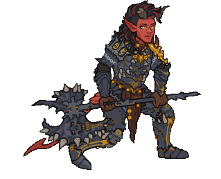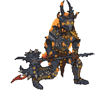
        
        
            Helldusk Karlach
        
        
            Champions of Renown: Year 7 All Star Pack
        
        
            8,000p
        
        
            27 Nov 2024
        
    
    
        
            ID: 490**Herald of the Champions Dungeon Master (DM)**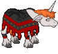
        
        
            Herald of the Champions Dungeon Master
        
        
            Herald of the Champions Dungeon Master Skin & Feat Pack
        
        
            1,680p
        
        
            27 Nov 2024
        
    
    
        
            ID: 500**Moonlight Halsin (Halsin)**
        
        
            Moonlight Halsin
        
        
            Moonlight Halsin Theme Pack
        
        
            3,830p
        
        
            04 Dec 2024
        
    
    
        
            ID: 502**Potent Gale (Gale)**
        
        
            Potent Gale
        
        
            ???
        
        
            ???
        
        
            04 Dec 2024
        
    
    
        
            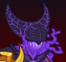ID: 493**Shadow Warduke (Warduke)**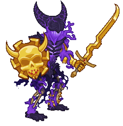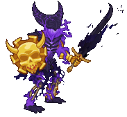
        
        
            Shadow Warduke
        
        
            Shadow Warduke Skin & Feat Pack
        
        
            1,680p
        
        
            04 Dec 2024
        
    
    
        
            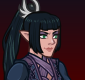ID: 492**Sharran Shadowheart (Shadowheart)**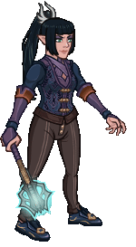
        
        
            Sharran Shadowheart
        
        
            Shadowheart's Champions of Renown Pack
        
        
            0p
        
        
            04 Dec 2024
        
    
    
        
            ID: 494**Selunite Shadowheart (Shadowheart)**
        
        
            Selunite Shadowheart
        
        
            Selûnite Shadowheart Skin & Feat Pack
        
        
            1,680p
        
        
            11 Dec 2024
        
    
    
        
            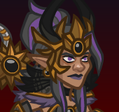ID: 491**Sharran Stoki (Stoki)**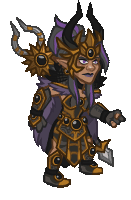
        
        
            Sharran Stoki
        
        
            Sharran Stoki Theme Pack
        
        
            3,830p
        
        
            11 Dec 2024
        
    
    
        
            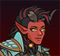ID: 501**Grymforge Karlach (Karlach)**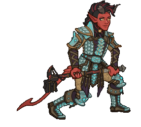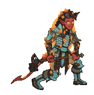
        
        
            Grymforge Karlach
        
        
            Grymforge Karlach Party Pack
        
        
            0p
        
        
            12 Dec 2024
        
    
    
        
            ID: 495**Moonlight Regis (Regis)**
        
        
            Moonlight Regis
        
        
            Moonlight Regis Skin & Feat Pack
        
        
            1,680p
        
        
            18 Dec 2024
        
    
    
        
            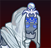ID: 496**Selûnite Warden (Warden)**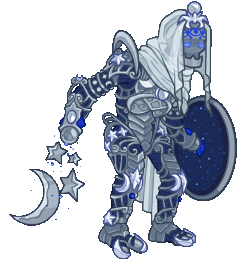
        
        
            Selûnite Warden
        
        
            Selûnite Warden Skin & Feat Pack
        
        
            1,680p
        
        
            18 Dec 2024
        
    
    
        
            ID: 497**Sharran Celeste (Celeste)**
        
        
            Sharran Celeste
        
        
            Sharran Celeste Skin & Feat Pack
        
        
            1,680p
        
        
            26 Dec 2024
        
    
    
        
            ID: 498**Yule Log Nordom (Nordom)**
        
        
            Yule Log Nordom
        
        
            Yule Log Nordom Skin & Feat Pack
        
        
            1,680p
        
        
            26 Dec 2024
        
    
    
        
            ID: 503**Red Dragon Rider Lae'zel (Lae'zel)**
        
        
            Red Dragon Rider Lae'zel
        
        
            ???
        
        
            ???
        
        
            04 Dec 2032
        
    

[Back to Top](#top)

*Last Modified: {{ site.time }}*