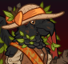
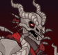

[Back to Main](index.md)

# Skins

Skins that are upcoming. Most skins are real money purchases only.

Please be aware that the developers recently removed most future skins from the defines to stop Jim from being able to select them with his Wand of Wonder. This means that getting the upcoming skins has become a lot trickier for me - and so this page might not be as accurate as it once was.

ⓘ *Note: Skins with missing portraits simply don't have that data available yet.*

    
        
            ID: 464**Harvestguard Bobby (Bobby)**Harvestguard Bobby
        
        
            Harvestguard Bobby Theme Pack
        
        
            $27.99
        
        
            04 Sept 2024
        
    
    
        
            ID: 466**Harvestguard D'hani (D'hani)**Harvestguard D'hani
        
        
            Harvestguard D'hani Skin & Feat Pack
        
        
            $11.99
        
        
            04 Sept 2024
        
    
    
        
            ID: 478**Harvestguard Presto (Presto)**Harvestguard Presto
        
        
            Anniversary Celebration
        
        
            ???
        
        
            04 Sept 2024
        
    
    
        
            ID: 463**Mind Flayer Minsc (Minsc)**Mind Flayer Minsc
        
        
            Founder's Pack VII
        
        
            $19.99
        
        
            04 Sept 2024
        
    
    
        
            ID: 465**Harvestguard Rosie (Rosie)**Harvestguard Rosie
        
        
            Harvestguard Rosie Theme Pack
        
        
            $27.99
        
        
            11 Sept 2024
        
    
    
        
            ID: 467**Harvestguard Wulfgar (Wulfgar)**Harvestguard Wulfgar
        
        
            Harvestguard Wulfgar Skin & Feat Pack
        
        
            $11.99
        
        
            11 Sept 2024
        
    
    
        
            ID: 468**Harvestguard Certainty (Certainty)**Harvestguard Certainty
        
        
            Harvestguard Certainty Skin & Feat Pack
        
        
            $11.99
        
        
            18 Sept 2024
        
    
    
        
            ID: 469**Harvestguard Farideh (Farideh)**Harvestguard Farideh
        
        
            Harvestguard Farideh Skin & Feat Pack
        
        
            $11.99
        
        
            18 Sept 2024
        
    
    
        
            ID: 470**Chibi Gale (Gale)**Chibi Gale
        
        
            Chibi Gale Skin & Feat Pack
        
        
            $11.99
        
        
            25 Sept 2024
        
    
    
        
            ID: 471**Plushie BBEG (BBEG)**Plushie BBEG
        
        
            Plushie BBEG Skin & Feat Pack
        
        
            $11.99
        
        
            25 Sept 2024
        
    
    
        
            ID: 442**Baldur's Gate Duke Ravengard (Ravengard)**Baldur's Gate Duke Ravengard
        
        
            Gem Shop
        
        
            20,000
        
        
            26 Sept 2024
        
    
    
        
            ID: 443**Wyrm Slayer Warduke (Warduke)**Wyrm Slayer Warduke
        
        
            Gem Shop
        
        
            20,000
        
        
            26 Sept 2024
        
    
    
        
            ID: 474**Darklord Kas (Kas)**Darklord Kas
        
        
            Darklord Kas Theme Pack
        
        
            $27.99
        
        
            02 Oct 2024
        
    
    
        
            ID: 472**Vampire Hunter Voronika (Voronika)**Vampire Hunter Voronika
        
        
            Vampire Hunter Voronika Theme Pack
        
        
            $27.99
        
        
            02 Oct 2024
        
    
    
        
            ID: 473**Ascended Astarion (Astarion)**Ascended Astarion
        
        
            Ascended Astarion Skin & Feat Pack
        
        
            $11.99
        
        
            09 Oct 2024
        
    
    
        
            ID: 479**Cursed Banshee Thellora (Thellora)**Cursed Banshee Thellora
        
        
            Cursed Banshee Thellora Skin & Feat Pack
        
        
            $11.99
        
        
            09 Oct 2024
        
    
    
        
            ID: 475**Headless Horseman Kent (Kent)**Headless Horseman Kent
        
        
            Headless Horseman Kent Skin & Feat Pack
        
        
            $11.99
        
        
            16 Oct 2024
        
    
    
        
            ID: 480**Werebear Donaar (Donaar)**Werebear Donaar
        
        
            Werebear Donaar Skin & Feat Pack
        
        
            $11.99
        
        
            16 Oct 2024
        
    
    
        
            ID: 461**Nosferatu Widdle (Widdle)**Nosferatu Widdle
        
        
            Emergence 9 (Guess)
        
        
            ???
        
        
            23 Oct 2024
        
    
    
        
            ID: 481**Vampire Hunter Desmond (Desmond)**Vampire Hunter Desmond
        
        
            Vampire Hunter Desmond Skin & Feat Pack
        
        
            $11.99
        
        
            23 Oct 2024
        
    
    
        
            ID: 462**Vampire Nahara (Nahara)**Vampire Nahara
        
        
            Emergence 9 (Guess)
        
        
            ???
        
        
            23 Oct 2024
        
    
    
        
            ID: 476**Vampire Viconia (Viconia)**Vampire Viconia
        
        
            Vampire Viconia Skin & Feat Pack
        
        
            $11.99
        
        
            23 Oct 2024
        
    
    
        
            ID: 477**Devil Wyll (Wyll)**Devil Wyll
        
        
            Devil Wyll Skin & Feat Pack
        
        
            $11.99
        
        
            30 Oct 2024
        
    

[Back to Top](#top)

*Last Modified: {{ site.time }}*