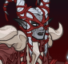
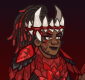
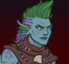
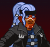

[Back to Main](index.md)

# Skins

Skins that are upcoming. Most skins are real money purchases only.

Please be aware that the developers recently removed most future skins from the defines to stop Jim from being able to select them with his Wand of Wonder. This means that getting the upcoming skins has become a lot trickier for me - and so this page might not be as accurate as it once was.

ⓘ *Note: Skins with missing portraits simply don't have that data available yet.*

    
        
            Casual Karlach
        
        
            Casual Karlach Skin & Feat Pack
        
        
            $11.99
        
        
            29 May 2024
        
    
    
        
            Icewind Dale Artemis
        
        
            Icewind Dale Artemis Skin & Feat Pack
        
        
            $11.99
        
        
            29 May 2024
        
    
    
        
            Wyrm Slayer Ezmerelda
        
        
            Wyrm Slayer Ezmerelda Theme Pack
        
        
            $27.99
        
        
            05 Jun 2024
        
    
    
        
            Wyrm Slayer Ravengard
        
        
            Wyrm Slayer Ravengard Theme Pack
        
        
            $27.99
        
        
            05 Jun 2024
        
    
    
        
            Wyrm Slayer BBEG
        
        
            Wyrm Slayer BBEG Skin & Feat Pack
        
        
            $11.99
        
        
            12 Jun 2024
        
    
    
        
            Wyrm Slayer Selise
        
        
            Wyrm Slayer Selise Skin & Feat Pack
        
        
            $11.99
        
        
            12 Jun 2024
        
    
    
        
            Robe of the Weave Gale
        
        
            Gem Shop
        
        
            20,000
        
        
            15 Jun 2024
        
    
    
        
            Wyrm Slayer Korth
        
        
            Wyrm Slayer Korth Skin & Feat Pack
        
        
            $11.99
        
        
            19 Jun 2024
        
    
    
        
            Wyrm Slayer Nova
        
        
            Wyrm Slayer Nova Skin & Feat Pack
        
        
            $11.99
        
        
            19 Jun 2024
        
    
    
        
            Chibi Birdsong
        
        
            Chibi Birdsong Skin & Feat Pack
        
        
            $11.99
        
        
            26 Jun 2024
        
    
    
        
            Detective Umberto
        
        
            Detective Umberto Theme Pack
        
        
            $27.99
        
        
            03 Jul 2024
        
    
    
        
            Detective Deekin
        
        
            Detective Deekin Skin & Feat Pack
        
        
            $11.99
        
        
            10 Jul 2024
        
    
    
        
            Infiltrator Nahara
        
        
            Infiltrator Nahara Skin & Feat Pack
        
        
            $11.99
        
        
            10 Jul 2024
        
    
    
        
            Agent Vin Ursa
        
        
            Agent Vin Ursa Skin & Feat Pack
        
        
            $11.99
        
        
            17 Jul 2024
        
    
    
        
            Undercover Sgt. Knox
        
        
            Undercover Sgt. Knox Skin & Feat Pack
        
        
            $11.99
        
        
            17 Jul 2024
        
    
    
        
            Triton Glitch Nayeli
        
        
            Triton Glitch Nayeli Skin & Feat Pack
        
        
            $9.99
        
        
            24 Jul 2024
        
    
    
        
            Yuan-ti Glitch Havilar
        
        
            Yuan-ti Glitch Havilar Skin & Feat Pack
        
        
            $11.99
        
        
            24 Jul 2024
        
    
    
        
            Baldurs Gate Ravengard
        
        
            ???
        
        
            ???
        
        
            ???
        
    
    
        
            Spymaster Aeon
        
        
            ???
        
        
            ???
        
        
            ???
        
    
    
        
            Wyrm Slayer Warduke
        
        
            ???
        
        
            ???
        
        
            ???
        
    
    
        
            Fairy Glitch Freely
        
        
            ???
        
        
            ???
        
        
            01 Jan 2032
        
    

[Back to Top](#top)

*Last Modified: {{ site.time }}*