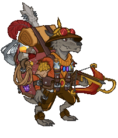
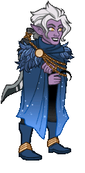
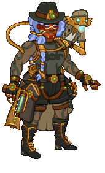
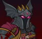
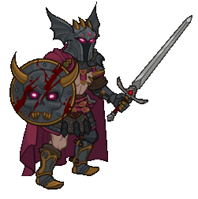
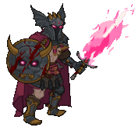
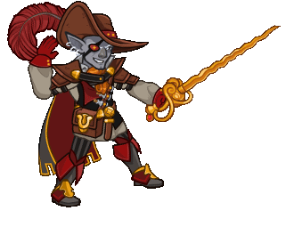
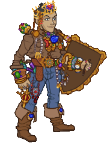
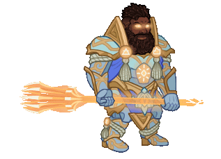

[Back to Main](index.md)

# Skins

Skins that are upcoming. Most skins are real money purchases only.

Please be aware that the developers recently removed most future skins from the defines to stop Jim from being able to select them with his Wand of Wonder. This means that getting the upcoming skins has become a lot trickier for me - and so this page might not be as accurate as it once was.

ⓘ *Note: The skin portraits have tooltips which can include an animated model. Skin models can sometimes exist even when the portrait does not. A ❌ indicates a skin with a portrait but no model - while a ✔️ indicates a skin with a model but no portrait.*

    
        
            ID: 569**Dragon Hoard Beadle (Beadle)**
        
        
            Dragon Hoard Beadle
        
        
            Beadle & Grimm Dragon Delves Pack
        
        
            0p
        
        
            08 Jul 2025
        
    
    
        
            ID: 570**Dragon Slayer Grimm (Grimm)**
        
        
            Dragon Slayer Grimm
        
        
            Beadle & Grimm Dragon Delves Pack
        
        
            0p
        
        
            08 Jul 2025
        
    
    
        
            ID: 575**Dungeoneer Deekin (Deekin)**
        
        
            Dungeoneer Deekin
        
        
            Dungeoneer Deekin Skin & Feat Pack
        
        
            1,680p
        
        
            09 Jul 2025
        
    
    
        
            ID: 576**Reincarnated K'thriss (K'thriss)**
        
        
            Reincarnated K'thriss
        
        
            Reincarnated K'thriss Theme Pack
        
        
            3,830p
        
        
            09 Jul 2025
        
    
    
        
            ID: 578**Dungeon Raider Aeon (Aeon)**
        
        
            Dungeon Raider Aeon
        
        
            Dungeon Raider Aeon Skin & Feat Pack
        
        
            1,680p
        
        
            16 Jul 2025
        
    
    
        
            ID: 581**Chosen of Vecna Blooshi (Blooshi)**
        
        
            Chosen of Vecna Blooshi
        
        
            Emergence 12
        
        
            ???
        
        
            23 Jul 2025
        
    
    
        
            ID: 579**Chosen of Vecna Warduke (Warduke)**
        
        
            Chosen of Vecna Warduke
        
        
            Chosen of Vecna Warduke Skin & Feat Pack
        
        
            1,680p
        
        
            23 Jul 2025
        
    
    
        
            ID: 584**Gentleman Jarlaxle (Jarlaxle)**✔️
        
        
            Gentleman Jarlaxle
        
        
            Emergence 12
        
        
            ???
        
        
            23 Jul 2025
        
    
    
        
            ID: 580**Fortune Hunter Eric (Eric)**
        
        
            Fortune Hunter Eric
        
        
            Fortune Hunter Eric Skin & Feat Pack
        
        
            1,680p
        
        
            30 Jul 2025
        
    
    
        
            ID: 585**Ascended Baldric (Baldric)**
        
        
            Ascended Baldric
        
        
            Ascended Baldric Theme Pack
        
        
            3,830p
        
        
            06 Aug 2025
        
    
    
        
            ID: 503**Kith'rak Lae'zel (Lae'zel)**
        
        
            Kith'rak Lae'zel
        
        
            Kith'rak Lae'zel Skin & Feat Pack
        
        
            1,680p
        
        
            06 Aug 2025
        
    
    
        
            ID: 589**Arborean Hunter Shandie (Shandie)**
        
        
            Arborean Hunter Shandie
        
        
            Arborean Hunter Shandie Skin & Feat Pack
        
        
            1,680p
        
        
            13 Aug 2025
        
    
    
        
            ID: 586**Seven Heavens Lazaapz (Lazaapz)**
        
        
            Seven Heavens Lazaapz
        
        
            Seven Heavens Lazaapz Theme Pack
        
        
            3,830p
        
        
            13 Aug 2025
        
    
    
        
            ID: 588**Blind Justice Ishi (Ishi)**
        
        
            Blind Justice Ishi
        
        
            Blind Justice Ishi Skin & Feat Pack
        
        
            1,680p
        
        
            20 Aug 2025
        
    
    
        
            ID: 591**Solar Scion Drizzt (Drizzt)**
        
        
            Solar Scion Drizzt
        
        
            Solar Scion Drizzt Skin & Feat Pack
        
        
            1,680p
        
        
            27 Aug 2025
        
    
    
        
            ID: 590**Weave Anchor Volo (Volo)**
        
        
            Weave Anchor Volo
        
        
            Weave Anchor Volo Skin & Feat Pack
        
        
            1,680p
        
        
            27 Aug 2025
        
    
    
        
            ID: 595**Heroic Bobby (Bobby)**
        
        
            Heroic Bobby
        
        
            Heroic Bobby Skin & Feat Pack
        
        
            1,680p
        
        
            03 Sept 2025
        
    
    
        
            ID: 594**Mythic Cazrin (Cazrin)**
        
        
            Mythic Cazrin
        
        
            Mythic Cazrin Theme Pack
        
        
            3,830p
        
        
            03 Sept 2025
        
    
    
        
            ID: 597**Legendkeeper Alyndra (Alyndra)**
        
        
            Legendkeeper Alyndra
        
        
            Legendkeeper Alyndra Theme Pack
        
        
            3,830p
        
        
            10 Sept 2025
        
    
    
        
            ID: 598**Mythic Torogar (Torogar)**
        
        
            Mythic Torogar
        
        
            Mythic Torogar Skin & Feat Pack
        
        
            1,680p
        
        
            10 Sept 2025
        
    
    
        
            ID: 600**Berserker Wulfgar (Wulfgar)**
        
        
            Berserker Wulfgar
        
        
            Berserker Wulfgar Skin & Feat Pack
        
        
            1,680p
        
        
            17 Sept 2025
        
    
    
        
            ID: 601**Nightmare D'hani (D'hani)**
        
        
            Nightmare D'hani
        
        
            Nightmare D'hani Skin & Feat Pack
        
        
            1,680p
        
        
            17 Sept 2025
        
    

[Back to Top](#top)

*Last Modified: {{ site.time }}*