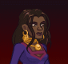
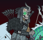

[Back to Main](index.md)

# Skins

Skins that are upcoming. Most skins are real money purchases only.

Please be aware that the developers recently removed most future skins from the defines to stop Jim from being able to select them with his Wand of Wonder. This means that getting the upcoming skins has become a lot trickier for me - and so this page might not be as accurate as it once was.

ⓘ *Note: Skins with missing portraits simply don't have that data available yet.*

    
        
            Aasimar Glitch Donaar
        
        
            Aasimar Glitch Donaar Skin & Feat Pack
        
        
            $9.99
        
        
            14 Feb 2024
        
    
    
        
            Gnome Glitch Avren
        
        
            Adventure / Variant (Guess)
        
        
            ???
        
        
            14 Feb 2024
        
    
    
        
            Baldur's Gate Dynaheir
        
        
            Baldur's Gate Dynaheir Theme Pack
        
        
            $24.99
        
        
            21 Feb 2024
        
    
    
        
            Undead Knight Solaak
        
        
            Undead Knight Solaak Skin & Feat Pack
        
        
            $9.99
        
        
            21 Feb 2024
        
    
    
        
            Archmage Dhadius
        
        
            Season 8 (Guess)
        
        
            ???
        
        
            06 Mar 2024
        
    
    
        
            Mind Flayer Dark Urge
        
        
            Mind Flayer Dark Urge Theme Pack
        
        
            $24.99
        
        
            06 Mar 2024
        
    
    
        
            Dragonborn Glitch Strongheart
        
        
            Dragonborn Glitch Strongheart Skin & Feat Pack
        
        
            $9.99
        
        
            27 Mar 2024
        
    
    
        
            Tiefling Glitch Miria
        
        
            Tiefling Glitch Miria Skin & Feat Pack
        
        
            $9.99
        
        
            27 Mar 2024
        
    
    
        
            Aarakocra Glitch Orkira
        
        
            ???
        
        
            ???
        
        
            ???
        
    

[Back to Top](#top)

*Last Modified: {{ site.time }}*