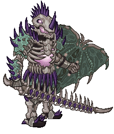
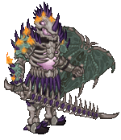
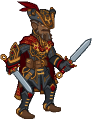
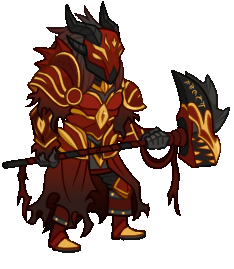
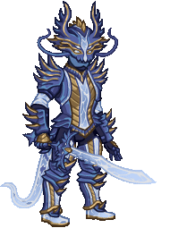
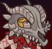
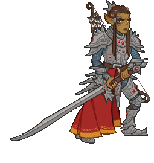

[Back to Main](index.md)

# Skins

Skins that are upcoming. Most skins are real money purchases only.

Please be aware that the developers recently removed most future skins from the defines to stop Jim from being able to select them with his Wand of Wonder. This means that getting the upcoming skins has become a lot trickier for me - and so this page might not be as accurate as it once was.

ⓘ *Note: The skin portraits have tooltips which can include an animated model. Skin models can sometimes exist even when the portrait does not.*

    
        
            ID: 559**Dracolich Duke Ravengard (Ravengard)**
        
        
            Dracolich Duke Ravengard
        
        
            Dracolich Duke Ravengard Skin & Feat Pack
        
        
            1,680p
        
        
            04 Jun 2025
        
    
    
        
            ID: 560**Dragonslayer Hank (Hank)**
        
        
            Dragonslayer Hank
        
        
            Dragonslayer Hank Theme Pack
        
        
            3,830p
        
        
            04 Jun 2025
        
    
    
        
            ID: 582**Dragon Knight Hitch (Hitch)**
        
        
            Dragon Knight Hitch
        
        
            ???
        
        
            ???
        
        
            11 Jun 2025
        
    
    
        
            ID: 561**Dragon Rider Krond (Krond)**
        
        
            Dragon Rider Krond
        
        
            Dragon Rider Krond Theme Pack
        
        
            3,830p
        
        
            11 Jun 2025
        
    
    
        
            ID: 562**Reaper BBEG (BBEG)**
        
        
            Reaper BBEG
        
        
            Reaper BBEG Skin & Feat Pack
        
        
            1,680p
        
        
            11 Jun 2025
        
    
    
        
            ID: 565**Cosmic Dragon Nova (Nova)**
        
        
            Cosmic Dragon Nova
        
        
            Cosmic Dragon Nova Skin & Feat Pack
        
        
            1,680p
        
        
            18 Jun 2025
        
    
    
        
            ID: 563**Dragon King Dungeon Master (DM)**
        
        
            Dragon King Dungeon Master
        
        
            Dragon King Dungeon Master Skin & Feat Pack
        
        
            1,680p
        
        
            18 Jun 2025
        
    
    
        
            ID: 564**Skypirate Antrius (Antrius)**
        
        
            Skypirate Antrius
        
        
            Skypirate Antrius Skin & Feat Pack
        
        
            1,680p
        
        
            18 Jun 2025
        
    
    
        
            ID: 566**Cataclysmic Kas (Kas)**
        
        
            Cataclysmic Kas
        
        
            Cataclysmic Kas Skin & Feat Pack
        
        
            1,680p
        
        
            25 Jun 2025
        
    
    
        
            ID: 567**Dragonskull Bobby (Bobby)**
        
        
            Dragonskull Bobby
        
        
            ???
        
        
            ???
        
        
            26 Jun 2025
        
    
    
        
            ID: 573**Archeologist Strongheart (Strongheart)**
        
        
            Archeologist Strongheart
        
        
            Archeologist Strongheart Skin & Feat Pack
        
        
            1,680p
        
        
            02 Jul 2025
        
    
    
        
            ID: 574**Fortune Hunter Nahara (Nahara)**
        
        
            Fortune Hunter Nahara
        
        
            Fortune Hunter Nahara Skin & Feat Pack
        
        
            1,680p
        
        
            02 Jul 2025
        
    
    
        
            ID: 572**Fortune Hunter Tess (Tess)**
        
        
            Fortune Hunter Tess
        
        
            Fortune Hunter Tess Theme Pack
        
        
            3,830p
        
        
            02 Jul 2025
        
    
    
        
            ID: 569**Dragon Hoard Beadle (Beadle)**
        
        
            Dragon Hoard Beadle
        
        
            Beadle & Grimm Dragon Delves Pack
        
        
            0p
        
        
            08 Jul 2025
        
    
    
        
            ID: 570**Dragon Slayer Grimm (Grimm)**
        
        
            Dragon Slayer Grimm
        
        
            Beadle & Grimm Dragon Delves Pack
        
        
            0p
        
        
            08 Jul 2025
        
    
    
        
            ID: 575**Dungeoneer Deekin (Deekin)**
        
        
            Dungeoneer Deekin
        
        
            Dungeoneer Deekin Skin & Feat Pack
        
        
            1,680p
        
        
            09 Jul 2025
        
    
    
        
            ID: 576**Reincarnated K'thriss (K'thriss)**
        
        
            Reincarnated K'thriss
        
        
            Reincarnated K'thriss Theme Pack
        
        
            3,830p
        
        
            09 Jul 2025
        
    
    
        
            ID: 578**Dungeon Raider Aeon (Aeon)**
        
        
            Dungeon Raider Aeon
        
        
            Dungeon Raider Aeon Skin & Feat Pack
        
        
            1,680p
        
        
            16 Jul 2025
        
    
    
        
            ID: 579**Chosen of Vecna Warduke (Warduke)**
        
        
            Chosen of Vecna Warduke
        
        
            Chosen of Vecna Warduke Skin & Feat Pack
        
        
            1,680p
        
        
            23 Jul 2025
        
    
    
        
            ID: 580**Fortune Hunter Eric (Eric)**
        
        
            Fortune Hunter Eric
        
        
            Fortune Hunter Eric Skin & Feat Pack
        
        
            1,680p
        
        
            30 Jul 2025
        
    
    
        
            ID: 585**Ascended Baldric (Baldric)**
        
        
            Ascended Baldric
        
        
            Ascended Baldric Theme Pack
        
        
            3,830p
        
        
            06 Aug 2025
        
    
    
        
            ID: 503**Kith'rak Lae'zel (Lae'zel)**
        
        
            Kith'rak Lae'zel
        
        
            Kith'rak Lae'zel Skin & Feat Pack
        
        
            1,680p
        
        
            06 Aug 2025
        
    
    
        
            ID: 589**Arborean Hunter Shandie (Shandie)**
        
        
            Arborean Hunter Shandie
        
        
            Arborean Hunter Shandie Skin & Feat Pack
        
        
            1,680p
        
        
            13 Aug 2025
        
    
    
        
            ID: 586**Seven Heavens Lazaapz (Lazaapz)**
        
        
            Seven Heavens Lazaapz
        
        
            Seven Heavens Lazaapz Theme Pack
        
        
            3,830p
        
        
            13 Aug 2025
        
    
    
        
            ID: 588**Blind Justice Ishi (Ishi)**
        
        
            Blind Justice Ishi
        
        
            Blind Justice Ishi Skin & Feat Pack
        
        
            1,680p
        
        
            20 Aug 2025
        
    
    
        
            ID: 591**Solar Scion Drizzt (Drizzt)**
        
        
            Solar Scion Drizzt
        
        
            Solar Scion Drizzt Skin & Feat Pack
        
        
            1,680p
        
        
            27 Aug 2025
        
    
    
        
            ID: 590**Weave Anchor Volo (Volo)**
        
        
            Weave Anchor Volo
        
        
            Weave Anchor Volo Skin & Feat Pack
        
        
            1,680p
        
        
            27 Aug 2025
        
    

[Back to Top](#top)

*Last Modified: {{ site.time }}*