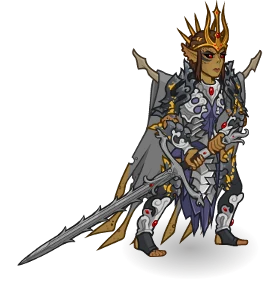
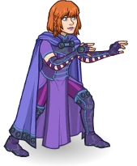

[Back to Main](index.md)

# Skins

Skins that are upcoming. Most skins are real money purchases only.

ⓘ *Note: The skin portraits have tooltips which can include an animated model. Skin models can sometimes exist even when the portrait does not. A ❌ indicates a skin with a portrait but no model - while a ✔️ indicates a skin with a model but no portrait.*

    
        
            ID: 660**Heroic Hank (Hank)**
        
        
            Heroic Hank
        
        
            Heroic Hank Skin & Feat Pack
        
        
            1,680p
        
        
            25 Feb 2026
        
    
    
        
            ID: 659**Undying Queen Lae'zel (Lae'zel)**
        
        
            Undying Queen Lae'zel
        
        
            Undying Queen Lae'zel Skin & Feat Pack
        
        
            1,680p
        
        
            25 Feb 2026
        
    
    
        
            ID: 671**Knight of Solamnia Shandie (Shandie)**
        
        
            Knight of Solamnia Shandie
        
        
            Dragonlance Giveaway - Dragonlance Celebration
        
        
            ???
        
        
            04 Mar 2026
        
    
    
        
            ID: 663**Order of the Red Robes Gale (Gale)**
        
        
            Order of the Red Robes Gale
        
        
            Order of the Red Robes Gale Skin & Feat Pack
        
        
            1,680p
        
        
            04 Mar 2026
        
    
    
        
            ID: 662**Raistlin, Master of Past and Present (Raistlin)**
        
        
            Raistlin, Master of Past and Present
        
        
            Raistlin, Master of Past and Present Theme Pack
        
        
            3,830p
        
        
            04 Mar 2026
        
    
    
        
            ID: 664**Bard of the Dragon Queen Deekin (Deekin)**
        
        
            Bard of the Dragon Queen Deekin
        
        
            Bard of the Dragon Queen Deekin Theme Pack
        
        
            3,830p
        
        
            11 Mar 2026
        
    
    
        
            ID: 666**Heroic Sheila (Sheila)**
        
        
            Heroic Sheila
        
        
            Heroic Sheila Skin & Feat Pack
        
        
            1,680p
        
        
            11 Mar 2026
        
    
    
        
            ID: 665**Knight of Solamnia Zorbu (Zorbu)**
        
        
            Knight of Solamnia Zorbu
        
        
            Knight of Solamnia Zorbu Skin & Feat Pack
        
        
            1,680p
        
        
            11 Mar 2026
        
    
    
        
            ID: 668**Desmondlance Desmond (Desmond)**
        
        
            Desmondlance Desmond
        
        
            Desmondlance Desmond Skin & Feat Pack
        
        
            1,680p
        
        
            18 Mar 2026
        
    
    
        
            ID: 667**Dragon Chronicler Volo (Volo)**
        
        
            Dragon Chronicler Volo
        
        
            Dragon Chronicler Volo Skin & Feat Pack
        
        
            1,680p
        
        
            18 Mar 2026
        
    
    
        
            ID: 669**Mage of the White Robes Orkira (Orkira)**
        
        
            Mage of the White Robes Orkira
        
        
            Mage of the White Robes Orkira Skin & Feat Pack
        
        
            1,680p
        
        
            18 Mar 2026
        
    
    
        
            ID: 670**Dragonlance Karlach (Karlach)**
        
        
            Dragonlance Karlach
        
        
            Dragonlance Karlach Skin & Feat Pack
        
        
            1,680p
        
        
            25 Mar 2026
        
    

[Back to Top](#top)

*Last Modified: {{ site.time }}*