[Back to Main](index.md)

# Skins

Skins that are upcoming. Most skins are real money purchases only.

Please be aware that the developers recently removed most future skins from the defines to stop Jim from being able to select them with his Wand of Wonder. This means that getting the upcoming skins has become a lot trickier for me - and so this page might not be as accurate as it once was.

ⓘ *Note: The skin portraits have tooltips which can include an animated model. Skin models can sometimes exist even when the portrait does not. A ❌ indicates a skin with a portrait but no model - while a ✔️ indicates a skin with a model but no portrait.*

    
        
            ID: 591**Solar Scion Drizzt (Drizzt)**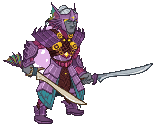
        
        
            Solar Scion Drizzt
        
        
            Solar Scion Drizzt Skin & Feat Pack
        
        
            1,680p
        
        
            27 Aug 2025
        
    
    
        
            ID: 590**Weave Anchor Volo (Volo)**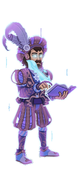
        
        
            Weave Anchor Volo
        
        
            Weave Anchor Volo Skin & Feat Pack
        
        
            1,680p
        
        
            27 Aug 2025
        
    
    
        
            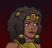ID: 602**Heroic Diana (Diana)**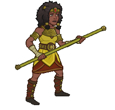
        
        
            Heroic Diana
        
        
            Anniversary Giveaway - 8th Anniversary Celebration
        
        
            ???
        
        
            03 Sept 2025
        
    
    
        
            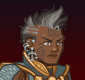ID: 596**Mythic Nayeli (Nayeli)**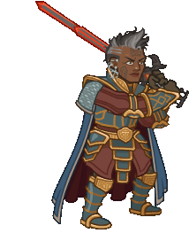
        
        
            Mythic Nayeli
        
        
            Founder's Pack VIII
        
        
            0p
        
        
            03 Sept 2025
        
    
    
        
            ID: 595**Heroic Bobby (Bobby)**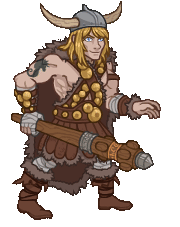
        
        
            Heroic Bobby
        
        
            Heroic Bobby Skin & Feat Pack
        
        
            1,680p
        
        
            03 Sept 2025
        
    
    
        
            ID: 594**Mythic Cazrin (Cazrin)**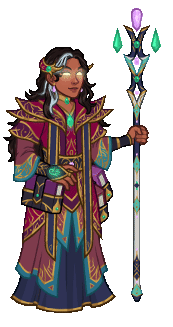
        
        
            Mythic Cazrin
        
        
            Mythic Cazrin Theme Pack
        
        
            3,830p
        
        
            03 Sept 2025
        
    
    
        
            ID: 599**Divine Certainty (Certainty)**✔️
        
        
            Divine Certainty
        
        
            Divine Certainty Skin & Feat Pack
        
        
            1,680p
        
        
            10 Sept 2025
        
    
    
        
            ID: 597**Legendkeeper Alyndra (Alyndra)**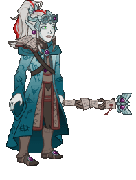
        
        
            Legendkeeper Alyndra
        
        
            Legendkeeper Alyndra Theme Pack
        
        
            3,830p
        
        
            10 Sept 2025
        
    
    
        
            ID: 598**Mythic Torogar (Torogar)**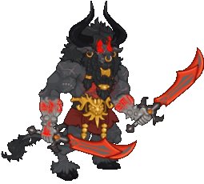
        
        
            Mythic Torogar
        
        
            Mythic Torogar Skin & Feat Pack
        
        
            1,680p
        
        
            10 Sept 2025
        
    
    
        
            ID: 600**Berserker Wulfgar (Wulfgar)**
        
        
            Berserker Wulfgar
        
        
            Berserker Wulfgar Skin & Feat Pack
        
        
            1,680p
        
        
            17 Sept 2025
        
    
    
        
            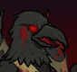ID: 601**Nightmare D'hani (D'hani)**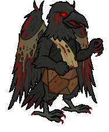
        
        
            Nightmare D'hani
        
        
            Nightmare D'hani Skin & Feat Pack
        
        
            1,680p
        
        
            17 Sept 2025
        
    
    
        
            ID: 605**Guardian of Illefarn King of Shadows (King of Shadows)**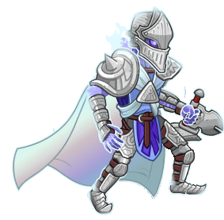
        
        
            Guardian of Illefarn King of Shadows
        
        
            King of Shadows Origin Theme Pack
        
        
            0p
        
        
            01 Oct 2025
        
    
    
        
            ID: 606**Raven Queen Astarion (Astarion)**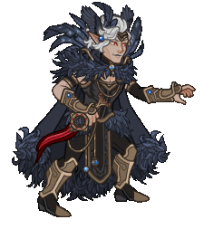
        
        
            Raven Queen Astarion
        
        
            Raven Queen Astarion Skin & Feat Pack
        
        
            1,680p
        
        
            01 Oct 2025
        
    
    
        
            ID: 607**Raven Queen Thellora (Thellora)**
        
        
            Raven Queen Thellora
        
        
            Raven Queen Thellora Skin & Feat Pack
        
        
            1,680p
        
        
            01 Oct 2025
        
    
    
        
            ID: 608**Darklord Farideh (Farideh)**
        
        
            Darklord Farideh
        
        
            Darklord Farideh Theme Pack
        
        
            3,830p
        
        
            08 Oct 2025
        
    
    
        
            ID: 609**Lord of Undeath Kas (Kas)**
        
        
            Lord of Undeath Kas
        
        
            Lord of Undeath Kas Skin & Feat Pack
        
        
            1,680p
        
        
            08 Oct 2025
        
    
    
        
            ID: 610**Shadowfell Ezmerelda (Ezmerelda)**
        
        
            Shadowfell Ezmerelda
        
        
            Shadowfell Ezmerelda Skin & Feat Pack
        
        
            1,680p
        
        
            08 Oct 2025
        
    
    
        
            ID: 611**Avren in a Jar (Avren)**
        
        
            Avren in a Jar
        
        
            Avren in a Jar Skin & Feat Pack
        
        
            1,680p
        
        
            15 Oct 2025
        
    
    
        
            ID: 612**Nightwalker Krond (Krond)**
        
        
            Nightwalker Krond
        
        
            Nightwalker Krond Skin & Feat Pack
        
        
            1,680p
        
        
            15 Oct 2025
        
    
    
        
            ID: 615**Shadow-Cursed Halsin (Halsin)**
        
        
            Shadow-Cursed Halsin
        
        
            Shadow-Cursed Halsin Skin & Feat Pack
        
        
            1,680p
        
        
            29 Oct 2025
        
    
    
        
            ID: 616**Action Figure Skylla (Skylla)**
        
        
            Action Figure Skylla
        
        
            Action Figure Skylla Theme Pack
        
        
            3,830p
        
        
            05 Nov 2025
        
    
    
        
            ID: 617**Entropic Sentry (Sentry)**
        
        
            Entropic Sentry
        
        
            Entropic Sentry Skin & Feat Pack
        
        
            1,680p
        
        
            05 Nov 2025
        
    
    
        
            ID: 618**Hemomancer Widdle (Widdle)**
        
        
            Hemomancer Widdle
        
        
            Hemomancer Widdle Skin & Feat Pack
        
        
            1,680p
        
        
            05 Nov 2025
        
    
    
        
            ID: 620**Turiel the Fallen (Turiel)**
        
        
            Turiel the Fallen
        
        
            Turiel the Fallen Skin & Feat Pack
        
        
            1,680p
        
        
            12 Nov 2025
        
    
    
        
            ID: 621**Witch Queen Minthara (Minthara)**
        
        
            Witch Queen Minthara
        
        
            Witch Queen Minthara Skin & Feat Pack
        
        
            1,680p
        
        
            12 Nov 2025
        
    
    
        
            ID: 624**Trickster Sheila (Sheila)**
        
        
            Trickster Sheila
        
        
            Trickster Sheila Skin & Feat Pack
        
        
            1,680p
        
        
            26 Nov 2025
        
    
    
        
            ID: 625**Cozy Regis (Regis)**
        
        
            Cozy Regis
        
        
            Cozy Regis Skin & Feat Pack
        
        
            1,680p
        
        
            03 Dec 2025
        
    
    
        
            ID: 626**Winter Gloom Shadowheart (Shadowheart)**
        
        
            Winter Gloom Shadowheart
        
        
            Winter Gloom Shadowheart Skin & Feat Pack
        
        
            1,680p
        
        
            03 Dec 2025
        
    
    
        
            ID: 627**Winter Gloom Yorven (Yorven)**
        
        
            Winter Gloom Yorven
        
        
            Winter Gloom Yorven Skin & Feat Pack
        
        
            1,680p
        
        
            03 Dec 2025
        
    
    
        
            ID: 629**Cozy Halsin (Halsin)**
        
        
            Cozy Halsin
        
        
            Cozy Halsin Skin & Feat Pack
        
        
            1,680p
        
        
            10 Dec 2025
        
    
    
        
            ID: 628**Cozy Nordom (Nordom)**
        
        
            Cozy Nordom
        
        
            Cozy Nordom Theme Pack
        
        
            3,830p
        
        
            10 Dec 2025
        
    
    
        
            ID: 630**Warmduke (Warduke)**
        
        
            Warmduke
        
        
            Warmduke Skin & Feat Pack
        
        
            1,680p
        
        
            10 Dec 2025
        
    
    
        
            ID: 632**Cozy Hunter Vin Ursa (Vin Ursa)**
        
        
            Cozy Hunter Vin Ursa
        
        
            Cozy Hunter Vin Ursa Skin & Feat Pack
        
        
            1,680p
        
        
            30 Dec 2025
        
    

[Back to Top](#top)

*Last Modified: {{ site.time }}*