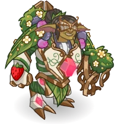
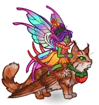
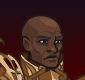
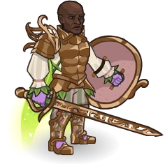
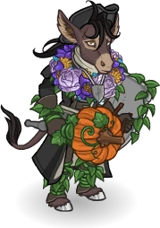

[Back to Main](index.md)

# Skins

Skins that are upcoming. Most skins are real money purchases only.

ⓘ *Note: The skin portraits have tooltips which can include an animated model. Skin models can sometimes exist even when the portrait does not. A ❌ indicates a skin with a portrait but no model - while a ✔️ indicates a skin with a model but no portrait.*

    
        
            ID: 706**Summer Court Lazaapz (Lazaapz)**
        
        
            Summer Court Lazaapz
        
        
            Summer Celebration (Guess)
        
        
            ???
        
        
            03 Jun 2026
        
    
    
        
            ID: 695**Summer Court Trixie (Trixie)**
        
        
            Summer Court Trixie
        
        
            Summer Court Trixie Theme Pack
        
        
            3,830p
        
        
            03 Jun 2026
        
    
    
        
            ID: 696**Viscount Ravengard (Ravengard)**
        
        
            Viscount Ravengard
        
        
            Viscount Ravengard Skin & Feat Pack
        
        
            1,680p
        
        
            03 Jun 2026
        
    
    
        
            ID: 697**Fey Touched Brother Uriah (Y4E15)**✔️
        
        
            Fey Touched Brother Uriah
        
        
            Fey Touched Brother Uriah Theme Pack
        
        
            3,830p
        
        
            10 Jun 2026
        
    
    
        
            ID: 698**Summer Court Antrius (Antrius)**
        
        
            Summer Court Antrius
        
        
            Summer Court Antrius Skin & Feat Pack
        
        
            1,680p
        
        
            10 Jun 2026
        
    
    
        
            ID: 699**Buzzwin (Binwin)**
        
        
            Buzzwin
        
        
            Buzzwin Skin & Feat Pack
        
        
            1,680p
        
        
            17 Jun 2026
        
    
    
        
            ID: 700**Summer Court Dungeon Master (DM)**
        
        
            Summer Court Dungeon Master
        
        
            Summer Court Dungeon Master Skin & Feat Pack
        
        
            1,680p
        
        
            17 Jun 2026
        
    
    
        
            ID: 702**Rictavio Van Richten (Van Richten)**
        
        
            Rictavio Van Richten
        
        
            Rictavio Van Richten Theme Pack
        
        
            3,830p
        
        
            01 Jul 2026
        
    
    
        
            ID: 705**Ravenloft's Champion Strongheart (Strongheart)**
        
        
            Ravenloft's Champion Strongheart
        
        
            Ravenloft's Champion Strongheart Skin & Feat Pack
        
        
            1,680p
        
        
            08 Jul 2026
        
    
    
        
            ID: 704**Vampire Slayer Tess (Tess)**
        
        
            Vampire Slayer Tess
        
        
            Vampire Slayer Tess Skin & Feat Pack
        
        
            1,680p
        
        
            08 Jul 2026
        
    
    
        
            ID: 533**Disciple of Cthulhu Deekin (Deekin)**
        
        
            Disciple of Cthulhu Deekin
        
        
            Disciple of Cthulhu Deekin Skin & Feat Pack
        
        
            1,680p
        
        
            15 Jul 2026
        
    
    
        
            ID: 534**Nechricor Vin Ursa (Vin Ursa)**
        
        
            Nechricor Vin Ursa
        
        
            Nechricor Vin Ursa Skin & Feat Pack
        
        
            1,680p
        
        
            15 Jul 2026
        
    
    
        
            ID: 536**Sly One Raistlin (Raistlin)**
        
        
            Sly One Raistlin
        
        
            Sly One Raistlin Skin & Feat Pack
        
        
            1,680p
        
        
            29 Jul 2026
        
    

[Back to Top](#top)

*Last Modified: {{ site.time }}*