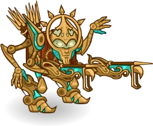
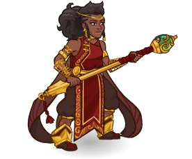

[Back to Main](index.md)

# Skins

Skins that are upcoming. Most skins are real money purchases only.

ⓘ *Note: The skin portraits have tooltips which can include an animated model. Skin models can sometimes exist even when the portrait does not. A ❌ indicates a skin with a portrait but no model - while a ✔️ indicates a skin with a model but no portrait.*

    
        
            ID: 688**Masterwork Nordom (Nordom)**
        
        
            Masterwork Nordom
        
        
            Masterwork Nordom Skin & Feat Pack
        
        
            1,680p
        
        
            06 May 2026
        
    
    
        
            ID: 686**Qualinesti Princess Laurana (Laurana)**
        
        
            Qualinesti Princess Laurana
        
        
            Qualinesti Princess Laurana Theme Pack
        
        
            3,830p
        
        
            06 May 2026
        
    
    
        
            ID: 687**Sovereign Diana (Diana)**
        
        
            Sovereign Diana
        
        
            Sovereign Diana Skin & Feat Pack
        
        
            1,680p
        
        
            06 May 2026
        
    
    
        
            ID: 690**Noble Mechanica Evelyn (Evelyn)**
        
        
            Noble Mechanica Evelyn
        
        
            Noble Mechanica Evelyn Skin & Feat Pack
        
        
            1,680p
        
        
            13 May 2026
        
    
    
        
            ID: 689**Pretentious Prestidigitator Melf (Melf)**
        
        
            Pretentious Prestidigitator Melf
        
        
            Pretentious Prestidigitator Melf Theme Pack
        
        
            3,830p
        
        
            13 May 2026
        
    
    
        
            ID: 691**Clockwork General Mehen (Mehen)**
        
        
            Clockwork General Mehen
        
        
            Clockwork General Mehen Skin & Feat Pack
        
        
            1,680p
        
        
            20 May 2026
        
    
    
        
            ID: 692**Noble Mechanica Nixie (Nixie)**
        
        
            Noble Mechanica Nixie
        
        
            Noble Mechanica Nixie Skin & Feat Pack
        
        
            1,680p
        
        
            20 May 2026
        
    
    
        
            ID: 693**Noble Mechanica Vlithryn (Vlithryn)**
        
        
            Noble Mechanica Vlithryn
        
        
            Noble Mechanica Vlithryn Skin & Feat Pack
        
        
            1,680p
        
        
            20 May 2026
        
    
    
        
            ID: 695**Summer Court Trixie (Trixie)**
        
        
            Summer Court Trixie
        
        
            Summer Court Trixie Theme Pack
        
        
            3,830p
        
        
            03 Jun 2026
        
    
    
        
            ID: 696**Viscount Ravengard (Ravengard)**
        
        
            Viscount Ravengard
        
        
            Viscount Ravengard Skin & Feat Pack
        
        
            1,680p
        
        
            03 Jun 2026
        
    
    
        
            ID: 697**Fey Touched Brother Uriah (Y4E15)**
        
        
            Fey Touched Brother Uriah
        
        
            Fey Touched Brother Uriah Theme Pack
        
        
            3,830p
        
        
            10 Jun 2026
        
    
    
        
            ID: 698**Summer Court Antrius (Antrius)**
        
        
            Summer Court Antrius
        
        
            Summer Court Antrius Skin & Feat Pack
        
        
            1,680p
        
        
            10 Jun 2026
        
    
    
        
            ID: 699**Buzzwin (Binwin)**
        
        
            Buzzwin
        
        
            Buzzwin Skin & Feat Pack
        
        
            1,680p
        
        
            17 Jun 2026
        
    
    
        
            ID: 700**Summer Court Dungeon Master (DM)**
        
        
            Summer Court Dungeon Master
        
        
            Summer Court Dungeon Master Skin & Feat Pack
        
        
            1,680p
        
        
            17 Jun 2026
        
    

[Back to Top](#top)

*Last Modified: {{ site.time }}*