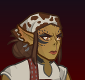
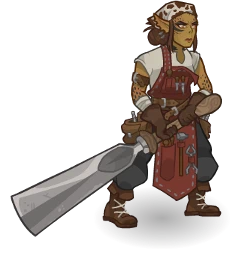
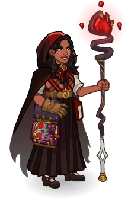

[Back to Main](index.md)

# Skins

Skins that are upcoming. Most skins are real money purchases only.

ⓘ *Note: The skin portraits have tooltips which can include an animated model. Skin models can sometimes exist even when the portrait does not. A ❌ indicates a skin with a portrait but no model - while a ✔️ indicates a skin with a model but no portrait.*

    
        
            ID: 714**Zombie Hunter Drizzt (Drizzt)**
        
        
            Zombie Hunter Drizzt
        
        
            Emergence 16
        
        
            ???
        
        
            29 Jul 2026
        
    
    
        
            ID: 536**Sly One Raistlin (Raistlin)**
        
        
            Sly One Raistlin
        
        
            Sly One Raistlin Skin & Feat Pack
        
        
            1,680p
        
        
            29 Jul 2026
        
    
    
        
            ID: 717**Colorweaver Jim (Jim)**
        
        
            Colorweaver Jim
        
        
            Colorweaver Jim Skin & Feat Pack
        
        
            1,680p
        
        
            05 Aug 2026
        
    
    
        
            ID: 716**Joyful Jester Omin (Omin)**
        
        
            Joyful Jester Omin
        
        
            Joyful Jester Omin Skin & Feat Pack
        
        
            1,680p
        
        
            05 Aug 2026
        
    
    
        
            ID: 715**Master Craftsman Flint (Flint)**
        
        
            Master Craftsman Flint
        
        
            Master Craftsman Flint Theme Pack
        
        
            3,830p
        
        
            05 Aug 2026
        
    
    
        
            ID: 718**Weaponsmith Lae'zel (Lae'zel)**
        
        
            Weaponsmith Lae'zel
        
        
            Weaponsmith Lae'zel Skin & Feat Pack
        
        
            1,680p
        
        
            12 Aug 2026
        
    
    
        
            ID: 719**Prismatic Painter Ellywick (Ellywick)**
        
        
            Prismatic Painter Ellywick
        
        
            Prismatic Painter Ellywick Skin & Feat Pack
        
        
            1,680p
        
        
            19 Aug 2026
        
    
    
        
            ID: 720**Caramon, Guardian of the Future (Caramon)**
        
        
            Caramon, Guardian of the Future
        
        
            Caramon, Guardian of the Future Theme Pack
        
        
            3,830p
        
        
            02 Sept 2026
        
    
    
        
            ID: 722**Dungeon Botanist Stoki (Stoki)**
        
        
            Dungeon Botanist Stoki
        
        
            Dungeon Botanist Stoki Skin & Feat Pack
        
        
            1,680p
        
        
            02 Sept 2026
        
    
    
        
            ID: 721**Schoolyard Bruiser Bobby (Bobby)**
        
        
            Schoolyard Bruiser Bobby
        
        
            Schoolyard Bruiser Bobby Skin & Feat Pack
        
        
            1,680p
        
        
            02 Sept 2026
        
    
    
        
            ID: 723**Pungent Professor Pwent (Pwent)**
        
        
            Pungent Professor Pwent
        
        
            Pungent Professor Pwent Skin & Feat Pack
        
        
            1,680p
        
        
            09 Sept 2026
        
    
    
        
            ID: 724**Shadow Studies Cazrin (Cazrin)**
        
        
            Shadow Studies Cazrin
        
        
            Shadow Studies Cazrin Skin & Feat Pack
        
        
            1,680p
        
        
            16 Sept 2026
        
    
    
        
            ID: 725**Scholar of the Nine Hells Karlach (Karlach)**
        
        
            Scholar of the Nine Hells Karlach
        
        
            Scholar of the Nine Hells Karlach Skin & Feat Pack
        
        
            1,680p
        
        
            30 Sept 2026
        
    
    
        
            ID: 731**Vampire Spawn Astarion (Astarion)**
        
        
            Vampire Spawn Astarion
        
        
            Vampire Spawn Astarion Skin & Feat Pack
        
        
            1,680p
        
        
            07 Oct 2026
        
    
    
        
            ID: 732**Headless Cavalier Thellora (Thellora)**
        
        
            Headless Cavalier Thellora
        
        
            Headless Cavalier Thellora Skin & Feat Pack
        
        
            1,680p
        
        
            14 Oct 2026
        
    
    
        
            ID: 733**Forsaken Bride Ezmerelda (Ezmerelda)**
        
        
            Forsaken Bride Ezmerelda
        
        
            Forsaken Bride Ezmerelda Skin & Feat Pack
        
        
            1,680p
        
        
            21 Oct 2026
        
    

[Back to Top](#top)

*Last Modified: {{ site.time }}*