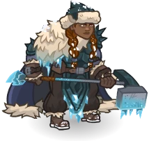
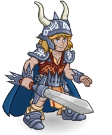
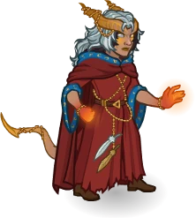

[Back to Main](index.md)

# Skins

Skins that are upcoming. Most skins are real money purchases only.

ⓘ *Note: The skin portraits have tooltips which can include an animated model. Skin models can sometimes exist even when the portrait does not. A ❌ indicates a skin with a portrait but no model - while a ✔️ indicates a skin with a model but no portrait.*

    
        
            ID: 685**Hammer of the North Barrowin (Barrowin)**
        
        
            Hammer of the North Barrowin
        
        
            Tales of the Champions (Guess)
        
        
            ???
        
        
            22 Apr 2026
        
    
    
        
            ID: 681**Cosmic Horror Beadle (Beadle)**
        
        
            Cosmic Horror Beadle
        
        
            Cosmic Horror Beadle Skin & Feat Pack
        
        
            1,680p
        
        
            22 Apr 2026
        
    
    
        
            ID: 684**Dragon Army Infiltrator Eric (Eric)**
        
        
            Dragon Army Infiltrator Eric
        
        
            Emergence 15
        
        
            ???
        
        
            22 Apr 2026
        
    
    
        
            ID: 682**Knight of the Crown Bobby (Bobby)**
        
        
            Knight of the Crown Bobby
        
        
            Knight of the Crown Bobby Skin & Feat Pack
        
        
            1,680p
        
        
            29 Apr 2026
        
    
    
        
            ID: 683**Raistlin Cosplay Farideh (Farideh)**
        
        
            Raistlin Cosplay Farideh
        
        
            Raistlin Cosplay Farideh Skin & Feat Pack
        
        
            1,680p
        
        
            29 Apr 2026
        
    
    
        
            ID: 688**Masterwork Nordom (Nordom)**
        
        
            Masterwork Nordom
        
        
            Masterwork Nordom Skin & Feat Pack
        
        
            1,680p
        
        
            06 May 2026
        
    
    
        
            ID: 686**Qualinesti Princess Laurana (Laurana)**
        
        
            Qualinesti Princess Laurana
        
        
            Qualinesti Princess Laurana Theme Pack
        
        
            3,830p
        
        
            06 May 2026
        
    
    
        
            ID: 687**Sovereign Diana (Diana)**
        
        
            Sovereign Diana
        
        
            Sovereign Diana Skin & Feat Pack
        
        
            1,680p
        
        
            06 May 2026
        
    
    
        
            ID: 690**Noble Mechanica Evelyn (Evelyn)**
        
        
            Noble Mechanica Evelyn
        
        
            Noble Mechanica Evelyn Skin & Feat Pack
        
        
            1,680p
        
        
            13 May 2026
        
    
    
        
            ID: 689**Pretentious Prestidigitator Melf (Melf)**
        
        
            Pretentious Prestidigitator Melf
        
        
            Pretentious Prestidigitator Melf Theme Pack
        
        
            3,830p
        
        
            13 May 2026
        
    
    
        
            ID: 691**Clockwork General Mehen (Mehen)**
        
        
            Clockwork General Mehen
        
        
            Clockwork General Mehen Skin & Feat Pack
        
        
            1,680p
        
        
            20 May 2026
        
    
    
        
            ID: 692**Noble Mechanica Nixie (Nixie)**
        
        
            Noble Mechanica Nixie
        
        
            Noble Mechanica Nixie Skin & Feat Pack
        
        
            1,680p
        
        
            20 May 2026
        
    
    
        
            ID: 693**Noble Mechanica Vlithryn (Vlithryn)**
        
        
            Noble Mechanica Vlithryn
        
        
            Noble Mechanica Vlithryn Skin & Feat Pack
        
        
            1,680p
        
        
            20 May 2026
        
    

[Back to Top](#top)

*Last Modified: {{ site.time }}*