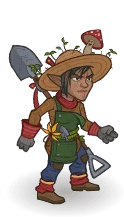
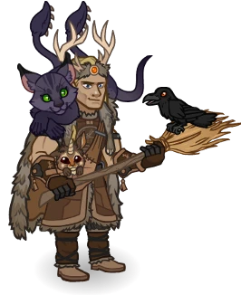
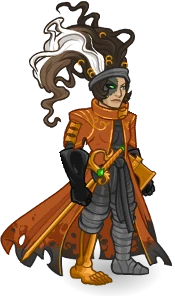
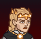
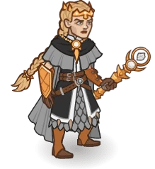
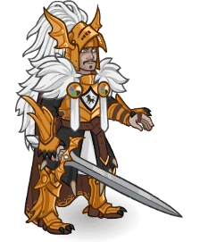

[Back to Main](index.md)

# Skins

Skins that are upcoming. Most skins are real money purchases only.

ⓘ *Note: The skin portraits have tooltips which can include an animated model. Skin models can sometimes exist even when the portrait does not. A ❌ indicates a skin with a portrait but no model - while a ✔️ indicates a skin with a model but no portrait.*

    
        
            ID: 708**Guest Lecturer Volo (Volo)**
        
        
            Guest Lecturer Volo
        
        
            Anniversary Giveaway - Anniversary Celebration
        
        
            Free?
        
        
            02 Sept 2026
        
    
    
        
            ID: 720**Caramon, Guardian of the Future (Caramon)**
        
        
            Caramon, Guardian of the Future
        
        
            Caramon, Guardian of the Future Theme Pack
        
        
            3,830p
        
        
            02 Sept 2026
        
    
    
        
            ID: 722**Dungeon Botanist Stoki (Stoki)**
        
        
            Dungeon Botanist Stoki
        
        
            Dungeon Botanist Stoki Skin & Feat Pack
        
        
            1,680p
        
        
            02 Sept 2026
        
    
    
        
            ID: 721**Schoolyard Bruiser Bobby (Bobby)**
        
        
            Schoolyard Bruiser Bobby
        
        
            Schoolyard Bruiser Bobby Skin & Feat Pack
        
        
            1,680p
        
        
            02 Sept 2026
        
    
    
        
            ID: 736**Professor of Beasts Wulfgar (Wulfgar)**✔️
        
        
            Professor of Beasts Wulfgar
        
        
            Professor of Beasts Wulfgar Skin & Feat Pack
        
        
            1,680p
        
        
            09 Sept 2026
        
    
    
        
            ID: 723**Pungent Professor Pwent (Pwent)**
        
        
            Pungent Professor Pwent
        
        
            Pungent Professor Pwent Skin & Feat Pack
        
        
            1,680p
        
        
            09 Sept 2026
        
    
    
        
            ID: 724**Shadow Studies Cazrin (Cazrin)**
        
        
            Shadow Studies Cazrin
        
        
            Shadow Studies Cazrin Skin & Feat Pack
        
        
            1,680p
        
        
            16 Sept 2026
        
    
    
        
            ID: 725**Scholar of the Nine Hells Karlach (Karlach)**❌
        
        
            Scholar of the Nine Hells Karlach
        
        
            Scholar of the Nine Hells Karlach Skin & Feat Pack
        
        
            1,680p
        
        
            30 Sept 2026
        
    
    
        
            ID: 734**Freeblade Kitiara (Kitiara)**
        
        
            Freeblade Kitiara
        
        
            Freeblade Kitiara Theme Pack
        
        
            3,830p
        
        
            07 Oct 2026
        
    
    
        
            ID: 731**Vampire Spawn Astarion (Astarion)**
        
        
            Vampire Spawn Astarion
        
        
            Vampire Spawn Astarion Skin & Feat Pack
        
        
            1,680p
        
        
            07 Oct 2026
        
    
    
        
            ID: 732**Headless Cavalier Thellora (Thellora)**
        
        
            Headless Cavalier Thellora
        
        
            Headless Cavalier Thellora Skin & Feat Pack
        
        
            1,680p
        
        
            14 Oct 2026
        
    
    
        
            ID: 737**Mummy Krond (Krond)**
        
        
            Mummy Krond
        
        
            Mummy Krond Skin & Feat Pack
        
        
            1,680p
        
        
            14 Oct 2026
        
    
    
        
            ID: 733**Forsaken Bride Ezmerelda (Ezmerelda)**
        
        
            Forsaken Bride Ezmerelda
        
        
            Forsaken Bride Ezmerelda Skin & Feat Pack
        
        
            1,680p
        
        
            21 Oct 2026
        
    
    
        
            ID: 739**Midnight Turiel (Turiel)**
        
        
            Midnight Turiel
        
        
            Midnight Turiel Skin & Feat Pack
        
        
            1,680p
        
        
            04 Nov 2026
        
    
    
        
            ID: 740**Ice Queen Minthara (Minthara)**
        
        
            Ice Queen Minthara
        
        
            Ice Queen Minthara Skin & Feat Pack
        
        
            1,680p
        
        
            11 Nov 2026
        
    
    
        
            ID: 741**Starlit Sentry (Sentry)**
        
        
            Starlit Sentry
        
        
            Starlit Sentry Skin & Feat Pack
        
        
            1,680p
        
        
            11 Nov 2026
        
    
    
        
            ID: 742**Frostbite Skylla (Skylla)**
        
        
            Frostbite Skylla
        
        
            Frostbite Skylla Skin & Feat Pack
        
        
            1,680p
        
        
            18 Nov 2026
        
    
    
        
            ID: 942**Chromatic Celeste (Celeste)**
        
        
            Chromatic Celeste
        
        
            ???
        
        
            ???
        
        
            ???
        
    
    
        
            ID: 943**Chromatic Strongheart (Strongheart)**
        
        
            Chromatic Strongheart
        
        
            ???
        
        
            ???
        
        
            ???
        
    

[Back to Top](#top)

*Last Modified: {{ site.time }}*