[Back to Main](index.md)

# Skins

Skins that are upcoming. Most skins are real money purchases only.

ⓘ *Note: The skin portraits have tooltips which can include an animated model. Skin models can sometimes exist even when the portrait does not. A ❌ indicates a skin with a portrait but no model - while a ✔️ indicates a skin with a model but no portrait.*

    
        
            ID: 732**Headless Cavalier Thellora (Thellora)**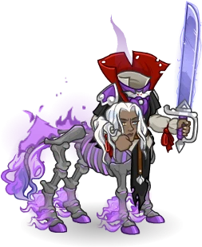
        
        
            Headless Cavalier Thellora
        
        
            Headless Cavalier Thellora Skin & Feat Pack
        
        
            1,680p
        
        
            14 Oct 2026
        
    
    
        
            ID: 737**Mummy Krond (Krond)**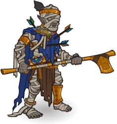
        
        
            Mummy Krond
        
        
            Mummy Krond Skin & Feat Pack
        
        
            1,680p
        
        
            14 Oct 2026
        
    
    
        
            ID: 733**Forsaken Bride Ezmerelda (Ezmerelda)**
        
        
            Forsaken Bride Ezmerelda
        
        
            Forsaken Bride Ezmerelda Skin & Feat Pack
        
        
            1,680p
        
        
            21 Oct 2026
        
    
    
        
            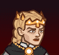ID: 754**Chromatic Celeste (Celeste)**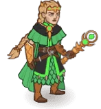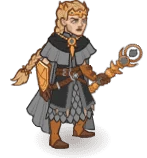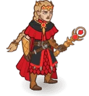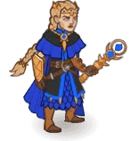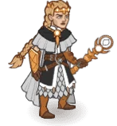
        
        
            Chromatic Celeste
        
        
            Patron Shop (Mastery Medallions)?
        
        
            10,000?
        
        
            28 Oct 2026
        
    
    
        
            ID: 755**Chromatic Strongheart (Strongheart)**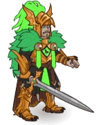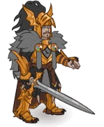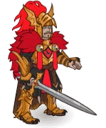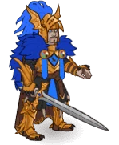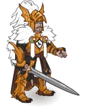
        
        
            Chromatic Strongheart
        
        
            Patron Shop (Mastery Medallions)?
        
        
            10,000?
        
        
            28 Oct 2026
        
    
    
        
            ID: 739**Midnight Turiel (Turiel)**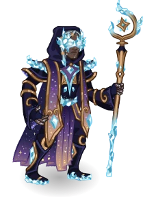
        
        
            Midnight Turiel
        
        
            Midnight Turiel Skin & Feat Pack
        
        
            1,680p
        
        
            04 Nov 2026
        
    
    
        
            ID: 763**Morte on the Rocks (Morte)**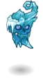
        
        
            Morte on the Rocks
        
        
            Morte on the Rocks Theme Pack
        
        
            3,830p
        
        
            04 Nov 2026
        
    
    
        
            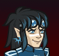ID: 738**Widdle Stardust (Widdle)**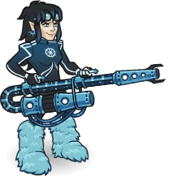
        
        
            Widdle Stardust
        
        
            Widdle Stardust Skin & Feat Pack
        
        
            1,680p
        
        
            04 Nov 2026
        
    
    
        
            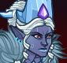ID: 740**Ice Queen Minthara (Minthara)**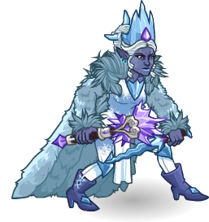
        
        
            Ice Queen Minthara
        
        
            Ice Queen Minthara Skin & Feat Pack
        
        
            1,680p
        
        
            11 Nov 2026
        
    
    
        
            ID: 741**Starlit Sentry (Sentry)**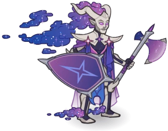
        
        
            Starlit Sentry
        
        
            Starlit Sentry Skin & Feat Pack
        
        
            1,680p
        
        
            11 Nov 2026
        
    
    
        
            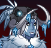ID: 742**Frostbite Skylla (Skylla)**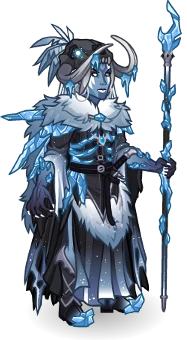
        
        
            Frostbite Skylla
        
        
            Frostbite Skylla Skin & Feat Pack
        
        
            1,680p
        
        
            18 Nov 2026
        
    
    
        
            ID: 765**Dragon Army Tanis (Tanis)**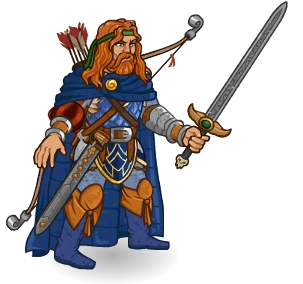
        
        
            Dragon Army Tanis
        
        
            Dragon Army Tanis Theme Pack
        
        
            3,830p
        
        
            02 Dec 2026
        
    
    
        
            ID: 756**Gladiator Krull (Krull)**
        
        
            Gladiator Krull
        
        
            Gladiator Krull Skin & Feat Pack
        
        
            1,680p
        
        
            02 Dec 2026
        
    
    
        
            ID: 757**Regis Goblin Shaman Kllug (Regis)**
        
        
            Regis Goblin Shaman Kllug
        
        
            Regis Goblin Shaman Kllug Skin & Feat Pack
        
        
            1,680p
        
        
            02 Dec 2026
        
    
    
        
            ID: 758**Infernal Shadowheart (Shadowheart)**
        
        
            Infernal Shadowheart
        
        
            Infernal Shadowheart Skin & Feat Pack
        
        
            1,680p
        
        
            09 Dec 2026
        
    
    
        
            ID: 764**Snow Day Diana (Diana)**
        
        
            Snow Day Diana
        
        
            Snow Day Diana Party Pack
        
        
            $24.99
        
        
            10 Dec 2026
        
    
    
        
            ID: 759**Feywild Fairytale Yorven (Yorven)**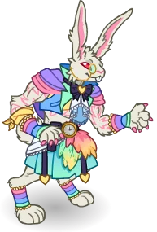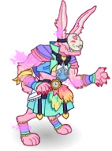
        
        
            Feywild Fairytale Yorven
        
        
            Feywild Fairytale Yorven Skin & Feat Pack
        
        
            1,680p
        
        
            16 Dec 2026
        
    

[Back to Top](#top)

*Last Modified: {{ site.time }}*