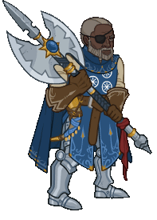

[Back to Main](index.md)

# Skins

Skins that are upcoming. Most skins are real money purchases only.

Please be aware that the developers recently removed most future skins from the defines to stop Jim from being able to select them with his Wand of Wonder. This means that getting the upcoming skins has become a lot trickier for me - and so this page might not be as accurate as it once was.

ⓘ *Note: Skins with missing portraits simply don't have that data available yet.*

    
        
            ID: 461**Nosferatu Widdle (Widdle)**
        
        
            Nosferatu Widdle
        
        
            Emergence 9
        
        
            ???
        
        
            23 Oct 2024
        
    
    
        
            ID: 481**Vampire Hunter Desmond (Desmond)**
        
        
            Vampire Hunter Desmond
        
        
            Vampire Hunter Desmond Skin & Feat Pack
        
        
            1,680p
        
        
            23 Oct 2024
        
    
    
        
            ID: 462**Vampire Nahara (Nahara)**
        
        
            Vampire Nahara
        
        
            Emergence 9
        
        
            ???
        
        
            23 Oct 2024
        
    
    
        
            ID: 476**Vampire Viconia (Viconia)**
        
        
            Vampire Viconia
        
        
            Vampire Viconia Skin & Feat Pack
        
        
            1,680p
        
        
            23 Oct 2024
        
    
    
        
            ID: 482**Classic Kas (Kas)**
        
        
            Classic Kas
        
        
            Adventure: Kas the Betrayer
        
        
            Free
        
        
            30 Oct 2024
        
    
    
        
            ID: 477**Devil Wyll (Wyll)**
        
        
            Devil Wyll
        
        
            Devil Wyll Skin & Feat Pack
        
        
            1,680p
        
        
            30 Oct 2024
        
    
    
        
            ID: 486**Herald of Protection Sentry (Sentry)**
        
        
            Herald of Protection Sentry
        
        
            Herald of Protection Sentry Skin & Feat Pack
        
        
            1,680p
        
        
            06 Nov 2024
        
    
    
        
            ID: 484**Herald of the Absolute Minthara (Minthara)**
        
        
            Herald of the Absolute Minthara
        
        
            Herald of the Absolute Minthara Theme Pack
        
        
            3,830p
        
        
            06 Nov 2024
        
    
    
        
            ID: 485**Herald of Neverwinter Sgt. Knox (Sgt. Knox)**
        
        
            Herald of Neverwinter Sgt. Knox
        
        
            Herald of Neverwinter Sgt. Knox Theme Pack
        
        
            3,830p
        
        
            13 Nov 2024
        
    
    
        
            ID: 487**Herald of The World Tree Penelope (Penelope)**
        
        
            Herald of The World Tree Penelope
        
        
            Herald of The World Tree Penelope Skin & Feat Pack
        
        
            1,680p
        
        
            13 Nov 2024
        
    
    
        
            ID: 488**Herald of Lore Turiel (Turiel)**
        
        
            Herald of Lore Turiel
        
        
            Herald of Lore Turiel Skin & Feat Pack
        
        
            1,680p
        
        
            20 Nov 2024
        
    
    
        
            ID: 489**Herald of Waterdeep Virgil (Virgil)**
        
        
            Herald of Waterdeep Virgil
        
        
            Herald of Waterdeep Virgil Skin & Feat Pack
        
        
            1,680p
        
        
            20 Nov 2024
        
    
    
        
            ID: 483**Goblin Glitch Calliope (Calliope)**
        
        
            Goblin Glitch Calliope
        
        
            Goblin Glitch Calliope Skin & Feat Pack
        
        
            1,680p
        
        
            27 Nov 2024
        
    
    
        
            ID: 490**Herald of the Champions Dungeon Master (DM)**
        
        
            Herald of the Champions Dungeon Master
        
        
            Herald of the Champions Dungeon Master Skin & Feat Pack
        
        
            1,680p
        
        
            27 Nov 2024
        
    
    
        
            ID: 497**Helldusk Karlach (Karlach)**
        
        
            Helldusk Karlach
        
        
            ???
        
        
            ???
        
        
            ???
        
    
    
        
            ID: 492**Moonlight Halsin (Halsin)**
        
        
            Moonlight Halsin
        
        
            ???
        
        
            ???
        
        
            ???
        
    
    
        
            ID: 491**Moonlight Regis (Regis)**
        
        
            Moonlight Regis
        
        
            ???
        
        
            ???
        
        
            ???
        
    
    
        
            ID: 495**Selunite Shadowheart (Shadowheart)**
        
        
            Selunite Shadowheart
        
        
            ???
        
        
            ???
        
        
            ???
        
    
    
        
            ID: 494**Solemn Shadowheart (Shadowheart)**
        
        
            Solemn Shadowheart
        
        
            ???
        
        
            ???
        
        
            ???
        
    
    
        
            ID: 454**Persistent Lae'zel (Lae'zel)**
        
        
            Persistent Lae'zel
        
        
            ???
        
        
            ???
        
        
            31 Jul 2032
        
    

[Back to Top](#top)

*Last Modified: {{ site.time }}*