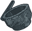
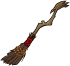
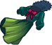
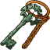
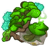
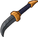
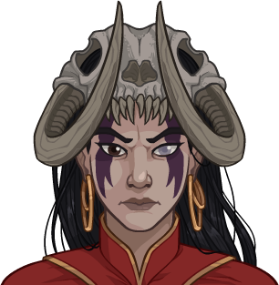
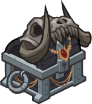

[Back to Main](index.md)

    
        
            
        
        
        Portrait
        
    
    
        
            
        
        
        Model
        
    

# Skylla

Skylla, who sometimes goes by the alias Charmay, forged a warlock's pact with Baba Yaga. It is from this powerful archfey that Skylla draws her magic.

[Skylla - 5etools](https://5e.tools/bestiary/skylla-wbtw.html)

# Basic Information

Skylla will be a new champion in the Feast of the Moon event on 5 November 2025.

    
        
            **Seat**:
        
        
            Unknown
        
    
    
        
            **Species**:
        
        
            Human (Guess)
        
    
    
        
            **Class**:
        
        
            Warlock (Guess)
        
    
    
        
            **Roles**:
        
        
            Support / Debuff (Guess)
        
    
    
        
            **Age**:
        
        
            Unknown
        
    
    
        
            **Gender**:
        
        
            Female (Guess)
        
    
    
        
            **Alignment**:
        
        
            Unknown
        
    
    
        
            **Affiliation**:
        
        
            Unknown
        
    

# Formation

    <svg xmlns="http://www.w3.org/2000/svg" id="Skylla" fill="#aaa" data-formationName="Skylla" data-campaignName="Feast of the Moon" width="338" height="160"><circle cx="175" cy="25" r="15"/><circle cx="175" cy="105" r="15"/><circle cx="135" cy="45" r="15"/><circle cx="135" cy="85" r="15"/><circle cx="95" cy="25" r="15"/><circle cx="95" cy="65" r="15"/><circle cx="95" cy="105" r="15"/><circle cx="95" cy="145" r="15"/><circle cx="55" cy="45" r="15"/><circle cx="15" cy="25" r="15"/><text x="205" y="25" fill="#dcdcdc" font-size="25" font-family="Arial" font-weight="bold">Skylla</text><text x="205" y="65" fill="#dcdcdc" font-size="15" font-family="Arial" font-weight="bold">Feast of the Moon</text></svg>

# Attacks

**Base Attack: Eldritch Staff** (Melee and Magic)
> Skylla attacks a random enemy with her staff for one hit, and zaps another random enemy for 1 hit.  
> Cooldown: 4.5s (Cap 1.125s)

<em>Raw Data</em>

<pre>
{
    "id": 904,
    "name": "Eldritch Staff",
    "description": "Skylla attacks a random enemy with her staff for one hit, and zaps another random enemy for 1 hit.",
    "long_description": "",
    "graphic_id": 0,
    "target": "random",
    "num_targets": 1,
    "aoe_radius": 0,
    "damage_modifier": 1,
    "cooldown": 4.5,
    "animations": [
        {
            "type": "melee_attack",
            "special_melee": "skylla",
            "target_offset": [
                -200,
                0
            ],
            "seq_chargeloop": 1,
            "attack_sounds": {
                "melee": 179,
                "ranged": 184
            },
            "particle_names": [
                "Particle_Skylla_FaerieFireGreen1",
                "Particle_Skylla_FaerieFireGreen2"
            ],
            "lightning_graphic_ids": [
                13484,
                13485,
                13486
            ],
            "projectile_id": 13483
        }
    ],
    "tags": [
        "melee",
        "ranged"
    ],
    "damage_types": [
        "melee",
        "magic"
    ]
}
</pre>

**Base Attack: Eldritch Staff** (Melee and Magic)
> Skylla attacks a random enemy with her staff for one hit, and zaps another random enemy for 1 hit.  
> Cooldown: 4.5s (Cap 1.125s)

<em>Raw Data</em>

<pre>
{
    "id": 906,
    "name": "Eldritch Staff",
    "description": "Skylla attacks a random enemy with her staff for one hit, and zaps another random enemy for 1 hit.",
    "long_description": "",
    "graphic_id": 0,
    "target": "random",
    "num_targets": 1,
    "aoe_radius": 0,
    "damage_modifier": 1,
    "cooldown": 4.5,
    "animations": [
        {
            "type": "melee_attack",
            "special_melee": "skylla",
            "target_offset": [
                -200,
                0
            ],
            "seq_chargeloop": 1,
            "attack_sounds": {
                "melee": 179,
                "ranged": 184
            },
            "particle_names": [
                "Particle_Skylla_FaerieFireBlue1",
                "Particle_Skylla_FaerieFireBlue2"
            ],
            "lightning_graphic_ids": [
                25593,
                25594,
                25595
            ],
            "projectile_id": 25592,
            "effects_on_monsters": [
                {
                    "effect_string": "monster_crit_hit_chance,40",
                    "hit_monsters": true,
                    "after_damage": true
                }
            ]
        }
    ],
    "tags": [
        "melee",
        "ranged"
    ],
    "damage_types": [
        "melee",
        "magic"
    ]
}
</pre>

**Base Attack: Eldritch Staff** (Melee and Magic)
> Skylla attacks a random enemy with her staff for one hit, and zaps another random enemy for 1 hit.  
> Cooldown: 4.5s (Cap 1.125s)

<em>Raw Data</em>

<pre>
{
    "id": 907,
    "name": "Eldritch Staff",
    "description": "Skylla attacks a random enemy with her staff for one hit, and zaps another random enemy for 1 hit.",
    "long_description": "",
    "graphic_id": 0,
    "target": "random",
    "num_targets": 1,
    "aoe_radius": 0,
    "damage_modifier": 1,
    "cooldown": 4.5,
    "animations": [
        {
            "type": "melee_attack",
            "special_melee": "skylla",
            "target_offset": [
                -200,
                0
            ],
            "seq_chargeloop": 1,
            "attack_sounds": {
                "melee": 179,
                "ranged": 184
            },
            "particle_names": [
                "Particle_Skylla_FaerieFirePurple1",
                "Particle_Skylla_FaerieFirePurple2"
            ],
            "lightning_graphic_ids": [
                27709,
                27710,
                27711
            ],
            "projectile_id": 27708,
            "effects_on_monsters": [
                {
                    "effect_string": "increase_damage_on_armor_and_hits,1",
                    "hit_monsters": true,
                    "after_damage": true
                }
            ]
        }
    ],
    "tags": [
        "melee",
        "ranged"
    ],
    "damage_types": [
        "melee",
        "magic"
    ]
}
</pre>

# Abilities

**Whispers of Baba Yaga** (Guess)
> Skylla increases the damage of all Champions in the column in front of her by 100% for each Champion affected by this ability, stacking multiplicatively.

ⓘ *Note: This ability is prestack.*

<em>Raw Data</em>

<pre>
{
    "id": 2474,
    "flavour_text": "",
    "description": {
        "desc": "Skylla increases the damage of all Champions in the column in front of her by $(amount)% for each Champion affected by this ability, stacking multiplicatively."
    },
    "effect_keys": [
        {
            "effect_string": "pre_stack,100"
        },
        {
            "effect_string": "hero_dps_multiplier_mult,100",
            "amount_expr": "upgrade_amount(17845,0)",
            "off_when_benched": true,
            "stacks_multiply": true,
            "amount_func": "mult",
            "stack_func": "per_hero_attribute",
            "per_hero_expr": "HasEffect(2474) && hero_id != 169",
            "targets": [
                "next_col"
            ],
            "show_bonus": true
        }
    ],
    "requirements": "",
    "graphic_id": 27665,
    "large_graphic_id": 27670,
    "properties": {
        "is_formation_ability": true,
        "owner_use_outgoing_description": true,
        "indexed_effect_properties": true,
        "per_effect_index_bonuses": true,
        "default_bonus_index": 0
    }
}
</pre>

**Faerie Fire** (Guess)
> When Skylla attacks an enemy but doesn't defeat it, she casts Faerie Fire on it. Champions deal 100% additional damage to enemies affected by Faerie Fire.

<em>Raw Data</em>

<pre>
{
    "id": 2475,
    "flavour_text": "",
    "description": {
        "desc": "When Skylla attacks an enemy but doesn't defeat it, she casts Faerie Fire on it. Champions deal $(amount___2)% additional damage to enemies affected by Faerie Fire."
    },
    "effect_keys": [
        {
            "effect_string": "skylla_faerie_fire_handler",
            "faerie_fire_effect_key": "skylla_faerie_fire",
            "debuffing_attack_ids": [
                904,
                906,
                907
            ],
            "debuff_effects": [
                {
                    "effect_string": "skylla_faerie_fire"
                }
            ],
            "particle_names": [
                "Particle_Skylla_FaerieFireGreen1",
                "Particle_Skylla_FaerieFireGreen2"
            ]
        },
        {
            "effect_string": "increase_damage_against_monster,100",
            "monster_has_effect_key": "skylla_faerie_fire"
        }
    ],
    "requirements": "",
    "graphic_id": 27668,
    "large_graphic_id": 27663,
    "properties": {
        "is_formation_ability": true,
        "owner_use_outgoing_description": true,
        "indexed_effect_properties": true,
        "per_effect_index_bonuses": true,
        "default_bonus_index": 1
    }
}
</pre>

**Fae's Flicker** (Guess)
> Whenever an enemy that is debuffed by Faerie Fire is defeated, Skylla gains a Shimmer stack. Skylla increases the effect of Whispers of Baba Yaga by 100% for each Shimmer stack she has, stacking additively. Shimmer stacks persist for the entire adventure and reset when you complete it.

<em>Raw Data</em>

<pre>
{
    "id": 2476,
    "flavour_text": "",
    "description": {
        "desc": "Whenever an enemy that is debuffed by Faerie Fire is defeated, Skylla gains a Shimmer stack. Skylla increases the effect of Whispers of Baba Yaga by $(not_buffed amount)% for each Shimmer stack she has, stacking additively. Shimmer stacks persist for the entire adventure and reset when you complete it."
    },
    "effect_keys": [
        {
            "effect_string": "buff_upgrade,100,17845,1",
            "off_when_benched": true,
            "stacks_on_trigger": "monster_killed_with_effect_key,skylla_faerie_fire",
            "stacks_multiply": false,
            "stack_title": "Shimmer Stacks",
            "show_stacks": true,
            "show_bonus": true
        }
    ],
    "requirements": "",
    "graphic_id": 27669,
    "large_graphic_id": 27664,
    "properties": {
        "is_formation_ability": true,
        "owner_use_outgoing_description": true,
        "indexed_effect_properties": true,
        "per_effect_index_bonuses": true,
        "default_bonus_index": 0
    }
}
</pre>

# Specialisations

**Witches Switch** (Guess)
> Most formation abilities featuring ability score thresholds now target Champions who do not meet the thresholds, instead of those that do, and the effect of Whispers of Baba Yaga is increased by 200% for each such ability, stacking multiplicatively.

<em>Raw Data</em>

<pre>
{
    "id": 2477,
    "flavour_text": "",
    "description": {
        "desc": "Most formation abilities featuring ability score thresholds now target Champions who do not meet the thresholds, instead of those that do, and the effect of Whispers of Baba Yaga is increased by 200% for each such ability, stacking multiplicatively."
    },
    "effect_keys": [
        {
            "effect_string": "do_nothing"
        }
    ],
    "requirements": "",
    "graphic_id": 27678,
    "large_graphic_id": 27678,
    "properties": {
        "is_formation_ability": true,
        "owner_use_outgoing_description": true,
        "indexed_effect_properties": true,
        "per_effect_index_bonuses": true,
        "default_bonus_index": 0
    }
}
</pre>

**League** (Guess)
> Skylla increases the effect of Whispers of Baba Yaga by 100% for each evil Champion in the formation, stacking multiplicatively.

<em>Raw Data</em>

<pre>
{
    "id": 2478,
    "flavour_text": "",
    "description": {
        "desc": "Skylla increases the effect of Whispers of Baba Yaga by $(not_buffed amount)% for each evil Champion in the formation, stacking multiplicatively."
    },
    "effect_keys": [
        {
            "effect_string": "buff_upgrade,100,17845",
            "amount_func": "mult",
            "stack_func": "per_hero_attribute",
            "per_hero_expr": "HasTag(`evil`)",
            "show_bonus": true
        }
    ],
    "requirements": "",
    "graphic_id": 27676,
    "large_graphic_id": 27676,
    "properties": {
        "is_formation_ability": true,
        "owner_use_outgoing_description": true,
        "indexed_effect_properties": true,
        "per_effect_index_bonuses": true,
        "default_bonus_index": 0,
        "spec_option_post_apply_info": "Evil Champions: $num_stacks"
    }
}
</pre>

**Wthering Ward** (Guess)
> Increase the effect of Whispers of Baba Yaga by 33% for each debuff that has been applied to an enemy in the current area, stacking multiplicatively and capping at 50.

<em>Raw Data</em>

<pre>
{
    "id": 2479,
    "flavour_text": "",
    "description": {
        "desc": "Increase the effect of Whispers of Baba Yaga by $(not_buffed amount)% for each debuff that has been applied to an enemy in the current area, stacking multiplicatively and capping at $max_stacks."
    },
    "effect_keys": [
        {
            "effect_string": "buff_upgrade,33,17845,1",
            "off_when_benched": true,
            "stacks_on_trigger": "debuff_applied",
            "stacks_multiply": true,
            "max_stacks": 50,
            "show_bonus": true
        }
    ],
    "requirements": "",
    "graphic_id": 27679,
    "large_graphic_id": 27679,
    "properties": {
        "is_formation_ability": true,
        "owner_use_outgoing_description": true,
        "indexed_effect_properties": true,
        "per_effect_index_bonuses": true,
        "default_bonus_index": 0
    }
}
</pre>

**Green Fire** (Guess)
> Skylla's Faerie Fire remains green, but increases the effect of the debuff by 100%.

<em>Raw Data</em>

<pre>
{
    "id": 2480,
    "flavour_text": "",
    "description": {
        "desc": "Skylla's Faerie Fire remains green, but increases the effect of the debuff by $amount%."
    },
    "effect_keys": [
        {
            "effect_string": "buff_upgrade,100,17851"
        }
    ],
    "requirements": "",
    "graphic_id": 27675,
    "large_graphic_id": 27675,
    "properties": {
        "is_formation_ability": true,
        "owner_use_outgoing_description": true,
        "indexed_effect_properties": true,
        "per_effect_index_bonuses": true,
        "default_bonus_index": 0
    }
}
</pre>

**Blue Fire** (Guess)
> Skylla's Faerie Fire turns blue. Champions attacking enemies affected by Faerie Fire have a 40% additional chance to deal a critical hit.

<em>Raw Data</em>

<pre>
{
    "id": 2481,
    "flavour_text": "",
    "description": {
        "desc": "Skylla's Faerie Fire turns blue. Champions attacking enemies affected by Faerie Fire have a 40% additional chance to deal a critical hit."
    },
    "effect_keys": [
        {
            "effect_string": "change_base_attack,906"
        }
    ],
    "requirements": "",
    "graphic_id": 27674,
    "large_graphic_id": 27674,
    "properties": {
        "is_formation_ability": true,
        "owner_use_outgoing_description": true,
        "indexed_effect_properties": true,
        "per_effect_index_bonuses": true,
        "default_bonus_index": 0
    }
}
</pre>

**Purple Fire** (Guess)
> Skylla gains the Breaker role and her Faerie Fire turns violet. Enemies affected by Faerie Fire lose an additional armor or segmented health piece when they are attacked and at least 1 segment was broken.

<em>Raw Data</em>

<pre>
{
    "id": 2482,
    "flavour_text": "",
    "description": {
        "desc": "Skylla gains the Breaker role and her Faerie Fire turns violet. Enemies affected by Faerie Fire lose an additional armor or segmented health piece when they are attacked and at least 1 segment was broken."
    },
    "effect_keys": [
        {
            "effect_string": "change_base_attack,907"
        },
        {
            "effect_string": "add_hero_tags,0,breaking"
        }
    ],
    "requirements": "",
    "graphic_id": 27677,
    "large_graphic_id": 27677,
    "properties": {
        "is_formation_ability": true,
        "owner_use_outgoing_description": true,
        "indexed_effect_properties": true,
        "per_effect_index_bonuses": true,
        "default_bonus_index": 0
    }
}
</pre>

# Items

    
        
            **Icons**
        
        
            **Name**
        
    
    
        
            
        
        
            Baba Yaga
        
    
    
        
            
        
        
            Charmay Disguise
        
    
    
        
            
        
        
            Clothing
        
    
    
        
            
        
        
            Golmos Prison
        
    
    
        
            
        
        
            Spell Components
        
    
    
        
            
        
        
            Weapons
        
    

# Feats

Unknown.

# Legendaries

Unknown.

# Adventures and Variants

**Unlock Adventure: The Crypt of Legends (Skylla)** (Complete Area 50)
> Pay respects to the heroes of olde during the Feast of the Moon.

**Variant 1: Variant 1** (Complete Area 75)
> 

**Variant 2: Variant 2** (Complete Area 125)
> 

**Variant 3: Variant 3** (Complete Area 175)
> 

# Other Champion Images

    
        
            Console Portrait
        
    
    
        
            Gold Chest Icon
        
        
            Silver Chest Icon
        
    

[Back to Top](#top)

*Last Modified: {{ site.time }}*