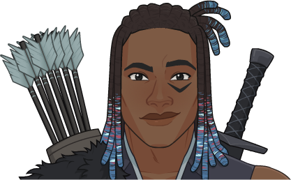

[Back to Main](index.md)

# Solaak

I have no idea who this is.

Note: I've tried to pair ability effects with ability names and might not have them correct. I know the ability names are correct - and I know the effects are correct - I just might not have paired them together correctly.

# Basic Information

Solaak will be the new champion in the Fleetswake event on 22 February 2023.

* Seat: Unknown
* Race: Unknown
* Class: Ranger (Guess)
* Roles: Support (Guess)
* Gender: Male (Guess)
* Alignment: Unknown
* Affiliation: Unknown
* Stats: Unknown

# Formation

# Abilities

**Base Attack: Knockback Strike** (Ranged)
> Solaak fires an arrow at the closest enemy, dealing damage and knocking it back a short distance.

<em>Raw Data</em>

<pre>
{
    "description": "Solaak fires an arrow at the closest enemy, dealing damage and knocking it back a short distance.",
    "long_description": "",
    "damage_modifier": 1,
    "damage_types": ["ranged"],
    "graphic_id": 0,
    "target": "front",
    "aoe_radius": 0,
    "tags": ["ranged"],
    "num_targets": 1,
    "animations": [{
        "hit_effects_only_on_direct_hit": true,
        "projectile_details": {
            "projectile_hit_graphic_id": 844,
            "percent_height_offset": 15,
            "use_auto_rotation": true,
            "projectile_graphic_id": 18030,
            "projectile_speed": 1600
        },
        "character": "companion",
        "hit_sound": 133,
        "shoot_offset_y": -155,
        "shoot_offset_x": 50,
        "shoot_sound": 149,
        "effects_on_monsters": [{
            "after_damage": true,
            "effect_string": "push_back_monster,10",
            "animation": "hit"
        }],
        "type": "ranged_attack",
        "projectile": "pd_generic_projectile",
        "shoot_frame": 13
    }],
    "name": "Knockback Strike",
    "cooldown": 4.2,
    "id": 599
}
</pre>

 

**Ultimate Attack: Tempest**
> Solaak flies over the enemies on Tempest's back while Tempest breaths lightning breath on the enemies below dealing damage, stunning, and knocking them back.

<em>Raw Data</em>

<pre>
{
    "description": "Solaak flies over the enemies on Tempest's back while Tempest breaths lightning breath on the enemies below dealing damage, stunning, and knocking them back. ",
    "long_description": "Solaak flies over the enemies on Tempest's back while Tempest breaths lightning breath on the enemies below dealing damage, stunning, and knocking them back. ",
    "damage_modifier": 1,
    "damage_types": ["ranged"],
    "graphic_id": 18028,
    "target": "all",
    "aoe_radius": 0,
    "tags": ["ranged"],
    "num_targets": 1,
    "animations": [{
        "character": "companion",
        "ultimate": "solaak",
        "stun_on_hit": 5,
        "type": "ultimate_attack"
    }],
    "name": "Tempest",
    "cooldown": 215,
    "id": 598
}
</pre>

 

**Blitzing Barrage** (Stack Title: Knock-Back Stacks) (Guess)
> The effect of `$(upgrade_name id)` is increased by `$(not_buffed amount)%` each time an enemy is knocked back, stacking multiplicatively to a max of 50 stacks. Stacks reset when changing areas.

<em>Raw Data</em>

<pre>
{
    "effect_keys": [{
        "stack_title": "Knock-Back Stacks",
        "stacks_multiply": true,
        "off_when_benched": true,
        "show_bonus": true,
        "effect_string": "buff_upgrade,25,10611",
        "max_stacks": 50,
        "more_triggers": [{
            "action": {"type": "reset"},
            "trigger": "area_changed"
        }],
        "stacks_on_trigger": "monster_pushed_back"
    }],
    "requirements": "",
    "description": {"desc": "The effect of $(upgrade_name id) is increased by $(not_buffed amount)% each time an enemy is knocked back, stacking multiplicatively to a max of $(max_stacks) stacks. Stacks reset when changing areas."},
    "id": 1391,
    "flavour_text": "",
    "graphic_id": 18020,
    "properties": {
        "retain_on_slot_changed": true,
        "is_formation_ability": true,
        "owner_use_outgoing_description": true
    }
}
</pre>

 

**Compatriots** (Guess)
> Solaak increases the effect of the outgoing positional formation abilities of all Champions with a ranged base attack by `$(not_buffed amount)%` for each Reach stack he has, stacking additively.

<em>Raw Data</em>

<pre>
{
    "effect_keys": [{
        "amount_updated_listeners": [
            "slot_changed",
            "attack_changed"
        ],
        "stacks_multiply": false,
        "amount_func": "add",
        "include_escorts": true,
        "stack_func": "per_crusader",
        "use_computed_amount_for_description": true,
        "effect_string": "buff_positional_formation_abilities,25",
        "target_filters_or": [{
            "attack": "ranged",
            "type": "attack_type"
        }],
        "targets": [{
            "attack": "ranged",
            "type": "attack_type"
        }],
        "stack_title": "Reach Stacks",
        "off_when_benched": true,
        "show_bonus": true,
        "override_key_desc": "Increases the effect of $target's outgoing Positional Formation Abilities by $amount%"
    }],
    "requirements": "",
    "description": {"desc": "$(source_hero) increases the effect of the outgoing positional formation abilities of all Champions with a ranged base attack by $(not_buffed amount)% for each Reach stack he has, stacking additively."},
    "id": 1392,
    "flavour_text": "",
    "graphic_id": 18023,
    "properties": {
        "is_formation_ability": true,
        "owner_use_outgoing_description": true
    }
}
</pre>

 

**Critical Mass** (Guess)
> Each time a Champion with a ranged base attack attacks there is a 5% chance per stack of Reach that their base attack cooldown is instantly reset.

<em>Raw Data</em>

<pre>
{
    "effect_keys": [{
        "amount_updated_listeners": [
            "slot_changed",
            "attack_changed"
        ],
        "stacks_multiply": false,
        "attack_type": "base_attack",
        "amount_func": "add",
        "include_escorts": true,
        "stack_func": "per_crusader",
        "use_computed_amount_for_description": true,
        "effect_string": "chance_on_attack_to_reset_attack_cooldown,5",
        "target_filters_or": [{
            "attack": "ranged",
            "type": "attack_type"
        }],
        "targets": [{
            "attack": "ranged",
            "type": "attack_type"
        }],
        "stack_title": "Reach Stacks",
        "off_when_benched": true,
        "show_bonus": true,
        "override_key_desc": "Gives a $(amount)% chance to instantly reset $target's attack cooldown right after using it"
    }],
    "requirements": "",
    "description": {"desc": "Each time a Champion with a ranged base attack attacks there is a 5% chance per stack of Reach that their base attack cooldown is instantly reset."},
    "id": 1393,
    "flavour_text": "",
    "graphic_id": 18021,
    "properties": {
        "is_formation_ability": true,
        "owner_use_outgoing_description": true
    }
}
</pre>

 

**Drakewarden** (Guess)
> Solaak's pet pseudodragon Levits takes Solaak's slot in the formation while Solaak rides his drake companion, Tempest, into battle. He attacks from Tempest. If Levits is knocked out by enemies, Solaak and Tempest retreat from the battlefield until you change areas.

<em>Raw Data</em>

<pre>
{
    "effect_keys": [{"effect_string": "do_nothing"}],
    "requirements": "",
    "description": {"desc": "$(source_hero)'s pet pseudodragon Levits takes $(source_hero)'s slot in the formation while $(source_hero) rides his drake companion, Tempest, into battle. He attacks from Tempest. If Levits is knocked out by enemies, $(source_hero) and Tempest retreat from the battlefield until you change areas."},
    "id": 1389,
    "flavour_text": "",
    "graphic_id": 18024,
    "properties": {
        "is_formation_ability": true,
        "owner_use_outgoing_description": true
    }
}
</pre>

 

**Maneuvers** (Guess)
> Solaak gains a Reach stack for each Champion with a ranged base attack in the formation. Each stack increases the damage of these Champions by `$(not_buffed amount)%`, stacking multiplicatively.

<em>Raw Data</em>

<pre>
{
    "effect_keys": [
        {
            "stack_title": "Reach Stacks",
            "amount_updated_listeners": [
                "slot_changed",
                "attack_changed"
            ],
            "show_stats_on_owner": true,
            "off_when_benched": true,
            "include_escorts": true,
            "use_computed_amount_for_description": true,
            "effect_string": "hero_dps_mult_per_crusader_mult,400",
            "target_filters_or": [{
                "attack": "ranged",
                "type": "attack_type"
            }],
            "targets": [{
                "attack": "ranged",
                "type": "attack_type"
            }],
            "override_key_desc": "Increases the Damage of $target by $amount%"
        },
        {
            "amount_updated_listeners": [
                "slot_changed",
                "attack_changed"
            ],
            "show_description": false,
            "active_graphic_max_stacks": 10,
            "active_graphic_id": 8529,
            "effect_string": "some_extras_solaak",
            "active_graphic_alpha_from_stacks": true,
            "target_filters": [{
                "attack": "ranged",
                "type": "attack_type"
            }],
            "active_graphic_under": true,
            "stacks_from_amount_func": "per_crusader"
        }
    ],
    "requirements": "",
    "description": {"desc": "$(source_hero) gains a Reach stack for each Champion with a ranged base attack in the formation. Each stack increases the damage of these Champions by $(not_buffed amount)%, stacking multiplicatively."},
    "id": 1390,
    "flavour_text": "",
    "graphic_id": 18022,
    "properties": {
        "indexed_effect_properties": true,
        "is_formation_ability": true,
        "default_bonus_index": 0,
											   
        "per_effect_index_bonuses": true
    }
}
</pre>

 

# Specialisations

**Confidant** (Guess)
> Each formation slot occupied by an escort adds 1 Reach stack for `$(upgrade_name id)`.

<em>Raw Data</em>

<pre>
{
    "effect_keys": [
        {
            "data": {"target_filters_or": [
                {
                    "attack": "ranged",
                    "type": "attack_type"
                },
                {"type": "escort"}
            ]},
            "off_when_benched": true,
            "effect_string": "change_upgrade_data,10611,0"
        },
        {
            "data": {"target_filters_or": [
                {
                    "attack": "ranged",
                    "type": "attack_type"
                },
                {"type": "escort"}
            ]},
            "off_when_benched": true,
            "effect_string": "change_upgrade_data,10613,0"
        },
        {
            "data": {"target_filters_or": [
                {
                    "attack": "ranged",
                    "type": "attack_type"
                },
                {"type": "escort"}
            ]},
            "off_when_benched": true,
            "effect_string": "change_upgrade_data,10614,0"
        }
    ],
    "requirements": "",
    "description": {"desc": "Each formation slot occupied by an escort adds 1 Reach stack for $(upgrade_name id)."},
    "id": 1396,
    "flavour_text": "",
    "graphic_id": 0,
    "properties": {
        "indexed_effect_properties": true,
        "is_formation_ability": true,
        "owner_use_outgoing_description": true,
        "type": "upgrade",
        "formation_circle_icon": false,
        "per_effect_index_bonuses": true
    }
}
</pre>

 

**Emboldened**
> Solaak's normal attack deals damage to all enemies in a small radius and all enemies hit take an additional `$(debuff_amount)%` damage for `$(debuff_duration)` seconds.

<em>Raw Data</em>

<pre>
{
    "effect_keys": [
        {
            "off_when_benched": true,
            "debuff_duration": 5,
            "debuff_effects": [{
                "stack_across_effects": true,
                "for_time": "$debuff_duration",
                "time_stack_type": "time_reset",
                "active_graphic_y": -70,
                "active_graphic_id": 18188,
                "effect_string": "increase_monster_damage,$debuff_amount"
            }],
            "effect_string": "solaak_emboldened_debuff",
            "debuff_amount": 400,
            "debuffing_attack_ids": [597]
        },
        {
            "off_when_benched": true,
            "effect_string": "change_base_attack,597"
        }
    ],
    "requirements": "",
    "description": {"desc": "$(source_hero)'s normal attack deals damage to all enemies in a small radius and all enemies hit take an additional $(debuff_amount)% damage for $(debuff_duration) seconds."},
    "id": 1395,
    "flavour_text": "",
    "graphic_id": 0,
    "properties": {
        "indexed_effect_properties": true,
        "is_formation_ability": true,
        "default_bonus_index": 0,
        "owner_use_outgoing_description": true,
        "type": "upgrade",
        "formation_circle_icon": false,
        "per_effect_index_bonuses": true
    }
}
{
    "description": "Solaak fires an arrow at the closest enemy, dealing damage and knocking it back a short distance. Emboldened - The arrow creates an electric burst that also deals damage to enemies near the target. Everyone hit also takes 400% more damage for 5 seconds.",
    "long_description": "",
    "damage_modifier": 1,
    "damage_types": ["ranged"],
    "graphic_id": 0,
    "target": "front",
    "aoe_radius": 150,
    "tags": [
        "ranged",
        "aoe"
    ],
    "num_targets": 1,
    "animations": [{
        "hit_effects_only_on_direct_hit": true,
        "projectile_details": {
            "projectile_hit_graphic_id": 18187,
            "trail": {
                "scale_lerp": [
                    {
                        "x": 1,
                        "y": 1
                    },
                    {
                        "x": 0,
                        "y": 0
                    }
                ],
                "lifespan": 0.25,
                "initial_velocity": {
                    "x": "0",
                    "y": "0"
                },
                "alpha_lerp": {
                    "0": 0,
                    "1": 0,
                    "0.1": 0.25
                },
                "tint": {
                    "a": 1,
                    "r": 1,
                    "b": 1,
                    "g": 1
                },
                "spawn_rate": 50,
                "particle_graphic_ids": [10110],
                "velocity_jitter": {
                    "x": "0",
                    "y": "0"
                }
            },
            "percent_height_offset": 15,
            "use_auto_rotation": true,
            "projectile_graphic_id": 18030,
            "projectile_speed": 1600
        },
        "character": "companion",
        "hit_sound": 133,
        "shoot_offset_y": -155,
        "shoot_offset_x": 50,
        "shoot_sound": 149,
        "effects_on_monsters": [{
            "after_damage": true,
            "effect_string": "push_back_monster,10",
            "animation": "hit"
        }],
        "type": "ranged_attack",
        "projectile": "pd_generic_projectile",
        "shoot_frame": 13
    }],
    "name": "Knockback Strike - Emboldened",
    "cooldown": 4.2,
    "id": 597
}
</pre>

 

**Unwavering** (Guess)
> Solaak's base attack speed is reduced by 2. Additionally, the effect of `$(upgrade_name id___2)` is increased to `$(new_amount___2)%` per stack.

<em>Raw Data</em>

<pre>
{
    "effect_keys": [
        {
            "off_when_benched": true,
            "effect_string": "reduce_attack_cooldown,2"
        },
        {
            "new_amount": 30,
            "data": {"amount": 30},
            "off_when_benched": true,
            "effect_string": "change_upgrade_data,10612,0"
        }
    ],
    "requirements": "",
    "description": {"desc": "$(source_hero)'s base attack speed is reduced by $(seconds_plural amount). Additionally, the effect of $(upgrade_name id___2) is increased to $(new_amount___2)% per stack."},
    "id": 1394,
    "flavour_text": "",
    "graphic_id": 0,
    "properties": {
        "indexed_effect_properties": true,
        "is_formation_ability": true,
        "default_bonus_index": 0,
        "owner_use_outgoing_description": true,
        "type": "upgrade",
        "formation_circle_icon": false,
        "per_effect_index_bonuses": true
    }
}
</pre>

 

# Items

| Slot | Name | Type |
|---|---|---|
| 1 | `Boots` | Unknown |
| 2 | `Chest Armor` | Unknown |
| 3 | `Longbow` | Unknown |
| 4 | `Short Sword` | Unknown |
| 5 | `Tempest` | Unknown |
| 6 | `Tristan Connection` | Unknown |

# Feats

Unknown.

# Legendaries

Unknown.

# Console Portrait

[Back to Top](#top)

*Last Modified: {{ site.time }}*