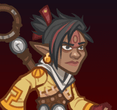
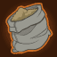

[Back to Main](index.md)

    
        
            
        
        
        Portrait
        
    

# Stoki

Born Stami Gackle, she fled her home after a terrible accident at a young age and joined a monastery of the Even-Handed to study ki. An adept monk and extremely capable adventurer, her thoughtful approach to problems has earned her a reputation as an uncommonly stoic Rock Gnome.

# Changes

Stoki will be a reworked champion in the Simril event on 11 December 2024 (expected a week after event start due to the Worst the Wait event augment).

Only abilities that have seen some changes will be displayed here - and be aware that there's a lot of guesswork involved. Some abilities may not have names - some may have the *wrong* names - or specialisations might not be marked as such - etc.. Focus on the effect data itself.

Please do me a favour and don't get all melodramatic about what you find here. I - and CNE - don't appreciate it. These are spoilers and will almost certainly change before release - likely multiple times. That and we don't have access to any upgrade data prior to release. Making assumptions on how the champions will turn out based on this information would be premature.

# Attacks

**Ultimate: Quivering Palm** (Guess)
> Stoki leaps out and attacks five random enemies with extremely powerful palm thrusts. Over the next 10 seconds, all affected enemies take damage over time equal to four times the initial hit.  
> Cooldown: 160s (Cap 40s)

<em>Raw Data</em>

<pre>
{
    "id": 823,
    "name": "Quivering Palm",
    "description": "Stoki attacks five random enemies dealing damage over time.",
    "long_description": "Stoki leaps out and attacks five random enemies with extremely powerful palm thrusts. Over the next 10 seconds, all affected enemies take damage over time equal to four times the initial hit.",
    "graphic_id": 1117,
    "target": "random",
    "num_targets": 5,
    "aoe_radius": 0,
    "damage_modifier": 0.025,
    "cooldown": 160,
    "animations": [
        {
            "type": "melee_attack",
            "animation": "split_sequence_multi_target",
            "shake_on_hit": 0.1,
            "damage_over_time": {
                "percent": 4,
                "time": 10,
                "tick_time": 1,
                "pop_damage": true,
                "damage_is_additional": true
            },
            "sequences": [
                {
                    "start_frame": 0,
                    "damage_frame": 20,
                    "end_frame": 25,
                    "sound_frames": {
                        "2": 174
                    },
                    "target_offset_x": -70
                }
            ]
        }
    ],
    "tags": [
        "melee",
        "ultimate"
    ],
    "damage_types": [
        "melee"
    ]
}
</pre>

# Abilities

**Unknown** (Guess)
> When Stoki attacks she gains a Focus Point for each enemy she hits. She increases the damage of all Champions with a base attack cooldown of 4.0s or faster by 10% for each Focus Point she has, stacking multiplicatively. Focus Points cap at 100 and are reduced by 50% (rounded down) when changing areas.

<em>Raw Data</em>

<pre>
{
    "id": 2147,
    "flavour_text": "",
    "description": {
        "desc": "When Stoki attacks she gains a Focus Point for each enemy she hits. She increases the damage of all Champions with a base attack cooldown of 4.0s or faster by $amount% for each Focus Point she has, stacking multiplicatively. Focus Points cap at $(amount___3) and are reduced by 50% (rounded down) when changing areas.",
        "post": {
            "conditions": [
                {
                    "condition": "not static_desc",
                    "desc": "^^Focus Points: $(stat_value stoki_focus_points 1 none)"
                }
            ]
        }
    },
    "effect_keys": [
        {
            "effect_string": "pre_stack,10",
            "skip_effect_key_desc": true
        },
        {
            "effect_string": "hero_dps_multiplier_mult,0",
            "amount_expr": "upgrade_amount(16052,0)",
            "amount_func": "mult",
            "stack_func": "get_stat",
            "instance_stat": true,
            "stat": "stoki_focus_points",
            "targets": [
                "all"
            ],
            "filter_targets": [
                {
                    "type": "hero_expr",
                    "hero_expr": "base_attack_cooldown<=4"
                }
            ],
            "amount_updated_listeners": [
                "slot_changed",
                "base_attack_cooldown_changed"
            ],
            "retarget_when_base_attack_cooldown_changed": true,
            "stacks_multiply": true,
            "use_computed_amount_for_description": true,
            "show_bonus": true,
            "show_stacks": false,
            "stack_title": "Focus Points",
            "hide_stack_description": true,
            "off_when_benched": true
        },
        {
            "effect_string": "stoki_focus_point_max,100",
            "skip_effect_key_desc": true
        },
        {
            "effect_string": "expression_on_trigger,owner_attack_single_hit",
            "per_trigger_expr": "SetSaveStat(`stoki_focus_points`, true, min(GetSaveStat(`stoki_focus_points`, true)+trigger_count,GetUpgradeAmount(16052,2)))",
            "skip_effect_key_desc": true
        },
        {
            "effect_string": "expression_on_trigger,owner_attack_single_hit",
            "per_trigger_expr": "AppendToSaveStat(`stoki_focus_points_this_adventure`, true, 1)",
            "skip_effect_key_desc": true
        },
        {
            "effect_string": "expression_on_trigger,area_changed",
            "reduction_mod": 0.5,
            "per_trigger_expr": "SetSaveStat(`stoki_focus_points`, true, floor(GetSaveStat(`stoki_focus_points`, true)* reduction_mod))"
        },
        {
            "effect_string": "expression_on_trigger,owner_attack_single_hit",
            "per_trigger_expr": "SetSaveStat(`stoki_focus_points_this_adventure_server`, false, max(GetSaveStat(`stoki_focus_points_this_adventure`, true), GetSaveStat(`stoki_focus_points_this_adventure_server`, false)))",
            "skip_effect_key_desc": true
        },
        {
            "effect_string": "expression_on_trigger,adventure_reset",
            "per_trigger_expr": "SetSaveStat(`stoki_focus_points_this_adventure`, true, 0)",
            "skip_effect_key_desc": true
        }
    ],
    "requirements": "",
    "graphic_id": 5880,
    "large_graphic_id": 5881,
    "properties": {
        "is_formation_ability": true,
        "formation_circle_icon": true,
        "owner_use_outgoing_description": true,
        "indexed_effect_properties": true,
        "per_effect_index_bonuses": true,
        "default_bonus_index": 1
    }
}
</pre>

**Golden Palm** (Guess)
> Enemies that have been attacked by Stoki at any point in the current area drop 100% more gold when killed for each Focus Point she has, stacking additively.

ⓘ *Note: This ability is prestack.*

<em>Raw Data</em>

<pre>
{
    "id": 2148,
    "flavour_text": "",
    "description": {
        "desc": "Enemies that have been attacked by Stoki at any point in the current area drop 100% more gold when killed for each Focus Point she has, stacking additively."
    },
    "effect_keys": [
        {
            "effect_string": "pre_stack,100",
            "skip_effect_key_desc": true
        },
        {
            "effect_string": "gold_buff_amount,0",
            "amount_expr": "upgrade_amount(16053,0)",
            "amount_func": "add",
            "stack_func": "get_stat",
            "instance_stat": true,
            "stat": "stoki_focus_points",
            "amount_updated_listeners": [
                "stacks_changed"
            ],
            "changing_stack_upgade_ids": [
                16052
            ],
            "use_computed_amount_for_description": true,
            "show_bonus": true
        },
        {
            "effect_string": "stoki_golden_palm",
            "off_when_benched": true,
            "broadcast_name": "stoki_debuffs_monster",
            "debuff_before_damage": false,
            "debuff_on_attack_animation": true,
            "debuff_max_stacks": 1,
            "debuffing_attack_ids": [
                42,
                823
            ],
            "debuff_effects": [
                {
                    "effect_string": "increase_monster_gold,0",
                    "amount_expr": "upgrade_amount(16053,1)",
                    "active_graphic_id": 25075,
                    "active_graphic_y": -30,
                    "overlay_play_mode": "stopped",
                    "bottom": true,
                    "stacks_on_reapply": false,
                    "manual_stacking": true,
                    "max_stacks": 1,
                    "use_collection_source": false,
                    "stack_across_effects": false,
                    "update_expression_on_amount_changed": true,
                    "amount_updated_listeners": [
                        "stat_changed,stoki_focus_points"
                    ]
                }
            ]
        }
    ],
    "requirements": "",
    "graphic_id": 5876,
    "large_graphic_id": 5877,
    "properties": {
        "is_formation_ability": true,
        "formation_circle_icon": false,
        "owner_use_outgoing_description": true,
        "indexed_effect_properties": true,
        "per_effect_index_bonuses": true,
        "default_bonus_index": 0,
        "retain_on_slot_changed": true
    }
}
</pre>

**Building Focus** (Guess)
> Stoki keeps track of the total Focus Points she has gained in the current adventure. If Stoki's Focus Points are capped for a given area, she still counts new ones towards this ability. Upon reaching certain milestones, the following effects activate:  
>   
> - 100 Focus Points: Encouragement - Champions adjacent to Stoki have their base attack cooldowns lowered by 0.5s.  
> - 1000 Focus Points: Flurry of Blows - For every 1000 levels Stoki has, she attacks an additional target with each attack. She prefers to attack different targets, but will attack the same target multiple times if she has already attacked everyone.  
> - 5000 Focus Points: Leadership - Champions adjacent to Stoki have a 0.45% chance to reset their base attack cooldown after attacking for each Focus Point she currently has. Caps at 90%.  
> - 12500 Focus Points: Overflow - When Stoki attacks an enemy that she already attacked, there is a 20% chance the enemy will be stunned for 3 seconds.  
> - 25000 Focus Points: Explosion - If Stoki hits the same enemy two or more times with the same base attack, power radiates from the enemy, dealing 5 seconds worth of BUD damage to itself and all other nearby enemies. Triggers with each extra hit.

<em>Raw Data</em>

<pre>
{
    "id": 2149,
    "flavour_text": "",
    "description": {
        "desc": "Stoki keeps track of the total Focus Points she has gained in the current adventure. If Stoki's Focus Points are capped for a given area, she still counts new ones towards this ability. Upon reaching certain milestones, the following effects activate:^^- 100 Focus Points: Encouragement - Champions adjacent to Stoki have their base attack cooldowns lowered by $(amount___2)s.^- 1000 Focus Points: Flurry of Blows - For every 1000 levels Stoki has, she attacks an additional target with each attack. She prefers to attack different targets, but will attack the same target multiple times if she has already attacked everyone.^- 5000 Focus Points: Leadership - Champions adjacent to Stoki have a 0.45% chance to reset their base attack cooldown after attacking for each Focus Point she currently has. Caps at 90%.^- 12500 Focus Points: Overflow - When Stoki attacks an enemy that she already attacked, there is a $amount___5% chance the enemy will be stunned for $stun_duration___5 seconds.^- 25000 Focus Points: Explosion - If Stoki hits the same enemy two or more times with the same base attack, power radiates from the enemy, dealing $seconds_of_bud___6 seconds worth of BUD damage to itself and all other nearby enemies. Triggers with each extra hit."
    },
    "effect_keys": [
        {
            "effect_string": "apply_effects_at_stacks",
            "show_description": false,
            "apply_effect_stack_amounts": [
                100,
                1000,
                5000,
                12500,
                25000
            ],
            "show_stacks": true,
            "stacks_are_bonus": false,
            "stacks_from_amount_func": "get_stat",
            "instance_stat": true,
            "stat": "stoki_focus_points_this_adventure",
            "amount_updated_listeners": [
                "stat_changed,stoki_focus_points_this_adventure"
            ],
            "off_when_benched": true,
            "active_effect_key_description_prepender": "- ",
            "active_effect_key_description_joiner": "^",
            "stack_title": "Focus Points Gained This Adventure"
        },
        {
            "effect_string": "reduce_attack_cooldown,0.5",
            "targets": [
                "adj"
            ],
            "apply_manually": true,
            "off_when_benched": true,
            "outgoing_buffs": false,
            "override_key_desc": "Encouragement - Champions adjacent to Stoki have their base attack cooldowns lowered by $(amount)s.",
            "show_bonus": false,
            "show_stacks": false
        },
        {
            "effect_string": "add_attack_targets,1",
            "amount_func": "add",
            "stack_func": "per_hero_attribute",
            "per_hero_expr": "as_int(hero_id==109) * floor(hero_level/1000)",
            "amount_updated_listeners": [
                "hero_level_changed"
            ],
            "apply_manually": true,
            "off_when_benched": true,
            "outgoing_buffs": false,
            "override_key_desc": "Flurry of Blows - For every 1000 levels Stoki has, she attacks an additional target with each attack. She prefers to attack different targets, but will attack the same target multiple times if she has already attacked everyone.^Bonus Attack Targets: $amount",
            "use_computed_amount_for_description": true,
            "show_bonus": false,
            "show_stacks": false
        },
        {
            "effect_string": "chance_on_attack_to_reset_attack_cooldown,0.45",
            "targets": [
                "adj"
            ],
            "attack_type": "base_attack",
            "apply_manually": true,
            "off_when_benched": true,
            "outgoing_buffs": false,
            "amount_func": "add",
            "stack_func": "get_stat",
            "instance_stat": true,
            "stat": "stoki_focus_points",
            "effect_cap": 90,
            "override_key_desc": "Leadership - Champions adjacent to Stoki have a $amount% chance to reset their base attack cooldown after attacking. Caps at 90%.",
            "use_computed_amount_for_description": true,
            "show_bonus": false,
            "show_stacks": false
        },
        {
            "effect_string": "stoki_chance_stun_on_repeat_attack,20",
            "stun_duration": 3,
            "apply_manually": true,
            "off_when_benched": true,
            "override_key_desc": "Overflow - When Stoki attacks an enemy that she already attacked, there is a $amount% chance the enemy will be stunned for $stun_duration seconds.",
            "show_bonus": false,
            "show_stacks": false
        },
        {
            "effect_string": "stoki_bud_damage_on_repeat_attack",
            "radius": 100,
            "seconds_of_bud": 5,
            "apply_manually": true,
            "off_when_benched": true,
            "override_key_desc": "Explosion - If Stoki hits the same enemy two or more times with the same base attack, power radiates from the enemy, dealing $seconds_of_bud seconds worth of BUD damage to itself and all other nearby enemies. Triggers with each extra hit.",
            "show_bonus": false,
            "show_stacks": false
        }
    ],
    "requirements": "",
    "graphic_id": 25052,
    "large_graphic_id": 25046,
    "properties": {
        "is_formation_ability": true,
        "formation_circle_icon": true,
        "owner_use_outgoing_description": false,
        "indexed_effect_properties": true,
        "per_effect_index_bonuses": true,
        "default_bonus_index": 0,
        "is_buff_incoming_formation_abilities_target": false
    }
}
</pre>

**Frenzied Friends** (Guess)
> Stoki additively increases the Focus Points cap of Focused Strike by 10 for each Champion in the formation whose base attack cooldown is 4.0s or lower.

<em>Raw Data</em>

<pre>
{
    "id": 2150,
    "flavour_text": "",
    "description": {
        "desc": "Stoki additively increases the Focus Points cap of Focused Strike by 10 for each Champion in the formation whose base attack cooldown is 4.0s or lower."
    },
    "effect_keys": [
        {
            "effect_string": "buff_upgrade,10,16052,2",
            "amount_func": "add",
            "stack_func": "per_hero_attribute",
            "per_hero_expr": "base_attack_cooldown<=4",
            "amount_updated_listeners": [
                "slot_changed",
                "base_attack_cooldown_changed"
            ],
            "use_computed_amount_for_description": true,
            "show_bonus": true,
            "percent_values": false,
            "off_when_benched": true
        }
    ],
    "requirements": "",
    "graphic_id": 25053,
    "large_graphic_id": 25047,
    "properties": {
        "is_formation_ability": true,
        "formation_circle_icon": false,
        "owner_use_outgoing_description": true,
        "indexed_effect_properties": true,
        "per_effect_index_bonuses": true,
        "default_bonus_index": 0
    }
}
</pre>

# Specialisations

**Specialisation: All Out Assault** (Guess)
> Stoki tracks the number of attacks her allies have performed in the past 10 seconds and increases the effect of Focused Strike by 15% for each one, stacking multiplicatively.

<em>Raw Data</em>

<pre>
{
    "id": 2151,
    "flavour_text": "",
    "description": {
        "desc": "Stoki tracks the number of attacks her allies have performed in the past 10 seconds and increases the effect of Focused Strike by 15% for each one, stacking multiplicatively."
    },
    "effect_keys": [
        {
            "effect_string": "pre_stack,15",
            "skip_effect_key_desc": true
        },
        {
            "effect_string": "buff_upgrade,0,16052,1",
            "amount_expr": "upgrade_amount(16056,0)",
            "stacks_on_trigger": "will_stack_manually",
            "stacks_multiply": true,
            "show_bonus": true,
            "show_stacks": true,
            "off_when_benched": true
        },
        {
            "effect_string": "stoki_all_out_assault",
            "dps_buff_effect_key_index": 1
        }
    ],
    "requirements": "",
    "graphic_id": 25058,
    "large_graphic_id": 25058,
    "properties": {
        "is_formation_ability": true,
        "formation_circle_icon": false,
        "owner_use_outgoing_description": true,
        "indexed_effect_properties": true,
        "per_effect_index_bonuses": true,
        "default_bonus_index": 1
    }
}
</pre>

**Specialisation: Bend It Like Birdsong** (Guess)
> Stoki counts the number of Champions in the formation with a DEX score of 16 or higher. For each such Champion, her base attack cooldown is decreased by 0.1 seconds, stacking additively, and the effect of Focused Strike is increased by 100%, stacking multiplicatively.

<em>Raw Data</em>

<pre>
{
    "id": 2152,
    "flavour_text": "",
    "description": {
        "desc": "Stoki counts the number of Champions in the formation with a DEX score of 16 or higher. For each such Champion, her base attack cooldown is decreased by 0.1 seconds, stacking additively, and the effect of Focused Strike is increased by 100%, stacking multiplicatively."
    },
    "effect_keys": [
        {
            "effect_string": "reduce_attack_cooldown,0.1",
            "amount_func": "add",
            "stack_func": "per_hero_attribute",
            "per_hero_expr": "GetStat(`Dex`)>=16",
            "amount_updated_listeners": [
                "slot_changed",
                "ability_score_changed"
            ],
            "use_computed_amount_for_description": true,
            "replace_bonus_with_current_value": true,
            "show_bonus": true,
            "show_stacks": true,
            "off_when_benched": true
        },
        {
            "effect_string": "buff_upgrade,100,16052,1",
            "amount_func": "mult",
            "stack_func": "per_hero_attribute",
            "per_hero_expr": "GetStat(`Dex`)>=16",
            "amount_updated_listeners": [
                "slot_changed",
                "ability_score_changed"
            ],
            "use_computed_amount_for_description": true,
            "show_bonus": true,
            "off_when_benched": true
        }
    ],
    "requirements": "",
    "graphic_id": 25059,
    "large_graphic_id": 25059,
    "properties": {
        "is_formation_ability": true,
        "formation_circle_icon": false,
        "owner_use_outgoing_description": true,
        "indexed_effect_properties": true,
        "per_effect_index_bonuses": true,
        "default_bonus_index": 0,
        "spec_option_post_apply_info": "Champions in Formation Targeted: $num_stacks"
    }
}
</pre>

**Specialisation: A Little Bit Faster** (Guess)
> Stoki reduces the base attack cooldown of all Champions with a default base attack cooldown of 6.0 seconds or higher to 4.0 seconds so that they qualify for Frenzied Friends. Their damage is increased by 100% for each 0.1 seconds their base attack cooldown is reduced by this ability, stacking multiplicatively.

<em>Raw Data</em>

<pre>
{
    "id": 2153,
    "flavour_text": "",
    "description": {
        "desc": "Stoki reduces the base attack cooldown of all Champions with a default base attack cooldown of 6.0 seconds or higher to 4.0 seconds so that they qualify for Frenzied Friends. Their damage is increased by 100% for each 0.1 seconds their base attack cooldown is reduced by this ability, stacking multiplicatively."
    },
    "effect_keys": [
        {
            "effect_string": "buff_incoming_effect_by_expr",
            "effect_id": 2153,
            "effect_index": 2,
            "buff_amount": 100,
            "hero_expr": "max(0, sign(default_base_attack_cooldown-5.99)) * pow((1+(buff_amount/100)), (default_base_attack_cooldown-4)*10)",
            "targets": [
                "all"
            ],
            "filter_targets": [
                {
                    "type": "hero_expr",
                    "hero_expr": "default_base_attack_cooldown>= 6"
                }
            ],
            "amount_updated_listeners": [
                "slot_changed"
            ],
            "skip_effect_key_desc": true,
            "off_when_benched": false
        },
        {
            "effect_string": "buff_incoming_effect_by_expr",
            "effect_id": 2153,
            "effect_index": 3,
            "hero_expr": "max(0, sign(default_base_attack_cooldown-5.99)) * (default_base_attack_cooldown-4)*10",
            "targets": [
                "all"
            ],
            "filter_targets": [
                {
                    "type": "hero_expr",
                    "hero_expr": "default_base_attack_cooldown>= 6"
                }
            ],
            "amount_updated_listeners": [
                "slot_changed"
            ],
            "skip_effect_key_desc": true,
            "off_when_benched": false
        },
        {
            "effect_string": "hero_dps_multiplier_mult,100",
            "targets": [
                "all"
            ],
            "filter_targets": [
                {
                    "type": "hero_expr",
                    "hero_expr": "default_base_attack_cooldown>= 6"
                }
            ],
            "amount_updated_listeners": [
                "slot_changed"
            ],
            "use_computed_amount_for_description": true,
            "override_key_desc": "Increases the damage of $target by $amount%.",
            "hide_amount_rate": true,
            "off_when_benched": false
        },
        {
            "effect_string": "reduce_attack_cooldown,0.1",
            "targets": [
                "all"
            ],
            "filter_targets": [
                {
                    "type": "hero_expr",
                    "hero_expr": "default_base_attack_cooldown>= 6"
                }
            ],
            "amount_updated_listeners": [
                "slot_changed"
            ],
            "use_computed_amount_for_description": true,
            "override_key_desc": "Reduces the cooldown of $target's Base Attack by $amount seconds.",
            "hide_amount_rate": true,
            "off_when_benched": false
        }
    ],
    "requirements": "",
    "graphic_id": 25057,
    "large_graphic_id": 25057,
    "properties": {
        "is_formation_ability": true,
        "formation_circle_icon": true,
        "owner_use_outgoing_description": true,
        "indexed_effect_properties": true,
        "per_effect_index_bonuses": true,
        "default_bonus_index": 0
    }
}
</pre>

# Adventures and Variants

**Unlock Adventure: The Bandit's Harvest (Stoki)** (Complete Area 50)
> Bandits are attempting to pilfer the harvest during Highharvestide and must be stopped.

 **Variant 1: The Farmer's Kids** (Complete Area 75)
> The Farmer's Daughter and Son take up two slots in the formation

 **Variant 2: Due Diligence** (Complete Area 125)
> Quest requirements are doubled

 **Variant 3: Wanton Necromancy** (Complete Area 175)
> Undead enemies randomly spawn alongside normal monster waves These extra monsters do not drop gold

# Formation

    <svg xmlns="http://www.w3.org/2000/svg" id="Stoki" fill="#aaa" data-formationName="Stoki" data-campaignName="Highharvestide" width="279" height="120"><circle cx="135" cy="45" r="15"/><circle cx="135" cy="85" r="15"/><circle cx="95" cy="25" r="15"/><circle cx="95" cy="65" r="15"/><circle cx="95" cy="105" r="15"/><circle cx="55" cy="45" r="15"/><circle cx="55" cy="85" r="15"/><circle cx="15" cy="25" r="15"/><circle cx="15" cy="65" r="15"/><circle cx="15" cy="105" r="15"/><text x="165" y="25" fill="#dcdcdc" font-size="25" font-family="Arial" font-weight="bold">Stoki</text><text x="165" y="65" fill="#dcdcdc" font-size="15" font-family="Arial" font-weight="bold">Highharvestide</text></svg>

[Back to Top](#top)

*Last Modified: {{ site.time }}*