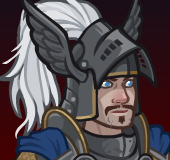
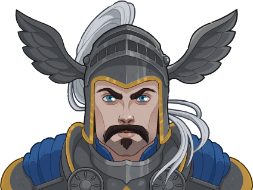

[Back to Main](index.md)

# Strongheart

Info from a wiki.
> Strongheart was a good paladin in Dungeons & Dragons, best known as an enemy and former friend of the evil Warduke. He first appeared as an action figure in the line of Advanced Dungeons & Dragons poseable player characters, and later in the game supplements Quest for the Heartstone and The Shady Dragon Inn. He wields a +2 magic sword called Purlblade.

[https://rpgmuseum.fandom.com/wiki/Strongheart](https://rpgmuseum.fandom.com/wiki/Strongheart)

# Basic Information

Strongheart will be the new champion in the Founder's Day event on 28 June 2023.

* Seat: Unknown
* Race: Human (Guess)
* Class: Paladin (Guess)
* Roles: Unknown
* Age: Unknown
* Gender: Male (Guess)
* Alignment: Unknown Good (Guess)
* Affiliation: Unknown
* Stats: Unknown

# Formation

Unknown.




# Abilities

**Base Attack: Unknown**
> Unknown effect.

<em>Raw Data</em>

<pre>
</pre>

 

**Ultimate Attack: Unknown**
> Unknown effect.

<em>Raw Data</em>

<pre>
</pre>

 

**Courage to Stand**
> Unknown effect.

<em>Raw Data</em>

<pre>
{
    "p": 0,
    "v": 2,
    "id": 19774,
    "export_params": {"uses": ["icon"]},
    "type": 1,
    "graphic": "Icons/Events/2018FoundersDay/Y6/Icon_FormationLarge_StrongheartCouragetoStand",
    "fs": 0
}
</pre>

 

**Justice Needs Champions**
> Unknown effect.

<em>Raw Data</em>

<pre>
{
    "p": 0,
    "v": 2,
    "id": 19775,
    "export_params": {"uses": ["icon"]},
    "type": 1,
    "graphic": "Icons/Events/2018FoundersDay/Y6/Icon_FormationLarge_StrongheartJusticeNeedsChampions",
    "fs": 0
}
</pre>

 

**Righteous Might**
> Unknown effect.

<em>Raw Data</em>

<pre>
{
    "p": 0,
    "v": 2,
    "id": 19776,
    "export_params": {"uses": ["icon"]},
    "type": 1,
    "graphic": "Icons/Events/2018FoundersDay/Y6/Icon_FormationLarge_StrongheartRighteousMight",
    "fs": 0
}
</pre>

 

**Seasoned Knight**
> Unknown effect.

<em>Raw Data</em>

<pre>
{
    "p": 0,
    "v": 2,
    "id": 19777,
    "export_params": {"uses": ["icon"]},
    "type": 1,
    "graphic": "Icons/Events/2018FoundersDay/Y6/Icon_FormationLarge_StrongheartSeasonedKnight",
    "fs": 0
}
</pre>

 

# Specialisations

**Specialisation: A Just Quest**
> Unknown effect.

<em>Raw Data</em>

<pre>
{
    "p": 0,
    "v": 2,
    "id": 19782,
    "export_params": {"uses": ["icon"]},
    "type": 1,
    "graphic": "Icons/Events/2018FoundersDay/Y6/Icon_Specialization_StrongheartAJustQuest",
    "fs": 0
}
</pre>

 

**Specialisation: Honorary Member**
> Unknown effect.

<em>Raw Data</em>

<pre>
{
    "p": 0,
    "v": 2,
    "id": 19783,
    "export_params": {"uses": ["icon"]},
    "type": 1,
    "graphic": "Icons/Events/2018FoundersDay/Y6/Icon_Specialization_StrongheartHonoraryMember",
    "fs": 0
}
</pre>

 

**Specialisation: Valor's Call**
> Unknown effect.

<em>Raw Data</em>

<pre>
{
    "p": 0,
    "v": 2,
    "id": 19784,
    "export_params": {"uses": ["icon"]},
    "type": 1,
    "graphic": "Icons/Events/2018FoundersDay/Y6/Icon_Specialization_StrongheartValorsCall",
    "fs": 0
}
</pre>

 

# Items

| Slot | Name | Type |
|---|---|---|
| 1 | `Adventuring Equipment` | Unknown |
| 2 | `Armor` | Unknown |
| 3 | `Helmet` | Unknown |
| 4 | `Horse Stuff` | Unknown |
| 5 | `Lookin Good Stuff` | Unknown |
| 6 | `Weapons` | Unknown |

# Feats

Unknown.

# Legendaries

Unknown.

# Console Portrait


# Chests

| Gold | Silver |
|---|---|
|  |  |


[Back to Top](#top)

*Last Modified: {{ site.time }}*