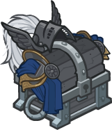

[Back to Main](index.md)

# Strongheart

Info from a wiki.
> Strongheart was a good paladin in Dungeons & Dragons, best known as an enemy and former friend of the evil Warduke. He first appeared as an action figure in the line of Advanced Dungeons & Dragons poseable player characters, and later in the game supplements Quest for the Heartstone and The Shady Dragon Inn. He wields a +2 magic sword called Purlblade.

[https://rpgmuseum.fandom.com/wiki/Strongheart](https://rpgmuseum.fandom.com/wiki/Strongheart)

# Basic Information

Strongheart will be the new champion in the Founder's Day event on 28 June 2023.

* Seat: Unknown
* Race: Human (Guess)
* Class: Paladin (Guess)
* Roles: Unknown
* Age: Unknown
* Gender: Male (Guess)
* Alignment: Unknown Good (Guess)
* Affiliation: Unknown
* Stats: Unknown

# Formation

Unknown.




# Abilities

**Base Attack: Steel** (Melee)
> Strongheart attacks the closest enemy with his sword, Steel, dealing one hit.

<em>Raw Data</em>

<pre>
{
    "description": "Strongheart attacks the closest enemy with his sword, Steel, dealing one hit.",
    "long_description": "",
    "damage_modifier": 1,
    "damage_types": ["melee"],
    "graphic_id": 0,
    "target": "front",
    "aoe_radius": 0,
    "tags": ["melee"],
    "num_targets": 1,
    "animations": [{
        "damage_frame": 2,
        "jump_sound": 30,
        "sound_frames": {"2": 154},
        "target_offset_x": -34,
        "type": "melee_attack"
    }],
    "name": "Steel",
    "cooldown": 4.5,
    "id": 641
}
</pre>

 

**Ultimate Attack: Command: Yield!**
> Unknown effect.

<em>Raw Data</em>

<pre>
{
    "description": "",
    "long_description": "",
    "damage_modifier": 0,
    "damage_types": ["magic"],
    "graphic_id": 19785,
    "target": "highest_health",
    "aoe_radius": 0,
    "tags": ["ultimate"],
    "num_targets": 1,
    "animations": [{
        "damage_frame": 8,
        "effect_frames": {"hit": {
            "duration": 6,
            "overlay_graphic_offset_y": -60,
            "effect_string": "monster_bud_damage,15",
            "apply_to_hit_monsters": true,
            "overlay_graphic_id": 19796
        }},
        "target_offset_x": -200,
        "stun_on_hit": 6,
        "animation_sequence_name": "ultimate",
        "type": "melee_attack",
        "no_damage_display": true
    }],
    "name": "Command: Yield!",
    "cooldown": 150,
    "id": 642
}
</pre>

 

**Justice Needs Champions**
> Strongheart increases the damage of all adjacent Champions by `$amount%`.

<em>Raw Data</em>

<pre>
{
    "effect_keys": [{
        "effect_string": "hero_dps_multiplier_mult,100",
        "targets": ["adj"]
    }],
    "requirements": "",
    "description": {"desc": "$source increases the damage of all adjacent Champions by $amount%."},
    "id": 1569,
    "flavour_text": "",
    "graphic_id": 19779,
    "properties": {"is_formation_ability": true}
}
</pre>

 

**Seasoned Knight**
> Season Quest progress made by Strongheart's party is increased by `$amount%`.

<em>Raw Data</em>

<pre>
{
    "effect_keys": [{
        "off_when_benched": true,
        "effect_string": "buff_season_challenge_progress,100"
    }],
    "requirements": "",
    "description": {"desc": "Season Quest progress made by $source's party is increased by $amount%."},
    "id": 1570,
    "flavour_text": "",
    "graphic_id": 19781,
    "properties": {
        "is_formation_ability": true,
        "owner_use_outgoing_description": true
    }
}
</pre>

 

**Courage to Stand**
> Heal champions affected by Justice Needs Champions for `$amount health per second`.

<em>Raw Data</em>

<pre>
{
    "effect_keys": [{
        "formation_arrows_for_effected_only": true,
        "off_when_benched": true,
        "slot_change_updates_targets": true,
        "effect_string": "heal,2",
        "filter_targets": [{
            "upgrade_id": 11736,
            "type": "affected_by_upgrade"
        }],
        "targets": ["all"]
    }],
    "requirements": "",
    "description": {"desc": "Heal champions affected by Justice Needs Champions for $amount health per second."},
    "id": 1571,
    "flavour_text": "",
    "graphic_id": 19778,
    "properties": {"is_formation_ability": true}
}
</pre>

 

**Righteous Might**
> Whenever Strongheart lands a critical hit, for the next 20 seconds he increases the damage of `$(upgrade_name id)` by `$(amount___4)%`, increases the healing amount of `$(upgrade_name id___2)` by `$(amount___2)%`, and reduces the base attack speed cooldown of himself and Champions affected by Justice Needs Champions by `$(amount___3)` seconds.

<em>Raw Data</em>

<pre>
{
    "effect_keys": [
        {
            "amount_expr": "upgrade_amount(11739,3)",
            "stacks_multiply": true,
            "show_bonus": true,
            "effect_string": "buff_upgrade,0,11736",
            "stacks_on_trigger": "will_stack_manually"
        },
        {
            "stacks_multiply": true,
            "show_bonus": true,
            "effect_string": "buff_upgrade,100,11738",
            "stacks_on_trigger": "will_stack_manually"
        },
        {
            "stacks_multiply": false,
            "show_bonus": true,
            "effect_string": "reduce_attack_cooldown,0.5",
            "filter_targets": [{
                "upgrade_id": 11736,
                "type": "affected_by_upgrade"
            }],
            "stacks_on_trigger": "will_stack_manually",
            "targets": ["all"]
        },
        {"effect_string": "pre_stack_amount,400"},
        {
            "duration": 20,
            "effect_string": "strongheart_righteous_might",
            "underlay_graphic": 19795,
            "underlay_state_max": 10
        }
    ],
    "requirements": "",
    "description": {
        "pre": "Whenever $source lands a critical hit, for the next 20 seconds he increases the damage of $(upgrade_name id) by $(amount___4)%, increases the healing amount of $(upgrade_name id___2) by $(amount___2)%, and reduces the base attack speed cooldown of himself and Champions affected by Justice Needs Champions by $(amount___3) seconds.",
        "conditions": [{
            "condition": "not static_desc",
            "desc": "^^$(strongheart_rightous_might_cooldown_desc)"
        }]
    },
    "id": 1572,
    "flavour_text": "",
    "graphic_id": 19780,
    "properties": {
        "indexed_effect_properties": true,
        "retain_on_slot_changed": true,
        "is_formation_ability": true,
        "owner_use_outgoing_description": true,
        "per_effect_index_bonuses": true
    }
}
</pre>

 

**Unknown**
> Strongheart's base chance to Critical Hit is `$amount%`.

<em>Raw Data</em>

<pre>
{
    "effect_keys": [{"effect_string": "set_base_crit_chance,20"}],
    "requirements": "",
    "description": {"desc": "$source's base chance to Critical Hit is $amount%."},
    "id": 1568,
    "flavour_text": "",
    "graphic_id": 0,
    "properties": {
        "is_formation_ability": true,
        "formation_circle_icon": false
    }
}
</pre>

 

# Specialisations

**Specialisation: Valor's Call** (Guess)
> Strongheart increases the damage bonus of `$(upgrade_name id)` by `$amount%` for each good Champion in the formation.

<em>Raw Data</em>

<pre>
{
    "effect_keys": [{
        "stack_title": "Good Champions",
        "stacks_multiply": true,
        "show_bonus": true,
        "effect_string": "buff_upgrade_by_tag_mult,100,good,11736",
        "max_stacks": 10
    }],
    "requirements": "",
    "description": {"desc": "$source increases the damage bonus of $(upgrade_name id) by $amount% for each good Champion in the formation."},
    "id": 1573,
    "flavour_text": "",
    "graphic_id": 0,
    "properties": {
        "is_formation_ability": true,
        "formation_circle_icon": false
    }
}
</pre>

 

**Specialisation: A Just Quest** (Guess)
> Strongheart increases the damage bonus of `$(upgrade_name id)` by `$amount%` for each Season Level you have gained in the current Season.

<em>Raw Data</em>

<pre>
{
    "effect_keys": [
        {
            "stack_title": "Season Levels",
            "amount_updated_listeners": ["season_level_changed"],
            "stacks_multiply": true,
            "show_bonus": true,
            "amount_func": "mult",
            "stack_func": "per_season_level",
            "effect_string": "buff_upgrade,12.5,11736"
        },
        {"effect_string": "strongheart_a_just_quest"}
    ],
    "requirements": "",
    "description": {"desc": "$source increases the damage bonus of $(upgrade_name id) by $amount% for each Season Level you have gained in the current Season."},
    "id": 1574,
    "flavour_text": "",
    "graphic_id": 0,
    "properties": {
        "indexed_effect_properties": true,
        "retain_on_slot_changed": true,
        "is_formation_ability": true,
        "default_bonus_index": 0,
        "formation_circle_icon": false,
        "per_effect_index_bonuses": true
    }
}
</pre>

 

**Specialisation: Honorary Member** (Guess)
> Strongheart gains the affiliation(s) of the most populous affiliation(s) in the formation, and increases the damage bonus of `$(upgrade_name id)` by `$amount%` for each Champion from the affiliation(s), stacking multiplicatively.

<em>Raw Data</em>

<pre>
{
    "effect_keys": [
        {
            "stacks_multiply": true,
            "show_bonus": true,
            "effect_string": "buff_upgrade,150,11736",
            "stacks_on_trigger": "will_stack_manually"
        },
        {"effect_string": "strongheart_gain_affiliation"}
    ],
    "requirements": "",
    "description": {
        "pre": "$(source_hero) gains the affiliation(s) of the most populous affiliation(s) in the formation, and increases the damage bonus of $(upgrade_name id) by $amount% for each Champion from the affiliation(s), stacking multiplicatively.",
        "conditions": [{
            "condition": "not static_desc",
            "desc": "^^$(strongheart_honorary_member_tag_desc)"
        }]
    },
    "id": 1575,
    "flavour_text": "",
    "graphic_id": 0,
    "properties": {
        "indexed_effect_properties": true,
        "retain_on_slot_changed": true,
        "is_formation_ability": true,
        "default_bonus_index": 0,
        "formation_circle_icon": false,
        "per_effect_index_bonuses": true
    }
}
</pre>

 

# Items

| Icon | Name | Type |
|:-:|---|---|
|  | `Adventuring Equipment` | Unknown |
|  | `Armor` | Unknown |
|  | `Helmet` | Unknown |
|  | `Horse Stuff` | Unknown |
|  | `Lookin Good Stuff` | Unknown |
|  | `Weapons` | Unknown |

# Feats

Unknown.

# Legendaries

Unknown.

# Console Portrait


# Chests

| Gold | Silver |
|---|---|
|  |  |


[Back to Top](#top)

*Last Modified: {{ site.time }}*