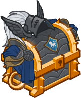

[Back to Main](index.md)

# Strongheart

Strongheart is a fearless seeker of justice, risking his life to ensure that good triumphs over evil. He is thoughtful, kind, and seldom rash, yet never hesitant to punish those who spit in the face of law and order.

# Basic Information

Strongheart will be the new champion in the Founder's Day event on 28 June 2023.

* Seat: 11
* Race: Human
* Class: Paladin
* Roles: Support / Healing
* Age: 39
* Gender: Male
* Alignment: Lawful Good

| Stat | Value | Day 1 Trials | Patrons |
|---|---|---|---|
| Strength | 15 | Yes | Mirt |
| Dexterity | 12 | Yes | Vajra (with Feat) |
| Constitution | 13 | Yes | - |
| Intelligence | 12 | Yes | Zariel |
| Wisdom | 13 | Yes | |
| Charisma | 17 | Yes | |
| Total | 82 | |

# Formation

# Abilities

 **Base Attack: Steel** (Melee)
> Strongheart attacks the closest enemy with his sword, Steel, dealing one hit.

<em>Raw Data</em>

<pre>
{
    "description": "Strongheart attacks the closest enemy with his sword, Steel, dealing one hit.",
    "long_description": "",
    "damage_modifier": 1,
    "damage_types": ["melee"],
    "graphic_id": 0,
    "target": "front",
    "aoe_radius": 0,
    "tags": ["melee"],
    "num_targets": 1,
    "animations": [{
        "damage_frame": 2,
        "jump_sound": 30,
        "sound_frames": {"2": 154},
        "target_offset_x": -34,
        "type": "melee_attack"
    }],
    "name": "Steel",
    "cooldown": 4.5,
    "id": 641
}
</pre>

 

 **Ultimate Attack: Command: Yield!** (Level: 30)
> Strongheart moves forward and Commands the enemy with the most health to Yield, stunning it for 6 seconds. While it is stunned, all attacks against the enemy deal additional 15 seconds worth of BUD.

<em>Raw Data</em>

<pre>
{
    "description": "Strongheart commands the enemy with the most health to Yield. It is stunned and all attacks deal additional BUD damage.",
    "long_description": "Strongheart moves forward and Commands the enemy with the most health to Yield, stunning it for 6 seconds. While it is stunned, all attacks against the enemy deal additional 15 seconds worth of BUD.",
    "damage_modifier": 0,
    "damage_types": ["magic"],
    "graphic_id": 19785,
    "target": "highest_health_exclude_blockers",
    "aoe_radius": 0,
    "tags": ["ultimate"],
    "num_targets": 1,
    "animations": [{
        "damage_frame": 8,
        "effect_frames": {"hit": {
            "duration": 6,
            "overlay_graphic_offset_y": -60,
            "effect_string": "monster_bud_damage,15",
            "apply_to_hit_monsters": true,
            "overlay_graphic_id": 19796
        }},
        "target_offset_x": -200,
        "stun_on_hit": 6,
        "animation_sequence_name": "ultimate",
        "type": "melee_attack",
        "no_damage_display": true
    }],
    "name": "Command: Yield!",
    "cooldown": 150,
    "id": 642
}
</pre>

 

**Critical Hit** (Level: 0)
> Strongheart's base chance to Critical Hit is 20%.

<em>Raw Data</em>

<pre>
{
    "static_dps_mult": null,
    "required_level": 0,
    "effect": "effect_def,1568",
    "name": "Critical Hit",
    "id": 11735,
    "hero_id": 126,
    "upgrade_type": "unlock_ability",
    "default_enabled": 1,
    "required_upgrade_id": 0
}
{
    "effect_keys": [{"effect_string": "set_base_crit_chance,20"}],
    "requirements": "",
    "description": {"desc": "$source's base chance to Critical Hit is $amount%."},
    "id": 1568,
    "flavour_text": "",
    "graphic_id": 0,
    "properties": {
        "is_formation_ability": true,
        "owner_use_outgoing_description": true,
        "formation_circle_icon": false
    }
}
</pre>

 

 **Justice Needs Champions** (Level: 5)
> Strongheart increases the damage of all adjacent Champions by 100%.

<em>Upgrade Data</em>

<pre>
Upgrades:
       35: 100%

    Total Upgrade Bonus: 100%

Expected numbers with various item levels:
	(Does not include feats.)
	(Possibly highly inaccurate.)

	Dull Epic ilvl    100: 8.68e02%
	Dull Epic ilvl  1,000: 2.85e03%
	Dull Epic ilvl 10,000: 2.26e04%
</pre>

<em>Raw Data</em>

<pre>
{
    "static_dps_mult": null,
    "required_level": 5,
    "effect": "effect_def,1569",
    "tip_text": "Strongheart buff the damage of adjacent Champions!",
    "name": "Justice Needs Champions",
    "id": 11736,
    "hero_id": 126,
    "upgrade_type": "unlock_ability",
    "default_enabled": 1,
    "required_upgrade_id": 0
}
{
    "effect_keys": [{
        "effect_string": "hero_dps_multiplier_mult,100",
        "targets": ["adj"]
    }],
    "requirements": "",
    "description": {"desc": "$source increases the damage of all adjacent Champions by $amount%."},
    "id": 1569,
    "flavour_text": "",
    "graphic_id": 19779,
    "properties": {"is_formation_ability": true}
}
</pre>

 

 **Seasoned Knight** (Level: 10)
> Season Quest progress made by Strongheart's party is increased by 100%.

<em>Upgrade Data</em>

<pre>
Upgrades:
       40: 100%

    Total Upgrade Bonus: 100%

Expected numbers:
	(Does not include feats.)
	(Possibly highly inaccurate.)

	At softcap: 100%
</pre>

<em>Raw Data</em>

<pre>
{
    "static_dps_mult": null,
    "required_level": 10,
    "effect": "effect_def,1570",
    "tip_text": "Strongheart increases your progress credited on Season quests.",
    "name": "Seasoned Knight",
    "id": 11737,
    "hero_id": 126,
    "upgrade_type": "unlock_ability",
    "default_enabled": 1,
    "required_upgrade_id": 0
}
{
    "effect_keys": [{
        "off_when_benched": true,
        "outgoing_buffs": false,
        "effect_string": "buff_season_challenge_progress,100"
    }],
    "requirements": "",
    "description": {"desc": "Season Quest progress made by $source's party is increased by $amount%."},
    "id": 1570,
    "flavour_text": "",
    "graphic_id": 19781,
    "properties": {
        "is_formation_ability": true,
        "owner_use_outgoing_description": true
    }
}
</pre>

 

 **Courage to Stand** (Level: 15)
> Strongheart heals champions affected by Justice Needs Champions for 2.

<em>Upgrade Data</em>

<pre>
Upgrades:
       45: 100%

    Total Upgrade Bonus: 100%

Expected numbers:
	(Does not include feats.)
	(Possibly highly inaccurate.)

	At softcap: -96%
</pre>

<em>Raw Data</em>

<pre>
{
    "static_dps_mult": null,
    "required_level": 15,
    "effect": "effect_def,1571",
    "name": "Courage to Stand",
    "id": 11738,
    "hero_id": 126,
    "upgrade_type": "unlock_ability",
    "default_enabled": 1,
    "required_upgrade_id": 0
}
{
    "effect_keys": [{
        "formation_arrows_for_effected_only": true,
        "off_when_benched": true,
        "slot_change_updates_targets": true,
        "effect_string": "heal,2",
        "filter_targets": [{
            "upgrade_id": 11736,
            "type": "affected_by_upgrade"
        }],
        "targets": ["all"]
    }],
    "requirements": "",
    "description": {"desc": "$source heals champions affected by Justice Needs Champions for $amount health per second."},
    "id": 1571,
    "flavour_text": "",
    "graphic_id": 19778,
    "properties": {"is_formation_ability": true}
}
</pre>

 

 **Righteous Might** (Level: 20)
> Whenever Strongheart lands a critical hit, for the next 20 seconds he increases the damage of Justice Needs Champions by 400%, increases the healing amount of Courage to Stand by 100%, and reduces the base attack speed cooldown of himself and Champions affected by Justice Needs Champions by 0.5 seconds.

<em>Upgrade Data</em>

<pre>
Upgrades:
       50: 100%

    Total Upgrade Bonus: 100%

Expected numbers with various item levels:
	(Does not include feats.)
	(Possibly highly inaccurate.)

	Dull Epic ilvl    100:
		   0 Stacks: -100%
		2000 Stacks: -100%

	Dull Epic ilvl  1,000:
		   0 Stacks: -100%
		2000 Stacks: -100%

	Dull Epic ilvl 10,000:
		   0 Stacks: -100%
		2000 Stacks: -100%
</pre>

<em>Raw Data</em>

<pre>
{
    "static_dps_mult": null,
    "required_level": 20,
    "effect": "effect_def,1572",
    "name": "Righteous Might",
    "id": 11739,
    "hero_id": 126,
    "upgrade_type": "unlock_ability",
    "default_enabled": 1,
    "required_upgrade_id": 0
}
{
    "effect_keys": [
        {
            "amount_expr": "upgrade_amount(11739,3)",
            "current_value_bonus_desc": "Damage Buff: $(bonus)%",
            "stacks_multiply": true,
            "show_bonus": true,
            "outgoing_buffs": false,
            "effect_string": "buff_upgrade,0,11736",
            "stacks_on_trigger": "will_stack_manually",
            "skip_effect_key_desc": true
        },
        {
            "current_value_bonus_desc": "Healing Buff: $(bonus)%",
            "stacks_multiply": true,
            "show_bonus": true,
            "effect_string": "buff_upgrade,100,11738",
            "stacks_on_trigger": "will_stack_manually",
            "skip_effect_key_desc": true
        },
        {
            "stacks_multiply": false,
            "show_bonus": true,
            "effect_string": "reduce_attack_cooldown,0.5",
            "filter_targets": [{
                "include_upgrade_owner": true,
                "upgrade_id": 11736,
                "type": "affected_by_upgrade"
            }],
            "stacks_on_trigger": "will_stack_manually",
            "targets": ["all"]
        },
        {
            "effect_string": "pre_stack_amount,400",
            "skip_effect_key_desc": true
        },
        {
            "duration": 20,
            "underlay_offset_y": -2,
            "effect_string": "strongheart_righteous_might",
            "underlay_graphic": 19795,
            "underlay_state_max": 10,
            "underlay_offset_x": -2,
            "skip_effect_key_desc": true
        }
    ],
    "requirements": "",
    "description": {
        "pre": "Whenever $source lands a critical hit, for the next 20 seconds he increases the damage of $(upgrade_name id) by $(amount___4)%, increases the healing amount of $(upgrade_name id___2) by $(amount___2)%, and reduces the base attack speed cooldown of himself and Champions affected by Justice Needs Champions by $(amount___3) seconds.",
        "conditions": [{
            "condition": "not static_desc",
            "desc": "^^$(strongheart_rightous_might_stack_desc)"
        }]
    },
    "id": 1572,
    "flavour_text": "",
    "graphic_id": 19780,
    "properties": {
        "indexed_effect_properties": true,
        "retain_on_slot_changed": true,
        "is_formation_ability": true,
        "owner_use_outgoing_description": false,
        "per_effect_index_bonuses": true
    }
}
</pre>

 

# Specialisations

 **A Just Quest** (Level: 25)
> Strongheart increases the damage bonus of Justice Needs Champions by 12.5% for each Season Level you have gained in the current Season, stacking multiplicatively.

<em>Upgrade Data</em>

<pre>
Upgrades:
       55: 100%

    Total Upgrade Bonus: 100%

Expected numbers with various item levels:
	(Does not include feats.)
	(Possibly highly inaccurate.)

	Dull Epic ilvl    100:
		 0 Stacks: 20.97%
		90 Stacks: 4.86e06%

	Dull Epic ilvl  1,000:
		 0 Stacks: 268.48%

	Dull Epic ilvl 10,000:
		 0 Stacks: 2,743.48%
		90 Stacks: 1.14e08%
</pre>

<em>Raw Data</em>

<pre>
{
    "static_dps_mult": null,
    "specialization_name": "A Just Quest",
    "required_level": 25,
    "effect": "effect_def,1574",
    "name": "A Just Quest",
    "specialization_graphic_id": 19782,
    "id": 11741,
    "hero_id": 126,
    "upgrade_type": "unlock_ability",
    "default_enabled": 1,
    "required_upgrade_id": 0,
    "specialization_description": "Strongheart is buoyed by a party that completes its quests"
}
{
    "effect_keys": [
        {
            "stack_title": "Season Levels",
            "amount_updated_listeners": ["season_level_changed"],
            "stacks_multiply": true,
            "show_bonus": true,
            "amount_func": "mult",
            "stack_func": "per_season_level",
            "effect_string": "buff_upgrade,12.5,11736"
        },
        {"effect_string": "strongheart_a_just_quest"}
    ],
    "requirements": "",
    "description": {"desc": "$source increases the damage bonus of $(upgrade_name id) by $(not_buffed amount)% for each Season Level you have gained in the current Season, stacking multiplicatively."},
    "id": 1574,
    "flavour_text": "",
    "graphic_id": 0,
    "properties": {
        "indexed_effect_properties": true,
        "retain_on_slot_changed": true,
        "is_formation_ability": true,
        "spec_option_post_apply_info": "Season Level: $num_stacks",
        "default_bonus_index": 0,
        "owner_use_outgoing_description": true,
        "formation_circle_icon": false,
        "per_effect_index_bonuses": true
    }
}
</pre>

 

 **Honorary Member** (Level: 25)
> Strongheart gains the affiliation(s) of the most populous affiliation(s) in the formation, and increases the damage bonus of Justice Needs Champions by 150% for each Champion from the affiliation(s), stacking multiplicatively.

<em>Upgrade Data</em>

<pre>
Upgrades:
       55: 100%

    Total Upgrade Bonus: 100%

Expected numbers with various item levels:
	(Does not include feats.)
	(Possibly highly inaccurate.)

	Dull Epic ilvl    100:
		 0 Stacks: 1,351.7%
		10 Stacks: 2,803.4%

	Dull Epic ilvl  1,000:
		 0 Stacks: 4,321.7%
		10 Stacks: 8,743.4%

	Dull Epic ilvl 10,000:
		 0 Stacks: 3.40e04%
		10 Stacks: 6.81e04%
</pre>

<em>Raw Data</em>

<pre>
{
    "static_dps_mult": null,
    "specialization_name": "Honorary Member",
    "required_level": 25,
    "effect": "effect_def,1575",
    "name": "Honorary Member",
    "specialization_graphic_id": 19783,
    "id": 11742,
    "hero_id": 126,
    "upgrade_type": "unlock_ability",
    "default_enabled": 1,
    "required_upgrade_id": 0,
    "specialization_description": "Strongheart joins the largest bonded group in your formation."
}
{
    "effect_keys": [
        {
            "stacks_multiply": true,
            "show_bonus": true,
            "effect_string": "buff_upgrade,150,11736",
            "stacks_on_trigger": "will_stack_manually"
        },
        {"effect_string": "strongheart_gain_affiliation"}
    ],
    "requirements": "",
    "description": {
        "pre": "$(source_hero) gains the affiliation(s) of the most populous affiliation(s) in the formation, and increases the damage bonus of $(upgrade_name id) by $(not_buffed amount)% for each Champion from the affiliation(s), stacking multiplicatively.",
        "conditions": [{
            "condition": "not static_desc",
            "desc": "^^$(strongheart_honorary_member_tag_desc)"
        }]
    },
    "id": 1575,
    "flavour_text": "",
    "graphic_id": 0,
    "properties": {
        "indexed_effect_properties": true,
        "retain_on_slot_changed": true,
        "is_formation_ability": true,
        "default_bonus_index": 0,
        "owner_use_outgoing_description": true,
        "formation_circle_icon": false,
        "per_effect_index_bonuses": true
    }
}
</pre>

 

 **Valor's Call** (Level: 25)
> Strongheart increases the damage bonus of Justice Needs Champions by 100% for each good Champion in the formation, stacking multiplicatively.

<em>Upgrade Data</em>

<pre>
Upgrades:
       55: 100%

    Total Upgrade Bonus: 100%

Expected numbers with various item levels:
	(Does not include feats.)
	(Possibly highly inaccurate.)

	Dull Epic ilvl    100:
		 0 Stacks: 867.8%
		10 Stacks: 1,835.6%

	Dull Epic ilvl  1,000:
		 0 Stacks: 2,847.8%
		10 Stacks: 5,795.6%

	Dull Epic ilvl 10,000:
		 0 Stacks: 2.26e04%
		10 Stacks: 4.54e04%
</pre>

<em>Raw Data</em>

<pre>
{
    "static_dps_mult": null,
    "specialization_name": "Valor's Call",
    "required_level": 25,
    "effect": "effect_def,1573",
    "name": "Valor's Call",
    "specialization_graphic_id": 19784,
    "id": 11740,
    "hero_id": 126,
    "upgrade_type": "unlock_ability",
    "default_enabled": 1,
    "required_upgrade_id": 0,
    "specialization_description": "Strongheart is heartened by Good Champions in the formation."
}
{
    "effect_keys": [{
        "stack_title": "Good Champions",
        "stacks_multiply": true,
        "show_bonus": true,
        "effect_string": "buff_upgrade_by_tag_mult,100,good,11736",
        "max_stacks": 10
    }],
    "requirements": "",
    "description": {"desc": "$source increases the damage bonus of $(upgrade_name id) by $(not_buffed amount)% for each good Champion in the formation, stacking multiplicatively."},
    "id": 1573,
    "flavour_text": "",
    "graphic_id": 0,
    "properties": {
        "is_formation_ability": true,
        "spec_option_post_apply_info": "Good Champions: $num_stacks",
        "formation_circle_icon": false
    }
}
</pre>

 

# Items

| Icon | Slot | Epic Name | Type |
|:-:|---|---|---|
|  | 1 | `Heart of Gold Hammer` | All Champion Damage |
|  | 2 | `Helm of Celestial Wings` | Justice Needs Champions |
|  | 3 | `Word of Honor Plate` | Courage to Stand |
|  | 4 | `Enchanted Mustache Wax` | Righteous Might |
|  | 5 | `Portable Ram` | All Specialisations |
|  | 6 | `Mystic Horse Armor` | Ultimate Cooldown Reduction |

<em>Item Names and Descriptions</em>

<pre>
Slot 1:
        Training Dagger: We all must start our adventure somewhere.
         Guard's Weapon: It's not much, but it has saved me on countless occasions.
   Blade of the Paladin: I pledge myself to your service. It is an honor to fight by your side.
   Heart of Gold Hammer: This once helped a band of brave adventurers escape the Prison of
                         Agony.

Slot 2:
             Winged Cap: This was my first cap, and only because it was all they had left.
         Guard's Helmet: I found myself fond of the wings and kept them as a guard.
            Winged Helm: Gifted to me by a dear friend in lands far from here.
Helm of Celestial Wings: I never thought I would soar through clouds -- until I found this.

Slot 3:
              Chainmail: This stopped more blades than it should have been able to.
          Enhanced Mail: Enchanted by an elven cleric in the forests of Icewind Dale.
            Plate Armor: Armor is only as good as the knight who wears it.
    Word of Honor Plate: A promise was made when this was crafted. I will honor it forever.

Slot 4:
           Armor Polish: Armor doesn't clean itself after all. Well, unless you're a wizard I
                         suppose.
         Scented Polish: I stood in line for four hours in the Neverwinter market for this.
          Draconic Soap: This was made for me by a bronze dragon. It never runs out!
 Enchanted Mustache Wax: There's no reason one can't look fabulous on the battlefield!

Slot 5:
            Hempen Rope: Some scoff at always having rope with you. They're fools.
       Unbreakable Rope: This has gotten me out of quite a few binds.
       Collapsible Pole: The best advice I can give you is to ALWAYS have this in your
                         adventuring pack.
           Portable Ram: No villain can hide with this at my side.

Slot 6:
     Horse Grooming Kit: A knight's horse should be as clean as they are.
    Expert Grooming Kit: My steed likes the extra care, so it's worth the extra coin to me.
          Trusty Saddle: You should trust your saddle as much as your horse.
     Mystic Horse Armor: A trusty steed deserves a set of trusty armor.
</pre>

 

# Feats

This list will only show feats that are going to be available on the release of this champion. The separate [Feats](feats.md) page may show others that could be available later if they exist.

| Icon | Feat | Effect | Source |
|---|---|---|---|
|  | `Selflessness` | 10% All Champion Damage | Free |
|  | `Inspiring Leader` | 25% All Champion Damage | 12,500 Gems |
|  | `Strength in Numbers` | 20% Justice Needs Champions | Free |
|  | `All Together Now` | 40% Justice Needs Champions | Gold Chest |
|  | `Seasoned Warrior` | 100% Seasoned Knight | 50,000 Gems |
|  | `Together We Stand` | 40% Courage to Stand | 12,500 Gems |
|  | `Aura of Courage` | 40% Righteous Might | Gold Chest |
|  | `Wings of Steel` | 20% All Specialisations | Free |
|  | `Wings of Gold` | 40% All Specialisations | Gold Chest |
|  | `Tactical Prowess` | +10% Crit Chance | Free |
|  | `Battle Expertise` | +20% Crit Chance | 12,500 Gems |
|  | `Durable` | Stat: +1 Constitution | Gold Chest |
|  | `Observant` | Stat: +1 Wisdom | Gold Chest |
|  | `Stunning Riposte` | Crits stun for 2s | 12,500 Gems |

# Legendaries

* Increases the damage of all Champions by 100%.
* Increases the damage of all Male Champions by 125%.
* Increases the damage of all Human Champions by 150%.
* Increases the damage of all Champions with a STR score of 13 or higher by 150%.
* Increases the damage of all Champions with a DEX score of 11 or higher by 100%.
* Increases the damage of all Melee Champions by 150%.

<em>DPS Applicable</em>

<pre>
     Arkhan: 5 / 6
    Artemis: 6 / 6
    Asharra: 2 / 6
      Azaka: 5 / 6
     Binwin: 4 / 6
   Birdsong: 3 / 6
Black Viper: 4 / 6
 Catti-brie: 4 / 6
     D'hani: 3 / 6
     Delina: 2 / 6
    Dhadius: 4 / 6
     Drizzt: 4 / 6
    Farideh: 2 / 6
        Fen: 4 / 6
      Grimm: 6 / 6
     Gromma: 3 / 6
       Ishi: 3 / 6
    Jaheira: 4 / 6
   Jarlaxle: 4 / 6
        Jim: 4 / 6
       Kent: 4 / 6
      Krond: 5 / 6
     Lucius: 4 / 6
      Makos: 2 / 6
      Minsc: 6 / 6
      NERDS: 3 / 6
     Nahara: 2 / 6
      Nixie: 2 / 6
      Nrakk: 5 / 6
   Prudence: 3 / 6
      Rosie: 3 / 6
    Torogar: 5 / 6
    Warduke: 6 / 6
     Yorven: 5 / 6
      Zorbu: 3 / 6
</pre>

 

# Console Portrait

# Chests

| Gold | Silver |
|---|---|
|  |  |

[Back to Top](#top)

*Last Modified: {{ site.time }}*