[Back to Main](index.md)





# Tanthalas Half-Elven

[Tanis Half-Elven - Dragonlace Fandom Wiki](https://dragonlance.fandom.com/wiki/Tanis_Half-Elven){:target="_blank"}

# Basic Information

Tanthalas Half-Elven will be a new champion in the Simril event on 2 December 2026.

  **Seat**:
  Unknown
  **Species**:
  Half-Elf (Guess)
  **Class**:
  Fighter (Guess)
  **Roles**:
  Unknown
  **Age**:
  Unknown
  **Gender**:
  Male (Guess)
  **Alignment**:
  Unknown
  **Affiliation**:
  Unknown

# Formation

Unknown.


    



# Attacks

Unknown.

# Abilities

**Hearts in Conflict** (Guess)
> Unknown effect.

<em>Raw Data</em>

<pre>
{
    "id": 31590,
    "graphic": "Icons/Events/2017Simril/Simril_Y10/Icon_PassiveFormation_Tanis_HeartsInConflict",
    "v": 2,
    "fs": 0,
    "p": 0,
    "type": 1,
    "export_params": {
        "uses": [
            "chest_icon"
        ],
        "quantize": true
    }
}
</pre>

**Focused Effort** (Guess)
> Unknown effect.

<em>Raw Data</em>

<pre>
{
    "id": 31587,
    "graphic": "Icons/Events/2017Simril/Simril_Y10/Icon_Formation_Tanis_FocusedEffort",
    "v": 2,
    "fs": 0,
    "p": 0,
    "type": 1,
    "export_params": {
        "uses": [
            "chest_icon"
        ],
        "quantize": true
    }
}
</pre>

**Well Rounded** (Guess)
> Unknown effect.

<em>Raw Data</em>

<pre>
{
    "id": 31588,
    "graphic": "Icons/Events/2017Simril/Simril_Y10/Icon_Formation_Tanis_WellRounded",
    "v": 2,
    "fs": 0,
    "p": 0,
    "type": 1,
    "export_params": {
        "uses": [
            "chest_icon"
        ],
        "quantize": true
    }
}
</pre>

# Specialisations

**Tactical Positioning** (Guess)
> Unknown effect.

<em>Raw Data</em>

<pre>
{
    "id": 31591,
    "graphic": "Icons/Events/2017Simril/Simril_Y10/Icon_Specialization_Tanis_TacticalPositioning",
    "v": 2,
    "fs": 0,
    "p": 0,
    "type": 1,
    "export_params": {
        "uses": [
            "chest_icon"
        ],
        "quantize": true
    }
}
</pre>

**War Hero** (Guess)
> Unknown effect.

<em>Raw Data</em>

<pre>
{
    "id": 31595,
    "graphic": "Icons/Events/2017Simril/Simril_Y10/Icon_Specialization_Tanis_WarHero",
    "v": 2,
    "fs": 0,
    "p": 0,
    "type": 1,
    "export_params": {
        "uses": [
            "chest_icon"
        ],
        "quantize": true
    }
}
</pre>

**Two Worlds: Betwixt** (Guess)
> Unknown effect.

<em>Raw Data</em>

<pre>
{
    "id": 31592,
    "graphic": "Icons/Events/2017Simril/Simril_Y10/Icon_Specialization_Tanis_TwoWorldsBetwixt",
    "v": 3,
    "fs": 0,
    "p": 0,
    "type": 1,
    "export_params": {
        "uses": [
            "chest_icon"
        ],
        "quantize": true
    }
}
</pre>

**Two Worlds: Qualinost** (Guess)
> Unknown effect.

<em>Raw Data</em>

<pre>
{
    "id": 31593,
    "graphic": "Icons/Events/2017Simril/Simril_Y10/Icon_Specialization_Tanis_TwoWorldsQualinost",
    "v": 3,
    "fs": 0,
    "p": 0,
    "type": 1,
    "export_params": {
        "uses": [
            "chest_icon"
        ],
        "quantize": true
    }
}
</pre>

**Two Worlds: Solace** (Guess)
> Unknown effect.

<em>Raw Data</em>

<pre>
{
    "id": 31594,
    "graphic": "Icons/Events/2017Simril/Simril_Y10/Icon_Specialization_Tanis_TwoWorldsSolace",
    "v": 3,
    "fs": 0,
    "p": 0,
    "type": 1,
    "export_params": {
        "uses": [
            "chest_icon"
        ],
        "quantize": true
    }
}
</pre>

# Items

    
        
            **Icons**
        
        
            **Name**
        
    
    
        
            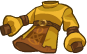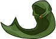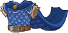
        
        
            Armor
        
    
    
        
            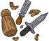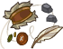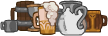
        
        
            Innfellows
        
    
    
        
            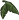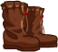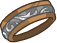
        
        
            Miscellaneous
        
    
    
        
            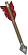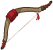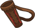
        
        
            Ranged Weapons
        
    
    
        
            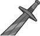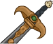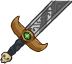
        
        
            Swords
        
    
    
        
            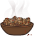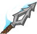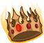
        
        
            The War
        
    

# Feats

Unknown.

# Legendaries

Unknown.

# Adventures and Variants

Unknown.

# Other Champion Images

    
        
            Console Portrait
        
    
    
        
            Gold Chest Icon
        
        
            Silver Chest Icon
        
    

[Back to Top](#top)

*Last Modified: {{ site.time }}*