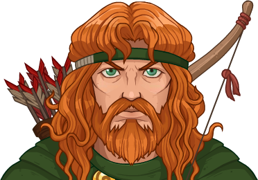
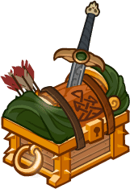
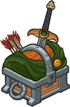

[Back to Main](index.md)





# Tanthalas Half-Elven

[Tanis Half-Elven - Dragonlace Fandom Wiki](https://dragonlance.fandom.com/wiki/Tanis_Half-Elven){:target="_blank"}

# Basic Information

Tanthalas Half-Elven will be a new champion in the Simril event on 2 December 2026.

  **Seat**:
  Unknown
  **Species**:
  Half-Elf (Guess)
  **Class**:
  Fighter (Guess)
  **Roles**:
  Unknown
  **Age**:
  Unknown
  **Gender**:
  Male (Guess)
  **Alignment**:
  Unknown
  **Affiliation**:
  Unknown

# Formation

Unknown.


    



# Attacks

Unknown.

# Abilities

Unknown.

# Specialisations

Unknown.

# Items

Unknown.

# Feats

Unknown.

# Legendaries

Unknown.

# Adventures and Variants

Unknown.

# Other Champion Images

    
        
            Console Portrait
        
    
    
        
            Gold Chest Icon
        
        
            Silver Chest Icon
        
    

[Back to Top](#top)

*Last Modified: {{ site.time }}*