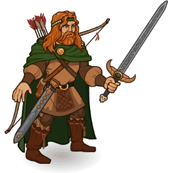
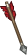
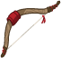
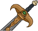
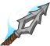
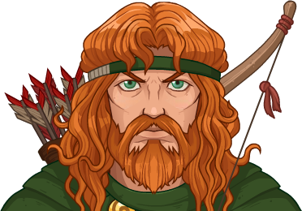

[Back to Main](index.md)

    
        
            
        
        
            Portrait
        
    
    
        
            
        
        
            Model
        
    

# Tanthalas Half-Elven

[Tanis Half-Elven - Dragonlace Fandom Wiki](https://dragonlance.fandom.com/wiki/Tanis_Half-Elven){:target="_blank"}

# Basic Information

Tanthalas Half-Elven will be a new champion in the Simril event on 2 December 2026.

  **Seat**:
  Unknown
  **Species**:
  Half-Elf (Guess)
  **Class**:
  Fighter (Guess)
  **Roles**:
  Support (Guess)
  **Age**:
  Unknown
  **Gender**:
  Male (Guess)
  **Alignment**:
  Unknown
  **Affiliation**:
  Heroes of the Lance (Guess)

# Formation

    <svg xmlns="http://www.w3.org/2000/svg" id="Tanis" fill="#aaa" data-formationName="Tanis" data-campaignName="Simril" width="275" height="120"><circle cx="175" cy="25" r="15"/><circle cx="175" cy="105" r="15"/><circle cx="135" cy="45" r="15"/><circle cx="135" cy="85" r="15"/><circle cx="95" cy="25" r="15"/><circle cx="95" cy="65" r="15"/><circle cx="95" cy="105" r="15"/><circle cx="55" cy="45" r="15"/><circle cx="55" cy="85" r="15"/><circle cx="15" cy="65" r="15"/><text x="205" y="25" fill="#dcdcdc" font-size="25" font-family="Arial" font-weight="bold">Tanis</text><text x="205" y="65" fill="#dcdcdc" font-size="15" font-family="Arial" font-weight="bold">Simril</text></svg>

# Attacks

**Base Attack: Power Attack** (Melee)
> Tanis swings at the nearest enemy with his sword, cleaving nearby enemies as well.  
> Cooldown: 5s (Cap 1.25s)

<em>Raw Data</em>

<pre>
{
    "id": 1010,
    "name": "Power Attack",
    "description": "Tanis swings at the nearest enemy with his sword, cleaving nearby enemies as well.",
    "long_description": "",
    "graphic_id": 0,
    "target": "front",
    "num_targets": 1,
    "aoe_radius": 0,
    "damage_modifier": 1,
    "cooldown": 5,
    "animations": [
        {
            "type": "melee_attack",
            "target_offset_x": -34,
            "damage_frame": 2,
            "jump_sound": 30,
            "sound_frames": {
                "2": 154
            }
        }
    ],
    "tags": [
        "melee",
        "ranged"
    ],
    "damage_types": [
        "melee"
    ]
}
</pre>

**Base Attack: Rapid Shot** (Ranged and Melee)
> Tanis shoots two arrows at the nearest enemy in quick succession, dealing two hits.  
> Cooldown: 5s (Cap 1.25s)

<em>Raw Data</em>

<pre>
{
    "id": 1011,
    "name": "Rapid Shot",
    "description": "Tanis shoots two arrows at the nearest enemy in quick succession, dealing two hits.",
    "long_description": "",
    "graphic_id": 0,
    "target": "front",
    "num_targets": 1,
    "aoe_radius": 0,
    "damage_modifier": 1,
    "cooldown": 5,
    "animations": [
        {
            "type": "ranged_attack",
            "projectile": "arrow",
            "shoot_frame": 23,
            "projectile_count": 5,
            "projectile_graphic_id": 5946,
            "shoot_offset_x": 40,
            "shoot_offset_y": -10
        }
    ],
    "tags": [
        "ranged"
    ],
    "damage_types": [
        "ranged",
        "melee"
    ]
}
</pre>

**Ultimate Attack: For Krynn!** (Guess)
> Tanis rallies his fellow Champions to deal an additional BUD-based hit with their next attack.  
> Cooldown: 30s (Cap 7.5s)

<em>Raw Data</em>

<pre>
{
    "id": 1012,
    "name": "For Krynn!",
    "description": "Tanis rallies his fellow Champions to deal an additional hit with their next attack.",
    "long_description": "Tanis rallies his fellow Champions to deal an additional BUD-based hit with their next attack.",
    "graphic_id": 31596,
    "target": "none",
    "num_targets": 1,
    "aoe_radius": 0,
    "damage_modifier": 0.03,
    "cooldown": 30,
    "animations": [
        {
            "type": "ultimate_attack",
            "ultimate": "tanis",
            "animation_sequence_name": "ultimate",
            "no_damage_display": true
        }
    ],
    "tags": [
        "melee",
        "ultimate"
    ],
    "damage_types": [
        "melee"
    ]
}
</pre>

# Abilities

**Hearts in Conflict** (Guess)
> Tanis may be used in any adventure or variant if Kitiara is already in the formation, even if the variant restrictions would forbid it. Likewise, when Tanis is already in the formation, Laurana may always be used.

<em>Raw Data</em>

<pre>
{
    "id": 3031,
    "flavour_text": "",
    "description": {
        "desc": "Tanis may be used in any adventure or variant if Kitiara is already in the formation, even if the variant restrictions would forbid it. Likewise, when Tanis is already in the formation, Laurana may always be used."
    },
    "effect_keys": [
        {
            "effect_string": "force_allow_hero",
            "off_when_benched": true,
            "ignore_hero_source_check": true,
            "hero_ids": [
                175
            ],
            "skip_effect_key_desc": true
        }
    ],
    "requirements": "",
    "graphic_id": 0,
    "large_graphic_id": 0,
    "properties": {
        "is_formation_ability": true,
        "formation_circle_icon": false,
        "indexed_effect_properties": true,
        "per_effect_index_bonuses": true,
        "show_incoming": false,
        "retain_on_slot_changed": true
    }
}
</pre>

**Well Rounded** (Guess)
> Tanis increases the effect of his Two Worlds specialization by 100% for each unique Role that is present in your formation.

ⓘ *Note: This ability is prestack.*

<em>Raw Data</em>

<pre>
{
    "id": 3035,
    "flavour_text": "",
    "description": {
        "desc": "Tanis increases the effect of his Two Worlds specialization by $amount% for each unique Role that is present in your formation."
    },
    "effect_keys": [
        {
            "effect_string": "pre_stack,100"
        },
        {
            "effect_string": "buff_upgrades,0,21568,21569,21570,0",
            "off_when_benched": true,
            "amount_expr": "upgrade_amount(21571,0)",
            "amount_func": "mult",
            "stack_func": "per_unique_role",
            "stack_title": "Unique Roles",
            "show_bonus": true,
            "amount_updated_listeners": [
                "slot_changed",
                "hero_tags_changed"
            ]
        }
    ],
    "requirements": "",
    "graphic_id": 0,
    "large_graphic_id": 0,
    "properties": {
        "is_formation_ability": true,
        "formation_circle_icon": false,
        "indexed_effect_properties": true,
        "per_effect_index_bonuses": true,
        "retain_on_slot_changed": true,
        "default_bonus_index": 0,
        "owner_use_outgoing_description": true
    }
}
</pre>

**Focused Effort** (Guess)
> Tanis increases the effect of his Two Worlds specialization by 100% for each Champion with the non-Support role that is most popular in your formation.

ⓘ *Note: This ability is prestack.*

<em>Raw Data</em>

<pre>
{
    "id": 3036,
    "flavour_text": "",
    "description": {
        "desc": "Tanis increases the effect of his Two Worlds specialization by $amount% for each Champion with the non-Support role that is most popular in your formation."
    },
    "effect_keys": [
        {
            "effect_string": "pre_stack,100"
        },
        {
            "effect_string": "buff_upgrades,0,21568,21569,21570,0",
            "off_when_benched": true,
            "amount_expr": "upgrade_amount(21572,0)",
            "amount_func": "mult",
            "stack_func": "per_most_common_non_support_role",
            "show_bonus": true,
            "amount_updated_listeners": [
                "slot_changed",
                "hero_tags_changed"
            ]
        }
    ],
    "requirements": "",
    "graphic_id": 0,
    "large_graphic_id": 0,
    "properties": {
        "is_formation_ability": true,
        "formation_circle_icon": false,
        "indexed_effect_properties": true,
        "per_effect_index_bonuses": true,
        "retain_on_slot_changed": true,
        "owner_use_outgoing_description": true,
        "default_bonus_index": 0
    }
}
</pre>

# Specialisations

**Two Worlds: Qualinost** (Guess)
> Tanis increases the damage of Champions in the tallest column in the formation by 100%. In the event that multiple columns are tied for the tallest, all qualifying columns are buffed.

<em>Raw Data</em>

<pre>
{
    "id": 3032,
    "flavour_text": "",
    "description": {
        "desc": "Tanis increases the damage of Champions in the tallest column in the formation by $(amount)%. In the event that multiple columns are tied for the tallest, all qualifying columns are buffed."
    },
    "effect_keys": [
        {
            "effect_string": "hero_dps_multiplier_mult,100",
            "targets": [
                "tallest_column"
            ],
            "use_computed_amount_for_description": true,
            "off_when_benched": true
        }
    ],
    "requirements": "",
    "graphic_id": 0,
    "large_graphic_id": 0,
    "properties": {
        "is_formation_ability": true,
        "owner_use_outgoing_description": true,
        "formation_circle_icon": false,
        "indexed_effect_properties": true,
        "per_effect_index_bonuses": true,
        "retain_on_slot_changed": true
    }
}
</pre>

**Two Worlds: Betwixt** (Guess)
> Tanis increases the damage of Champions in his column in the formation by 100%.

<em>Raw Data</em>

<pre>
{
    "id": 3033,
    "flavour_text": "",
    "description": {
        "desc": "Tanis increases the damage of Champions in his column in the formation by $(amount)%."
    },
    "effect_keys": [
        {
            "effect_string": "hero_dps_multiplier_mult,100",
            "targets": [
                "col"
            ],
            "use_computed_amount_for_description": true,
            "off_when_benched": true
        }
    ],
    "requirements": "",
    "graphic_id": 0,
    "large_graphic_id": 0,
    "properties": {
        "is_formation_ability": true,
        "owner_use_outgoing_description": true,
        "formation_circle_icon": false,
        "indexed_effect_properties": true,
        "per_effect_index_bonuses": true,
        "retain_on_slot_changed": true
    }
}
</pre>

**Two Worlds: Solace** (Guess)
> Tanis increases the damage of Champions in the shortest column in the formation by 100%. In the event that multiple columns are tied for the shortest, all qualifying columns are buffed.

<em>Raw Data</em>

<pre>
{
    "id": 3034,
    "flavour_text": "",
    "description": {
        "desc": "Tanis increases the damage of Champions in the shortest column in the formation by $(amount)%. In the event that multiple columns are tied for the shortest, all qualifying columns are buffed."
    },
    "effect_keys": [
        {
            "effect_string": "hero_dps_multiplier_mult,100",
            "targets": [
                "shortest_column"
            ],
            "use_computed_amount_for_description": true,
            "off_when_benched": true
        }
    ],
    "requirements": "",
    "graphic_id": 0,
    "large_graphic_id": 0,
    "properties": {
        "is_formation_ability": true,
        "owner_use_outgoing_description": true,
        "formation_circle_icon": false,
        "indexed_effect_properties": true,
        "per_effect_index_bonuses": true,
        "retain_on_slot_changed": true
    }
}
</pre>

**War Hero** (Guess)
> Tanis adds 1 stack to all stacking abilities naturally from Champions with the Heroes of the Lance affiliation. His Two Worlds specialization is increased by 100% for each ability affected.

<em>Raw Data</em>

<pre>
{
    "id": 3037,
    "flavour_text": "",
    "description": {
        "desc": "Tanis adds 1 stack to all stacking abilities naturally from Champions with the Heroes of the Lance affiliation. His Two Worlds specialization is increased by $(not_buffed amount___2)% for each ability affected."
    },
    "effect_keys": [
        {
            "effect_string": "add_stack_count_for_heroes_by_tag,heroeslance",
            "off_when_benched": true
        },
        {
            "effect_string": "buff_upgrades,100,21568,21569,21570",
            "off_when_benched": true,
            "stacks_multiply": true,
            "show_bonus": true,
            "stacks_on_trigger": "will_stack_manually",
            "stack_title": "Extra Stacks Added",
            "amount_updated_listeners": [
                "slot_changed",
                "stacks_changed"
            ]
        },
        {
            "effect_string": "tanis_war_hero_handler",
            "buff_effect_index": 1,
            "tag": "heroeslance"
        }
    ],
    "requirements": "",
    "graphic_id": 0,
    "large_graphic_id": 0,
    "properties": {
        "is_formation_ability": true,
        "formation_circle_icon": false,
        "indexed_effect_properties": true,
        "per_effect_index_bonuses": true,
        "owner_use_outgoing_description": true,
        "retain_on_slot_changed": true
    }
}
</pre>

**Tactical Positioning** (Guess)
> Tanis duplicates any positional formation abilities that are affecting him to the Champions with the DPS role that are nearest to him in the formation. If a receiving Champion is already getting the buff, they do not get another copy. His Two Worlds specialization is increased by 100% for each positional ability affecting him, and he doesn't count against the number of champions targeted for the purposes of Raistlin's Savant ability.

<em>Raw Data</em>

<pre>
{
    "id": 3038,
    "flavour_text": "",
    "description": {
        "desc": "Tanis duplicates any positional formation abilities that are affecting him to the Champions with the DPS role that are nearest to him in the formation. If a receiving Champion is already getting the buff, they do not get another copy. His Two Worlds specialization is increased by 100% for each positional ability affecting him, and he doesn't count against the number of champions targeted for the purposes of Raistlin's Savant ability."
    },
    "effect_keys": [
        {
            "off_when_benched": true,
            "effect_string": "tanis_tactical_positioning_target",
            "targets": [
                "nearest_dps_hero"
            ],
            "filter_targets": [
                {
                    "type": "by_tags",
                    "tags": "dps"
                }
            ],
            "override_effect_key_desc": "Tanis redirects abilities that target him to $target."
        },
        {
            "off_when_benched": true,
            "effect_string": "tanis_tactical_positioning",
            "effect_scale_title": "Duplicated",
            "effect_scale_description": "Duplicated by"
        },
        {
            "effect_string": "buff_upgrades,100,21568,21569,21570,0",
            "off_when_benched": true,
            "stacks_multiply": true,
            "stack_func": "per_positional_formation_ability",
            "show_bonus": true,
            "stack_title": "Positional Formation Abilities",
            "amount_updated_listeners": [
                "slot_changed",
                "positional_formation_ability_changed"
            ]
        }
    ],
    "requirements": "",
    "graphic_id": 0,
    "large_graphic_id": 0,
    "properties": {
        "is_formation_ability": true,
        "owner_use_outgoing_description": true,
        "retain_on_slot_changed": true
    }
}
</pre>

**Tactical Positioning** (Guess)
> Unknown effect.

<em>Raw Data</em>

<pre>
{
    "id": 31591,
    "graphic": "Icons/Events/2017Simril/Simril_Y10/Icon_Specialization_Tanis_TacticalPositioning",
    "v": 2,
    "fs": 0,
    "p": 0,
    "type": 1,
    "export_params": {
        "uses": [
            "chest_icon"
        ],
        "quantize": true
    }
}
</pre>

**War Hero** (Guess)
> Unknown effect.

<em>Raw Data</em>

<pre>
{
    "id": 31595,
    "graphic": "Icons/Events/2017Simril/Simril_Y10/Icon_Specialization_Tanis_WarHero",
    "v": 2,
    "fs": 0,
    "p": 0,
    "type": 1,
    "export_params": {
        "uses": [
            "chest_icon"
        ],
        "quantize": true
    }
}
</pre>

# Items

    
        
            **Icons**
        
        
            **Name**
        
    
    
        
            
        
        
            Armor
        
    
    
        
            
        
        
            Innfellows
        
    
    
        
            
        
        
            Miscellaneous
        
    
    
        
            
        
        
            Ranged Weapons
        
    
    
        
            
        
        
            Swords
        
    
    
        
            
        
        
            The War
        
    

# Feats

Unknown.

# Legendaries

Unknown.

# Adventures and Variants

**Unlock Adventure: The Simril Spoilsport (Tanis)** (Complete Area 50)
> Simril is ruined! Someone has pilfered the food supplies!

**Variant 1: Variant 1** (Complete Area 75)
> 

**Variant 2: Variant 2** (Complete Area 125)
> 

**Variant 3: Variant 3** (Complete Area 175)
> 

# Other Champion Images

    
        
            Console Portrait
        
    
    
        
            Gold Chest Icon
        
        
            Silver Chest Icon
        
    

[Back to Top](#top)

*Last Modified: {{ site.time }}*